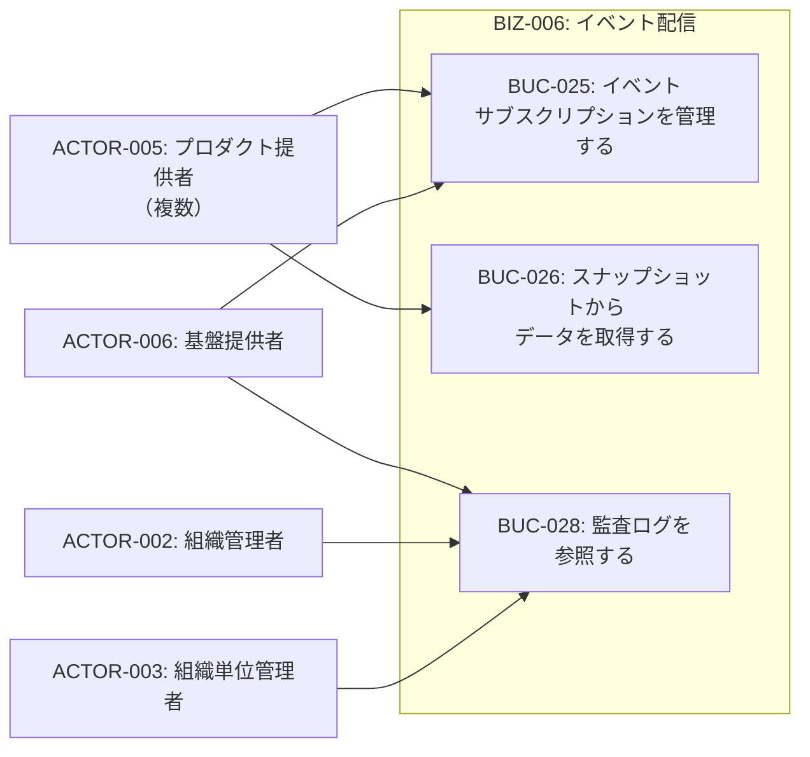
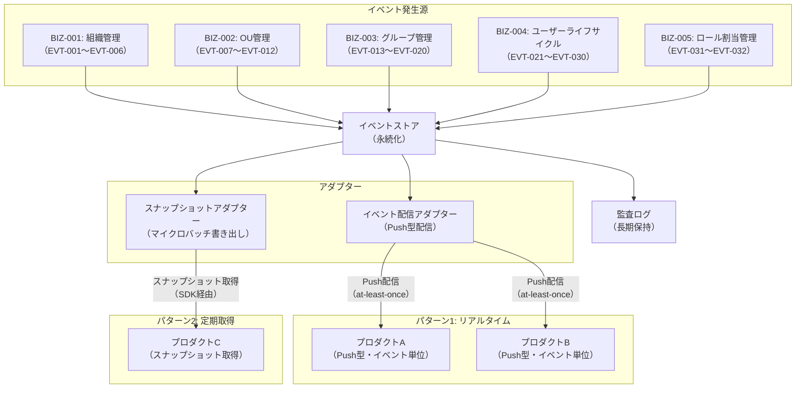
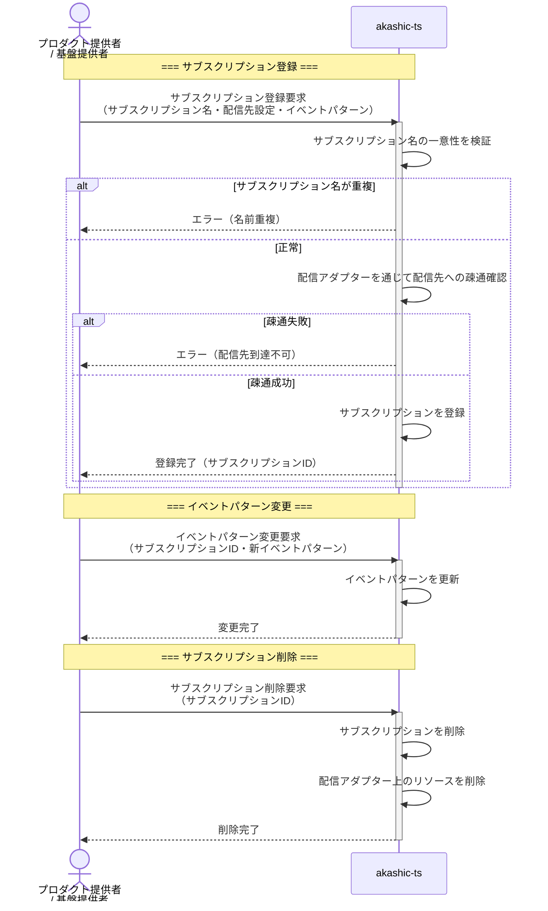
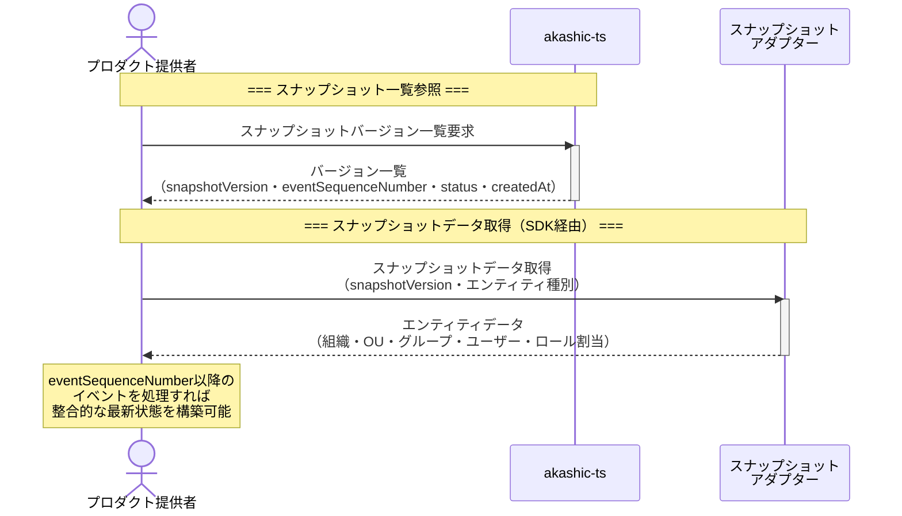
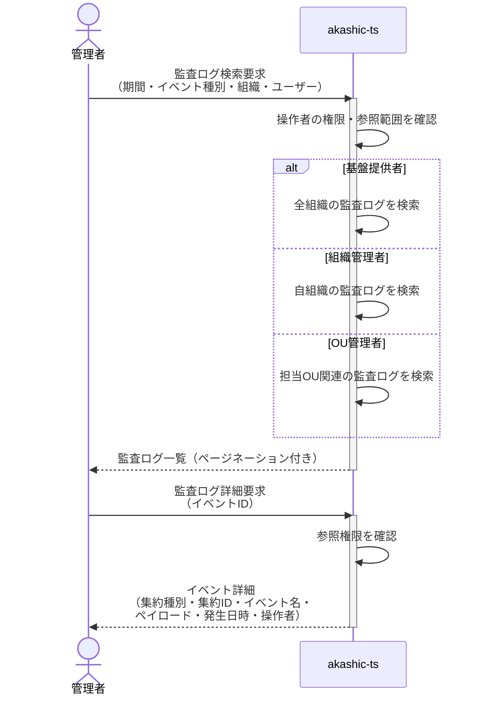

# BIZ-006: イベント配信

## ビジネスコンテキスト図

## アダプターモデルによるイベント配信・データ取得

## 業務フロー

### BUC-025: イベントサブスクリプションを管理する

### BUC-026: スナップショットからデータを取得する

### BUC-028: 監査ログを参照する

## スコープ外

| 項目 | 説明 |
|------|------|
| イベントの変換・加工 | イベントはそのまま配信。プロダクト側で変換を行う |
| アダプター固有の設計 | ペイロードサイズ制限、transitive routing制限、cross-account targets等は別途アダプター文書に記載 |

## 条件一覧

| ID | 条件 | 関連UC |
|----|------|--------|
| COND-023 | 各イベントは一意のeventIdを持ちat-least-once配信に対応する冪等処理が必要 | UC-045 |
| COND-024 | Push配信は順序非保証。aggregateVersionによるリオーダリング・欠損検出が必要 | UC-045 |
| COND-025 | イベントアーカイブ・スナップショットの保持期間は基盤提供者が設定 | UC-050, UC-051 |
| COND-026 | 監査ログ参照範囲はアクター権限に応じて制限 | UC-051 |
| COND-027 | サブスクリプション名は基盤全体で一意 | UC-045 |
| COND-028 | スナップショットの一貫性はアダプターが保証 | UC-052 |
| COND-029 | スナップショットのeventSequenceNumberでイベントストリームと接続 | UC-050, UC-052 |
| COND-030 | スナップショット生成間隔は基盤提供者が設定（デフォルト: 15〜60分） | UC-052 |
| COND-031 | 配信先の認証・認可は配信アダプターの責任 | UC-045 |
