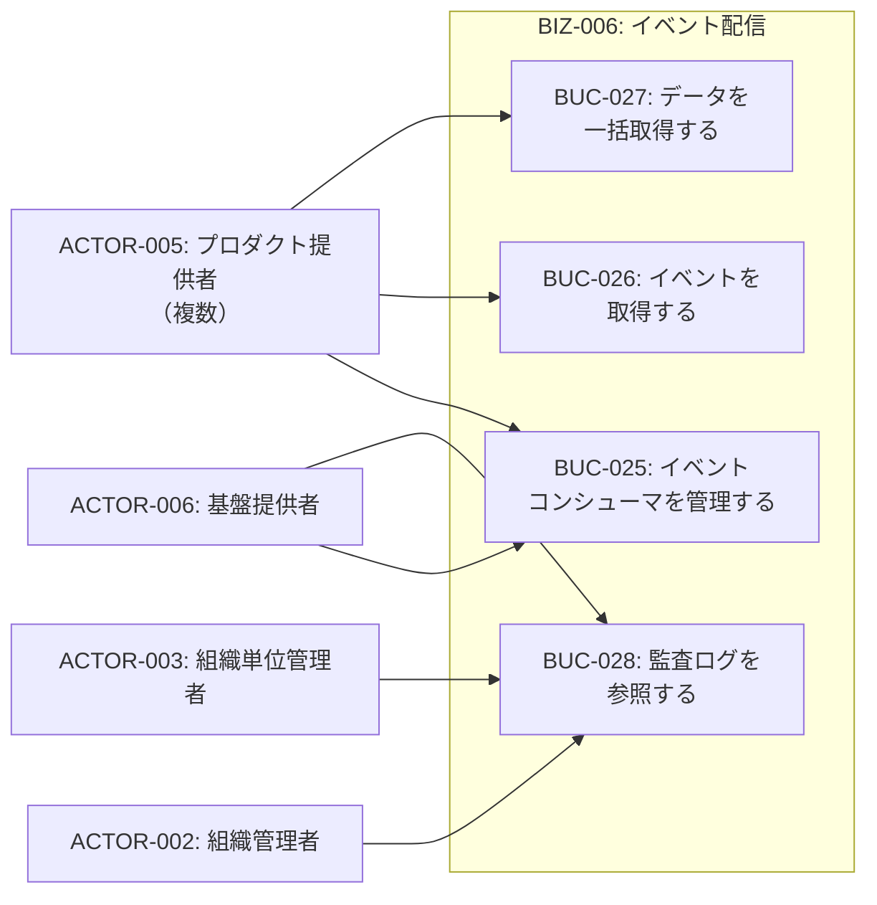
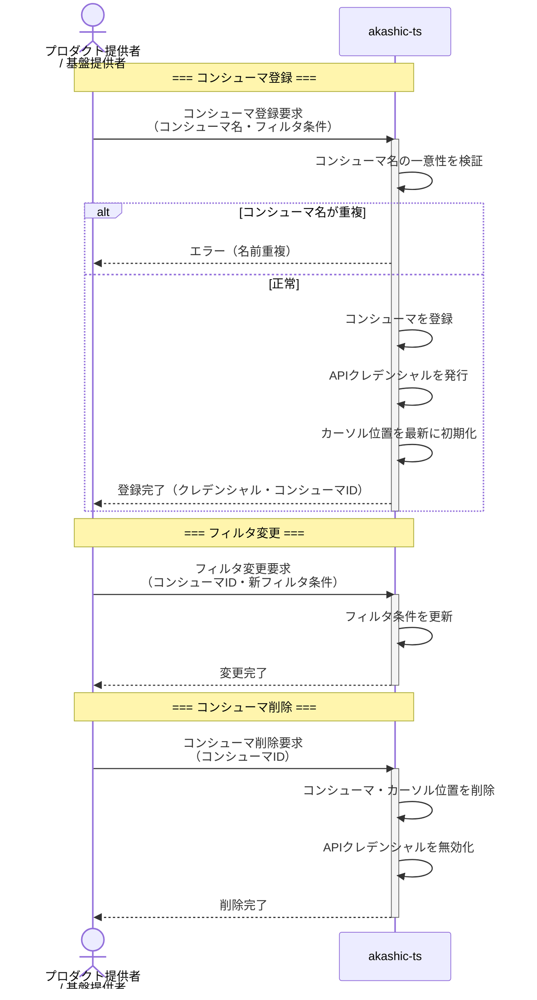
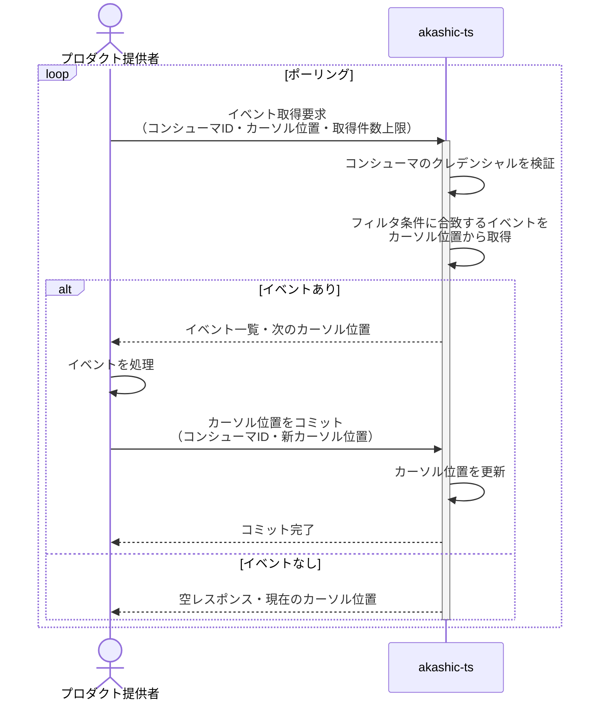
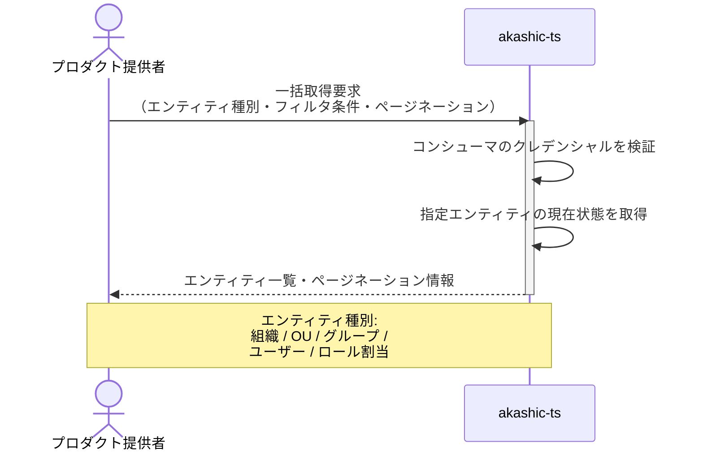
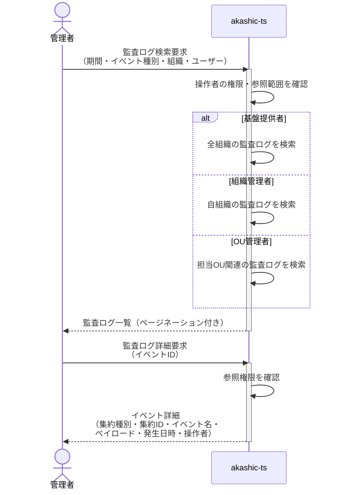
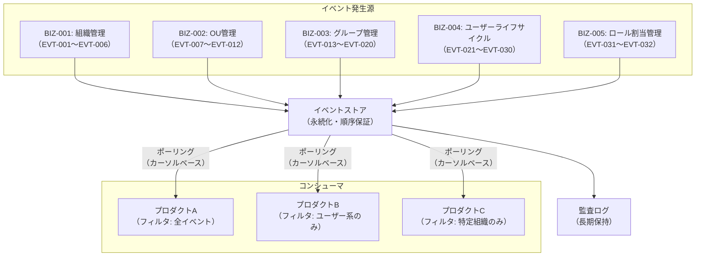

# BIZ-006: イベント配信

## ビジネスコンテキスト図

## 業務フロー

### BUC-025: イベントコンシューマを管理する

### BUC-026: イベントを取得する

### BUC-027: データを一括取得する

### BUC-028: 監査ログを参照する

## イベントストリームの仕組み

## スコープ外

| 項目 | 説明 |
|------|------|
| Push型配信（Webhook） | 現時点ではPull型のみ。将来的にWebhook配信を追加する可能性あり |
| イベントの変換・加工 | イベントはそのまま配信。コンシューマ側で変換を行う |
| イベントのリプレイ | カーソルを巻き戻すことで過去イベントの再取得は可能だが、専用のリプレイ機能は提供しない |

## 条件一覧

| ID | 条件 | 関連UC |
|----|------|--------|
| COND-023 | 各イベントは一意のeventIdを持ち冪等処理を可能にする | UC-049 |
| COND-024 | 同一集約IDのイベントは発生順に取得。異なる集約間の順序は非保証 | UC-049 |
| COND-025 | イベント保持期間は基盤提供者が設定。期間超過後もログとしては保持 | UC-049, UC-051 |
| COND-026 | 監査ログ参照範囲はアクター権限に応じて制限 | UC-051 |
| COND-027 | コンシューマ名は基盤全体で一意 | UC-045 |
