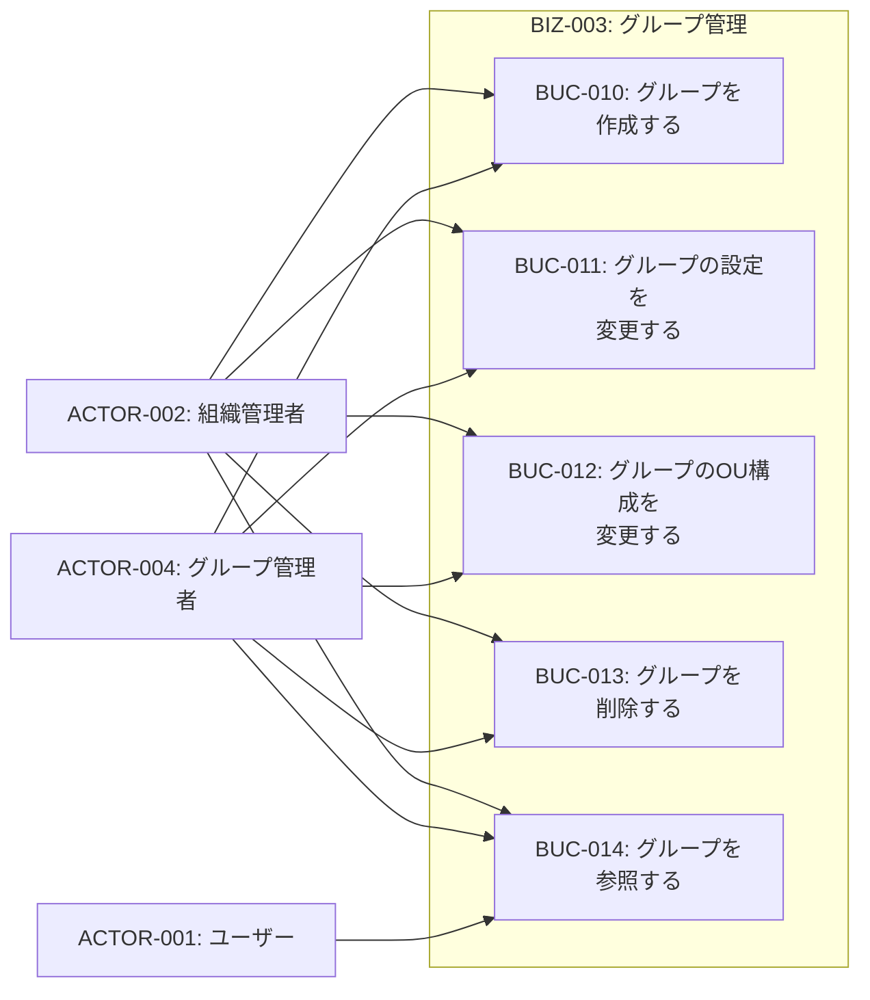
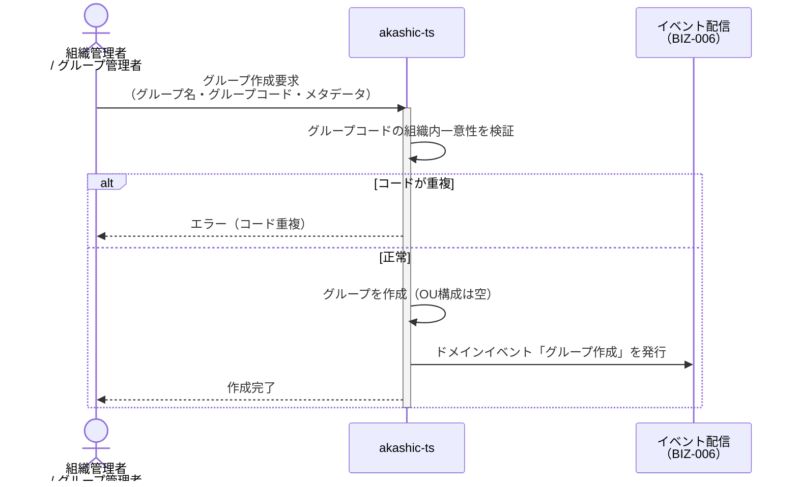
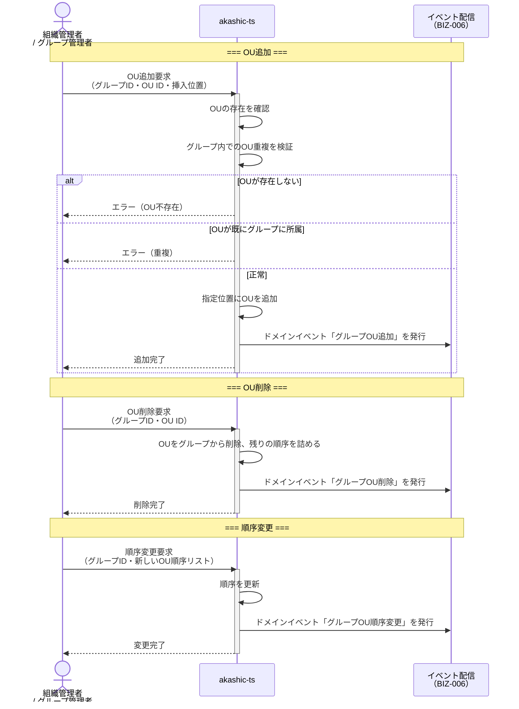
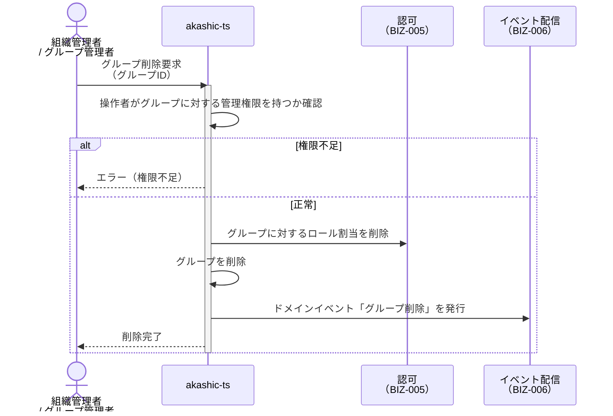

# BIZ-003: グループ管理

## ビジネスコンテキスト図

## 業務フロー

### BUC-010: グループを作成する

### BUC-012: グループのOU構成を変更する

### BUC-013: グループを削除する

## 条件一覧

| ID | 条件 | 関連UC |
|----|------|--------|
| COND-010 | グループコードは同一組織内で一意 | UC-017, UC-019 |
| COND-011 | 同一グループに同じOUを複数回追加不可 | UC-021 |
| COND-012 | 1つのOUは複数グループに所属可能 | UC-021 |
