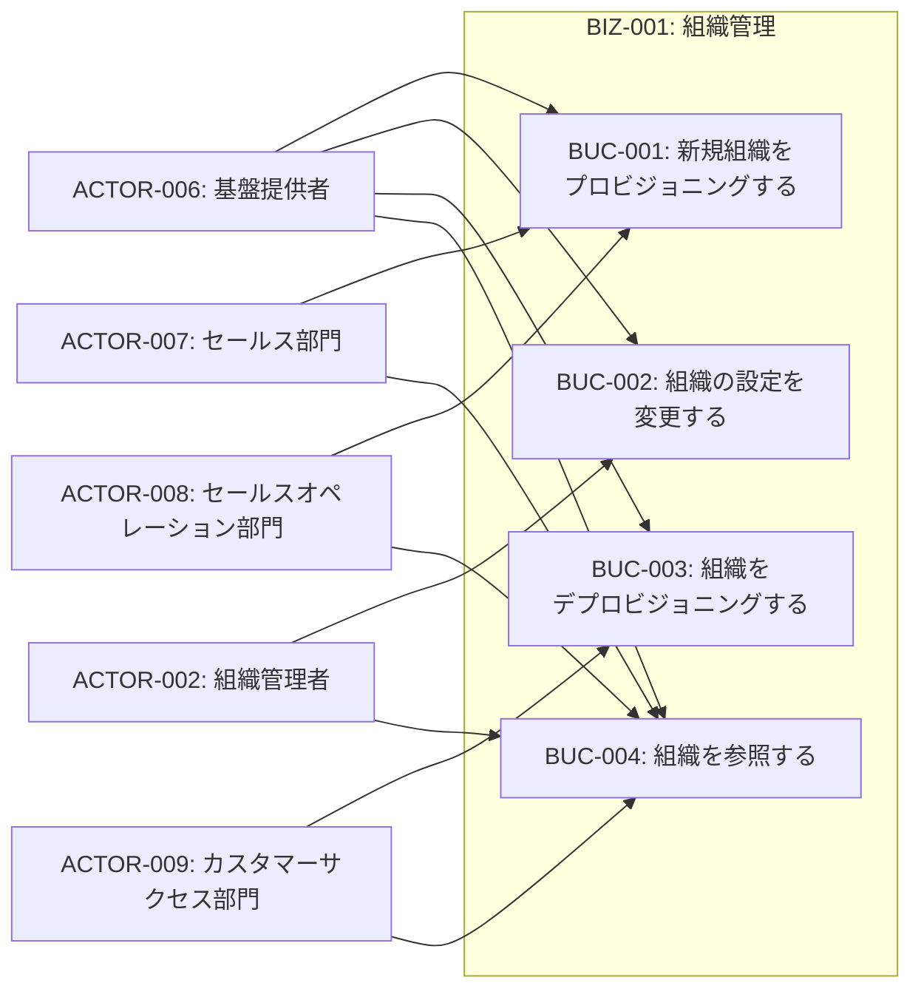
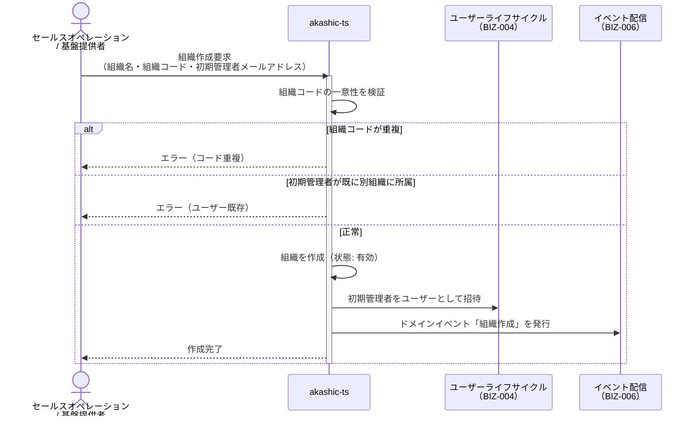
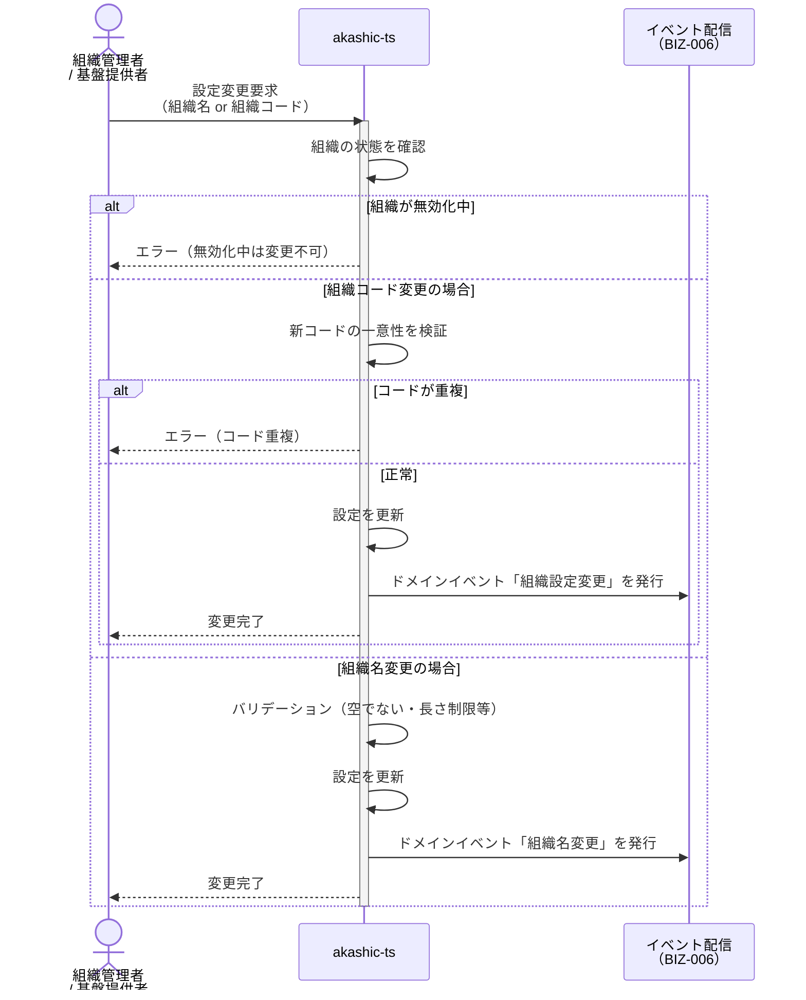
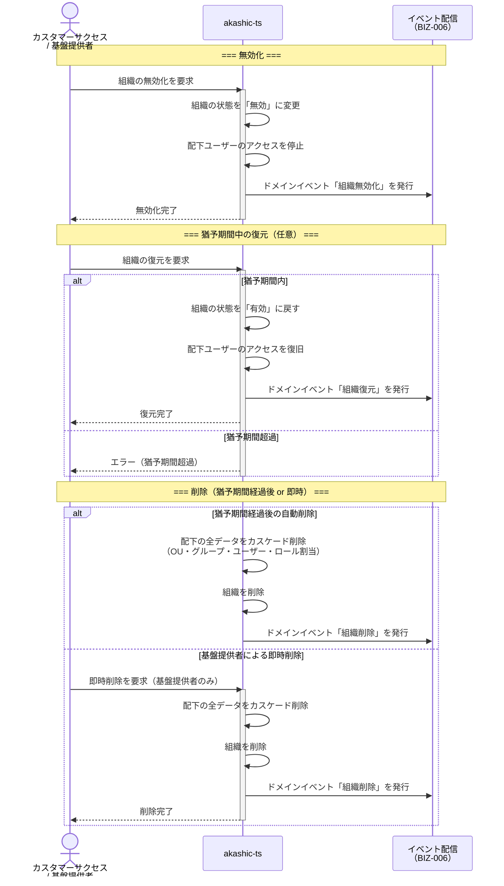
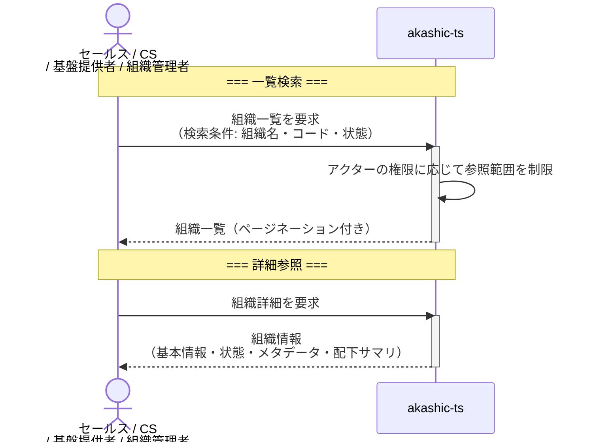
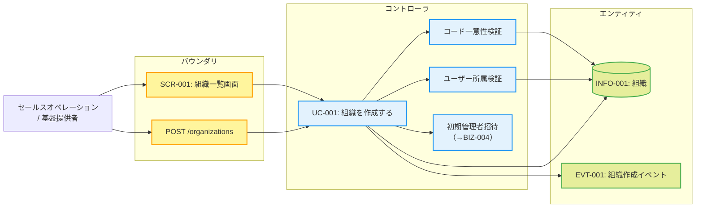
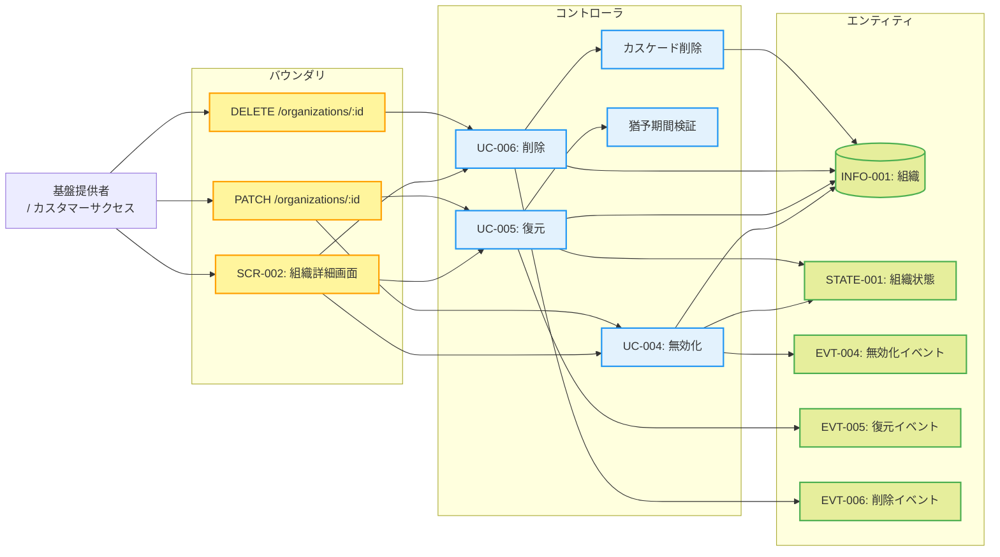

# BIZ-001: 組織管理

## ビジネスコンテキスト図

## 業務フロー

### BUC-001: 新規組織をプロビジョニングする

### BUC-002: 組織の設定を変更する

### BUC-003: 組織をデプロビジョニングする

### BUC-004: 組織を参照する

## ロバストネス図

### UC-001: 組織を作成する

### UC-004〜006: 組織のライフサイクル操作

## 条件一覧

| ID | 条件 | 関連UC |
|----|------|--------|
| COND-001 | 組織コードは基盤全体で一意 | UC-001, UC-003 |
| COND-002 | 無効化中の組織は設定変更不可 | UC-002, UC-003 |
| COND-003 | 復元は猶予期間内のみ（最長は基盤側固定） | UC-005 |
| COND-004 | 即時削除は基盤提供者のみ | UC-006 |
| COND-005 | ユーザーは1組織のみ所属 | UC-001 |
