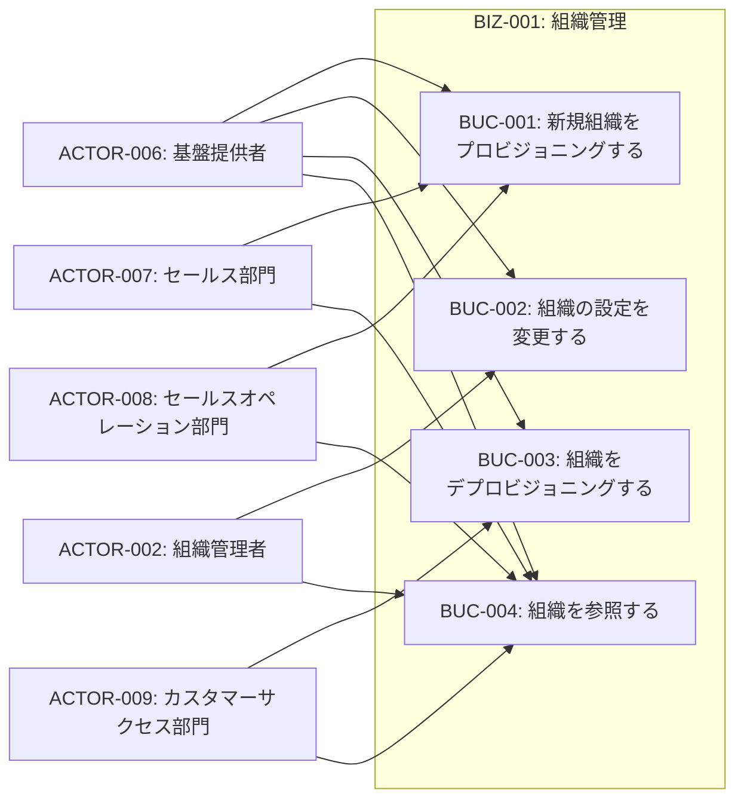
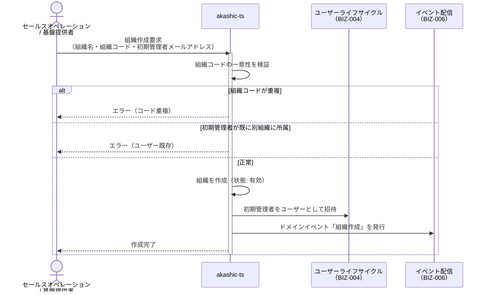
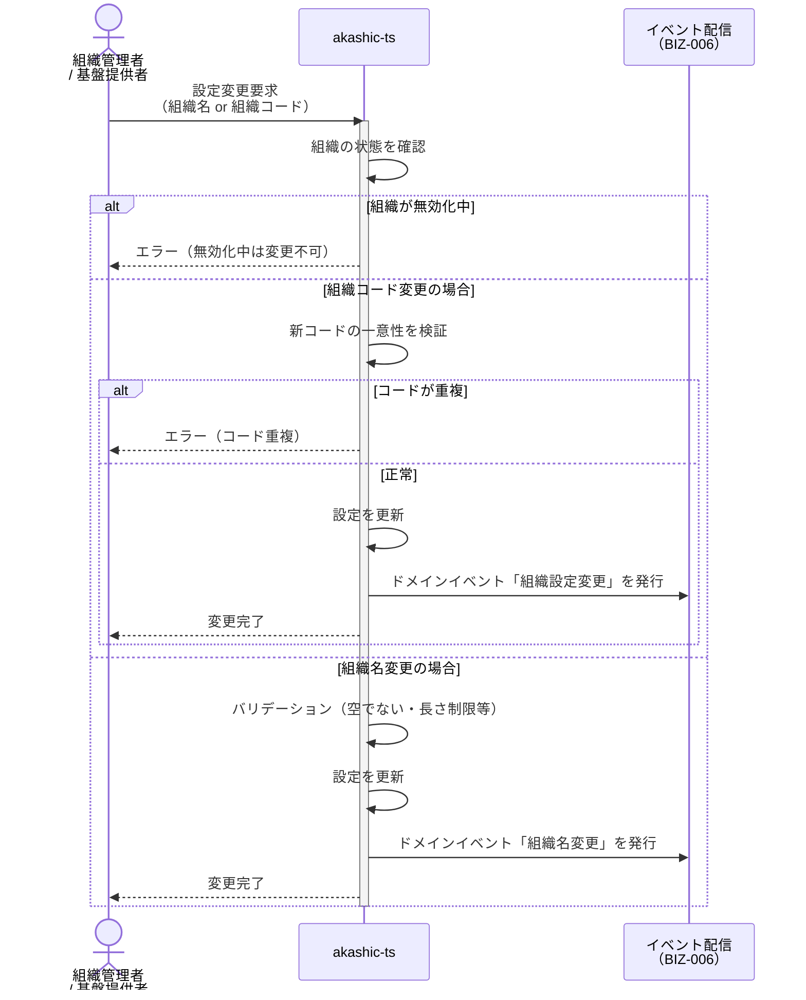
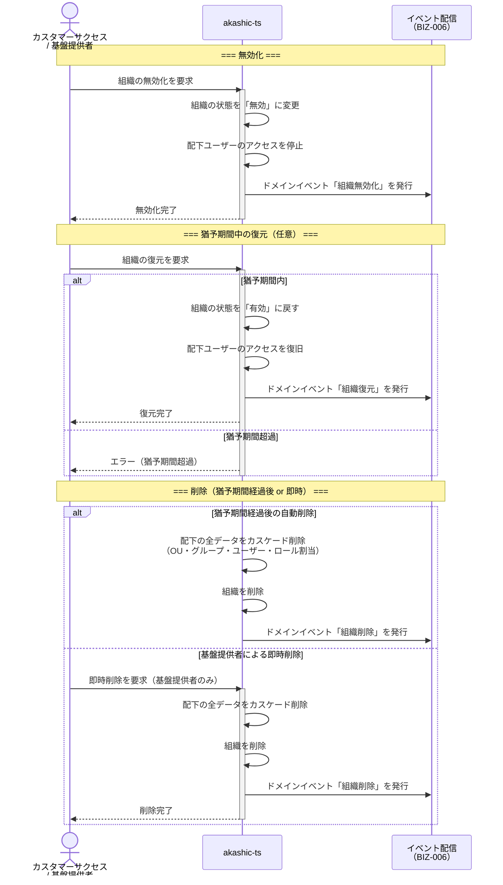
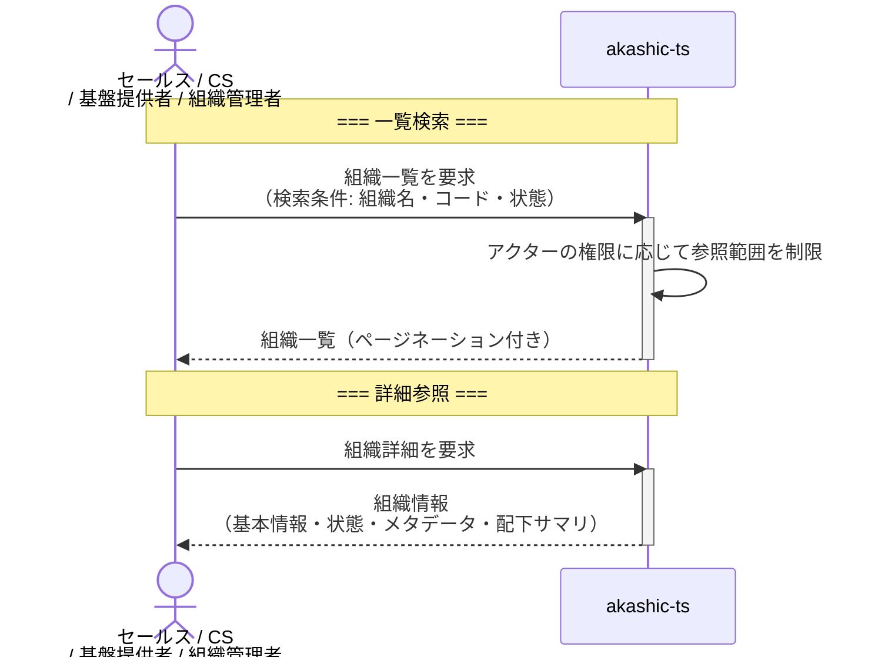

# BIZ-001: 組織管理

## ビジネスコンテキスト図

```mermaid
graph LR
    platform["ACTOR-006: 基盤提供者"]
    sales["ACTOR-007: セールス部門"]
    salesops["ACTOR-008: セールスオペレーション部門"]
    cs["ACTOR-009: カスタマーサクセス部門"]
    orgAdmin["ACTOR-002: 組織管理者"]

    subgraph ctx["BIZ-001: 組織管理"]
        buc1["BUC-001: 新規組織を\nプロビジョニングする"]
        buc2["BUC-002: 組織の設定を\n変更する"]
        buc3["BUC-003: 組織を\nデプロビジョニングする"]
        buc4["BUC-004: 組織を参照する"]
    end

    platform --> buc1
    platform --> buc2
    platform --> buc3
    platform --> buc4
    sales --> buc1
    sales --> buc4
    salesops --> buc1
    salesops --> buc4
    cs --> buc3
    cs --> buc4
    orgAdmin --> buc2
    orgAdmin --> buc4
```

## 業務フロー

### BUC-001: 新規組織をプロビジョニングする

```mermaid
sequenceDiagram
    actor Ops as セールスオペレーション<br/>/ 基盤提供者
    participant S as akashic-ts
    participant UL as ユーザーライフサイクル<br/>（BIZ-004）
    participant EV as イベント配信<br/>（BIZ-006）

    Ops->>S: 組織作成要求<br/>（組織名・組織コード・初期管理者メールアドレス）
    activate S
    S->>S: 組織コードの一意性を検証
    alt 組織コードが重複
        S-->>Ops: エラー（コード重複）
    else 初期管理者が既に別組織に所属
        S-->>Ops: エラー（ユーザー既存）
    else 正常
        S->>S: 組織を作成（状態: 有効）
        S->>UL: 初期管理者をユーザーとして招待
        S->>EV: ドメインイベント「組織作成」を発行
        S-->>Ops: 作成完了
    end
    deactivate S
```

### BUC-002: 組織の設定を変更する

```mermaid
sequenceDiagram
    actor Admin as 組織管理者<br/>/ 基盤提供者
    participant S as akashic-ts
    participant EV as イベント配信<br/>（BIZ-006）

    Admin->>S: 設定変更要求<br/>（組織名 or 組織コード）
    activate S
    S->>S: 組織の状態を確認
    alt 組織が無効化中
        S-->>Admin: エラー（無効化中は変更不可）
    else 組織コード変更の場合
        S->>S: 新コードの一意性を検証
        alt コードが重複
            S-->>Admin: エラー（コード重複）
        else 正常
            S->>S: 設定を更新
            S->>EV: ドメインイベント「組織設定変更」を発行
            S-->>Admin: 変更完了
        end
    else 組織名変更の場合
        S->>S: バリデーション（空でない・長さ制限等）
        S->>S: 設定を更新
        S->>EV: ドメインイベント「組織名変更」を発行
        S-->>Admin: 変更完了
    end
    deactivate S
```

### BUC-003: 組織をデプロビジョニングする

```mermaid
sequenceDiagram
    actor CS as カスタマーサクセス<br/>/ 基盤提供者
    participant S as akashic-ts
    participant EV as イベント配信<br/>（BIZ-006）

    Note over CS,EV: === 無効化 ===
    CS->>S: 組織の無効化を要求
    activate S
    S->>S: 組織の状態を「無効」に変更
    S->>S: 配下ユーザーのアクセスを停止
    S->>EV: ドメインイベント「組織無効化」を発行
    S-->>CS: 無効化完了
    deactivate S

    Note over CS,EV: === 猶予期間中の復元（任意） ===
    CS->>S: 組織の復元を要求
    activate S
    alt 猶予期間内
        S->>S: 組織の状態を「有効」に戻す
        S->>S: 配下ユーザーのアクセスを復旧
        S->>EV: ドメインイベント「組織復元」を発行
        S-->>CS: 復元完了
    else 猶予期間超過
        S-->>CS: エラー（猶予期間超過）
    end
    deactivate S

    Note over CS,EV: === 削除（猶予期間経過後 or 即時） ===
    alt 猶予期間経過後の自動削除
        S->>S: 配下の全データをカスケード削除<br/>（OU・グループ・ユーザー・ロール割当）
        S->>S: 組織を削除
        S->>EV: ドメインイベント「組織削除」を発行
    else 基盤提供者による即時削除
        CS->>S: 即時削除を要求（基盤提供者のみ）
        activate S
        S->>S: 配下の全データをカスケード削除
        S->>S: 組織を削除
        S->>EV: ドメインイベント「組織削除」を発行
        S-->>CS: 削除完了
        deactivate S
    end
```

### BUC-004: 組織を参照する

```mermaid
sequenceDiagram
    actor User as セールス / CS<br/>/ 基盤提供者 / 組織管理者
    participant S as akashic-ts

    Note over User,S: === 一覧検索 ===
    User->>S: 組織一覧を要求<br/>（検索条件: 組織名・コード・状態）
    activate S
    S->>S: アクターの権限に応じて参照範囲を制限
    S-->>User: 組織一覧（ページネーション付き）
    deactivate S

    Note over User,S: === 詳細参照 ===
    User->>S: 組織詳細を要求
    activate S
    S-->>User: 組織情報<br/>（基本情報・状態・メタデータ・配下サマリ）
    deactivate S
```
