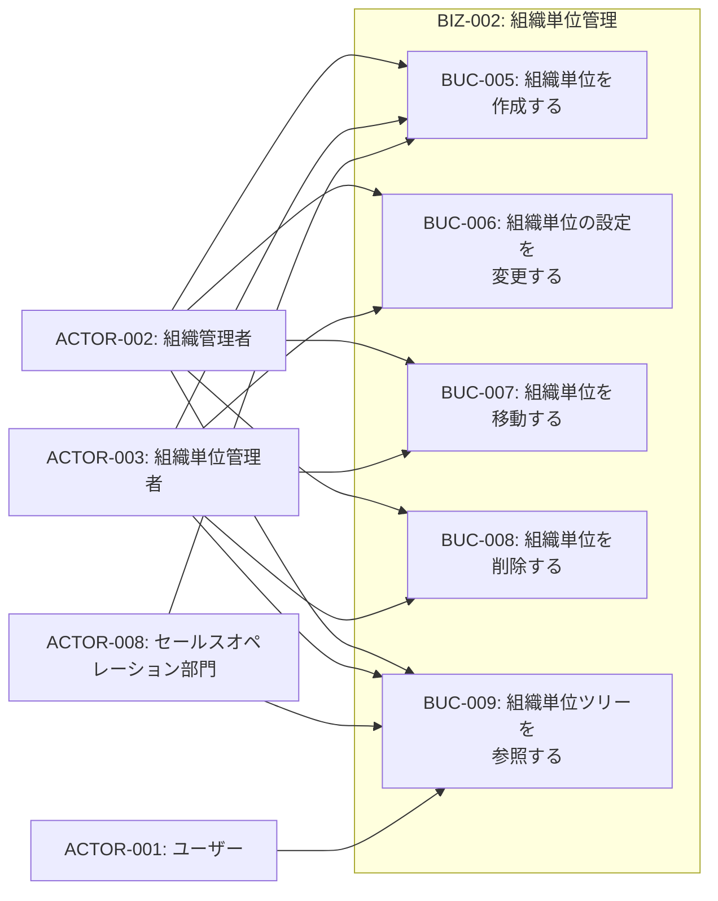
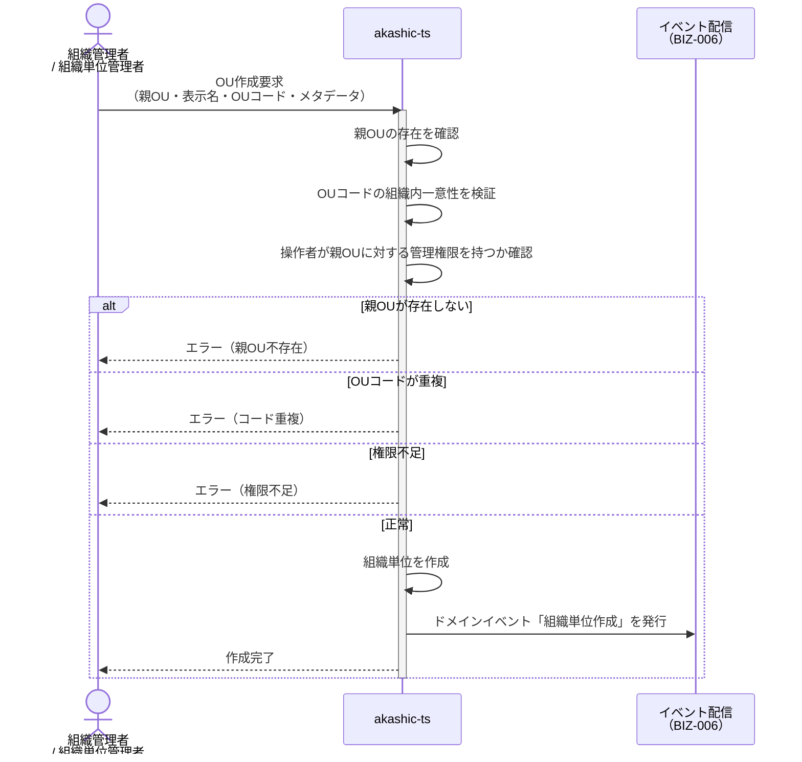
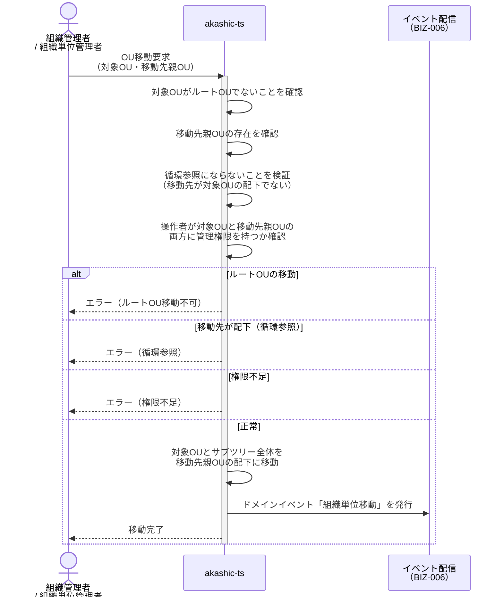
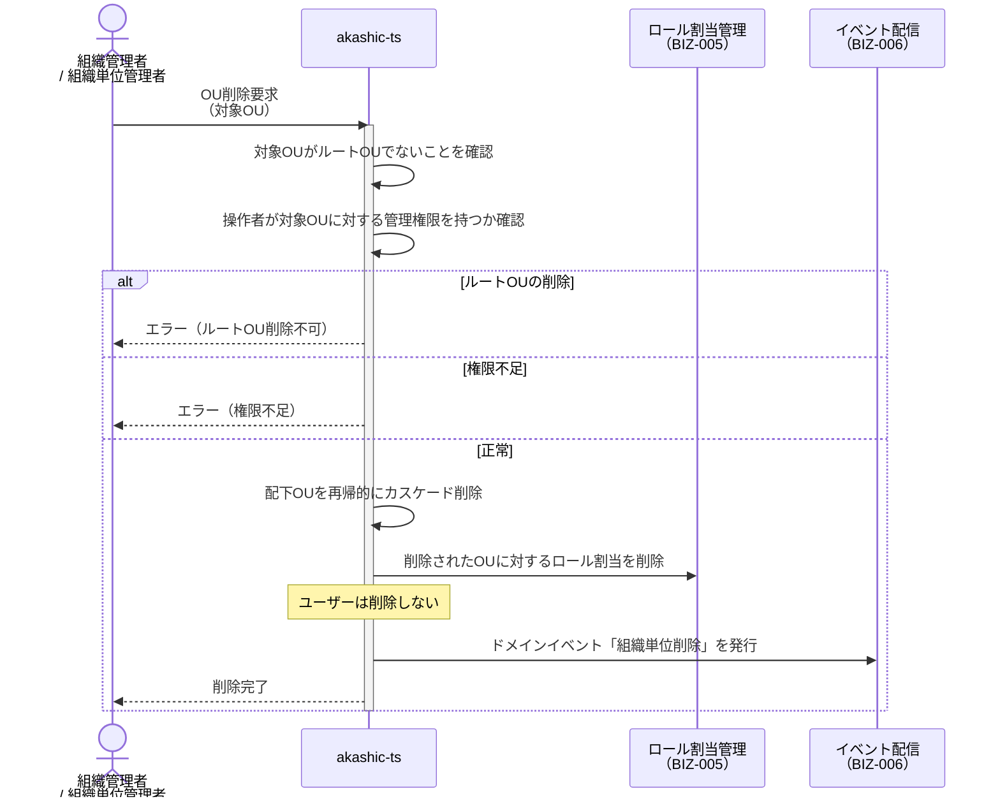
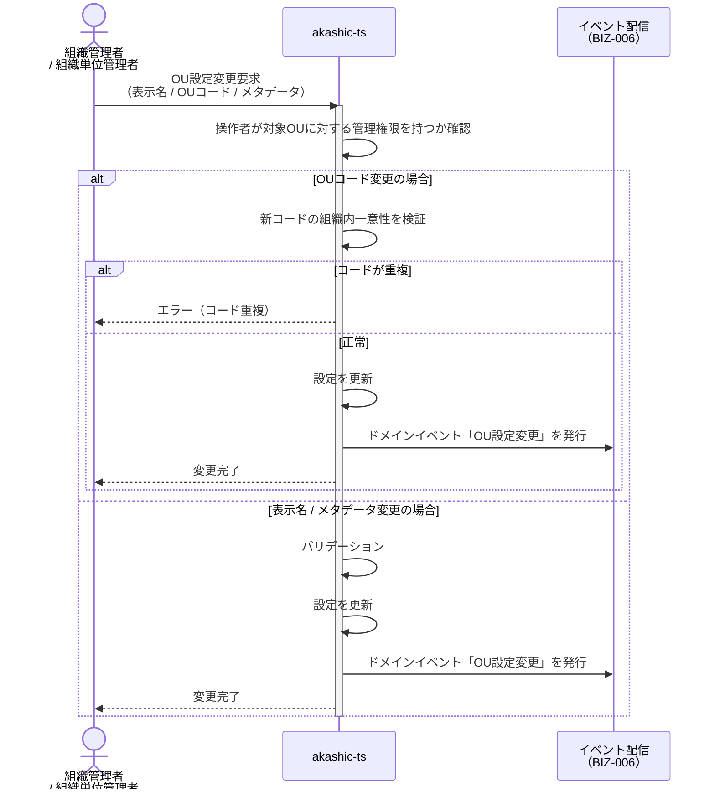
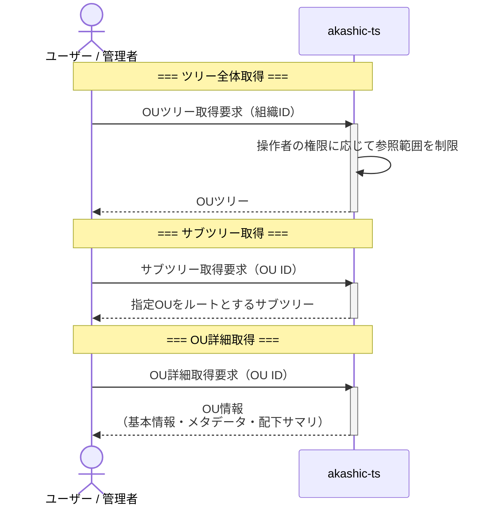

# BIZ-002: 組織単位管理

## ビジネスコンテキスト図

## 業務フロー

### BUC-005: 組織単位を作成する

### BUC-007: 組織単位を移動する

### BUC-008: 組織単位を削除する

### BUC-006: 組織単位の設定を変更する

### BUC-009: 組織単位ツリーを参照する

## 条件一覧

| ID | 条件 | 関連UC |
|----|------|--------|
| COND-006 | OUコードは同一組織内で一意 | UC-009, UC-011 |
| COND-007 | ルートOUは削除不可 | UC-014 |
| COND-008 | 移動先が配下の場合は循環参照として拒否 | UC-013 |
| COND-009 | OU削除時、配下OUとロール割当はカスケード削除するがユーザーは削除しない | UC-014 |
