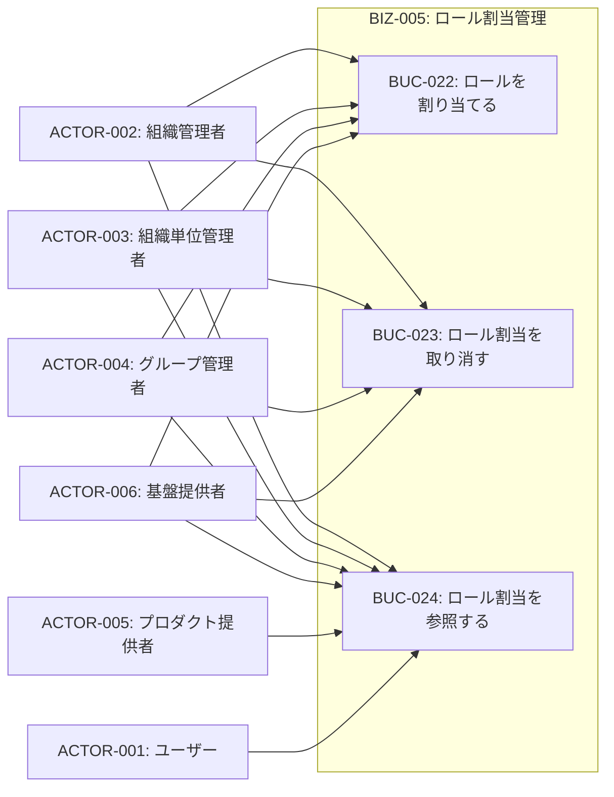
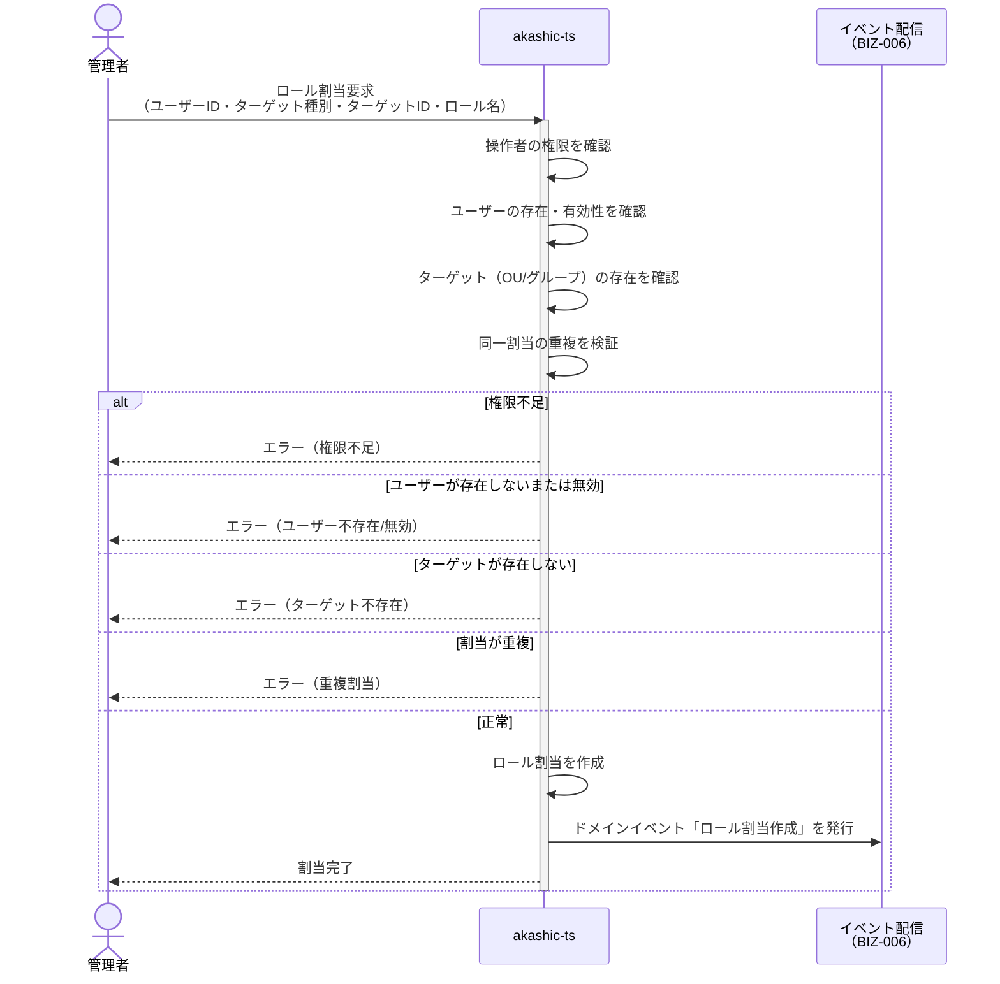
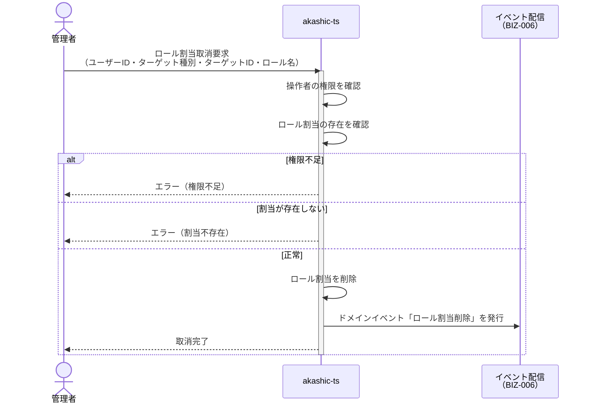

# BIZ-005: ロール割当管理

## ビジネスコンテキスト図

## 業務フロー

### BUC-022: ロールを割り当てる

### BUC-023: ロール割当を取り消す

## スコープ外（外部システムの責務）

| 責務 | 説明 | 想定される外部システム |
|------|------|----------------------|
| ロール定義 | ロール名に紐づくパーミッションの定義・管理 | SpiceDB, OPA, Cedar等 |
| パーミッション定義 | resource:action形式のアクセス権の定義 | SpiceDB, OPA, Cedar等 |
| アクセス制御評価 | 「ユーザーXはリソースYに対してアクションZを実行できるか」の判定 | SpiceDB, OPA, Cedar等 |

akashic-tsは「ユーザーXはOU/グループYに対してロール名Zを持つ」という割当データのみを管理し、ドメインイベントとして配信する。外部システムはこの割当情報を受け取り、独自のポリシーに基づいてアクセス制御を行う。

## 条件一覧

| ID | 条件 | 関連UC |
|----|------|--------|
| COND-019 | 同一ユーザー・同一ターゲット・同一ロール名の重複割当禁止 | UC-039, UC-040 |
| COND-020 | ロール名は外部定義（akashic-tsは管理しない） | - |
| COND-021 | 割当対象はOUまたはグループ（組織全体はルートOUで代替） | UC-039, UC-040 |
| COND-022 | 割当時にユーザー・OU/グループの存在と有効性を確認 | UC-039, UC-040 |
