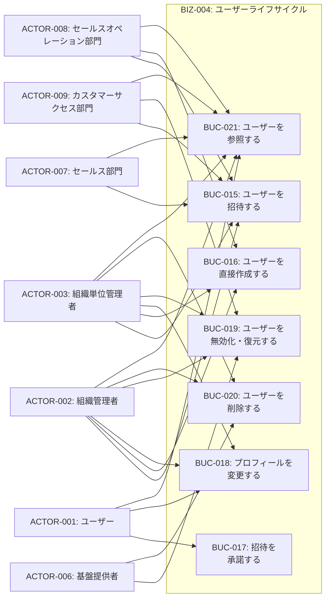
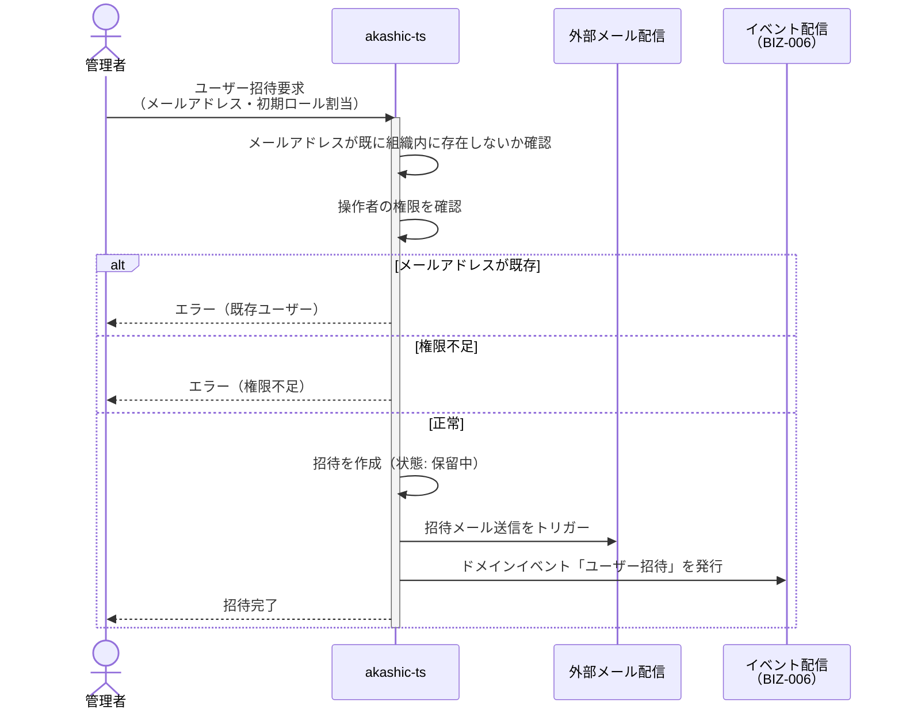
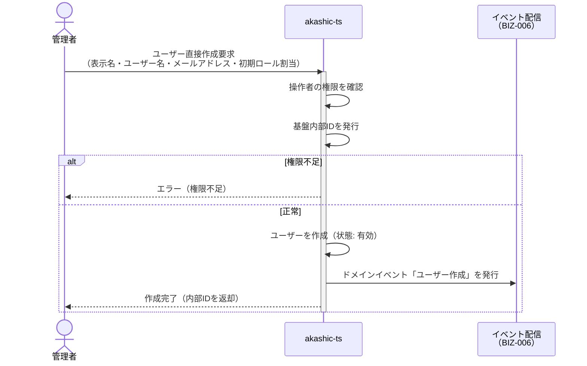
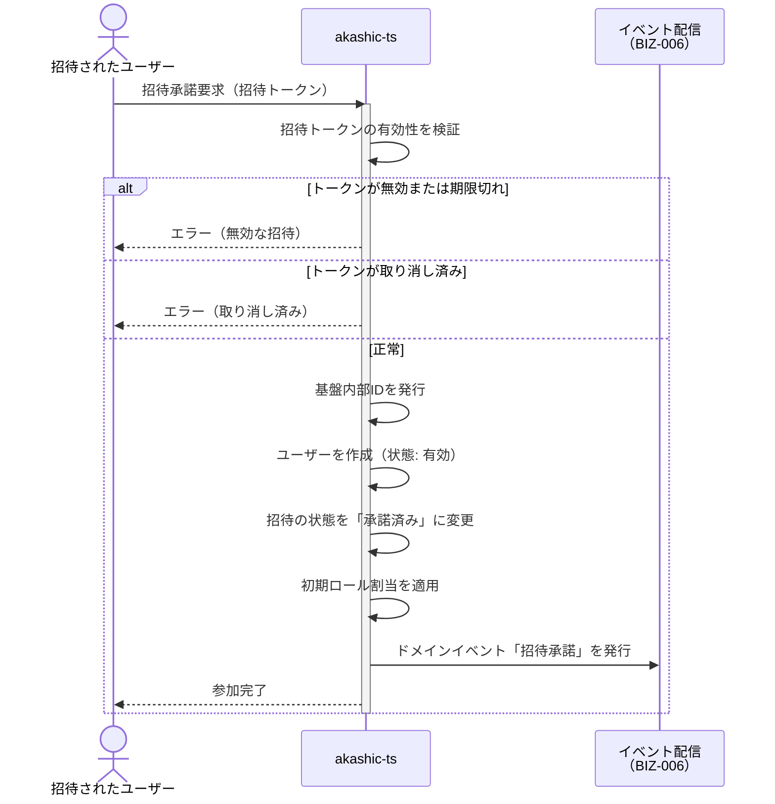
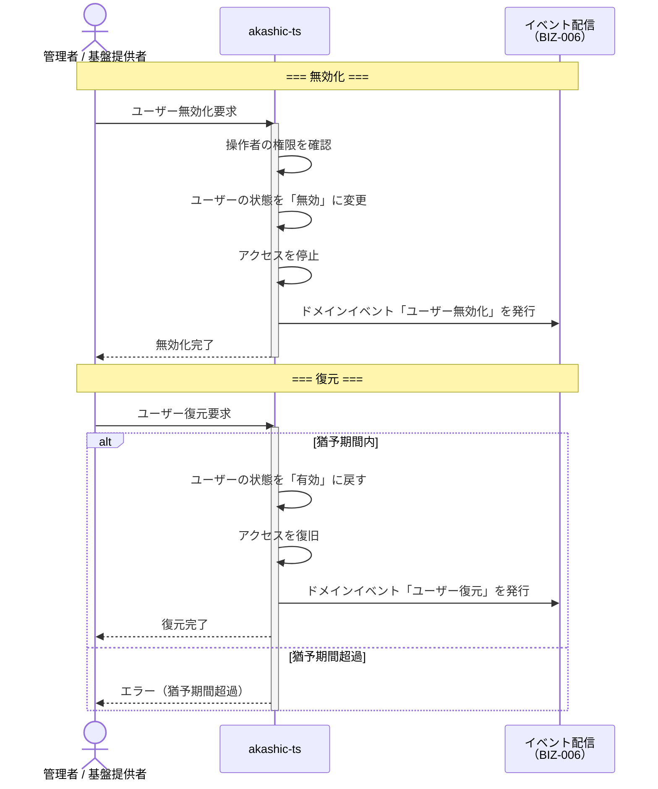
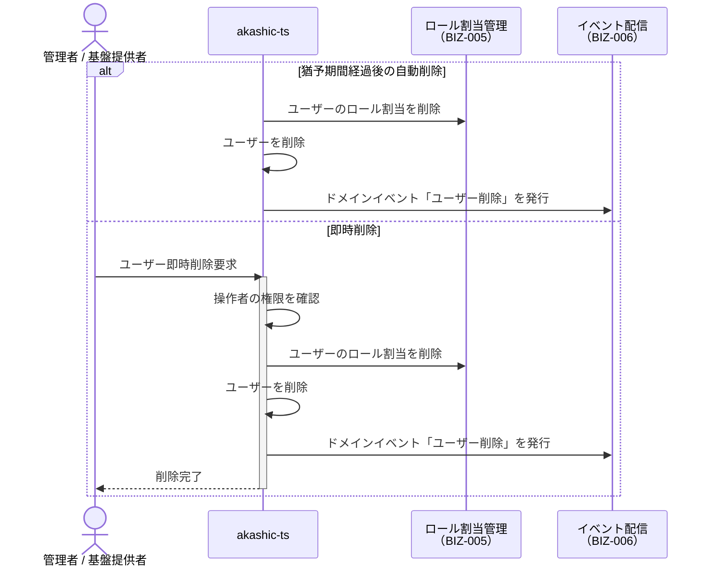

# BIZ-004: ユーザーライフサイクル

## ビジネスコンテキスト図

## 業務フロー

### BUC-015: ユーザーを招待する

### BUC-016: ユーザーを直接作成する

### BUC-017: 招待を承諾する

### BUC-019: ユーザーを無効化・復元する

### BUC-020: ユーザーを削除する

## 条件一覧

| ID | 条件 | 関連UC |
|----|------|--------|
| COND-013 | ユーザーは1組織のみ所属 | UC-027, UC-028, UC-029 |
| COND-014 | 認証は外部IdPに委譲 | - |
| COND-015 | ユーザー名またはメールアドレスのいずれかは必須 | UC-028, UC-032, UC-033 |
| COND-016 | ユーザー名は組織内で一意 | UC-028, UC-032 |
| COND-017 | 無効化中のユーザーはアクセス不可 | UC-034 |
| COND-018 | 削除時ロール割当も削除 | UC-036 |
