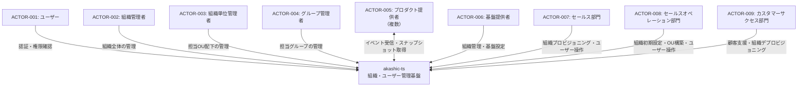
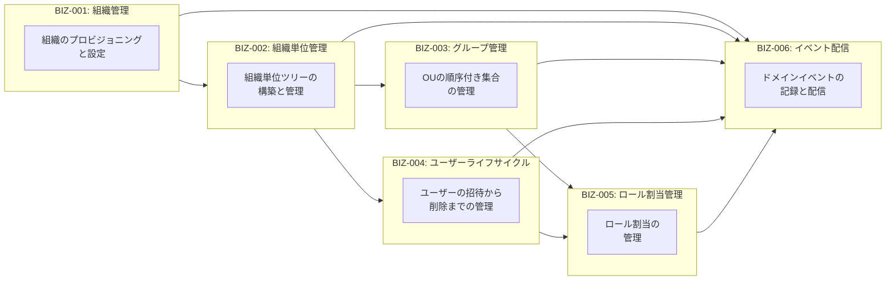

# akashic-ts 全体概観

## プロジェクト概要

akashic-tsは、SaaS企業のための顧客の組織・ユーザー管理基盤OSSである。マルチプロダクトSaaSでの利用を想定し、組織・組織単位（ツリー構造）・グループ（OUの順序付き集合）・ユーザーライフサイクル・ロール＋パーミッションを一元管理する。あらゆる変更はドメインイベントとして記録され、外部プロダクトへの配信が可能。

### ドメイン用語

| 用語 | 説明 |
|------|------|
| 組織 | 顧客企業の契約・管理単位 |
| 組織単位（OU） | 組織直下のツリー構造ノード。部門・支社・課など |
| グループ | 組織単位の順序付き集合。汎用的な用途（OSS利用者が自由に定義） |
| ユーザー | 組織に属する人。OUまたはグループに対してロールを持つ |
| ロール割当 | ユーザーがOU/グループに対して持つロール名の割当。ロール名は任意の文字列であり、パーミッション定義やアクセス制御評価は外部システムに委ねる |

### 現在のスコープ

- 組織管理
- 組織単位ツリー管理
- グループ管理
- ユーザーライフサイクル管理
- ロール割当管理（ロール定義・パーミッション定義・アクセス制御は外部）
- ドメインイベントの記録・配信

### 将来のスコープ

- 端末管理
- ライセンス管理

## システムコンテキスト図

## コンテキスト関連図

## ゴール一覧

| ID | ゴール | 関連アクター |
|----|-------|------------|
| GOAL-001 | マルチ組織の階層管理 | 組織管理者, 組織単位管理者, グループ管理者, 基盤提供者, セールスオペレーション |
| GOAL-002 | 統一的なユーザーライフサイクル管理 | ユーザー, 組織管理者, 組織単位管理者, 基盤提供者 |
| GOAL-003 | 完全な監査証跡 | 組織管理者, 基盤提供者, カスタマーサクセス |
| GOAL-004 | イベント駆動連携 | プロダクト提供者, 基盤提供者 |
| GOAL-005 | 拡張可能なロール割当モデル | ユーザー, 組織管理者, プロダクト提供者 |

## アクター一覧

| ID | アクター | 種別 | 説明 |
|----|---------|------|------|
| ACTOR-001 | ユーザー | human | エンドユーザー。ロールに基づいてプロダクトを利用 |
| ACTOR-002 | 組織管理者 | human | 組織全体を管理するロールを持つユーザー |
| ACTOR-003 | 組織単位管理者 | human | 担当OU配下を管理するロールを持つユーザー |
| ACTOR-004 | グループ管理者 | human | 担当グループを管理するロールを持つユーザー |
| ACTOR-005 | プロダクト提供者 | system | 基盤上のSaaSプロダクト（複数） |
| ACTOR-006 | 基盤提供者 | human | akashic-ts基盤の運営者 |
| ACTOR-007 | セールス部門 | human | 基盤提供者側。顧客獲得・組織プロビジョニング |
| ACTOR-008 | セールスオペレーション部門 | human | 基盤提供者側。組織初期設定・OU構築 |
| ACTOR-009 | カスタマーサクセス部門 | human | 基盤提供者側。顧客支援・デプロビジョニング |
