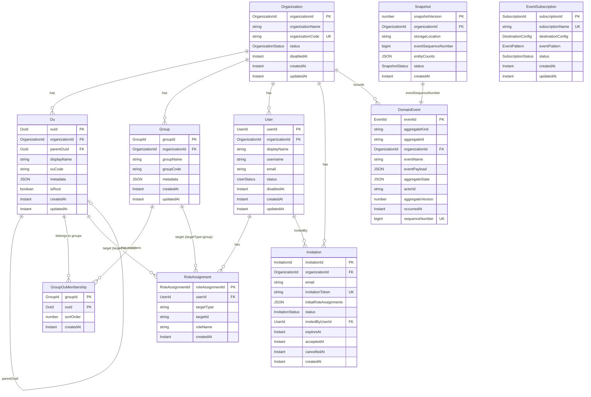

# 情報モデル

## ER図

## 一意性制約まとめ

| エンティティ | 制約 | スコープ |
|------------|------|---------|
| INFO-001 組織 | organizationCode | 基盤全体 |
| INFO-002 OU | ouCode | 組織内 |
| INFO-003 グループ | groupCode | 組織内 |
| INFO-004 ユーザー | username | 組織内（設定時のみ） |
| INFO-005 ロール割当 | (userId, targetType, targetId, roleName) | 基盤全体 |
| INFO-006 サブスクリプション | subscriptionName | 基盤全体 |
| INFO-007 招待 | invitationToken | 基盤全体 |
| INFO-008 グループOU構成 | (groupId, ouId) | 基盤全体 |
| INFO-009 ドメインイベント | eventId, sequenceNumber | 基盤全体 |
| INFO-010 スナップショット | snapshotVersion | 基盤全体 |

## カスケード削除の影響範囲

| 削除対象 | カスケード削除される関連エンティティ | 削除されないもの |
|---------|-----------------------------------|----------------|
| Organization | Ou, Group, GroupOuMembership, User, RoleAssignment, Invitation | - |
| Ou | 配下Ou（再帰）, 関連RoleAssignment(targetType=ou), 関連GroupOuMembership | User |
| Group | 関連RoleAssignment(targetType=group), 関連GroupOuMembership | - |
| User | 関連RoleAssignment | - |
