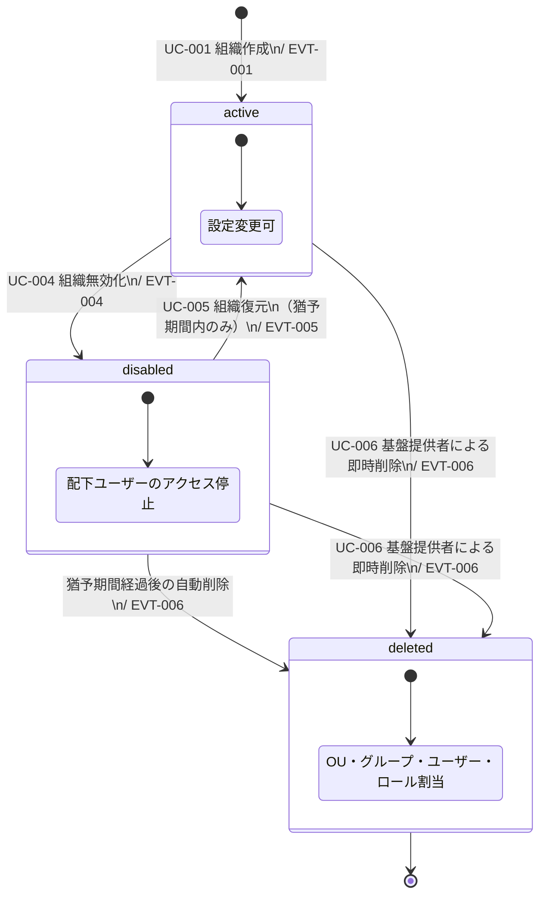
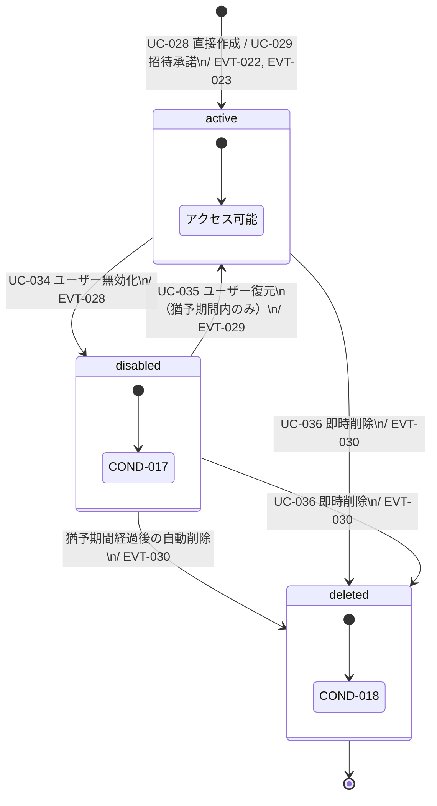
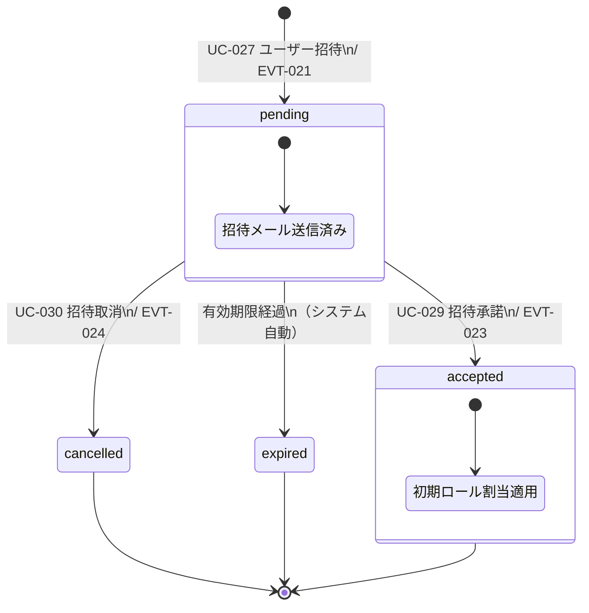

# 状態モデル

## STATE-001: 組織状態

### 遷移条件

| 遷移 | 条件 |
|------|------|
| active → disabled | - |
| disabled → active | COND-003: 猶予期間内のみ |
| active → deleted | COND-004: 基盤提供者のみ |
| disabled → deleted | COND-004（即時削除時）/ 猶予期間経過（自動削除時） |

## STATE-002: ユーザー状態

### 遷移条件

| 遷移 | 条件 |
|------|------|
| active → disabled | - |
| disabled → active | 猶予期間内のみ |
| active → deleted | 即時削除権限を持つアクターのみ |
| disabled → deleted | 即時削除権限 / 猶予期間経過 |

## STATE-003: 招待状態

### 遷移条件

| 遷移 | 条件 |
|------|------|
| pending → accepted | 有効なトークン・期限内 |
| pending → cancelled | 管理者操作 |
| pending → expired | expiresAt経過（システム自動） |
