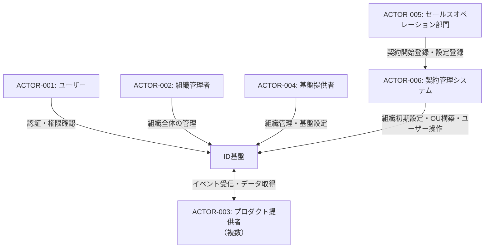
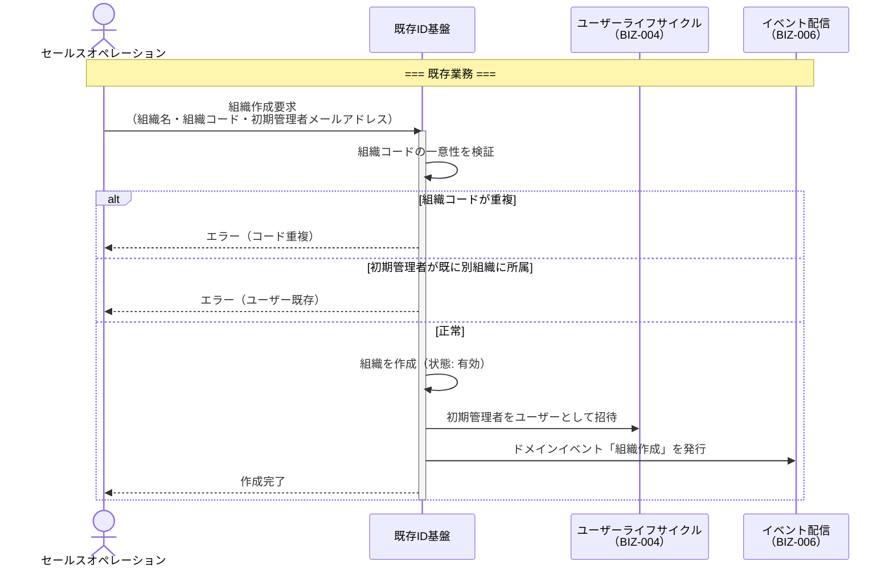

## SDDの「仕様」とは何を指しているのか

仕様駆動開発が話題です。[Kiro](https://kiro.dev/)、[OpenSpec](https://openspec.dev/)、[Spec Kit](https://github.blog/ai-and-ml/generative-ai/spec-driven-development-with-ai-get-started-with-a-new-open-source-toolkit/)といったツールが登場し、[Martin Fowlerのブログ](https://martinfowler.com/articles/exploring-gen-ai/sdd-3-tools.html)でも詳細に分析されています。

一方で、「仕様」という言葉が指す範囲が人によって異なるし、どのようなプロダクトを想定しているかが人によって異なるから、SDDの是非を巡る議論は空中戦になりがちです。

各ツールの定義を確認してみます。

[Martin Fowlerの記事](https://martinfowler.com/articles/exploring-gen-ai/sdd-3-tools.html)では、「仕様」を次のように定義しています。

> A structured, behavior-oriented artifact - or a set of related artifacts - written in natural language that expresses **software functionality** and serves as guidance to AI coding agents.

Kiroのspecは以下の3ファイルを順番に書いていきます。

1. `requirements.md`  
  EARS記法によるユーザーストーリーと受け入れ基準
2. `design.md`  
  アーキテクチャと技術判断
3. `tasks.md`  
  実装タスク

Kiroでは「なぜこのシステムを作るのか」に相当する独立した成果物はなく、ユーザーの自然言語プロンプトがその役割を担います。つまるところ、そもそもある程度は要求を自分の言葉で語れる状態であることが想定されているように見えます。すでにプロダクトやシステムがある程度順調に育っているなら、人間がそれなりにスラスラとユーザーストーリーや受け入れ基準を書けるのかもしれませんが、私が普段実務で向き合っている社内共通基盤やプラットフォームシステムのような領域では「そもそも価値を提供する対象のチームの要求が、そのチームのリーダーですらまだ言語化できない」ということも多く、「そもそもどうやってrequirements.mdを出力するか」が難しそうに感じました。

OpenSpecは少し異なり、以下の4ファイル構成です。Whyを扱うproposal層が存在する点でKiroより上流をカバーしています。

1. `proposal.md`  
  "why we're doing this, what's changing"
1. `specs/`  
  振る舞い契約
2. `design.md`  
  アーキテクチャと技術判断
3. `tasks.md`  
  実装タスク

ただし、OpenSpecの `proposal.md` が扱う「Why」は「なぜこの変更をするか」という機能変更レベルのWhyです。「なぜこのシステムを作るのか」「各運用チームの業務目標は何か」「セールスオペレーションチームは契約管理システムに対して、いつ何のために何をするのか」など、事業・業務レベルのWhyを構造的に分析するフレームワークではありません。

ソフトウェア開発には「要望→要求→要件→仕様→設計」という階層があります。詳細は　[ゴトーラボの解説](https://www.gotolab.co.jp/%E8%A6%81%E6%9C%9B-%E8%A6%81%E6%B1%82-%E8%A6%81%E4%BB%B6-%E4%BB%95%E6%A7%98-%E8%A8%AD%E8%A8%88%E3%81%AE%E9%81%95%E3%81%84%E3%81%AB%E3%81%A4%E3%81%84%E3%81%A6%E8%A7%A3%E8%AA%AC/)が分かりやすいですが、顧客やステークホルダーが唱える「あったらいいな、できたらいいな」はあくまで表層化された要望であって、それを「顧客は、○○を解決するため、△△したい」のようにWho/Why/Whatを明確にしたのが要求で、それに対して「システムは、○○しなければならない」と主語をシステムに置き換えたものが要件です。

このうち、SDDが主に扱うのは「要件→仕様→設計」のレイヤーです。「要望→要求」の構造化、つまりステークホルダーの業務を理解し、システム化の目的とスコープを明確にすることで、そのあとの要件もクリアになることでしょう。つまり、それぞれが補完関係にあります。

この記事では、この「要望➝要求➝要件」に落とし込んでいく仕事を要求分析と呼び、その方法として[RDRA](https://www.rdra.jp/)とClaude Codeで実践するワークフローを紹介します。

## 要求分析が抜けるとどうなるか

あくまで私のN=1の経験ですが、構造的な問題として共有します。

セールスオペレーションやカスタマーサクセスなど、顧客向き合いの運用チームが使うシステムを開発する場面を考えてみてください。例えば契約管理システムとID基盤の同期システムを開発するとき、以下のような判断が求められます。

- そもそも誰にとってなぜ契約管理システムとID基盤が同期されてほしいのか
- どのタイミングで、どのチームのメンバーが契約管理システムを利用するのか
- どのタイミングで、ID基盤へ反映されると誰が嬉しいのか
- この同期システムとコンフリクトする業務は存在するか
- 書き込みが失敗した場合、どのようなメッセージを誰に通知すべきか
- 書き込みは一括で行うべきか、個別に行うべきか

これらの判断は、それぞれの運用チームが何を目標とし、何に関心を置いて業務をしているかによって大きく変わります。にもかかわらず、曖昧な仮定を置いたまま開発を進めてしまうと、いびつな業務フローが爆誕し、顧客や関係チームの運用コストが増大してしまう。そして多くの場合、そのまま運用が開始され、運用コストが高いシステムを使い続けることになります。本来そのチームが向き合いたかった目標を達成するための時間が奪われ、最終的にはいびつな運用プロセスが固着してしまう。

SDDで仕様を丁寧に書いたとしても、その仕様の前提となる業務理解が間違っていれば意味がありません。仕様の前に要求があって、それぞれの要求が満たされることで誰にどんな価値が届くのか考える必要があります。

## なぜRDRAか

要求分析のフレームワークはRDRAだけではありません。イベントストーミング、ユーザーストーリーマッピング、ICONIX、匠Methodなど、選択肢は多い。その中でRDRAを選ぶ理由は、コーディングエージェントとの相性にあります。

RDRAの特徴は、要求を4つのレイヤー（システム価値/外部環境/システム境界/システム）で構造化し、各要素を表形式で表現する点です。図も使いますが、RDRAの成果物の本体は表やリストなど、構造化されたテキストデータです。

これがなぜ重要か、イベントストーミングを例に考えてみます。イベントストーミングはFigJamやMiroで付箋を空間的に配置するビジュアルな手法で、ワークショップとしては非常に強力です。ただ、その結果をコーディングエージェントに渡すのが難しい。付箋の位置関係、グルーピングの境界、矢印の意味などの空間的な情報をテキストに構造化する段階で情報が欠落しやすく、セクション境界をエージェントがうまく読み取ってくれないことが経験上多いです。私もスクリーンショットやCSV出力機能やMCPなど、あの手この手でデータをコーディングエージェントに転送することを試みましたが、どれもうまくいきませんでした。

一方、RDRAであれば、人間が読みやすいMarkdownでそのまま構造化データとして表現できます。実際に私が使っているClaude Codeの `/rdra` スキルでは、RDRAの成果物を以下のようなフォーマットで管理しています。

```markdown
### アクター一覧

| ID | アクター | 種別 | 説明 |
|----|---------|------|------|
| ACTOR-001 | ユーザー | human | エンドユーザー。ロールに基づいてプロダクトを利用 |
| ACTOR-002 | 組織管理者 | human | 組織全体を管理するロールを持つユーザー |
| ACTOR-003 | 組織単位管理者 | human | 担当OU配下を管理するロールを持つユーザー |
| ACTOR-004 | グループ管理者 | human | 担当グループを管理するロールを持つユーザー |
| ACTOR-005 | プロダクト提供者 | system | 基盤上のSaaSプロダクト（複数） |
| ACTOR-006 | 基盤提供者 | human | akashic-ts基盤の運営者 |
| ACTOR-007 | セールス部門 | human | 基盤提供者側。顧客獲得・組織プロビジョニング |
| ACTOR-008 | セールスオペレーション部門 | human | 基盤提供者側。組織初期設定・OU構築 |
| ACTOR-009 | カスタマーサクセス部門 | human | 基盤提供者側。顧客支援・デプロビジョニング |

### 要求一覧

システムが満たすべき機能的・非機能的な要件のリストです。

| ID | 内容 | 関連ゴール (Traces to) |
| --- | --- | --- |
| **REQ-024** | ユーザーにOU（組織単位）またはグループに対するロールを割り当てできる | GOAL-002, GOAL-005 |
| **REQ-025** | ロール割当を取り消しできる | GOAL-002, GOAL-005 |
| **REQ-026** | ロール割当の一覧を参照できる（ユーザー別・OU別・グループ別） | GOAL-002, GOAL-005 |
| **REQ-027** | ロール名の定義・パーミッション定義・アクセス制御評価は外部システムに委ね、基盤はロール割当の管理のみ行う | GOAL-005 |

### ビジネスユースケース一覧

外部環境レイヤーにおける、アクターとシステムの相互作用を定義したリストです。

| ID | ユースケース名 | 主なアクター | 内容 | 関連要求 (Traces to) |
| --- | --- | --- | --- | --- |
| **BUC-022** | ロールを割り当てる | ACTOR-002, 003, 004, 006 | ユーザーにOU（組織単位）またはグループに対するロールを割り当てる。ロール名は任意の文字列。 | REQ-024 |
| **BUC-023** | ロール割当を取り消す | ACTOR-002, 003, 004, 006 | ユーザーのOU（組織単位）またはグループに対するロール割当を取り消す。 | REQ-025 |
| **BUC-024** | ロール割当を参照する | ACTOR-001, 002, 003, 004, 005, 006 | ロール割当の一覧を参照する。ユーザー別・OU別・グループ別にフィルタ可能。 | REQ-026 |
```

参照関係を明示することで、ゴール → 要求 → 業務 → ユースケースというWhyの依存チェーンが形成されます。「このタスクはなぜ必要か」を遡れば必ずゴールに到達するので、エージェントにとっても人間にとっても、構造が明示的で扱いやすい設計です。ただ、何でもかんでもすべての物事がきれいに構造化できるわけではないですし、あくまで自然言語で書いているわけですから矛盾も発生します。あくまでここで言いたいのは、RDRAなら人間とコーディングエージェントの両方にとって扱いやすい構造にしやすいということです。

## Claude CodeとRDRAの実践ワークフロー

ここからが本題です。私が実際に業務で行っているワークフローを紹介します。

RDRAのような要求分析の手法をチームの全員がよく理解して実践することは容易ではありません。それぞれの項目に何を記入すればいいのか、それぞれのワークは何のために存在するのか、途中までは試行錯誤して進めてみたものの、不慣れな手法を使って得られる成果と、それを得るために必死にファシリテーションするコストが見合わず、徒労感の中で要求分析の実践をやめてしまった人もそれなりにいるのではないでしょうか。

要求分析の書籍はどれも抽象的な話題が多く、いくら学習しても実践フェーズに入るまでがあまりにも大変すぎます。

そこで、コーディングエージェントにインタビュワーになってもらい、チームで同期的に議論しながらそのインタビュワーに回答していく、人間が受け身になるワークフローを提案します。

### Step 1: スコープ把握

プロジェクトを推進する数名のエンジニアが、まずインセプションデッキや関連チームの業務マニュアルを読みます。その上で、Claude Codeのエージェントに社内のConfluenceやNotion、Slackを検索させ、関連するアクターや外部システムの仮説を立てさせます。

エージェントの出力は完璧ではありません。ただ、仮説があることで対話が始まります。エンジニアは「このチームも関わっているはずでは？」「過去のアーキテクチャ俯瞰図を見ると、このシステムも関係しそう？」とフィードバックを返す。エージェントはフィードバックを反映し、RDRA形式で「どんな人間・外部システムが関わるか」「それぞれの人間や外部システムは何を達成したいか」「そのためにプロダクトへ何を要求するか」を整理します。

例: 契約管理システムと連携するID基盤



### Step 2: 業務フロー生成

コンテキストが特定できたら、エージェントに各コンテキストのas-is業務フローをMermaidシーケンス図で生成させます。同時に、各業務プロセスでどんな課題があるかの仮説も提示させます。

ここで人間のレビューが効きます。例えば「契約開始時の業務であっても、初期ユーザーの作成と店舗の契約開始は実際には別の業務フローだから、分けて書いてほしい」というフィードバックが出る。こういった業務の実態は、ドキュメントには書かれていないことが多い。エンジニアの頭の中にある暗黙知がエージェントの仮説によって引き出されます。

as-is業務フローが固まったら、to-be候補を複数提案させます。各候補がどのゴール・要求を満たすかを紐づけることで、「なぜこの改善案を選ぶのか」の判断材料が構造化されます。




### Step 3: 非同期の仮説検証ループ

このワークフローの隠れた価値は、エージェントの処理待ち時間が人間の思考時間になることです。

エージェントが業務フローを生成したり、to-be候補を検討している間に、人間は別のドキュメントを読み込んだり、チーム内で議論を再開したりできます。エージェントの出力を待ってから次に進むのではなく、人間とエージェントが非同期に仮説を検証し合うリズムが生まれる。

### Step 4: 成果物の共有

要求分析の成果物は、最終的にセールスオペレーションやカスタマーサクセスといった運用チームにレビューしてもらう必要があります。ここで「成果物をどこに置くか」が問題になります。

GitHubで管理するのが常にベストとは限りません。

まず、コストとリテラシーの壁があります。GitHubのライセンスは1シートあたりのコストが馬鹿にならないし、非エンジニアを含む運用チーム全員にアカウントを発行するのはコスト面で厳しい。それに、GitHubを使いこなすリテラシーを全員に求めるのは組織をスケールする上でボトルネックになります。

もうひとつ、リアルタイム共同編集の価値があります。ConfluenceやNotionであれば、ミーティング中に全員が同時に要求を修正できる。ローカルにあるMarkdownファイルをGitHubにプッシュするフローだと、誰か一人が議事録を取るついでに修正しなければならなくなる。全員が話しながらドキュメントを育て、その結果をClaude Codeに読み込ませて次のイテレーションに反映する。このサイクルが回ることで、要求分析がエンジニアだけの作業ではなくチーム全体の営みになります。

もちろん、スタートアップのアーリーフェーズでリテラシーの高いメンバーが揃っているなら、GitHubで一元管理するのも合理的です。チームの実態に合わせて選べばよいと思います。

## まとめ

SDDと要求分析は対立しません。SDDは「仕様を書いてからコードを生成する」アプローチであり、その前工程として「なぜこのシステムを作るのか、誰のどんな業務課題を解決するのか」を構造化する要求分析がある。両者は補完関係にあります。

RDRAの表形式はコーディングエージェントとの相性がよく、FigJamやMiroのビジュアル手法では構造化しにくい情報を、エージェントが読み書きしやすいフォーマットで表現できます。また、それぞれに依存関係を明示しておくことで、「なぜこのタスクが必要なのか」をゴールまで一気通貫で遡れる仕組みを提供します。

そして成果物の配置先はチームの実態に合わせる。GitHubが全てではありません。非エンジニアが気軽に書き込み、議論しながら育てられるツールと連携することで、要求分析は初めてチーム全体のものになります。
