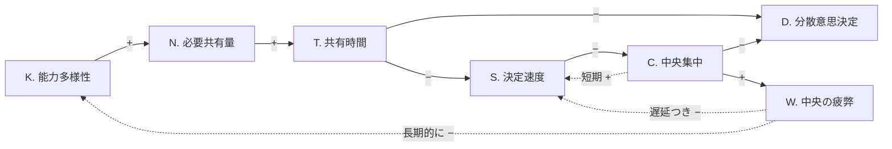
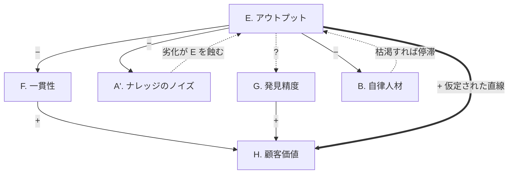
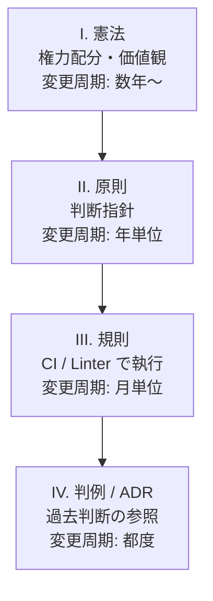

## 出発点 — 強くなったチームが分散できない

シニアで多様なチームへ移行できたのに、コンテキスト共有に時間がかかり、分散意思決定への移行に苦しんでいます。「組織が大きくなると遅くなる」という素朴な話ではなく、個々が強くなるほどある特定の構造が組織を縛る現象です。本稿ではこの罠を因果ループ図で可視化し、Brooks・Hickey・Humble らの知見を踏まえてホラクラシー的な分散組織の実装可能性を検討します。なお以下のループ図は筆者の現場観察を構造化した仮説で、定量的な実証研究ではない点に留意してください。

## 能力向上の罠 — 構造を図にする

観測可能な変数として、能力多様性 K、必要共有量 N、共有時間 T、決定速度 S、中央集中 C、分散意思決定 D、中央の認知負荷 W を置きます。

絡み合うループは4つです。**R1**(共有負荷増): K が増えるほど N が膨らみ、T を圧迫します。シニア揃いほど各人の判断には深い根拠があり、根拠を共有するコストもまた高くなります。Fred Brooks が『[The Mythical Man-Month](https://en.wikipedia.org/wiki/The_Mythical_Man-Month)』で示した n(n-1)/2 のチャネル数増加と同型の指数性が能力多様性にも組み込まれていると考えると、構造仮説として妥当です。**B1**(中央集中の短期解): T が増えて S が落ちると、特定の人が判断する C へ流れ、短期的には決定が速くなります。**B2**(分散と集中の両立不能): しかし C が高まれば D は進まず、D を進めるには T を要し、T が増えれば S が落ちる。共有が追いつかないから任せられず、任せないから共有も育たない、鶏と卵の問題です。**R2**(能力向上の自己矛盾): C が続くほど W が積み上がり、判断品質や育成投資の時間が落ちます。

一行で書けば、意思決定の品質は共有度と自律性の積に近似され、シニア多様チームは前者に時間を奪われて後者に投資できなくなります。

## 仮説と、その盲点

抜け道の最初の発想は、「ナレッジ基盤に蓄積した文脈を生成 AI で各人が引き出し、共有コストを非同期化する」というものです。各人が自律的に判断できるホラクラシー的な分散組織へ移行できれば B2 のジレンマから抜け出せる、というのが当初の仮説でした。

しかしシステム思考のレンズで見ると、4つの欠けた矢印が浮かびます。

**B1' 一貫性の崩壊**: 局所最適でアウトプットを増やすと、UI 思想・データモデル・命名規則がバラバラになります。**B2' ナレッジの腐敗**: 書き込みが増えるほど矛盾・陳腐化・文脈欠落が蓄積し、AI 参照精度が落ちます。**B3' 顧客価値発見の盲点**: 「何を作るか」の発見は、ナレッジ基盤と AI の中には基本的に存在しません。**B4' 自律人材の燃焼**: AI を使いこなせる人ほど判断の総量が増え、図1 の R2 と同型の罠が再来します。

ここで Rich Hickey が [Simple Made Easy](https://www.infoq.com/presentations/Simple-Made-Easy/) (Strange Loop 2011) で示した区別が効きます。AI ナレッジ基盤は共有を `easy`(手の届きやすい)にしますが、共有すべき内容そのものを `simple`(絡み合っていない)にはしません。仮説は人間時間の節約には効きますが、複雑性は手付かずのまま新しい場所に再配置されるだけです。

## ホラクラシーが見落とす「法体系」

つまり、AI ナレッジと自律人材があれば自動的に解けるわけではなく、4つの矢印を補う装置が必要です。とりわけ一貫性と剪定は、組織内に共有された具体的な規範を要求します。「外部キーには必ずインデックスを張る」「ID は ULID を使う」のような条文です。

> ホラクラシーには憲法レベルの文書はありますが、その下の法体系が未整備なのではないでしょうか。

ホラクラシー憲章 (Holacracy Constitution) はサークルやロールやテンション処理のメタルールを定めますが、具体的な行為規範はほとんど書かれていません。何をしてはいけないかは法律・条例・判例で具体化されるべき領域で、ここが空白か逆に過剰立法に陥ったとき組織は失調します。Zappos での大量離職や Medium の制度撤退は、現実のホラクラシーが両端で躓いてきた例です。

「法律」が満たすべき属性は、AI が読み込んで挙動を引き出せる**機械可読性**、CI や PR テンプレートで自動執行と一体化する**執行可能性**、なぜそのルールが生まれたかの文脈を残す**改正可能性**、規範の矛盾を解決する**階層性**の4つです。Michael Nygard が 2011 年に提唱した [Architectural Decision Records](https://adr.github.io/) — Andrew Harmel-Law が [Martin Fowler のサイトで詳細化](https://martinfowler.com/articles/scaling-architecture-conversationally.html) しています — は、この判例レイヤーの先行例です。階層化すると次のようになります。

## それでも残る懸念 — Accelerate の知見から

ただし「法体系を作る」というアプローチは、Nicole Forsgren・Jez Humble・Gene Kim が『Accelerate』(IT Revolution Press, 2018) で示した DORA 研究と緊張関係にあります。同書は Ron Westrum の組織文化モデルを引き、`bureaucratic`(規則重視)文化が `generative`(成果重視)文化よりソフトウェアデリバリ性能で劣ることを定量的に示しました。法体系の整備は、このルール依存文化への滑落と紙一重です。

一方で同書が高パフォーマンスチームに共通する特徴として挙げる loosely coupled architecture と decentralized decision making は、規範レイヤーがなければ実現できません。論点は「法体系を持つか否か」ではなく、「過剰立法を避け、機械執行可能で抽象度の高い少数の条文に絞れるか」という設計品質に移ります。

## 結論 — 罠から抜け出す条件

問題の核は「シニアほど遅くなる」ではなく、能力多様性の指数的な共有需要を、線形にしか伸びない人間の同期コストで支えようとする構造です。抜け出すには人を増やすことでも AI を入れることでもなく、共有を非同期化・機械化する規範レイヤーへの投資が要ります。Hickey が言う `simple` を組織側でも引き受け、Humble らが言う `generative` 文化を壊さない抽象度で「法律」を書ききれるか — それが能力向上の罠から抜け出すための条件だと考えています。
