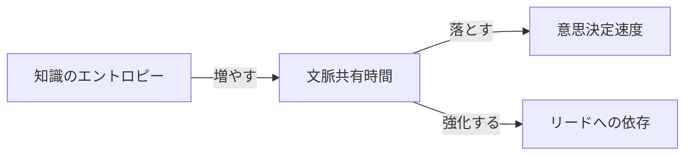
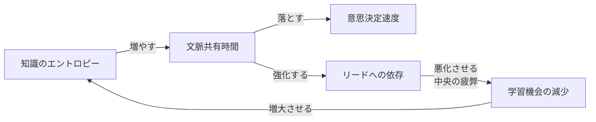
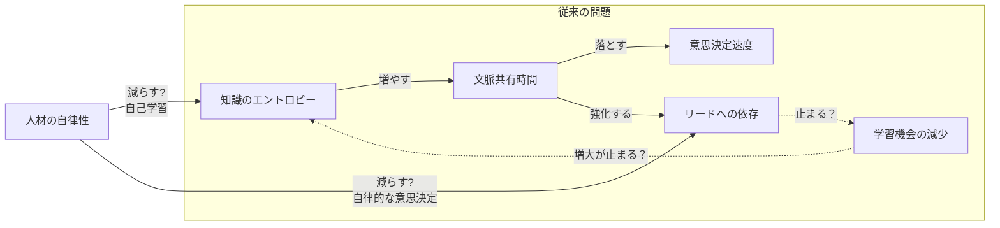
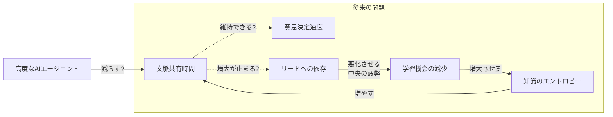
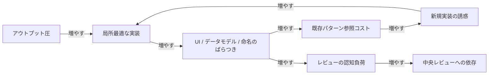
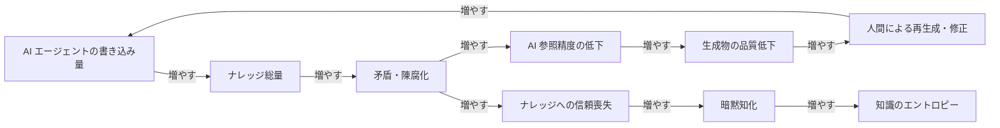
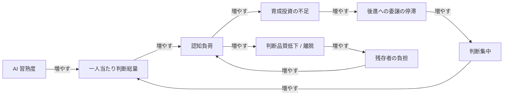
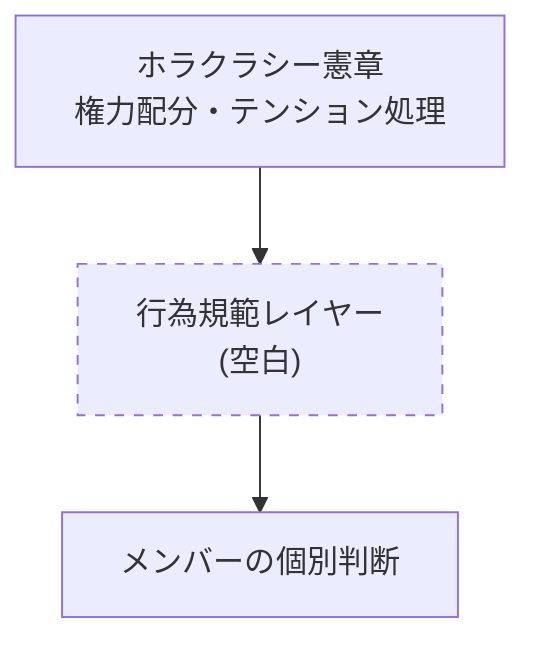
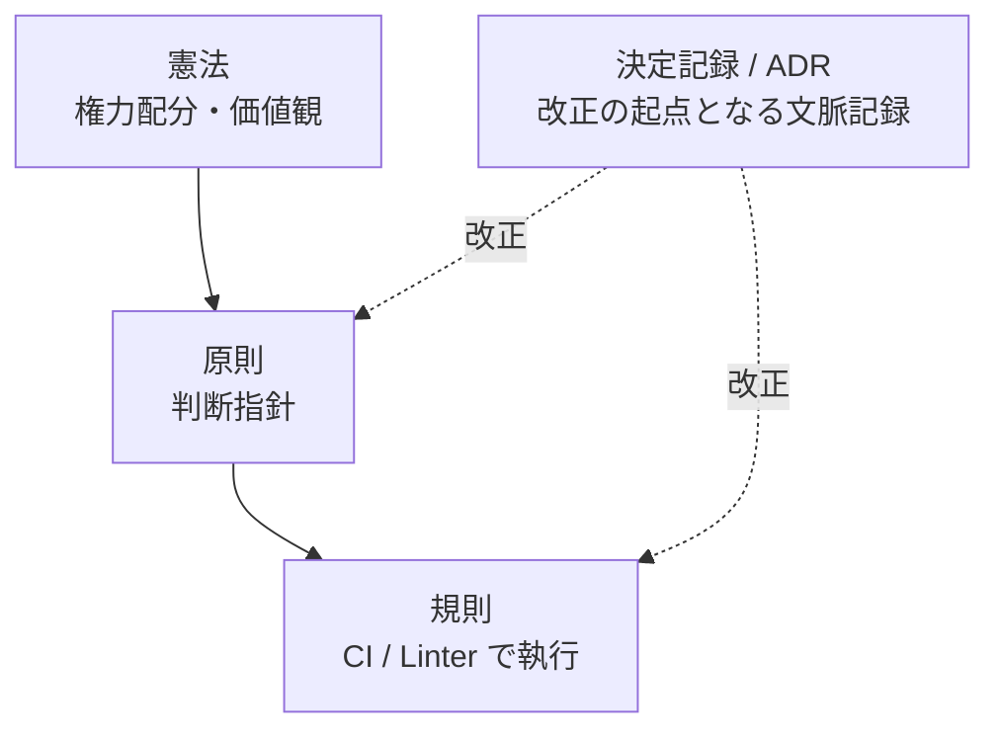

## 「人を増やすか減らすか」の前にある問い

チームの人数が増えるほど、それぞれのメンバーに求められる情報の発信量・受信量が増えていき、やがて情報の伝搬速度がチーム開発のボトルネックになりがちです。特に、AIエージェントが登場してからは表面上の開発速度が上がったように見え、「人間の人数を減らせば減らすほど、コンテキストの伝搬が速くなり開発生産性が上がる」と考える人はいるでしょう。

一方で、1人ができることが増えたのだから、自律的な人材を採用し、開発テーマやエピックをその人が1人でまるっと担当すれば、コンテキストの伝搬を省略してデリバリー速度を上げられると考えることもできます。つまり、「優秀な人間を増やせば増やすほど、開発生産性の総量が増える」と考える人も存在します。

その結果、「人を減らした方が開発生産性が上がるのか、人を増やした方が開発生産性が上がるのか」という二元論が度々話されることになるでしょう。しかし、こうした極端な二元論で考える前に、隠れた他の変数があるか考えるべきです。

この記事では、組織アウトプットの質を保つために組織とチームをどう構造化するかを考えていきます。

## 文脈共有コストが膨らむ

組織のアウトプットを支えているのは、メンバー同士の意思決定の速度と、判断を任せ合える分散度です。

例えば、テックリードがすべてのプルリクエストを詳細にレビューするまでマージできないチームよりも、それぞれのメンバーが相互にレビューすることで十分に情報を共有し品質を担保できるチームの方が、アウトプットは多いでしょう。

逆に言えば、メンバー間の知識のエントロピー（メンバーが持つ知識分布のばらつき）が大きくなるほど、互いに事前共有しておかないと噛み合わない事項が増え、文脈共有のための時間が膨らみます。

『[人月の神話](https://en.wikipedia.org/wiki/The_Mythical_Man-Month)』で示された「人数が増えるほどコミュニケーションパスが指数的に増加する」という主張について、人数のみならず知識のエントロピーによってコミュニケーションパスが変動する、と捉えるのが本稿の出発点です。人数が変わらなくても、各人がカバーする領域を広げるだけで文脈共有コストは膨らんでいきます。

## 速度と分散の両立不能

文脈共有時間が膨らむと、意思決定の速度が直接遅くなります。

ミーティングばかりのチームでは意思決定の速度が落ちていきますし、分散的な意思決定を可能にするチームへ移行する準備もままならなくなってしまいます。

## 中央集権体制とその限界

意思決定が遅くなれば、組織は短期的な逃げ道として特定の人が判断する体制に移行します。「テックリードやEM、PdMさえ承認すればその意思決定はチームで合意済みとみなす」という体制を見たことがある読者はきっと多いでしょう。

中央集権体制は意思決定速度を一時的に取り戻しますが、分散意思決定とは構造的に両立しません。さらに長く続けば、判断する側に認知負荷が積み上がり、判断品質や育成投資の時間が削れていきます。

つまり、組織のアウトプットの質は、「どれほど文脈が共有されているか」「どれほど意思決定を分散できるか」に大きく左右されるのです。片方に時間を奪われると他方への投資ができなくなります。「人を増やすか減らすか」の議論は、この構造に与える影響を語らない限り、ほとんど意味を持ちません。

## 自律的な人材が全てを解決するか？

仮にホロクラシー組織を経験した自律的な人材を採用すれば、意思決定は加速するのでしょうか。

あるいは、高度なAIエージェントによって文脈共有時間そのものが大きく減少し、意思決定が加速するのでしょうか。

- **一貫性の崩壊**: 局所最適でアウトプットを増やすと、UI 思想・データモデル・命名規則がバラバラになります。
- **ナレッジの腐敗**: AIエージェントからの書き込みが増えるほど矛盾・陳腐化・文脈欠落が蓄積し、AI 参照精度が落ちます。
- **自律人材の燃焼**: AI を使いこなせる人ほど判断の総量が増え、前節で見た中央集中の自己矛盾と同型の罠が再来します。

それぞれが、放置すれば自己強化的に悪化するループを抱えています。

### 一貫性の崩壊

アウトプット圧の下で局所最適を許容すると、UI 思想・データモデル・命名のばらつきが累積していきます。次の実装者が既存パターンを参照するコストが上がるため、参照せず新しく作る選択が合理的になり、ばらつきがさらに加速する強化ループに入ります。同時に、ばらつきはレビュー側の認知負荷を増やし、前章で見た中央集権の問題に合流します。

### ナレッジの腐敗

AIエージェントの書き込みが増えるほどナレッジ総量は増えますが、剪定が伴わなければ矛盾と陳腐化が蓄積し、AI の参照精度が落ちます。生成物の品質低下は人間による再生成・修正を呼び、書き込み量がさらに増える強化ループになります。同時に陳腐化は人間側でナレッジへの信頼を失わせ、暗黙知化を進めて知識のエントロピーを押し上げます。

### 自律人材の燃焼

AI を使いこなせる人ほど一人当たりの判断総量が増え、認知負荷が育成投資の時間を圧迫します。育成が止まれば判断を委譲できず、その人への集中がさらに強まる強化ループに入ります。負荷の累積はやがて判断品質の低下や離脱を呼び、残存者の負担として再燃します。中央集権の自己矛盾と同型の構造が、自律人材の側でも起きます。

ここで Rich Hickey が [Simple Made Easy](https://www.infoq.com/presentations/Simple-Made-Easy/) (Strange Loop 2011) で示した区別が効きます。

AIエージェントは文脈の共有を easy にしますが、共有すべき内容そのものを simple にはしません。アウトプットを増やすための仮説は人間の時間の節約には効きますが、複雑性は手付かずのまま新しい場所に再配置されるだけで、組織アウトプットの質は上がりません。

## 規範レイヤーの空白という診断

つまり、AIエージェントと自律人材があれば自動的に解けるわけではなく、前節で挙げた3つの問題を補う装置が必要です。一貫性も剪定も燃焼対策も、最終的には「組織として何を許し何を禁じるか」の共有規範に落ちます。

> ホラクラシー憲章には権力配分のメタルールがありますが、その下に必要な行為規範のレイヤーが意図的に空白のままなのではないでしょうか。

ホラクラシー憲章 (Holacracy Constitution) はサークル・ロール・テンション処理のメタルールを定める一方で、組織横断の具体的な行為規範はほとんど含まれていません。各サークルの自律性を尊重する設計上の選択ですが、結果として「何をしてはいけないか」「どこで一貫性を担保するか」の判断はメンバーの個別運用に委ねられます。

前節で見た中央集中の自己矛盾は、この空白が部分的な原因です。空白を暗黙運用で埋めると一貫性も剪定も持続せず、判断の重みは中央に積み上がっていきます。

## 機械執行可能な少数条文という設計

空白を埋める条文とはどういうものか。「外部キーには必ずインデックスを張る」「ID は ULID を使う」のような、判断の余地を機械側に押し戻す具体的なルールです。核心は、CI や Linter が読み取って PR レビュー時に検出できる、機械執行可能な形式に落ちていることです。人間が読み合わせて運用する規範は、前節のナレッジ腐敗と同じ経路で陳腐化していきます。

Michael Nygard が 2011 年に提唱した [Architectural Decision Records](https://adr.github.io/) — Andrew Harmel-Law が [Martin Fowler のサイトで詳細化しています](https://martinfowler.com/articles/scaling-architecture-conversationally.html) — は、なぜその条文が生まれたかを記録し、後から規則を改正する起点となる決定記録のレイヤーです。規範を階層で捉えると次の関係になります。

上位ほど変更が稀で、下位ほど頻繁に改正されます。決定記録は規則や原則を双方向に改正していく動的な層で、ここが回らないと規則は陳腐化します。

## 条文設計の品質基準 — Accelerate の留保

ただし、この設計は Nicole Forsgren・Jez Humble・Gene Kim が『Accelerate』(IT Revolution Press, 2018) で示した DORA 研究と緊張関係にあります。同書は Ron Westrum の組織文化モデルを引き、generative (成果重視) 文化スコアの高さがソフトウェアデリバリ性能と相関することを示しました。条文を増やすほど、組織は generative ではなく規則重視の bureaucratic 側に寄っていきます。

論点は「規範レイヤーを持つか否か」ではなく、設計品質です。条文数が少ないほど、抽象度が高いほど、機械執行率が高いほど、組織は generative 文化を保ちやすい。「人間が読まなくても回る最小集合」に絞り込めるかが分岐点で、絞り込めないなら空白のままにしておく方が組織としては健全です。Accelerate が高パフォーマンスチームの特徴として挙げる loosely coupled architecture と decentralized decision making は、抽象度の高い少数の条文がなければ実現できません。

## 結論 — 人数論を超えて

問いを「人を増やすか減らすか」から「組織アウトプットの質をどう設計するか」へ移すと、見える景色が変わります。文脈共有コストの罠は人数ではなく知識のエントロピーが生む構造で、一貫性・ナレッジ・燃焼の3つの問題はアウトプット量とは独立に存在し、それらを補う規範レイヤーは機械執行可能な少数の条文に絞り込めるかにかかっています。問題は構造であって員数ではない、というのが本稿の主張です。
