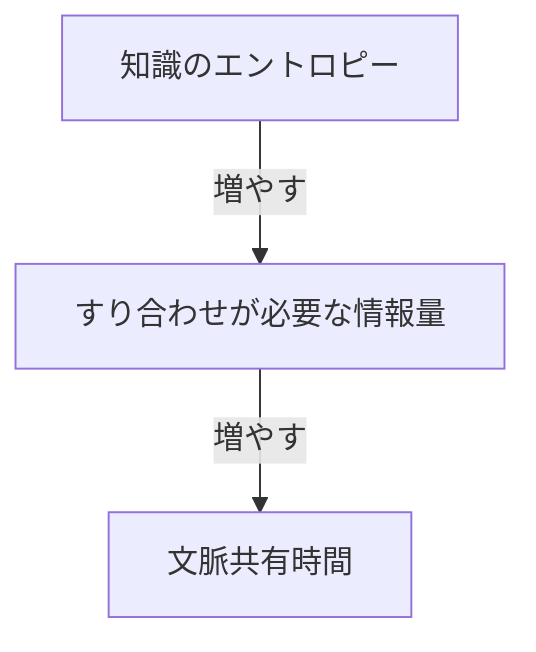
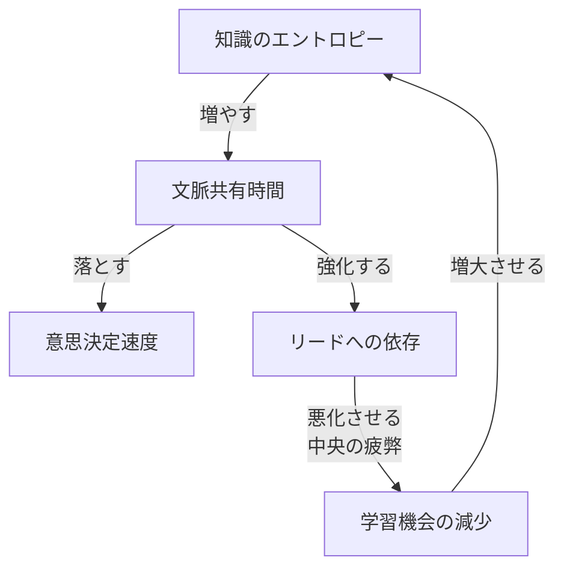
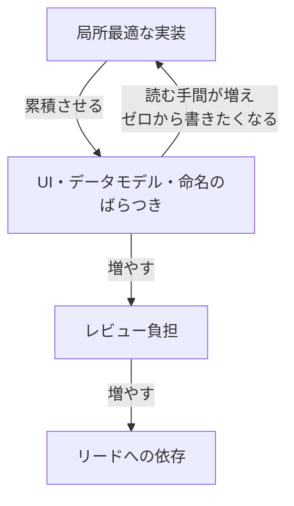
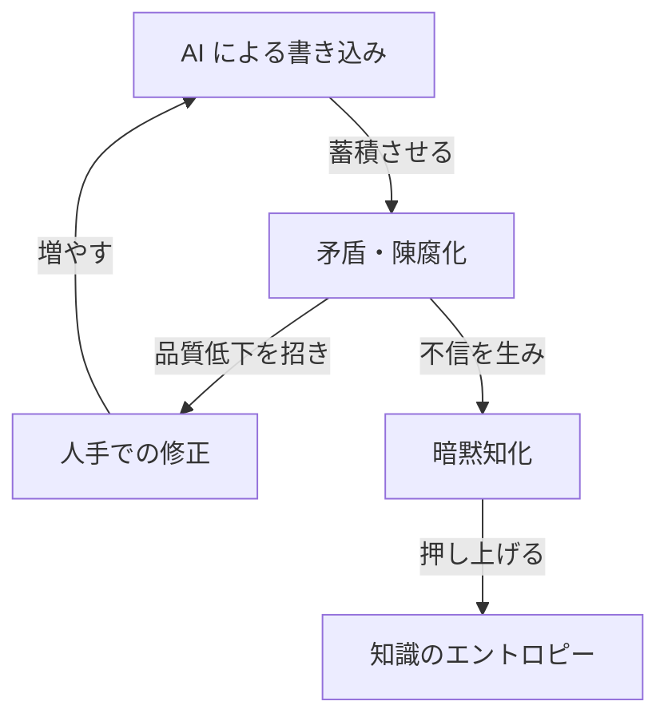
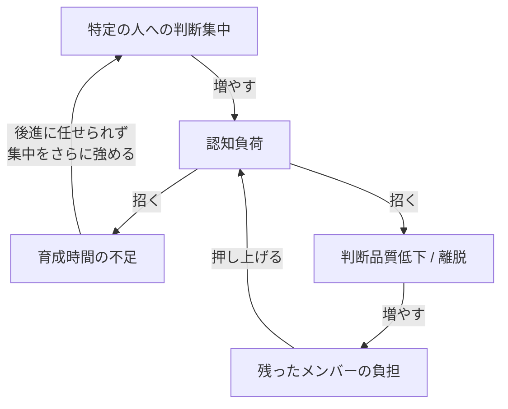

## 「人を増やすか減らすか」の前にある問い

チームの人数が増えるほど、それぞれのメンバーに求められる情報の発信量・受信量が増えていき、やがて情報の伝搬速度がチーム開発のボトルネックになりがちです。特に、AIエージェントが登場してからは表面上の開発速度が上がったように見え、「人間の人数を減らせば減らすほど、意思決定の速度は上がり、迅速に価値を提供できる」と考える人はいるでしょう。

一方で、個々ができることが増えたのだから、自律的な存在に開発テーマやエピックをまるっと担当させれば、コンテキストの伝搬を省略してデリバリー速度を上げられると考えることもできます。つまり、「自律的な存在を増やせば増やすほど、組織のアウトプットの総量が増える」と考える人も存在します。

その結果、「人を減らした/増やした方が組織のアウトプットは増えるのか」という二元論が度々話されることになるでしょう。しかし、こうした極端な二元論で考える前に、隠れた他の変数があるか考えるべきです。

この記事では、まず人を増やしても減らしてもアウトプットの品質は向上しない理由を整理し、その上で、ではどのように組織を構造化すれば良いかを検討していきます。

## 人を増やしても量は増えない

ソフトウェア開発の古典である『[人月の神話](https://en.wikipedia.org/wiki/The_Mythical_Man-Month)』は、人を追加することで生産量が増えていくわけではないことを示した本です。同書では、人数が増えるほどコミュニケーションパスが指数的に増えていくと指摘されています。N人いれば N(N-1)/2 のパスを抱えることになるので、10人なら45本、20人で190本、30人なら435本ものパスを抱えることになります。

ただし、人数の問題だけではないように思います。人数のみならず、各人がカバーする領域の広さによっても文脈共有コストは大きく変わります。

例えば、フロントエンドとバックエンドを分けて担当しているチームと、一人ひとりが両方を見ているチームを比べてみます。前者は役割を分けたことで、一人ひとりが抱える領域は狭くなっていますが、フロントエンドとバックエンドの境目では、すり合わせが頻繁に必要になります。後者は1人で全部見ているので、すり合わせは要らないかわりに、一人ひとりが知っておくべき範囲が広くなり、お互いのレビューでは双方が広い前提を分かっている必要があります。

このような、メンバーが持つ知識分布のばらつきを「知識のエントロピー」と呼ぶことにします。知識のエントロピーが大きくなるほど、互いに事前共有しておかないと整合しない事項が増え、文脈共有のための時間が増えます。



つまり、人を増やすことで組織は、コミュニケーションパスの増加と知識のエントロピーの拡大の両方に直面することになるのではないでしょうか。

## 人を減らしても品質は下がる

では、逆に人を減らせばコミュニケーションパスが減るので、文脈共有が容易になって品質が上がるのでしょうか。残念ながら、そう単純ではないように思います。

人を減らしても、解くべき問題の複雑さは変わりません。例えば、5人で見ていた領域を3人で抱えることになれば、1人あたりの担当範囲は広がります。一人ひとりが抱える知識の幅、つまり一人ひとりが抱える知識のばらつきは広がるため、すり合わせの手間はむしろ増えていくかもしれません。同時に、各人の認知負荷が積み上がっていきます。

組織のアウトプットを支えているのは、メンバー同士の意思決定の速度と、判断を任せ合える分散度です。テックリードがすべてのプルリクエストを詳細にレビューするまでマージできないチームよりも、それぞれのメンバーが相互にレビューすることで十分に情報を共有し品質を担保できるチームの方が、アウトプットは多いでしょう。しかし文脈共有時間と認知負荷が増えていくと、意思決定の速度は直接遅くなっていきますし、分散的な意思決定を可能にするチームへ移行する準備もままならなくなってしまいます。

意思決定が遅くなれば、組織は短期的な逃げ道として特定の人が判断する体制に移行します。「テックリードやEM、PdMさえ承認すればその意思決定はチームで合意済みとみなす」という体制を見たことがある読者はきっと多いでしょう。

中央集権体制は意思決定速度を一時的に取り戻しますが、分散意思決定とは構造的に両立しません。さらに長く続けば、判断する側に認知負荷が積み上がり、判断品質や育成に割ける時間が削れていきます。



このループは、人を増やしすぎたチームでも、人を減らしすぎたチームでも、同じ均衡点に向かっていきます。組織のアウトプットの質は「どれほど文脈が共有されているか」「どれほど意思決定を分散できるか」に大きく左右されると思います。「人を増やすか減らすか」の議論は、この構造に与える影響を語らない限り、あまり意味を持たないのではないでしょうか。

## 議論すべきは人数ではなく構造

ここまで述べてきたように、人を増やすことでコミュニケーションパスと知識のエントロピーが広がるため、量が単純に増えていくわけではありません。逆に人を減らしても、1人あたりの担当範囲が広がることで知識のエントロピーはむしろ増していきます。さらに、認知負荷がリードに集中し、品質が下がっていくことになります。組織のアウトプットを支配しているのは人数そのものではなく、知識のエントロピーと、それが引き起こす中央集権化のループであるように思います。

では、人数を変えずに品質を改善するには何ができるでしょうか。一つの方向性として、自律的な存在を増やすという発想があります。これは人増減の二元論を超える解になりうるのか、次に検討していきます。

## 自律的な存在は何を解決し、何を解決しないか

自律的な存在の一例として、仮にホラクラシー組織、つまり自主経営型のメタルールで知られる組織形態を経験した人材を起用すれば、知識のエントロピーやリードへの依存を減らすことが期待できそうです。あるいは、自律的な存在のもう一つの形として、高度なAIエージェントを導入すれば、文脈共有時間そのものが大きく減少し、意思決定が加速するかもしれません。

ただし、自律的な存在を増やすだけで前章のループから脱出できるとは限らないように思います。1人もしくはごく小規模なチームで構成された自律的な存在たちは、その場その場で「目の前にある課題を解決するための70点」を見つけることが得意です。しかし、ある程度のサイズの組織やチームでそれぞれの局所最適をそのまま許容することは、やがて大きな問題をもたらします。

ここでは、自律的な存在に期待してもなお残る3つの問題を見ていきます。

### 一貫性の喪失


成果への要求が強まる中で局所最適を許容すると、UI・データモデル・命名のばらつきが累積していきます。次の実装者が既存実装を読む手間が増えるため、ゼロから書きたくなる動機が生まれ、ばらつきがさらに加速する強化ループに入ります。同時に、ばらつきはレビュー側の負担を増やしていきます。リードとして一貫性を持った意思決定ができるような優秀なレビュワーが一所懸命にばらつきを収束させようとすればするほど、前章で見たようにリードへの依存が強化され、やがて前章と同じ問題にいきつきます。



### ナレッジの劣化


AI によるナレッジベースへの書き込みの頻度が高まるほど蓄積される知識の量は増えますが、ナレッジベースを剪定する役割が存在しなければ、加速度的に矛盾と陳腐化が累積し、AI の回答精度が落ちます。

生成されるナレッジの品質を人間が躍起になって修正しようとすればするほど、書き込みの頻度がさらに増えていきます。しかし、あくまでそれぞれが個別に判断し修正する構図は変わらないので、矛盾・陳腐化は悪化していきます。同時に陳腐化は人間側でナレッジベースへの不信を生み、暗黙知化を進めて知識のエントロピーを押し上げます。



### 自律的な人間の燃え尽き


AI を使いこなす度合いが高い人ほど一人にかかる判断の量が増え、認知負荷が育成に割ける時間を圧迫します。育成が止まれば後進に任せられない状態となり、特定の人への判断集中がさらに強まる強化ループに入ります。

こうした特定の人への認知負荷の累積は、やがて判断品質の低下や離脱を呼び、残ったメンバーの負担へと転じます。



当然ながら、ある物事について情報量を失わずに単純にすることは原理的に不可能です。よって、AIエージェントは文脈の共有を easy にしますが、共有すべき内容そのものを simple にはしません。今や既に居なくなった自律的な人材が構築した、あまりにも複雑で高度な設計や仕様の運用を、誰が責任を持って説明し実行するのでしょうか。

## 規範レイヤーの未整備という診断

つまり、自律的な存在があれば自動的に解けるわけではなく、前節で挙げた3つの問題を補う装置が必要だと思います。

その装置の一つとして、私は「組織として何を許し何を禁じるか」を共有された規範として定義することを提案します。

ホラクラシー憲章には権力をどのように配分するかを表現したルールがあります。

しかし、その下に必要な行為規範のレイヤーが意図的に未整備のままなのではないでしょうか。

ホラクラシー憲章は、組織を運営する枠組み、つまり「誰がどんな役割を担うか」「どの単位で意思決定するか」「メンバー間で生じた違和感をどう扱うか」といった仕組みを定めています。一方で、組織横断で「何をしてよいか・何をしてはいけないか」という具体的な行為規範はほとんど含まれていません。各チームの自律性を尊重する設計上の選択ですが、結果として一貫性をどう担保するかの判断は、チームやメンバーの個別運用に委ねられます。

こうした規範を整備せずに、リードの暗黙知に依存した運用でしのぐと、情報の一貫性も剪定も持続せず、判断の重みはさらにリードへ積み上がっていきます。これは前章で見たループと同じ構造です。

## 自動検出可能な少数の条文という設計

規範レイヤーに置く条文とはどういうものか。例えば次のようなルールです。

```markdown
この組織が提供するビジネスでは、安易な個人情報・要配慮個人情報の永続化を許容しない。

なぜならば、それを原因とした情報漏洩インシデントが我々のビジネスにとって最大のリスクとなるからだ。
一度でも情報漏洩が発生した場合、この事業領域ではエンタープライズ顧客ほどサービスを解約せざるを得なくなるだろう。

また、たとえ現時点では発生確率が低いインシデントであっても、影響範囲は極大であると評価するべきだ。
今後の設計の変化によって、気づかないうちに大きな脆弱性がもたらされてしまう可能性は拭えない。

よって、次の制約を設ける。

- PII (個人情報) を永続化する場合は ADR や Design Doc などで理由を必ず明示する
- プラットフォームシステムでは PHI (要配慮個人情報) は永続化してはならない
```

チームレベルでは、もう少し具体的な規範にしてもよいでしょう。

- ID や金額などのリテラル値は固有の型を必須とし、取り違えを型検査で防げる形にする

これらの条文は「組織やチームとして何を恐れるか」「どの正確性を優先する/捨てるか」という価値基準が含まれています。

そして、優先順位の宣言として読めることが重要です。型検査・CI・Linter の設定として表現できるものはそこに書き、自然言語の条文のように形式化しづらいものはAIエージェントが読み取ってパターン的に判断する形でも構いません。人間が読み合わせて運用しなければならない規範は、前節のナレッジ劣化と同じように陳腐化していきます。

あらゆる PRD や Design Doc、そして ADR はそれらの規則に準じて評価されます。人間がレビューする前に、機械的にそれらのドキュメントが規範によって評価されるべきでしょう。

また、規則は ADR によってのみ変更可能とされるべきです。

## 条文設計の品質基準 — 条文を増やすほどデリバリ性能が下がりうる

規範レイヤーを設計せよと書いてきましたが、規則を増やすこと自体が組織文化を損なう可能性は無視できません。

Nicole Forsgren・Jez Humble・Gene Kim の『Accelerate』(IT Revolution Press, 2018) は、4年にわたる DORA (DevOps Research and Assessment) 調査を基に、デリバリ性能と組織文化の関係を示した本です。同書が引く社会学者 Ron Westrum の分類によると、組織文化は3類型に分かれます。情報が止まり責任を回避する「病的」、規則と縄張りが優先される「官僚的」、成果のために情報が自由に流れる「生成的」の3つで、生成的な文化のスコアが高い組織ほどデリバリ性能も高いというのが Accelerate の実証結果です。


条文を増やすほど、組織は官僚的な方向に近づいていきます。「ID は固有の型を使う」と決めれば、それを守らせるレビュー・違反の指摘・例外申請といった運用が生まれ、規則を仕事の中心に据える文化が育つからです。Accelerate の含意に従えば、これはデリバリ性能を引き下げます。あまりにも詳細に立ち入りすぎた大量のチェックリストが機能しなくなった現場を見たことがある人は少なくないはずです。

つまり、論点は「規範を持つべきか否か」ではなく、「規範の目的の明確化とそれを実現するための設計」に置くべきです。条文数が少なく、抽象度が高く、自動検出される比率が高いほど、組織は規則を意識せずに済み、生成的な文化を維持しやすくなります。つまり、規範に含まれる条文の集合を「人間が読まなくても自動で回る最小の集合」に絞り込めるかが分岐点で、絞り込めないなら未整備のままにしておく方が健全です。

詳細度の設計には、もう一段階の判断軸が要ります。あらゆる観点を細かい規則で縛ると、条文はチェックリスト化して読まれなくなり、形骸化します。そのシステムにとって最重要な機能・品質を見極め、それが守られないときに発生するリスクの大きさに応じて詳細度を配分すべきです。重大な領域だけを具体的な条文で押さえ、それ以外は原則レベルにとどめて判断の余地を残す方が、規範全体が運用に耐えます。


例えば、24時間365日無停止で稼働するミッションクリティカルなサービスの共通認証基盤なら、セキュリティと可用性を何よりも最重要の品質特性とするべきであって、残念ではありますが使用性はあくまでそれらに劣後するものと考えるべきでしょう。また、非常に公共性が高いシステムでアクセシビリティよりも魅力性を重視することは非常に馬鹿げています。

なお Accelerate が高パフォーマンスチームの特徴として挙げる「疎結合なアーキテクチャ」と「分散した意思決定」も、抽象度の高い少数の条文がなければ成立しません。チーム間の連携を最小化するには、各チームが守るべき不変条件が明文化され自動的に検査されていることが前提だからです。マルチプロダクトなSaaS群を提供するコンパウンドスタートアップにあって、あらゆるプロダクトのサブドメインに対する条文が全て詳細に網羅された条文のセットをすべてのチームに押し付けた場合、おそらくそのチームが本当に払うべきだった関心へ目を向ける機会は奪われてしまいます。

## 結論

問いを「人を増やすか減らすか」という単純な二元論から「組織のアウトプットの品質を悪化させる問題が何であり、どのように解決するか」へ移した結果、この記事では「自律的な存在が生成的かつ継続的に価値を出すための仕組みはどうあるべきか」という問いにぶつかることとなりました。

人を増やすことでコミュニケーションパスと知識のエントロピーが広がるため、量が単純に増えていくわけではありません。逆に人を減らしても、1人あたりの担当範囲が広がることで知識のエントロピーはむしろ増し、認知負荷がリードに集中して品質が下がっていきます。これに自律的な存在を導入しても、一貫性の喪失・ナレッジの劣化・自律的な人間の燃え尽きという3つの問題は残り続けます。

これらを補う規範を、自動検出可能な少数の条文に絞り込むことの重要性をここでは訴えました。私は、まずボトムアップに「チームとしてあるべき規範の最小セット」を考えることから始めてみようと思います。
