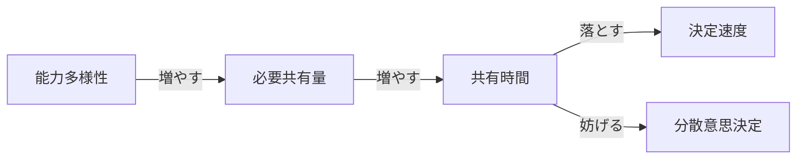
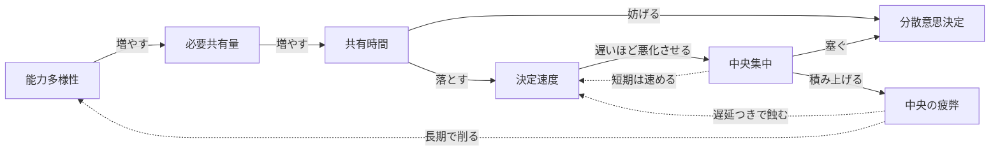
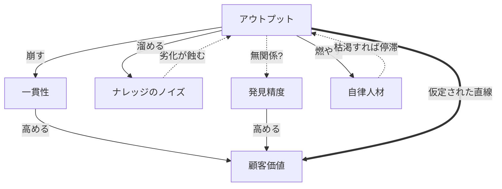
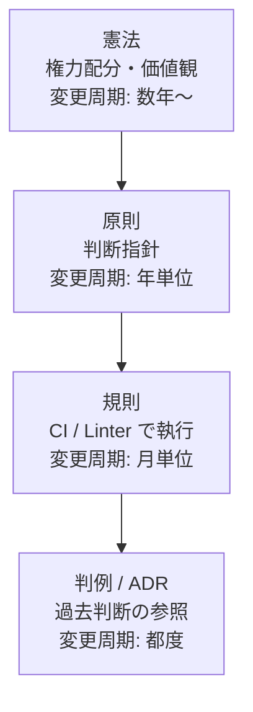

## 「人を増やすか減らすか」の前にある問い

チームの人数が増えるほど、それぞれのメンバーに求められる情報の発信量・受信量が増えていき、やがて情報の伝搬速度がチーム開発のボトルネックになりがちです。特に、AIエージェントが登場してからは表面上の開発速度が上がったように見え、「人間の人数を減らせば減らすほど、コンテキストの伝搬が速くなり開発生産性が上がる」と考える人はいるでしょう。

一方で、1人ができることが増えたのだから、開発テーマやエピックを1人がまるっと担当すれば、コンテキストの伝搬を省略してデリバリー速度を上げられると考えることもできます。つまり、「優秀な人間を増やせば増やすほど、開発生産性の総量が増える」と考える人も存在します。

その結果、「人を減らした方が開発生産性が上がるのか、人を増やした方が開発生産性が上がるのか」という二元論が度々話されることになるでしょう。しかし、こうした極端な二元論で考える前に、隠れた他の変数があるか考えるべきです。

この記事では、顧客価値を最大化するために組織とチームをどう構造化するかを考えていきます。

## 共有コストが膨らむ

組織のアウトプットを支えているのは、メンバー同士の意思決定の速度と、判断を任せ合える分散度です。

例えば、テックリードがすべてのプルリクエストを詳細にレビューするまでマージできないチームよりも、それぞれのメンバーが相互にレビューすることで十分に情報を共有し品質を担保できるチームの方が、アウトプットは多いでしょう。

逆に言えば、それぞれのメンバーの能力の多様性が広がるほど、互いに事前共有しておかないと噛み合わない事項が増え、共有のための時間が膨らみます。

『[人月の神話](https://en.wikipedia.org/wiki/The_Mythical_Man-Month)』で示された「人数が増えるほどコミュニケーションパスが指数的に増加する」という主張について、人数のみならず能力多様性によってコミュニケーションパスが変動する、と捉えるのが本稿の出発点です。人数が変わらなくても、各人がカバーする領域を広げるだけで共有コストは膨らんでいきます。

## 速度と分散の両立不能

共有時間が膨らむと、決定の速度が直接遅くなります。

ミーティングばかりのチームでは意思決定の速度が落ちていきます。加えて、その状況下では、分散的な意思決定を可能にするチームへ移行できません。

## 中央集権体制とその限界

決定が遅くなれば、組織は短期的な逃げ道として特定の人が判断する体制に移行します。「テックリードやEM、PdMさえ承認すればその意思決定はチームで合意済みとみなす」という体制を見たことがある読者はきっと多いでしょう。

中央集権体制は決定速度を一時的に取り戻しますが、分散意思決定とは構造的に両立しません。さらに長く続けば、判断する側に認知負荷が積み上がり、判断品質や育成投資の時間が削れていきます。

つまり、組織のアウトプットの質は、「どれほど文脈が共有されているか」「どれほど意思決定を分散できるか」に大きく左右されるのです。片方に時間を奪われると他方への投資ができなくなります。「人を増やすか減らすか」の議論は、この構造に与える影響を語らない限り、ほとんど意味を持ちません。

## アウトプットの量を増やしても、顧客価値には届かない

仮にこの罠を抜けて、AI ナレッジ基盤と自律分散人材を組み合わせて組織のアウトプットを増やせたとします。それで顧客価値は本当に最大化されるのでしょうか。システム思考のレンズで見ると、アウトプットから顧客価値へ直線で繋がるという暗黙の仮定の周りに、4つの欠けた矢印が浮かびます。

**一貫性の崩壊**: 局所最適でアウトプットを増やすと、UI 思想・データモデル・命名規則がバラバラになります。**ナレッジの腐敗**: 書き込みが増えるほど矛盾・陳腐化・文脈欠落が蓄積し、AI 参照精度が落ちます。**顧客価値発見の盲点**: 「何を作るか」の発見は、ナレッジ基盤と AI の中には基本的に存在しません。**自律人材の燃焼**: AI を使いこなせる人ほど判断の総量が増え、前節で見た中央集中の自己矛盾と同型の罠が再来します。

ここで Rich Hickey が [Simple Made Easy](https://www.infoq.com/presentations/Simple-Made-Easy/) (Strange Loop 2011) で示した区別が効きます。AI ナレッジ基盤は共有を `easy`(手の届きやすい)にしますが、共有すべき内容そのものを `simple`(絡み合っていない)にはしません。アウトプットを増やすための仮説は人間時間の節約には効きますが、複雑性は手付かずのまま新しい場所に再配置されるだけで、顧客価値への変換効率は上がりません。

## ホラクラシーが見落とす「法体系」

つまり、AI ナレッジと自律人材があれば自動的に解けるわけではなく、4つの矢印を補う装置が必要です。とりわけ一貫性と剪定は、組織内に共有された具体的な規範を要求します。「外部キーには必ずインデックスを張る」「ID は ULID を使う」のような条文です。

> ホラクラシーには憲法レベルの文書はありますが、その下の法体系が未整備なのではないでしょうか。

ホラクラシー憲章 (Holacracy Constitution) はサークルやロールやテンション処理のメタルールを定めますが、具体的な行為規範はほとんど書かれていません。何をしてはいけないかは法律・条例・判例で具体化されるべき領域で、ここが空白か逆に過剰立法に陥ったとき組織は失調します。Zappos での大量離職や Medium の制度撤退は、現実のホラクラシーが両端で躓いてきた例です。

「法律」が満たすべき属性は、AI が読み込んで挙動を引き出せる**機械可読性**、CI や PR テンプレートで自動執行と一体化する**執行可能性**、なぜそのルールが生まれたかの文脈を残す**改正可能性**、規範の矛盾を解決する**階層性**の4つです。Michael Nygard が 2011 年に提唱した [Architectural Decision Records](https://adr.github.io/) — Andrew Harmel-Law が [Martin Fowler のサイトで詳細化](https://martinfowler.com/articles/scaling-architecture-conversationally.html) しています — は、この判例レイヤーの先行例です。階層化すると次のようになります。

## それでも残る懸念 — Accelerate の知見から

ただし「法体系を作る」というアプローチは、Nicole Forsgren・Jez Humble・Gene Kim が『Accelerate』(IT Revolution Press, 2018) で示した DORA 研究と緊張関係にあります。同書は Ron Westrum の組織文化モデルを引き、`bureaucratic`(規則重視)文化が `generative`(成果重視)文化よりソフトウェアデリバリ性能で劣ることを定量的に示しました。法体系の整備は、このルール依存文化への滑落と紙一重です。

一方で同書が高パフォーマンスチームに共通する特徴として挙げる loosely coupled architecture と decentralized decision making は、規範レイヤーがなければ実現できません。論点は「法体系を持つか否か」ではなく、「過剰立法を避け、機械執行可能で抽象度の高い少数の条文に絞れるか」という設計品質に移ります。

## 結論 — 人数論を超えて

問いを「人を増やすか減らすか」から「顧客価値を最大化する組織構造をどう設計するか」へ移すと、見える景色が変わります。アウトプットを増やすために必要な共有コストの構造、アウトプットを顧客価値に変換するための統合・剪定・発見・燃焼対策、それらを支える機械執行可能な規範レイヤー — どれも人数を増減させても解けません。Hickey が言う `simple` を組織側でも引き受け、Humble らが言う `generative` 文化を壊さない抽象度で「法律」を書ききれるか。これが、AI 時代の組織が顧客価値で勝負するための条件だと考えています。
