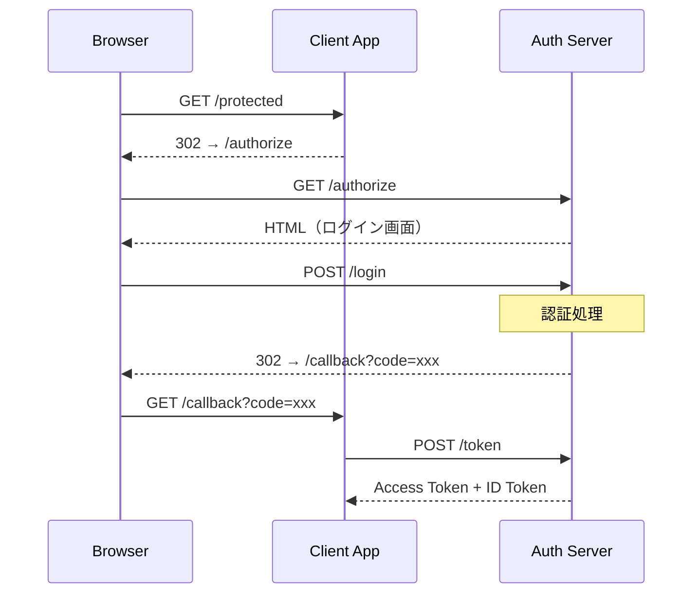
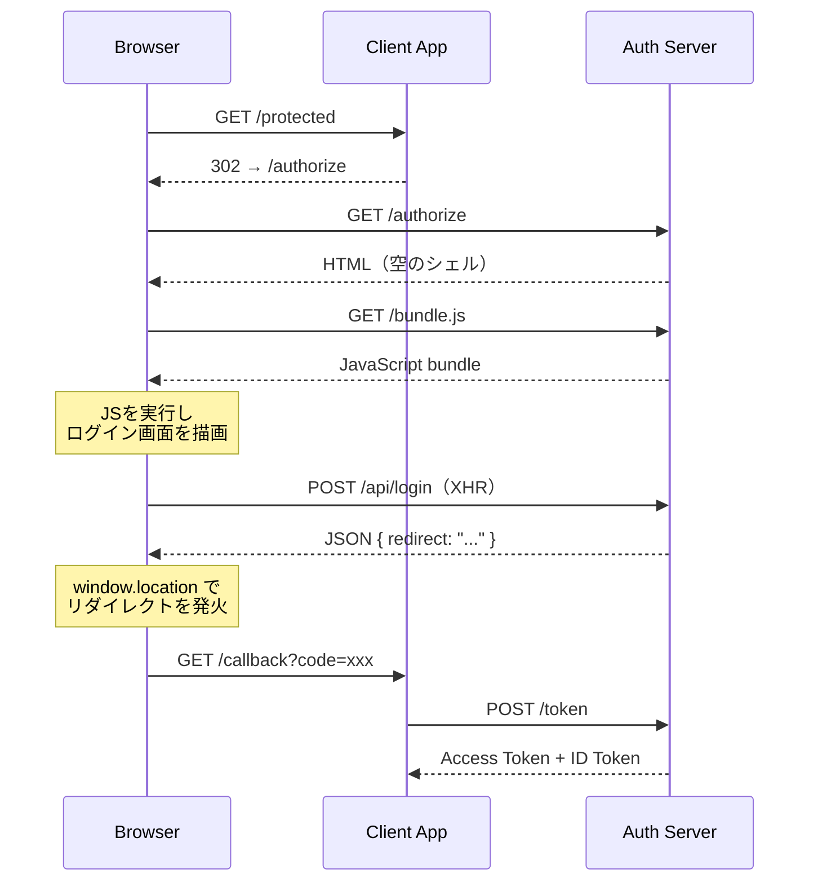

前編「[サーバサイドTypeScriptを選ぶ前に向き合ってほしいこと](/posts/2026/06/26/before-choosing-server-side-typescript)」では、TypeScriptの言語特性や実行環境の得意・不得意と向き合う覚悟について書いた。本稿では、その覚悟の先にあったもの——認証基盤という具体的な領域でサーバサイドTypeScriptを選んだことで実際に得られた恩恵について書く。

ただし、ここに書くことは「だからサーバサイドTypeScriptを選ぶべきだ」という主張ではない。私たちの領域と組織の文脈において嬉しかったことを、できるだけ正直に共有するものだ。

## OIDCとSSRの親和性

認証基盤を語る上で避けて通れないのがOIDCだ。OIDCはリダイレクトをベースにしたプロトコルであり、認可リクエスト、ユーザー認証、同意画面、コールバックといった一連のフローの中で、サーバサイドで画面を生成して返す必要がある場面が多い。つまり、SSRとの親和性が非常に高い。

SSRで認証基盤を構成した場合、フローは次のようになる。

HTTPのリダイレクトとフォーム送信という、Webの基本的な仕組みだけでフローが完結する。認証サーバが返すログイン画面や同意画面はサーバサイドで生成されたHTMLであり、ユーザーの操作に対してサーバが次のリダイレクト先を決定する。

一方、もしこれをCSRで構築しようとすると、フローは不自然になる。

空のHTMLシェルを返してからJavaScriptバンドルを読み込み、クライアントサイドでログイン画面を描画し、フォーム送信の代わりにXHRでAPIを呼び、HTTPリダイレクトの代わりに`window.location`でプログラム的に遷移する。OIDCのリダイレクトベースのプロトコルに対して、わざわざHTTPの仕組みを迂回するレイヤーを挟むことになる。

事実、KeycloakをはじめとするOIDC/OAuth2の著名なOSSも、テンプレートエンジンによるSSRを採用している。認証フローの中で表示されるログイン画面や同意画面は、セキュリティ上の理由からサーバサイドで制御すべきものであり、SPAで構築する積極的な理由がない。

サーバサイドTypeScriptを選んでいたことで、こうした画面のロジックも表示も同じ言語で書くことができた。認証フローのサーバサイドロジックと、そのフローの中で表示される画面を、一つのコードベースでシンプルに構成できたのは大きな恩恵だった。

## 代数的データ型による状態遷移の表現

認証は複雑な状態遷移が絡み合う領域だ。ユーザーが未認証なのか、認証済みなのか、MFAの検証待ちなのか、セッションが期限切れなのか。それぞれの状態に応じて取りうるアクションは異なり、状態の組み合わせを間違えればセキュリティホールに直結する。

TypeScriptのDiscriminated Unionを使えば、こうした状態をコンパイル時に網羅的に表現できる。前編で紹介した「全てを値で表現する」アプローチと組み合わせることで、状態遷移の漏れを型検査で検出できる。認証のようにミスが許されない領域において、この恩恵は大きかった。

ただし、代数的データ型による状態の表現はTypeScriptの専売特許ではない。ScalaやKotlinでは以前から可能だったし、最近ではJavaもSealed Classによって同様の表現ができるようになった。TypeScriptを選ぶ理由としてこの点だけを挙げるのは不十分だろう。

## プラットフォームチームの運用とオンボーディング

私たちのチームは、認証基盤だけでなく、ID基盤、ライセンス基盤、証明書基盤といった複数のプラットフォームシステムを開発・運用している。プラットフォームシステムはシステム間連携が多く、一つのチームが複数のシステムを横断的に理解して運用し続ける必要がある。

こうしたシステムに複雑でリッチなUIはあまり必要ない。それよりもセキュリティや可用性がはるかに重要だ。だからこそ、チームはバックエンドエンジニアを中心に構成し、一人ひとりがインフラからバックエンド、フロントエンドまで一通り見れる状態——SRE的な動き方ができる状態を目指している。

フロントエンドとバックエンドの両方がTypeScriptで書かれていることで、バックエンドエンジニアがフロントエンドのコードに入っていく際の認知的な障壁は確かに下がった。前編では「人材採用における母集団の広さ」を安易に理由にすることへの警鐘を書いたが、私たちの場合は「母集団の広さ」ではなく、「バックエンドエンジニアが全レイヤーを見渡せること」がTypeScriptを同一言語で揃えた実際の恩恵だった。

一方で、フロントエンドに精通したメンバーが少ない構成ゆえの課題もある。アクセシビリティやレガシー環境での動作性については十分な知見を持てておらず、これは正直に課題として認識している。

## プラットフォーム横断の共通ライブラリ

プラットフォームシステムには、システムごとに異なるドメインがありながらも、横断的に必要なロジックが存在する。その代表がドメインイベントの記録だ。誰が、いつ、何を、どう変更したのか。プラットフォームシステムとしての監査性を担保するために、この仕組みはどのシステムにも必要になる。

TypeScriptの型システムはそれなりに表現力があり、こうしたロジックを共通ライブラリとして抽象化し、複数のドメインへ適用するということがやりやすかった。型パラメータやDiscriminated Unionを活用することで、各ドメイン固有のイベント型を定義しつつ、記録・配信のインフラ部分は共通化できた。

ただし、これには注意が必要だ。抽象化を誤れば、責務分界点のずれた自己満足的なライブラリが生まれてしまう。「共通化できるから共通化する」のではなく、本当に共通であるべきロジックを見極める判断が求められる。

## おわりに

前編では、サーバサイドTypeScriptと向き合う覚悟について書いた。本稿では、その覚悟の先にあった恩恵を書いた。

OIDCとSSRの親和性、代数的データ型による状態遷移の表現、プラットフォームチームの運用効率、横断的な共通ライブラリ。いずれも、私たちの領域と組織の文脈があってこそ恩恵として実感できたものだ。文脈が変われば、恩恵の重みも変わるだろう。

安易に選ぶのでも安易に辞めるのでもなく、自分たちの文脈と向き合い続けることが大事だという結論は、前編と変わらない。
