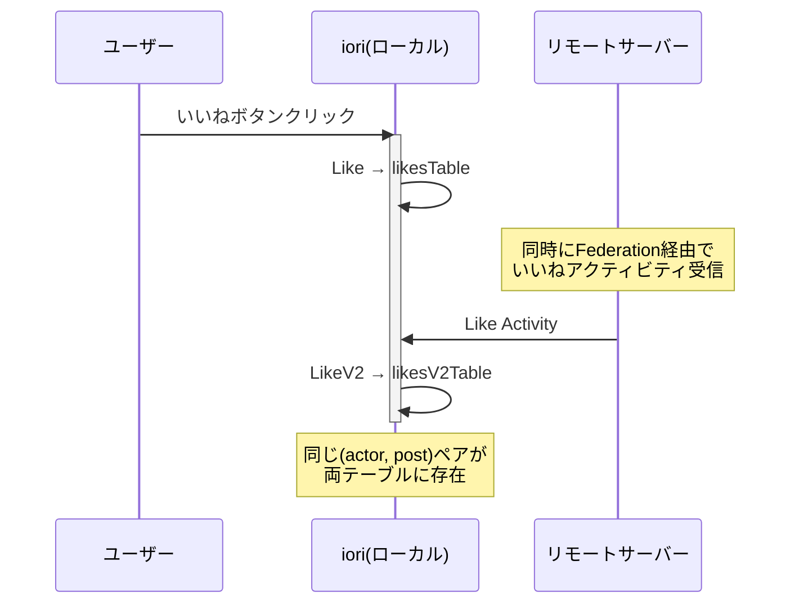
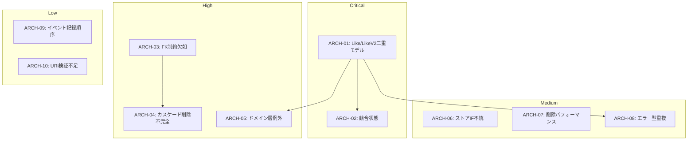

# iori（庵）アーキテクチャ課題一覧

**作成日**: 2026-01-24
**バージョン**: 1.0

---

## 概要

本ドキュメントでは、CLAUDE.mdで定義された開発方針と現在の実装状況を照らし合わせ、アーキテクチャ上の課題を重要度順に整理します。未実装機能ではなく、**既存コードの設計・実装品質**に焦点を当てています。

---

## 課題サマリー

|    重要度    | 課題ID  | 課題                            | カテゴリ       | 影響範囲          |
| :----------: | ------- | ------------------------------- | -------------- | ----------------- |
| **Critical** | ARCH-01 | Like/LikeV2 二重モデルの未統合  | データモデル   | 全Like機能        |
| **Critical** | ARCH-02 | ローカル/リモートLikeの競合状態 | 並行性         | エンゲージメント  |
|   **High**   | ARCH-03 | 通知テーブルの外部キー制約欠如  | スキーマ       | データ整合性      |
|   **High**   | ARCH-04 | カスケード削除の不完全な実装    | ユースケース   | 孤立レコード      |
|   **High**   | ARCH-05 | ドメイン層での例外使用          | ROP違反        | エラー処理        |
|  **Medium**  | ARCH-06 | ストアインターフェースの不統一  | 型システム     | Image/LinkPreview |
|  **Medium**  | ARCH-07 | 削除処理のパフォーマンス問題    | パフォーマンス | 大規模削除        |
|  **Medium**  | ARCH-08 | エラー型の重複定義              | 型システム     | Like関連          |
|   **Low**    | ARCH-09 | イベント記録順序の問題          | イベント駆動   | 障害復旧          |
|   **Low**    | ARCH-10 | ActivityPub URI検証の不足       | ドメインモデル | Federation        |

---

## Critical（即時対応推奨）

システムの整合性に直接影響する重大な問題。

### ARCH-01: Like/LikeV2 二重モデルの未統合

**カテゴリ**: データモデル
**影響範囲**: いいね機能全般

#### 現状

`Like`と`LikeV2`の2つのドメインモデルが並存しており、用途によって使い分けられている。

| モデル   | 用途                   | テーブル       | ActivityPub URI  |
| -------- | ---------------------- | -------------- | ---------------- |
| `Like`   | ユーザー発のいいね     | `likesTable`   | なし             |
| `LikeV2` | Federation受信のいいね | `likesV2Table` | あり（nullable） |

**ファイル位置**:

- `src/domain/like/like.ts:11-113`
- `src/domain/like/likeV2.ts:11-117`
- `src/adaptor/pg/schema.ts:103-120`

#### 問題点

1. **コード重複**: エラー型（`AlreadyLikedError` / `AlreadyLikedV2Error`）が重複定義
2. **一貫性の欠如**: 同じ投稿へのいいねが2つのテーブルに分散
3. **統計の不整合**: いいね数カウントが両テーブルを考慮する必要がある
4. **移行計画の欠如**: マイグレーションコードや非推奨マーカーが存在しない

```
sendLike.ts         → Like      → likesTable
addReceivedLike.ts  → LikeV2    → likesV2Table
undoLike.ts         → Like      → likesTable
removeReceivedLike.ts → LikeV2  → likesV2Table
```

#### 推奨対応

**オプションA**: LikeV2への統合

- `Like`を非推奨化し、`LikeV2`に統合
- `likesTable`のデータを`likesV2Table`にマイグレーション
- ユーザー発のいいねにも`likeActivityUri`を生成

**オプションB**: 統一モデルの新規作成

- `LikeUnified`として新モデルを設計
- 両方の特性を包含（ActivityPub URI対応、ローカル/リモート判別）

---

### ARCH-02: ローカル/リモートLikeの競合状態

**カテゴリ**: 並行性
**影響範囲**: エンゲージメント統計

#### 現状

同一ユーザーが同一投稿に対して、ローカル経由（`sendLike`）とFederation経由（`addReceivedLike`）で同時にいいねを送信できる可能性がある。

**ファイル位置**:

- `src/adaptor/pg/like/likeCreatedStore.ts`
- `src/adaptor/pg/likeV2/likeV2CreatedStore.ts`

#### 問題点

1. **テーブル分離**: `likesTable`と`likesV2Table`にそれぞれ一意制約があるが、クロステーブルでの重複チェックなし
2. **統計の二重カウント**: いいね数が実際より多くカウントされる可能性
3. **UI表示の不整合**: ユーザーが「いいね済み」と「未いいね」の両方の状態を見る可能性

#### 発生シナリオ



#### 推奨対応

1. **短期**: クロステーブルの一意制約チェックを追加
2. **中期**: ARCH-01の解決（単一テーブルへの統合）

---

## High（早期対応推奨）

データ整合性やエラー処理に影響する問題。

### ARCH-03: 通知テーブルの外部キー制約欠如

**カテゴリ**: スキーマ
**影響範囲**: データ整合性

#### 現状

`notificationLikesTable`および`notificationRepliesTable`で、投稿への外部キー制約が欠落している。

**ファイル位置**:

- `src/adaptor/pg/schema.ts:138-142` (notificationLikesTable)
- `src/adaptor/pg/schema.ts:210-218` (notificationRepliesTable)

#### 問題のコード

```typescript
// notificationLikesTable
likedPostId: uuid().notNull(),  // ← .references(() => postsTable.postId) がない

// notificationRepliesTable
replyPostId: uuid().notNull(),     // ← 同上
originalPostId: uuid().notNull(),  // ← 同上
```

#### 問題点

1. **孤立レコード**: 投稿削除時に参照先が存在しないレコードが残る
2. **データベース整合性**: RDBMS本来の参照整合性が機能しない
3. **デバッグ困難**: 存在しない投稿IDを持つ通知を検出しにくい

#### 推奨対応

1. スキーマに外部キー制約を追加
2. マイグレーションで既存の孤立レコードをクリーンアップ
3. `ON DELETE CASCADE`または`ON DELETE SET NULL`を設定

---

### ARCH-04: カスケード削除の不完全な実装

**カテゴリ**: ユースケース
**影響範囲**: 孤立レコード

#### 現状

`deletePost`ユースケースで、投稿に関連するエンティティの削除処理が不完全。

**ファイル位置**:

- `src/useCase/deletePost.ts:155-223`

#### 削除されるエンティティ

| エンティティ           | 削除 | 備考     |
| ---------------------- | :--: | -------- |
| TimelineItem           |  ✓   |          |
| LikeNotification       |  ✓   |          |
| EmojiReactNotification |  ✓   |          |
| ReplyNotification      |  ✓   |          |
| Repost                 |  ✓   |          |
| Like                   |  ✓   |          |
| EmojiReact             |  ✓   |          |
| Article                |  ✓   |          |
| **PostImage**          |  ✗   | **欠落** |
| **LinkPreview**        |  ✗   | **欠落** |

#### 問題点

1. **孤立画像**: `postImagesTable`のレコードが残る
2. **孤立プレビュー**: `linkPreviewsTable`のレコードが残る（スキーマに`ON DELETE CASCADE`あり、矛盾）
3. **ストレージリーク**: 画像ファイル自体も削除されない可能性

#### 推奨対応

1. `deletePost.ts`に画像削除処理を追加
2. 画像ファイル（ファイルシステム）の削除も考慮
3. スキーマの`ON DELETE CASCADE`との整合性を確認

---

### ARCH-05: ドメイン層での例外使用

**カテゴリ**: ROP違反
**影響範囲**: エラー処理全般

#### 現状

CLAUDE.mdではRailway Oriented Programming（ROP）を採用し、エラーは`Result<T, E>`で表現すると定義されているが、一部のドメイン層コードで例外が使用されている。

**ファイル位置**:

- `src/domain/like/likeV2.ts:55-66`

```typescript
const deleteLikeV2 = (like: LikeV2, now: Instant): LikeV2Deleted => {
  if (!like.likeActivityUri) {
    throw new Error('Cannot delete a like without likeActivityUri'); // ← ROP違反
  }
  // ...
};
```

#### 問題点

1. **設計方針との矛盾**: CLAUDE.mdの「エラーは例外ではなく型システムで追跡可能な値」に違反
2. **エラーハンドリングの不統一**: 呼び出し側でtry-catchが必要
3. **型安全性の低下**: コンパイル時にエラーケースを検出できない

#### 推奨対応

```typescript
// Before
const deleteLikeV2 = (like: LikeV2, now: Instant): LikeV2Deleted => {
  if (!like.likeActivityUri) {
    throw new Error('...');
  }
  // ...
};

// After
const deleteLikeV2 = (
  like: LikeV2,
  now: Instant,
): Result<LikeV2Deleted, LikeActivityUriRequiredError> => {
  if (!like.likeActivityUri) {
    return err(LikeActivityUriRequiredError.create());
  }
  return ok(/* ... */);
};
```

---

## Medium（計画的対応）

保守性やパフォーマンスに影響する問題。

### ARCH-06: ストアインターフェースの不統一

**カテゴリ**: 型システム
**影響範囲**: Image、LinkPreview集約

#### 現状

ほとんどのストアは`Agg.Store<T>`インターフェースに従っているが、`PostImageCreatedStore`と`LinkPreviewStore`は独自の型定義を使用。

**ファイル位置**:

- `src/domain/image/image.ts:20-22`
- `src/domain/linkPreview/linkPreview.ts`

```typescript
// 標準パターン（他の集約）
type Store<T extends DomainEvent> = Readonly<{
  store: (...events: readonly T[]) => ResultAsync<void, never>;
}>;

// 非標準パターン（Image）
export type PostImageCreatedStore = {
  store: (images: PostImage[]) => Promise<void>; // ← ResultAsyncではなくPromise
};
```

#### 問題点

1. **一貫性の欠如**: 呼び出し側で異なるエラーハンドリングが必要
2. **テストの複雑化**: モック作成時に異なるインターフェースを考慮
3. **拡張性の低下**: 将来的なエラー型追加が困難

#### 推奨対応

`PostImageCreatedStore`と`LinkPreviewStore`を標準パターンに統一。

---

### ARCH-07: 削除処理のパフォーマンス問題

**カテゴリ**: パフォーマンス
**影響範囲**: 大規模削除時

#### 現状

`likeDeletedStore`などで、ループ内で順次DELETEを実行している。

**ファイル位置**:

- `src/adaptor/pg/like/likeDeletedStore.ts:14-26`

```typescript
for (const event of events) {
  await tx.delete(likesTable).where(eq(likesTable.likeId, event.eventPayload.likeId));
  await tx.insert(domainEventsTable).values({...});
}
```

#### 問題点

1. **N+1問題**: N件の削除に対して2N回のクエリ
2. **トランザクション時間増大**: 大量削除時にロック時間が長くなる
3. **スケーラビリティ**: 1000件のいいね削除で2000回のクエリ実行

#### 推奨対応

バッチ処理への変更:

```sql
-- Before: N回のDELETE
DELETE FROM likes WHERE like_id = 'id1';
DELETE FROM likes WHERE like_id = 'id2';
-- ...

-- After: 1回のDELETE
DELETE FROM likes WHERE like_id IN ('id1', 'id2', ...);
```

---

### ARCH-08: エラー型の重複定義

**カテゴリ**: 型システム
**影響範囲**: Like関連エラー処理

#### 現状

`Like`と`LikeV2`で、構造的に同一のエラー型が別名で定義されている。

**ファイル位置**:

- `src/domain/like/like.ts:78-112`
- `src/domain/like/likeV2.ts:82-116`

| Like                | LikeV2                |
| ------------------- | --------------------- |
| `AlreadyLikedError` | `AlreadyLikedV2Error` |
| `NotLikedError`     | `LikeV2NotFoundError` |

#### 問題点

1. **コード重複**: 同じロジックが2箇所に存在
2. **Union型の複雑化**: ユースケース層で両方のエラー型をハンドリング
3. **メンテナンス負荷**: 変更時に複数箇所を修正

#### 推奨対応

ARCH-01の解決に伴い、統一されたエラー型を定義。

---

## Low（将来的改善）

現時点では影響が小さいが、将来的に問題となる可能性がある。

### ARCH-09: イベント記録順序の問題

**カテゴリ**: イベント駆動
**影響範囲**: 障害復旧、監査

#### 現状

ドメインイベントは集約の状態変更**後に**記録される。

**ファイル位置**:

- `src/adaptor/pg/notification/notificationCreatedStore.ts:12-34`

```typescript
await DB.getInstance().transaction(async (tx) => {
  await tx.insert(notificationsTable)...     // 1. 集約を更新
  await tx.insert(notificationLikesTable)... // 2. 関連テーブルを更新
  await tx.insert(domainEventsTable)...      // 3. イベントを記録 ← 最後
});
```

#### 問題点

1. **イベントソーシングとの不整合**: イベントが「事実の記録」ではなく「副産物」
2. **障害時の整合性**: ステップ3で失敗した場合、集約は更新されるがイベントは記録されない
3. **リプレイ不可**: イベントログからの状態復元が不完全になる可能性

#### 推奨対応

**オプションA**: イベント記録を先に実行
**オプションB**: Outboxパターンの導入

---

### ARCH-10: ActivityPub URI検証の不足

**カテゴリ**: ドメインモデル
**影響範囲**: Federation

#### 現状

`LikeV2.likeActivityUri`はドメインモデルでは単なる`nullable string`だが、データベーススキーマでは`UNIQUE`制約がある。

**ファイル位置**:

- `src/domain/like/likeV2.ts:16`
- `src/adaptor/pg/schema.ts:116`

```typescript
// ドメインモデル
likeActivityUri: z.nullable(z.string()),  // ← 一意性の概念なし

// スキーマ
likeActivityUri: text().unique(),  // ← 一意制約あり
```

#### 問題点

1. **レイヤー間の不整合**: ドメイン層で許可される値がDB層で拒否される
2. **エラーの後方互換性**: ドメインバリデーションをパスしてもDB制約で失敗
3. **デバッグ困難**: エラーがアダプタ層で発生し、原因特定が難しい

#### 推奨対応

ドメインモデルにビジネスルールとして一意性の概念を導入し、リゾルバーで事前チェック。

---

## 開発方針遵守状況サマリー

| 方針                         | 遵守率 | 主な違反箇所                           |
| ---------------------------- | :----: | -------------------------------------- |
| Schema-Driven Development    |  95%   | Image/LinkPreviewの独自型              |
| Always-Valid Domain Model    |  90%   | `deleteLikeV2`での例外                 |
| Railway Oriented Programming |  85%   | ドメイン層での例外、アダプタ層での例外 |
| Event-Driven Design          |  95%   | イベント記録順序                       |
| レイヤードアーキテクチャ     |  90%   | アダプタ層での例外処理                 |
| 集約境界ルール               |  95%   | カスケード削除の不完全                 |
| 命名規則                     |  98%   | 概ね遵守                               |

---

## 課題間の依存関係



---

## 推奨対応優先順位

### Phase 1: 即時対応（1-2週間）

1. **ARCH-05**: `deleteLikeV2`の例外を`Result`に変更
2. **ARCH-03**: 通知テーブルへのFK制約追加
3. **ARCH-04**: `deletePost`に画像/プレビュー削除を追加

### Phase 2: 短期対応（1ヶ月）

1. **ARCH-01/ARCH-02**: Like/LikeV2の統合計画策定・実施
2. **ARCH-08**: エラー型の統一

### Phase 3: 中期対応（3ヶ月）

1. **ARCH-06**: ストアインターフェースの統一
2. **ARCH-07**: バッチ削除の実装
3. **ARCH-09/ARCH-10**: イベント順序とURI検証の改善

---

## 改訂履歴

| 日付       | バージョン | 変更内容 |
| ---------- | ---------- | -------- |
| 2026-01-24 | 1.0        | 初版作成 |
