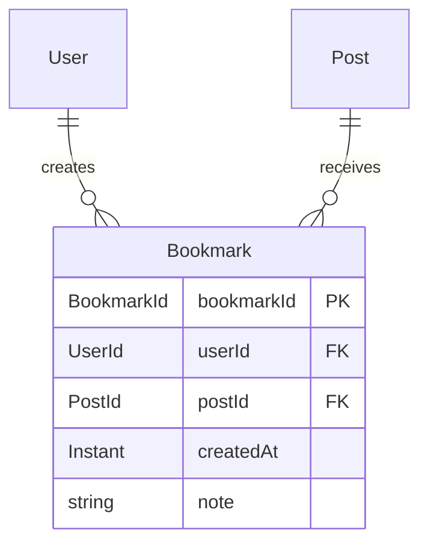
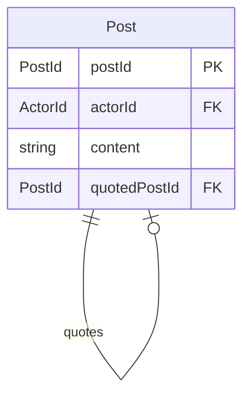
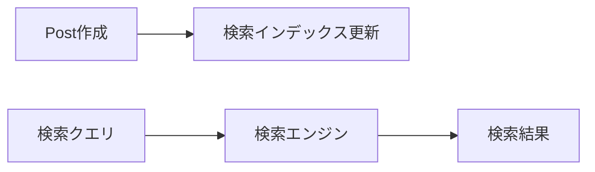
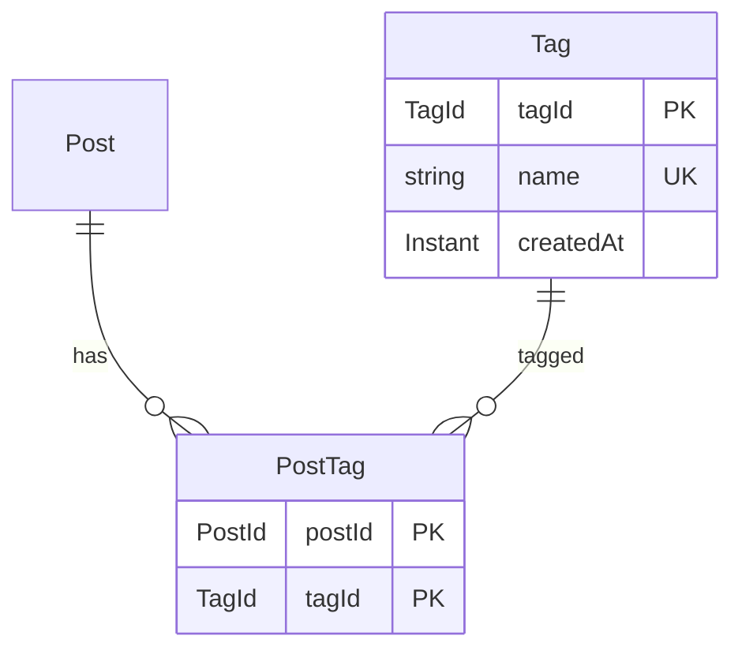
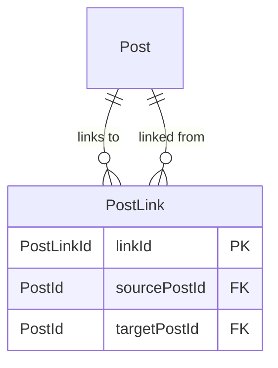
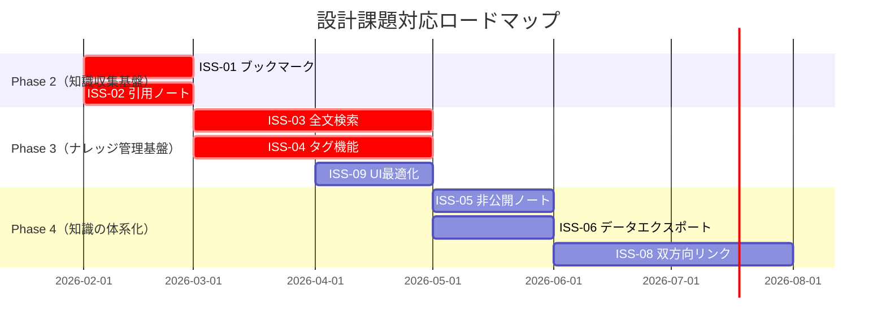
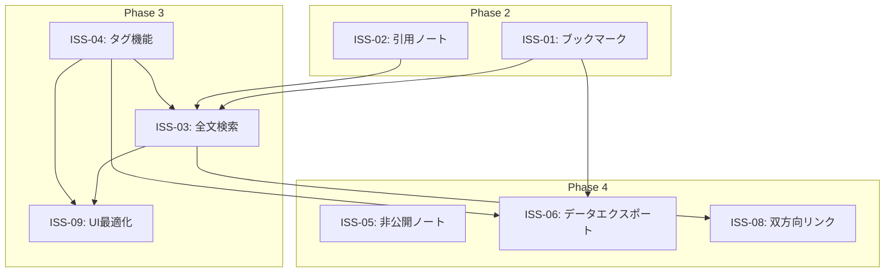

# iori（庵）設計課題一覧

**作成日**: 2026-01-24
**バージョン**: 1.0

---

## 概要

本ドキュメントでは、RDRAで定義された要求・要件と現在の実装状況を照らし合わせ、設計上の課題を重要度順に整理します。

---

## 課題サマリー

|    重要度    | 課題ID | 課題                         | 関連BUC | 対応フェーズ |
| :----------: | ------ | ---------------------------- | ------- | :----------: |
| **Critical** | ISS-01 | ブックマーク機能の未実装     | BUC-02  |   Phase 2    |
| **Critical** | ISS-02 | 引用ノート機能の未実装       | BUC-02  |   Phase 2    |
| **Critical** | ISS-03 | 全文検索機能の未実装         | BUC-03  |   Phase 3    |
| **Critical** | ISS-04 | タグ機能の未実装             | BUC-03  |   Phase 3    |
|   **High**   | ISS-05 | 非公開ノート機能の欠如       | BUC-03  |   Phase 4    |
|   **High**   | ISS-06 | データエクスポート機能の欠如 | BUC-01  |   Phase 4    |
|  **Medium**  | ISS-07 | 用語とコード命名の不整合     | -       |      -       |
|  **Medium**  | ISS-08 | 双方向リンク機能の欠如       | BUC-03  |   Phase 4    |
|   **Low**    | ISS-09 | UIのナレッジ管理向け最適化   | BUC-03  |   Phase 3    |

---

## Critical（必須・ブロッカー）

BUCの達成に**直接的に必要**な機能が未実装。プロダクトビジョン達成の障壁となる。

### ISS-01: ブックマーク機能の未実装

**関連要求**: REQ-02（他者のノートをブックマークしたい）
**関連BUC**: BUC-02（Fediverseから知識を収集する）

#### 現状

- ドメインモデル（`src/domain/`）に`Bookmark`集約が存在しない
- データベーススキーマに`bookmarks`テーブルが存在しない
- ユースケース層にブックマーク関連の処理が存在しない

#### 影響

- ナレッジワーカーがタイムラインで見つけた有用な情報を保存・後で参照できない
- 「知識の収集」というコア機能が実現できない
- Fediverseからの知識取り込みが「フォロー」に限定される

#### 推奨設計



**必要な実装**:

- `src/domain/bookmark/` - Bookmark集約
- `src/adaptor/pg/bookmark/` - PostgreSQLアダプタ
- `src/useCase/` - `createBookmark.ts`, `deleteBookmark.ts`, `getBookmarks.ts`
- UI: ブックマーク一覧ページ、投稿へのブックマークボタン

---

### ISS-02: 引用ノート機能の未実装

**関連要求**: REQ-03（他者のノートを引用して取り込みたい）
**関連BUC**: BUC-02（Fediverseから知識を収集する）

#### 現状

- `Post`モデルに`quotedPostId`フィールドが存在しない
- 引用投稿のActivityPub送受信が未実装
- 引用表示のUIが存在しない

#### 影響

- 他者の知識に「自分の文脈を加えて取り込む」ことができない
- 知識の批評や発展的考察ができない
- Fediverseの引用機能との相互運用ができない

#### 推奨設計



**必要な実装**:

- `Post`モデルに`quotedPostId`フィールド追加
- `LocalPost`生成時に引用対象を指定可能にする
- ActivityPub: `quoteUrl`または`_misskey_quote`拡張の送受信
- UI: 引用投稿作成フォーム、引用表示コンポーネント

**ActivityPub互換性**:

- Mastodonは引用を標準サポートしていないが、表示はされる
- MisskeyはRenote with Quoteとして対応
- `AS_PUBLIC`スコープでの配信が必要

---

### ISS-03: 全文検索機能の未実装

**関連要求**: REQ-07（蓄積した知識を検索したい）
**関連BUC**: BUC-03（思考を蓄積・整理・体系化する）

#### 現状

- 検索エンジン連携が未実装
- PostgreSQLの全文検索（`tsvector`/`tsquery`）が未設定
- 検索APIエンドポイントが存在しない
- 検索UIが存在しない

#### 影響

- 蓄積した知識にアクセスする手段がタイムライン閲覧のみ
- 「知識を検索してアクセス」というコア機能が実現できない
- ナレッジ管理プラットフォームとしての価値が大幅に低下

#### 推奨設計

**Phase 1（短期）**: PostgreSQL全文検索

```sql
-- posts テーブルに検索用カラム追加
ALTER TABLE posts ADD COLUMN search_vector tsvector;
CREATE INDEX posts_search_idx ON posts USING GIN (search_vector);

-- トリガーで自動更新
CREATE TRIGGER posts_search_vector_update
BEFORE INSERT OR UPDATE ON posts
FOR EACH ROW EXECUTE FUNCTION
tsvector_update_trigger(search_vector, 'pg_catalog.simple', content);
```

**Phase 2（中期）**: 外部検索エンジン（Meilisearch/Typesense）



**必要な実装**:

- `src/useCase/searchPosts.ts` - 検索ユースケース
- `src/adaptor/pg/post/search.ts` - PostgreSQL検索アダプタ
- UI: 検索バー、検索結果ページ

---

### ISS-04: タグ機能の未実装

**関連要求**: REQ-08（タグで知識を分類したい）
**関連BUC**: BUC-03（思考を蓄積・整理・体系化する）

#### 現状

- `Tag`集約が存在しない
- `PostTag`関連テーブルが存在しない
- ハッシュタグのパース・抽出が未実装
- タグによるフィルタリング/検索が不可能

#### 影響

- ノート・手記を体系的に分類できない
- 関連する知識をまとめて参照できない
- ActivityPubのハッシュタグとの相互運用ができない

#### 推奨設計



**必要な実装**:

- `src/domain/tag/` - Tag集約
- `src/domain/postTag/` - PostTag関連エンティティ
- ハッシュタグパーサー（`#tag`形式の抽出）
- `src/useCase/getPostsByTag.ts` - タグ検索ユースケース
- UI: タグクラウド、タグフィルタリング

**ActivityPub互換性**:

- `tag`プロパティで`Hashtag`オブジェクトを送受信
- フォロー中タグの投稿をタイムラインに表示（将来）

---

## High（重要）

プロダクトビジョンの達成に**間接的に必要**。ユーザー体験に大きな影響を与える。

### ISS-05: 非公開ノート機能の欠如

**関連要求**: REQ-09（自分のサーバーで管理したい）
**関連BUC**: BUC-03（思考を蓄積・整理・体系化する）

#### 現状

- `Post`は常に公開状態（`visibility`フィールドなし）
- 下書き機能なし
- Fediverseに配信せずにローカルのみに保存する手段がない

#### 影響

- 公開前の思考を記録・整理できない
- 「ナレッジ管理」としての利用が制限される
- 公開・非公開を選択できないため発信の自由度が低い

#### 推奨設計

```typescript
type PostVisibility = 'public' | 'unlisted' | 'private' | 'draft';

type LocalPost = {
  postId: PostId;
  actorId: ActorId;
  content: string;
  visibility: PostVisibility;
  createdAt: Instant;
};
```

| 状態       | TL表示 | Fediverse配信 | 検索 | URL直接アクセス |
| ---------- | :----: | :-----------: | :--: | :-------------: |
| `public`   |   ○    |       ○       |  ○   |        ○        |
| `unlisted` |   ×    |       ○       |  ○   |        ○        |
| `private`  |   ×    |       ×       |  ○   |  ○（本人のみ）  |
| `draft`    |   ×    |       ×       |  ×   |  ○（本人のみ）  |

---

### ISS-06: データエクスポート機能の欠如

**関連要求**: REQ-09（自分のサーバーで管理したい）
**関連BUC**: BUC-01（自分だけの知識基盤を持つ）

#### 現状

- データエクスポート機能が存在しない
- ユーザーが自分のデータを持ち出す手段がない

#### 影響

- データポータビリティが確保されない
- プラットフォームロックインのリスク
- 「自分だけの知識基盤」というビジョンに矛盾

#### 推奨設計

**エクスポート形式**:

- JSON（構造化データ）
- Markdown（人間可読）
- ActivityPub Archive（Fediverseポータビリティ）

**エクスポート対象**:

- 自分の投稿（ノート、手記）
- ブックマーク
- フォロー/フォロワーリスト
- 添付画像

---

## Medium（中程度）

実装品質や保守性に影響。ビジョン達成に直接的な影響は小さい。

### ISS-07: 用語とコード命名の不整合

#### 現状

RDRAで定義された用語とコード上の命名に不整合がある：

| RDRA用語         | コード命名 | 状況   |
| ---------------- | ---------- | ------ |
| ノート           | `Post`     | 不整合 |
| 手記             | `Article`  | 一致   |
| ナレッジワーカー | -          | 未使用 |

#### 影響

- ドキュメントとコードの対応が取りにくい
- 新規開発者のオンボーディングコスト増加
- ビジネス用語と技術用語の乖離

#### 推奨対応

**オプション A**: コードをRDRA用語に合わせる

- `Post` → `Note`（破壊的変更、工数大）

**オプション B**: 用語マッピングを明文化

- ドキュメントに対応表を追加（工数小）
- コードコメントで説明

**推奨**: オプションB（現時点では）

---

### ISS-08: 双方向リンク機能の欠如

**関連要求**: REQ-04（思考をノートとして記録したい）
**関連BUC**: BUC-03（思考を蓄積・整理・体系化する）

#### 現状

- ノート間のリンク機能が存在しない
- バックリンク（被参照リスト）の追跡ができない

#### 影響

- 知識のネットワーク化ができない
- 関連する思考を辿れない
- Obsidian/Roamのようなナレッジグラフが構築できない

#### 推奨設計（将来）



---

## Low（低）

将来の改善候補。現時点では優先度低。

### ISS-09: UIのナレッジ管理向け最適化

#### 現状

- UIは従来のマイクロブログ（Twitter/Mastodon）を踏襲
- タイムライン中心の情報表示
- 検索・整理・体系化を意識したUIではない

#### 影響

- ナレッジ管理プラットフォームとしての使い勝手が悪い
- 収集した知識へのアクセスが非効率

#### 将来の改善案

- ブックマーク・タグを中心としたナビゲーション
- スレッド（思考の展開）の可視化
- 検索を中心としたインターフェース
- ナレッジグラフの可視化

---

## 対応ロードマップ



---

## 課題間の依存関係



---

## 改訂履歴

| 日付       | バージョン | 変更内容 |
| ---------- | ---------- | -------- |
| 2026-01-24 | 1.0        | 初版作成 |
