# iori（庵）情報モデル定義書

**作成日**: 2026-01-24
**バージョン**: 1.0

---

## 1. 概要

本ドキュメントでは、iori（庵）システムのドメインモデル（情報モデル）を定義します。
RDRAにおける情報モデルは、システムが扱うデータの構造と関係を表現します。

### 1.1 集約一覧

| 集約名               | ID型                 | 説明                                | 境界コンテキスト |
| -------------------- | -------------------- | ----------------------------------- | ---------------- |
| **User**             | `UserId`             | ローカルユーザー（認証主体）        | 認証             |
| **Actor**            | `ActorId`            | ActivityPubアクター（Local/Remote） | フェデレーション |
| **Post**             | `PostId`             | ノート（投稿）                      | コンテンツ       |
| **Article**          | `ArticleId`          | 手記（長文コンテンツ）              | コンテンツ       |
| **Image**            | `ImageId`            | 投稿添付画像                        | コンテンツ       |
| **Like**             | `LikeId`             | いいね                              | リアクション     |
| **EmojiReact**       | `EmojiReactId`       | 絵文字リアクション                  | リアクション     |
| **Repost**           | `RepostId`           | リポスト（共有）                    | リアクション     |
| **Follow**           | 複合ID               | フォロー関係                        | ソーシャル       |
| **Notification**     | `NotificationId`     | 通知                                | 通知             |
| **TimelineItem**     | `TimelineItemId`     | タイムラインアイテム                | 表示             |
| **Session**          | `SessionId`          | ログインセッション                  | 認証             |
| **Key**              | `KeyId`              | ActivityPub署名用鍵ペア             | フェデレーション |
| **PushSubscription** | `PushSubscriptionId` | Web Push購読                        | 通知             |
| **Mute**             | `MuteId`             | ミュート設定                        | ソーシャル       |
| **LinkPreview**      | `LinkPreviewId`      | リンクプレビュー                    | コンテンツ       |

---

## 2. ドメインモデル全体図

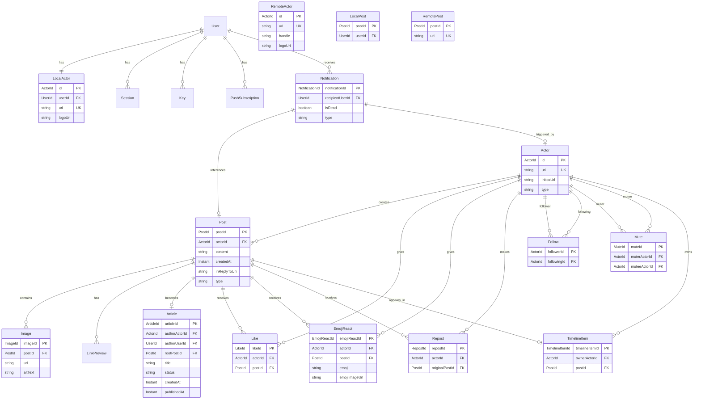

---

## 3. 境界コンテキスト別詳細

### 3.1 認証コンテキスト

ユーザー認証とセッション管理を担当します。

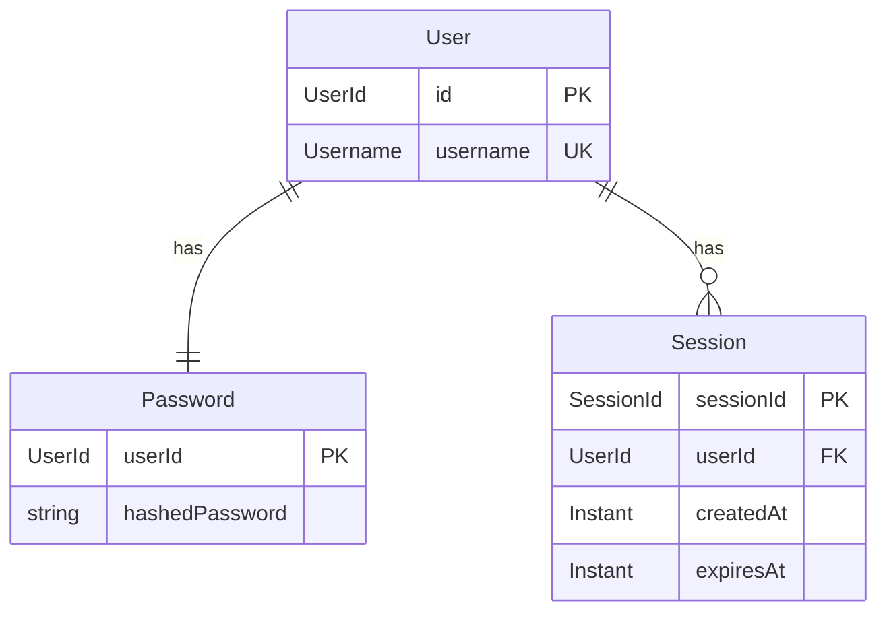

**User（ユーザー）**

ローカルユーザーを表す集約。認証の主体となります。

| 属性       | 型         | 説明               |
| ---------- | ---------- | ------------------ |
| `id`       | `UserId`   | 一意識別子（UUID） |
| `username` | `Username` | ユーザー名（一意） |

**制約**:

- 現在、`username`は「kosui」のみ許可（シングルユーザーモード）

---

### 3.2 フェデレーションコンテキスト

ActivityPubプロトコルに関連するエンティティを管理します。

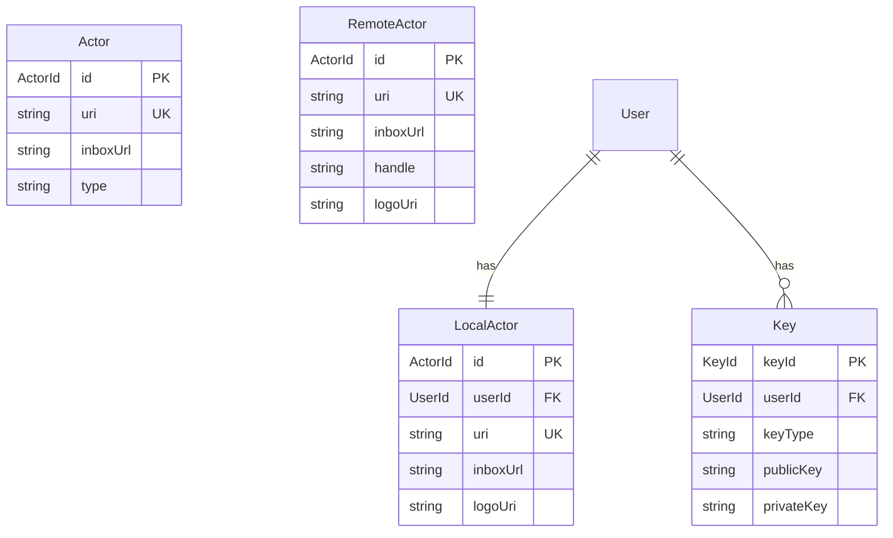

**Actor（アクター）**

ActivityPubにおけるアクターを表す判別共用体（Discriminated Union）。

| バリアント    | 説明                 |
| ------------- | -------------------- |
| `LocalActor`  | 自サーバーのユーザー |
| `RemoteActor` | 他サーバーのユーザー |

**LocalActor属性**:

| 属性       | 型        | 説明            |
| ---------- | --------- | --------------- |
| `id`       | `ActorId` | 一意識別子      |
| `userId`   | `UserId`  | 関連するUser    |
| `uri`      | `string`  | ActivityPub URI |
| `inboxUrl` | `string`  | インボックスURL |
| `logoUri`  | `string?` | アイコン画像URL |

**RemoteActor属性**:

| 属性       | 型        | 説明             |
| ---------- | --------- | ---------------- |
| `id`       | `ActorId` | 一意識別子       |
| `uri`      | `string`  | ActivityPub URI  |
| `inboxUrl` | `string`  | インボックスURL  |
| `handle`   | `Handle`  | @user@domain形式 |
| `logoUri`  | `string?` | アイコン画像URL  |

---

### 3.3 コンテンツコンテキスト

ノート（投稿）、手記（Article）、画像などのコンテンツを管理します。

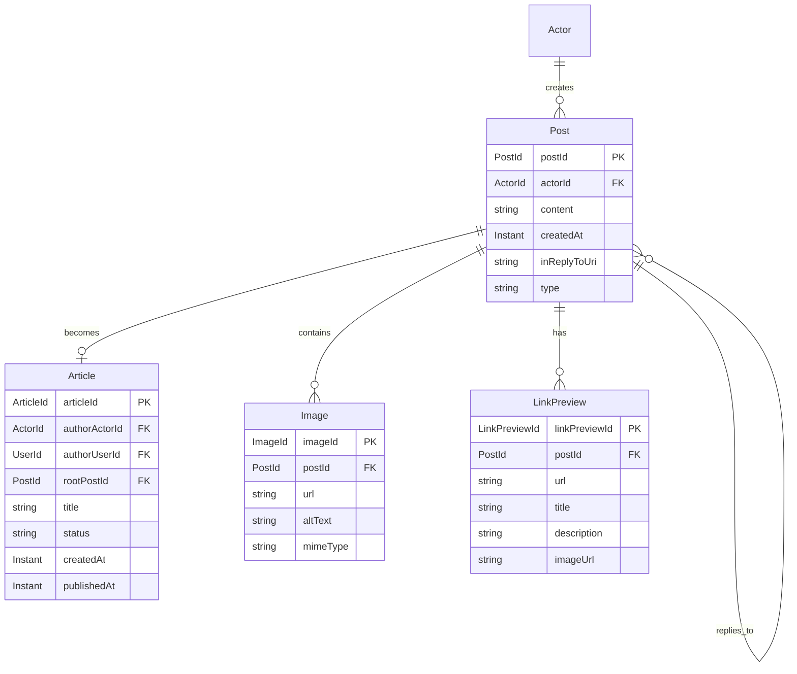

**Post（ノート/投稿）**

思考を記録する短いテキスト。LocalPostとRemotePostの判別共用体。

| バリアント   | 説明                       |
| ------------ | -------------------------- |
| `LocalPost`  | 自サーバーで作成された投稿 |
| `RemotePost` | 他サーバーから受信した投稿 |

**共通属性**:

| 属性           | 型        | 説明                 |
| -------------- | --------- | -------------------- |
| `postId`       | `PostId`  | 一意識別子           |
| `actorId`      | `ActorId` | 作成者のアクター     |
| `content`      | `string`  | 本文（Markdown対応） |
| `createdAt`    | `Instant` | 作成日時             |
| `inReplyToUri` | `string?` | リプライ先のURI      |

**LocalPost追加属性**:

| 属性     | 型       | 説明             |
| -------- | -------- | ---------------- |
| `userId` | `UserId` | 作成者のユーザー |

**RemotePost追加属性**:

| 属性  | 型       | 説明            |
| ----- | -------- | --------------- |
| `uri` | `string` | ActivityPub URI |

**Article（手記）**

スレッドをまとめた長文コンテンツ。

| 属性            | 型              | 説明                     |
| --------------- | --------------- | ------------------------ |
| `articleId`     | `ArticleId`     | 一意識別子               |
| `authorActorId` | `ActorId`       | 著者のアクター           |
| `authorUserId`  | `UserId`        | 著者のユーザー           |
| `rootPostId`    | `PostId`        | スレッドの起点となるPost |
| `title`         | `string`        | タイトル（1-200文字）    |
| `status`        | `ArticleStatus` | 公開状態                 |
| `createdAt`     | `Instant`       | 作成日時                 |
| `publishedAt`   | `Instant?`      | 公開日時                 |

**ArticleStatus（手記の状態）**:

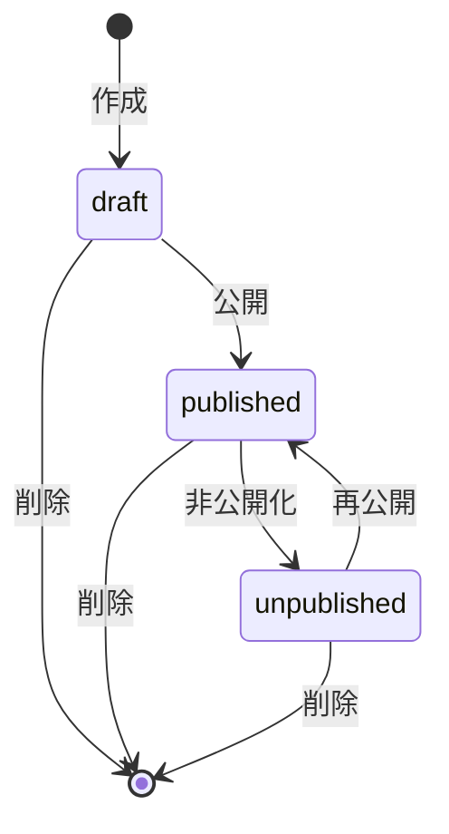

| 状態          | 説明             |
| ------------- | ---------------- |
| `draft`       | 下書き（非公開） |
| `published`   | 公開中           |
| `unpublished` | 公開後に非公開化 |

---

### 3.4 リアクションコンテキスト

投稿に対するリアクション（いいね、絵文字リアクション、リポスト）を管理します。

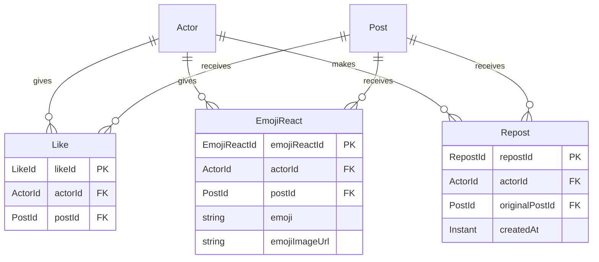

**Like（いいね）**

| 属性      | 型        | 説明               |
| --------- | --------- | ------------------ |
| `likeId`  | `LikeId`  | 一意識別子         |
| `actorId` | `ActorId` | いいねしたアクター |
| `postId`  | `PostId`  | いいねされた投稿   |

**制約**: 同じアクターは同じ投稿に1回しかいいねできない

**EmojiReact（絵文字リアクション）**

| 属性            | 型             | 説明                           |
| --------------- | -------------- | ------------------------------ |
| `emojiReactId`  | `EmojiReactId` | 一意識別子                     |
| `actorId`       | `ActorId`      | リアクションしたアクター       |
| `postId`        | `PostId`       | リアクションされた投稿         |
| `emoji`         | `string`       | 絵文字（Unicode or shortcode） |
| `emojiImageUrl` | `string?`      | カスタム絵文字の画像URL        |

**Repost（リポスト）**

| 属性             | 型         | 説明                 |
| ---------------- | ---------- | -------------------- |
| `repostId`       | `RepostId` | 一意識別子           |
| `actorId`        | `ActorId`  | リポストしたアクター |
| `originalPostId` | `PostId`   | リポスト元の投稿     |

---

### 3.5 ソーシャルコンテキスト

フォロー関係とミュートを管理します。

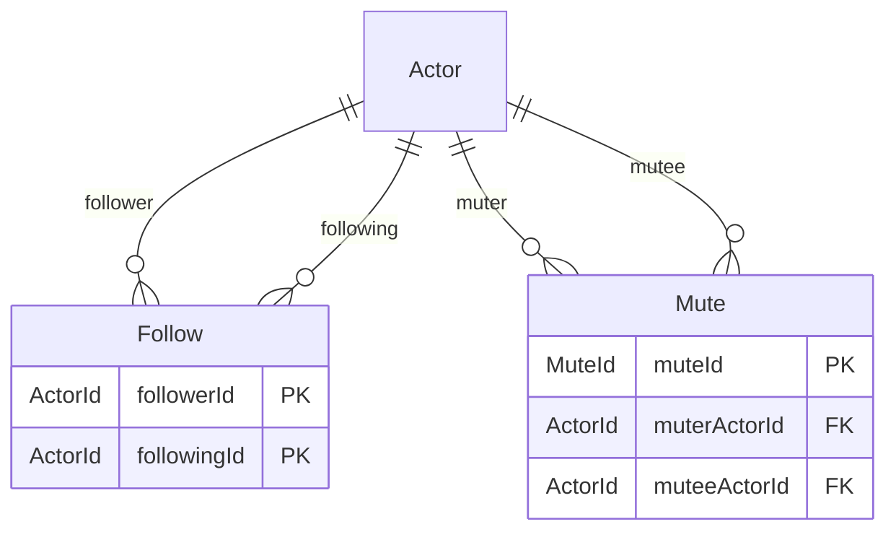

**Follow（フォロー）**

| 属性          | 型        | 説明                   |
| ------------- | --------- | ---------------------- |
| `followerId`  | `ActorId` | フォローするアクター   |
| `followingId` | `ActorId` | フォローされるアクター |

**複合主キー**: (`followerId`, `followingId`)

**フォローの状態遷移**:

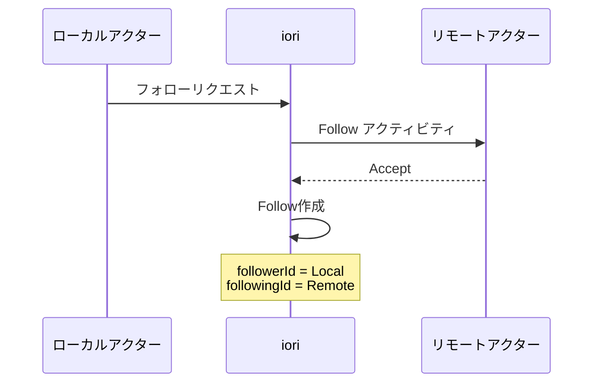

---

### 3.6 通知コンテキスト

ユーザーへの通知を管理します。

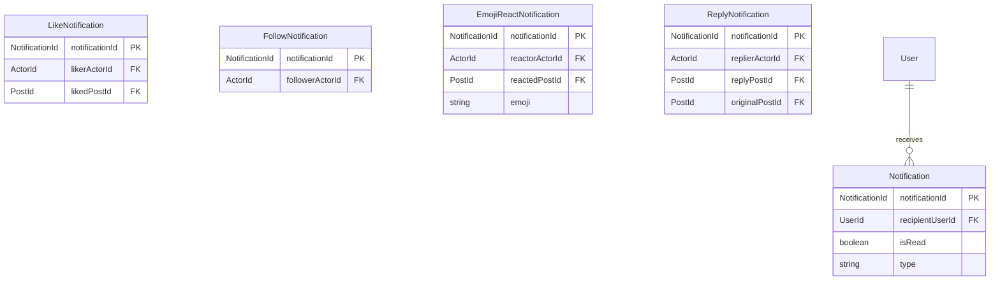

**Notification（通知）**

判別共用体で4種類の通知を表現。

| 種類         | トリガー                 | 追加属性                                          |
| ------------ | ------------------------ | ------------------------------------------------- |
| `like`       | いいねされた             | `likerActorId`, `likedPostId`                     |
| `follow`     | フォローされた           | `followerActorId`                                 |
| `emojiReact` | 絵文字リアクションされた | `reactorActorId`, `reactedPostId`, `emoji`        |
| `reply`      | リプライされた           | `replierActorId`, `replyPostId`, `originalPostId` |

**共通属性**:

| 属性              | 型               | 説明                   |
| ----------------- | ---------------- | ---------------------- |
| `notificationId`  | `NotificationId` | 一意識別子             |
| `recipientUserId` | `UserId`         | 通知を受け取るユーザー |
| `isRead`          | `boolean`        | 既読フラグ             |

---

## 4. イベント一覧

各集約が発行するドメインイベントを整理します。

### 4.1 Post関連イベント

| イベント名               | トリガー         | aggregateState |
| ------------------------ | ---------------- | -------------- |
| `post.created`           | ローカル投稿作成 | `LocalPost`    |
| `post.remotePostCreated` | リモート投稿受信 | `RemotePost`   |
| `post.deleted`           | 投稿削除         | `undefined`    |

### 4.2 Article関連イベント

| イベント名            | トリガー     | aggregateState |
| --------------------- | ------------ | -------------- |
| `article.created`     | 手記作成     | `Article`      |
| `article.published`   | 手記公開     | `Article`      |
| `article.unpublished` | 手記非公開化 | `Article`      |
| `article.deleted`     | 手記削除     | `undefined`    |

### 4.3 Like関連イベント

| イベント名         | トリガー   | aggregateState |
| ------------------ | ---------- | -------------- |
| `like.likeCreated` | いいね作成 | `Like`         |
| `like.likeDeleted` | いいね削除 | `undefined`    |

### 4.4 EmojiReact関連イベント

| イベント名           | トリガー               | aggregateState |
| -------------------- | ---------------------- | -------------- |
| `emojiReact.created` | 絵文字リアクション作成 | `EmojiReact`   |
| `emojiReact.deleted` | 絵文字リアクション削除 | `undefined`    |

### 4.5 Repost関連イベント

| イベント名             | トリガー     | aggregateState |
| ---------------------- | ------------ | -------------- |
| `repost.repostCreated` | リポスト作成 | `Repost`       |
| `repost.repostDeleted` | リポスト削除 | `undefined`    |

### 4.6 Follow関連イベント

| イベント名                      | トリガー               | aggregateState |
| ------------------------------- | ---------------------- | -------------- |
| `follow.followRequested`        | フォローリクエスト送信 | `Follow`       |
| `follow.followAccepted`         | フォロー承認           | `Follow`       |
| `follow.undoFollowingProcessed` | フォロー解除           | `undefined`    |

### 4.7 Notification関連イベント

| イベント名                                   | トリガー         | aggregateState           |
| -------------------------------------------- | ---------------- | ------------------------ |
| `notification.likeNotificationCreated`       | いいね通知作成   | `LikeNotification`       |
| `notification.likeNotificationDeleted`       | いいね通知削除   | `undefined`              |
| `notification.followNotificationCreated`     | フォロー通知作成 | `FollowNotification`     |
| `notification.emojiReactNotificationCreated` | 絵文字通知作成   | `EmojiReactNotification` |
| `notification.emojiReactNotificationDeleted` | 絵文字通知削除   | `undefined`              |
| `notification.replyNotificationCreated`      | リプライ通知作成 | `ReplyNotification`      |
| `notification.replyNotificationDeleted`      | リプライ通知削除 | `undefined`              |
| `notification.notificationsRead`             | 通知既読化       | `undefined`              |

---

## 5. 集約境界ルール

### 5.1 ID参照の原則

集約間の参照は、常にIDを介して行います。

```typescript
// ✓ 正しい: ID参照
type LikeNotification = {
  likedPostId: PostId; // PostのIDのみを保持
};

// ✗ 間違い: 直接参照
type LikeNotification = {
  likedPost: Post; // Postオブジェクトを直接保持
};
```

### 5.2 カスケード削除

親集約の削除時に子集約も削除する場合、ユースケース層で制御します。

**Post削除時のカスケード**:

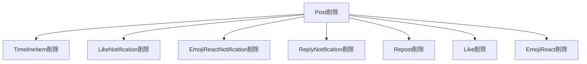

---

## 6. 将来の拡張（未実装）

### 6.1 ブックマーク

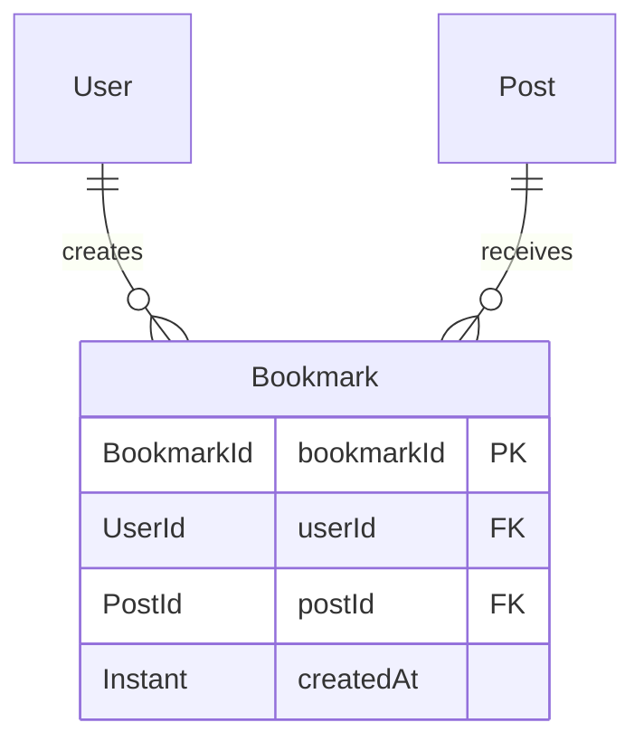

### 6.2 タグ

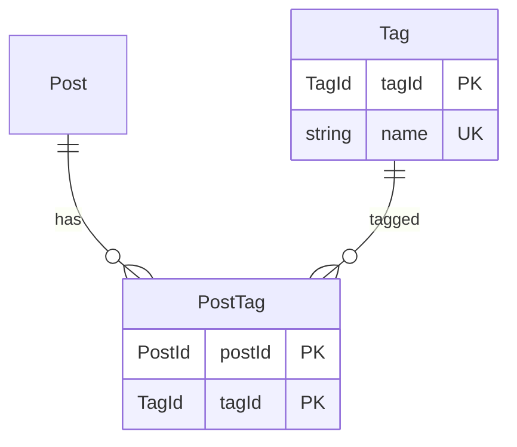

### 6.3 引用ノート

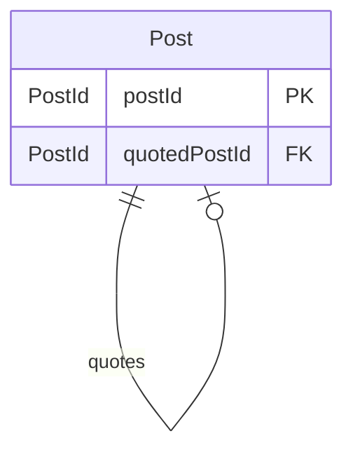

---

## 改訂履歴

| 日付       | バージョン | 変更内容 |
| ---------- | ---------- | -------- |
| 2026-01-24 | 1.0        | 初版作成 |
