# iori（庵）状態モデル定義書

**作成日**: 2026-01-24
**バージョン**: 1.0

---

## 1. 概要

本ドキュメントでは、iori（庵）システムの主要エンティティの状態遷移を定義します。
RDRAにおける状態モデルは、エンティティのライフサイクルとビジネスルールを可視化します。

### 1.1 状態モデル対象エンティティ

| エンティティ               | 状態数 | 複雑度 | 説明                           |
| -------------------------- | ------ | ------ | ------------------------------ |
| **Article**                | 3      | 中     | 下書き・公開・非公開の遷移     |
| **Follow**                 | 3      | 中     | リクエスト・承認・解除のフロー |
| **Notification**           | 2      | 低     | 未読・既読                     |
| **Session**                | 2      | 低     | 有効・期限切れ                 |
| **Post**                   | 2      | 低     | 存在・削除                     |
| **Like/Repost/EmojiReact** | 2      | 低     | 存在・削除（トグル動作）       |

---

## 2. Article（手記）の状態モデル

### 2.1 状態遷移図

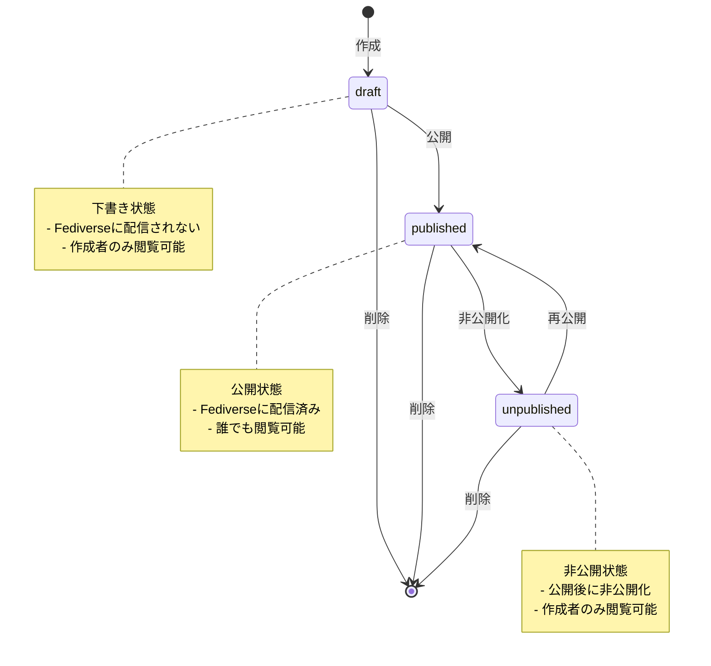
```mermaid
stateDiagram-v2
    [*] --> draft: 作成

    draft --> published: 公開
    draft --> [*]: 削除

    published --> unpublished: 非公開化
    published --> [*]: 削除

    unpublished --> published: 再公開
    unpublished --> [*]: 削除

    note right of draft
        下書き状態
        - Fediverseに配信されない
        - 作成者のみ閲覧可能
    end note

    note right of published
        公開状態
        - Fediverseに配信済み
        - 誰でも閲覧可能
    end note

    note right of unpublished
        非公開状態
        - 公開後に非公開化
        - 作成者のみ閲覧可能
    end note
```

### 2.2 状態定義

| 状態          | 説明   | Fediverseへの配信 | 閲覧権限   |
| ------------- | ------ | ----------------- | ---------- |
| `draft`       | 下書き | 未配信            | 作成者のみ |
| `published`   | 公開中 | 配信済み          | 全員       |
| `unpublished` | 非公開 | 削除通知済み      | 作成者のみ |

### 2.3 遷移イベント

| 遷移                        | イベント              | 条件                | 副作用              |
| --------------------------- | --------------------- | ------------------- | ------------------- |
| `[*]` → `draft`             | `article.created`     | なし                | Article作成         |
| `draft` → `published`       | `article.published`   | タイトルが1文字以上 | Fediverseに配信     |
| `published` → `unpublished` | `article.unpublished` | なし                | Fediverseに削除通知 |
| `unpublished` → `published` | `article.published`   | なし                | Fediverseに再配信   |
| `*` → `[*]`                 | `article.deleted`     | なし                | Article削除         |

### 2.4 シーケンス図：手記の公開フロー

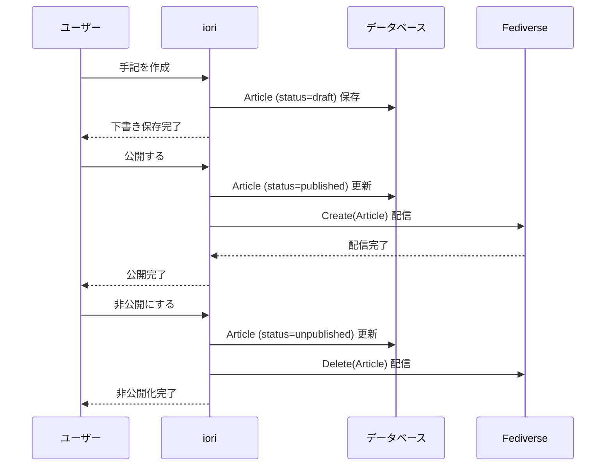
```mermaid
sequenceDiagram
    participant User as ユーザー
    participant iori as iori
    participant DB as データベース
    participant Fediverse as Fediverse

    User->>iori: 手記を作成
    iori->>DB: Article (status=draft) 保存
    iori-->>User: 下書き保存完了

    User->>iori: 公開する
    iori->>DB: Article (status=published) 更新
    iori->>Fediverse: Create(Article) 配信
    Fediverse-->>iori: 配信完了
    iori-->>User: 公開完了

    User->>iori: 非公開にする
    iori->>DB: Article (status=unpublished) 更新
    iori->>Fediverse: Delete(Article) 配信
    iori-->>User: 非公開化完了
```

---

## 3. Follow（フォロー）の状態モデル

### 3.1 状態遷移図

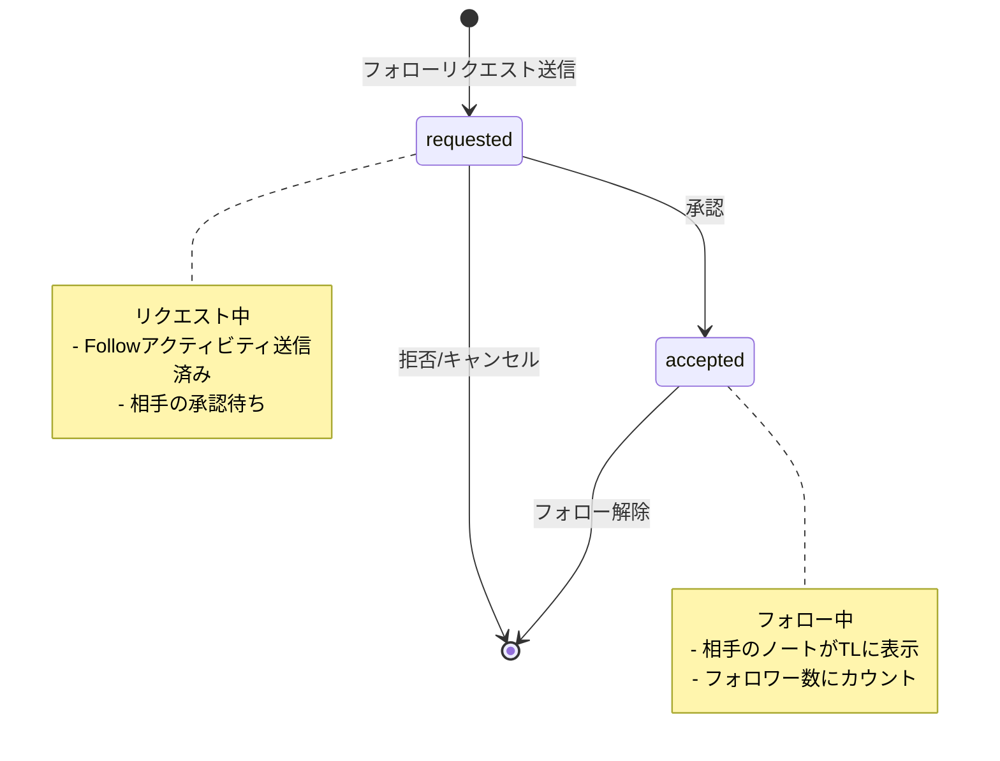
```mermaid
stateDiagram-v2
    [*] --> requested: フォローリクエスト送信

    requested --> accepted: 承認
    requested --> [*]: 拒否/キャンセル

    accepted --> [*]: フォロー解除

    note right of requested
        リクエスト中
        - Followアクティビティ送信済み
        - 相手の承認待ち
    end note

    note right of accepted
        フォロー中
        - 相手のノートがTLに表示
        - フォロワー数にカウント
    end note
```

### 3.2 状態定義

| 状態        | 説明         | フォロワーTL | フォロワー数     |
| ----------- | ------------ | ------------ | ---------------- |
| `requested` | リクエスト中 | 表示されない | カウントされない |
| `accepted`  | フォロー中   | 表示される   | カウントされる   |

### 3.3 ローカル→リモートのフォローフロー

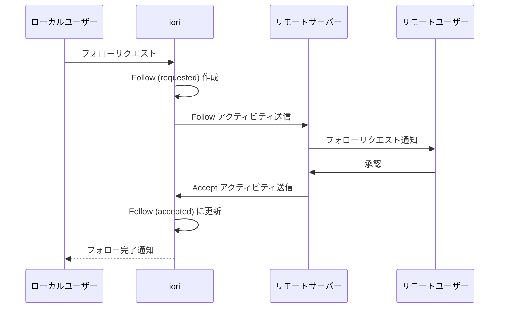
```mermaid
sequenceDiagram
    participant Local as ローカルユーザー
    participant iori as iori
    participant Remote as リモートサーバー
    participant RemoteUser as リモートユーザー

    Local->>iori: フォローリクエスト
    iori->>iori: Follow (requested) 作成
    iori->>Remote: Follow アクティビティ送信

    Remote->>RemoteUser: フォローリクエスト通知
    RemoteUser->>Remote: 承認
    Remote->>iori: Accept アクティビティ送信

    iori->>iori: Follow (accepted) に更新
    iori-->>Local: フォロー完了通知
```

### 3.4 リモート→ローカルのフォローフロー

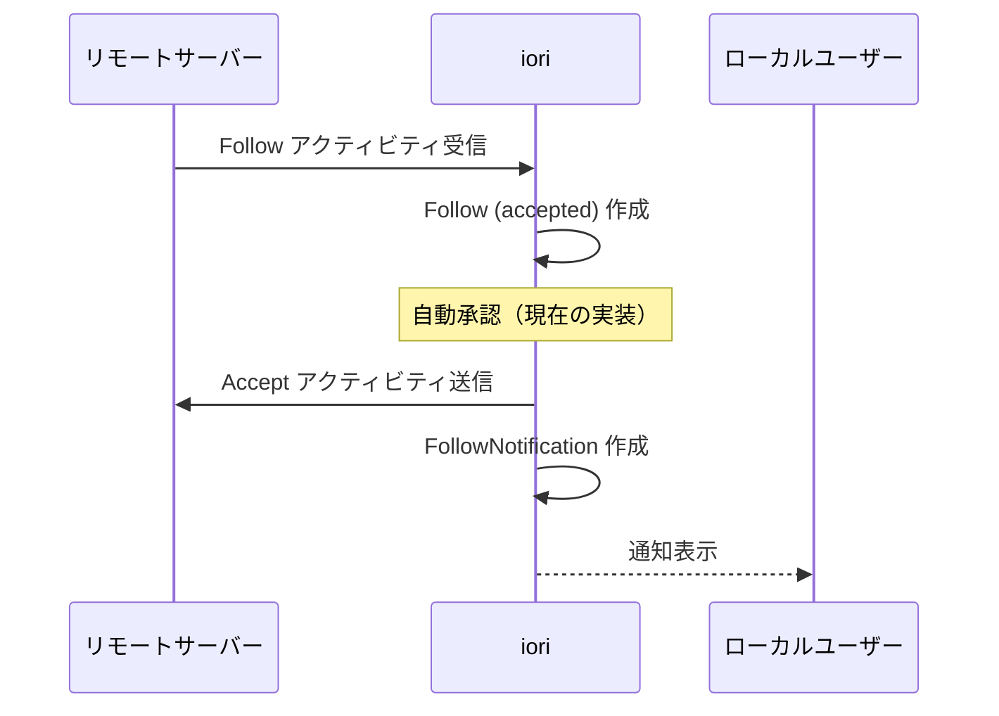
```mermaid
sequenceDiagram
    participant Remote as リモートサーバー
    participant iori as iori
    participant Local as ローカルユーザー

    Remote->>iori: Follow アクティビティ受信
    iori->>iori: Follow (accepted) 作成
    Note over iori: 自動承認（現在の実装）
    iori->>Remote: Accept アクティビティ送信
    iori->>iori: FollowNotification 作成
    iori-->>Local: 通知表示
```

### 3.5 フォロー解除フロー

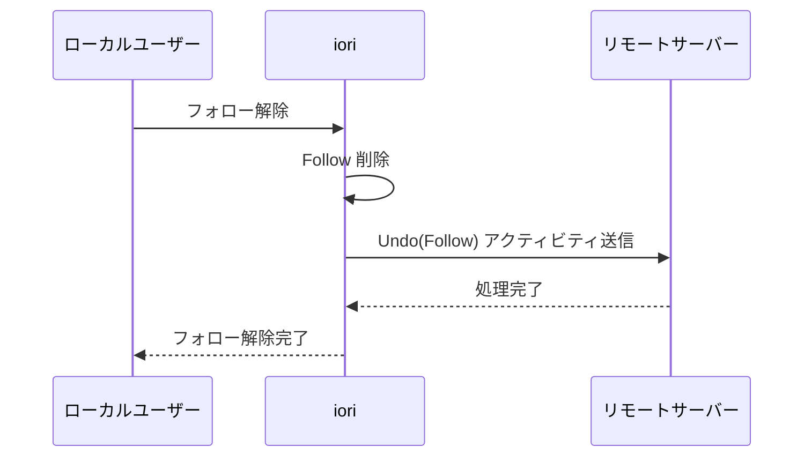
```mermaid
sequenceDiagram
    participant Local as ローカルユーザー
    participant iori as iori
    participant Remote as リモートサーバー

    Local->>iori: フォロー解除
    iori->>iori: Follow 削除
    iori->>Remote: Undo(Follow) アクティビティ送信
    Remote-->>iori: 処理完了
    iori-->>Local: フォロー解除完了
```

---

## 4. Notification（通知）の状態モデル

### 4.1 状態遷移図

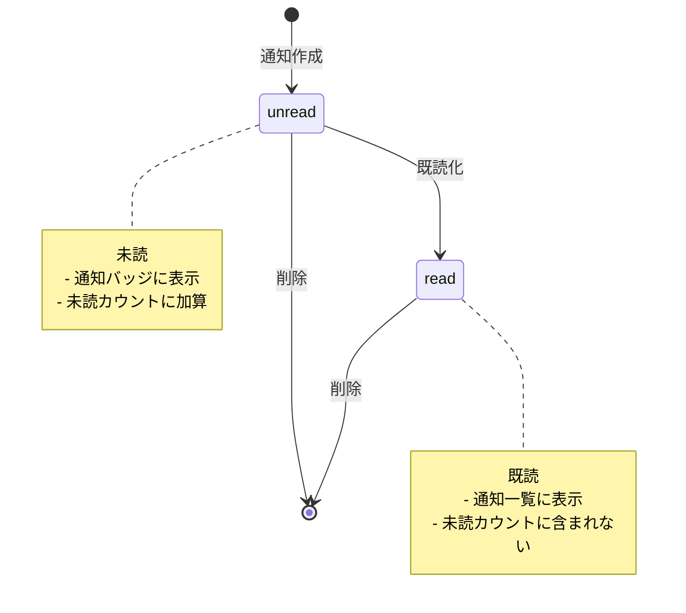
```mermaid
stateDiagram-v2
    [*] --> unread: 通知作成

    unread --> read: 既読化

    unread --> [*]: 削除
    read --> [*]: 削除

    note right of unread
        未読
        - 通知バッジに表示
        - 未読カウントに加算
    end note

    note right of read
        既読
        - 通知一覧に表示
        - 未読カウントに含まれない
    end note
```

### 4.2 状態定義

| 状態     | `isRead` | バッジ表示 | 未読カウント |
| -------- | -------- | ---------- | ------------ |
| `unread` | `false`  | 表示       | 加算         |
| `read`   | `true`   | 非表示     | 除外         |

### 4.3 通知種類別の作成トリガー

| 通知種類     | トリガー                 | 削除トリガー                     |
| ------------ | ------------------------ | -------------------------------- |
| `like`       | いいねされた             | いいね取り消し or 投稿削除       |
| `follow`     | フォローされた           | フォロー解除                     |
| `emojiReact` | 絵文字リアクションされた | リアクション取り消し or 投稿削除 |
| `reply`      | リプライされた           | リプライ削除 or 元投稿削除       |

### 4.4 通知のライフサイクル

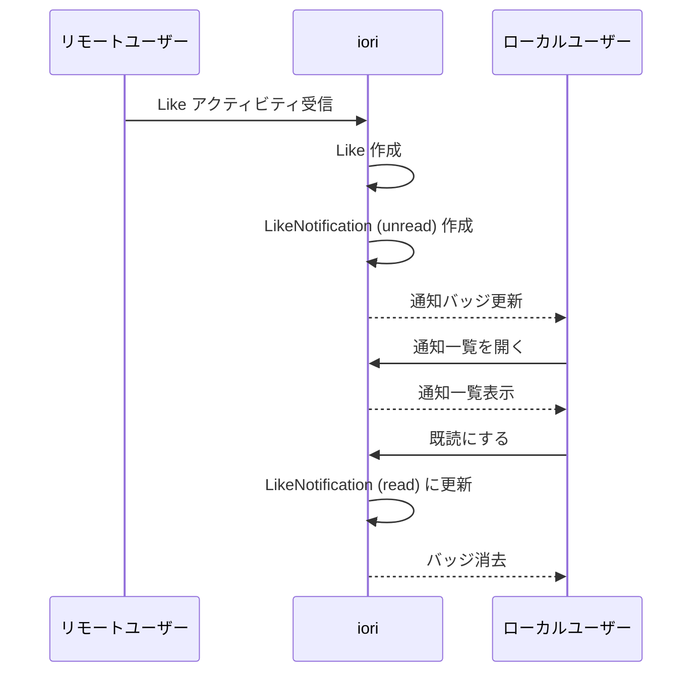
```mermaid
sequenceDiagram
    participant Remote as リモートユーザー
    participant iori as iori
    participant Local as ローカルユーザー

    Remote->>iori: Like アクティビティ受信
    iori->>iori: Like 作成
    iori->>iori: LikeNotification (unread) 作成
    iori-->>Local: 通知バッジ更新

    Local->>iori: 通知一覧を開く
    iori-->>Local: 通知一覧表示

    Local->>iori: 既読にする
    iori->>iori: LikeNotification (read) に更新
    iori-->>Local: バッジ消去
```

---

## 5. Session（セッション）の状態モデル

### 5.1 状態遷移図

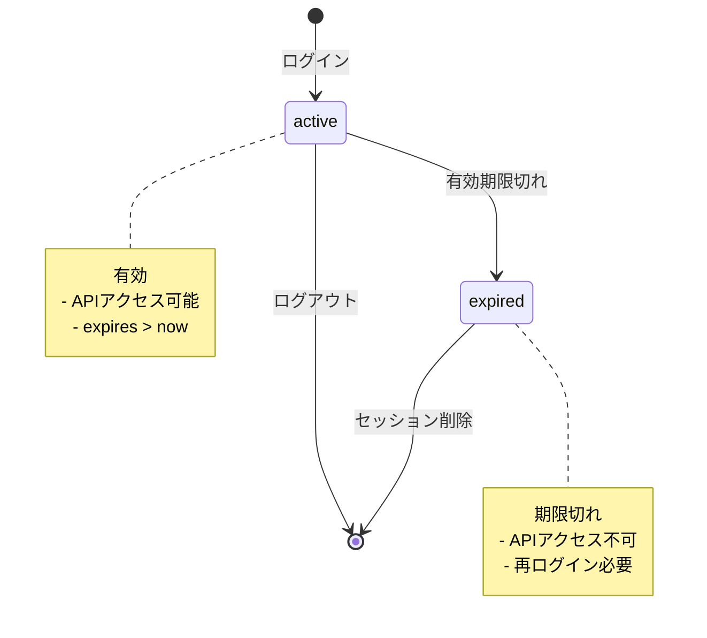
```mermaid
stateDiagram-v2
    [*] --> active: ログイン

    active --> expired: 有効期限切れ
    active --> [*]: ログアウト

    expired --> [*]: セッション削除

    note right of active
        有効
        - APIアクセス可能
        - expires > now
    end note

    note right of expired
        期限切れ
        - APIアクセス不可
        - 再ログイン必要
    end note
```

### 5.2 状態判定ロジック

```typescript
Session.verify = (session: Session, now: Instant): boolean => {
  return session.expires > now;
};
```

| 条件             | 状態      | 結果      |
| ---------------- | --------- | --------- |
| `expires > now`  | `active`  | API許可   |
| `expires <= now` | `expired` | 401エラー |

### 5.3 セッションのライフサイクル

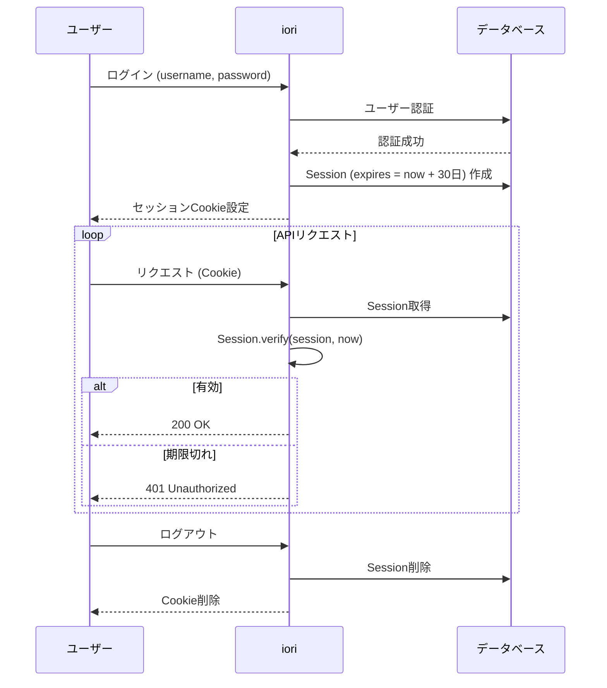
```mermaid
sequenceDiagram
    participant User as ユーザー
    participant iori as iori
    participant DB as データベース

    User->>iori: ログイン (username, password)
    iori->>DB: ユーザー認証
    DB-->>iori: 認証成功
    iori->>DB: Session (expires = now + 30日) 作成
    iori-->>User: セッションCookie設定

    loop APIリクエスト
        User->>iori: リクエスト (Cookie)
        iori->>DB: Session取得
        iori->>iori: Session.verify(session, now)
        alt 有効
            iori-->>User: 200 OK
        else 期限切れ
            iori-->>User: 401 Unauthorized
        end
    end

    User->>iori: ログアウト
    iori->>DB: Session削除
    iori-->>User: Cookie削除
```

---

## 6. Post（ノート）の状態モデル

### 6.1 状態遷移図

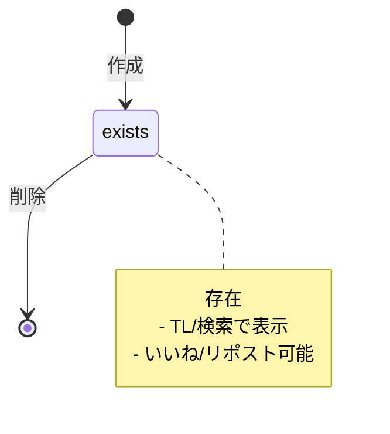
```mermaid
stateDiagram-v2
    [*] --> exists: 作成

    exists --> [*]: 削除

    note right of exists
        存在
        - TL/検索で表示
        - いいね/リポスト可能
    end note
```

### 6.2 Postのバリアント

| バリアント   | 説明               | 作成イベント             |
| ------------ | ------------------ | ------------------------ |
| `LocalPost`  | 自サーバーで作成   | `post.created`           |
| `RemotePost` | 他サーバーから受信 | `post.remotePostCreated` |

### 6.3 Post削除時のカスケード

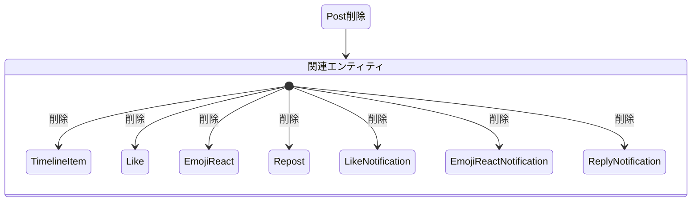
```mermaid
stateDiagram-v2
    state "Post削除" as PostDelete
    state "関連エンティティ" as Related {
        [*] --> TimelineItem: 削除
        [*] --> Like: 削除
        [*] --> EmojiReact: 削除
        [*] --> Repost: 削除
        [*] --> LikeNotification: 削除
        [*] --> EmojiReactNotification: 削除
        [*] --> ReplyNotification: 削除
    }

    PostDelete --> Related
```

### 6.4 Post削除のシーケンス

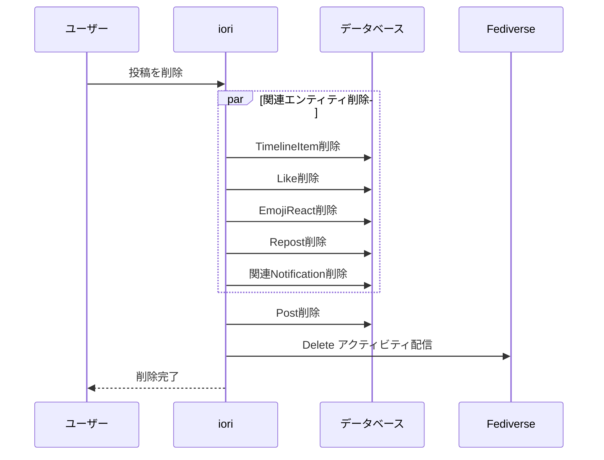
```mermaid
sequenceDiagram
    participant User as ユーザー
    participant iori as iori
    participant DB as データベース
    participant Fediverse as Fediverse

    User->>iori: 投稿を削除

    par 関連エンティティ削除
        iori->>DB: TimelineItem削除
        iori->>DB: Like削除
        iori->>DB: EmojiReact削除
        iori->>DB: Repost削除
        iori->>DB: 関連Notification削除
    end

    iori->>DB: Post削除
    iori->>Fediverse: Delete アクティビティ配信
    iori-->>User: 削除完了
```

---

## 7. リアクション（Like/Repost/EmojiReact）の状態モデル

### 7.1 トグル動作

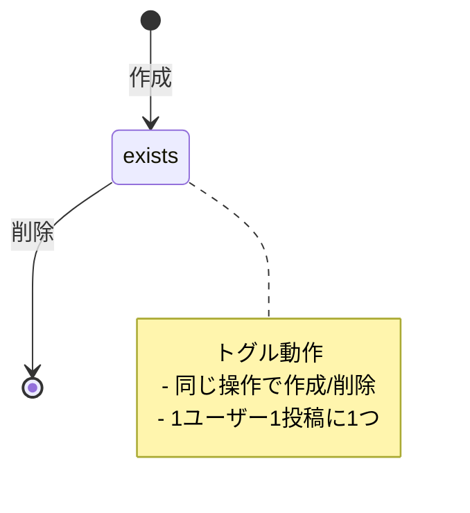
```mermaid
stateDiagram-v2
    [*] --> exists: 作成
    exists --> [*]: 削除

    note right of exists
        トグル動作
        - 同じ操作で作成/削除
        - 1ユーザー1投稿に1つ
    end note
```

### 7.2 Like（いいね）のフロー

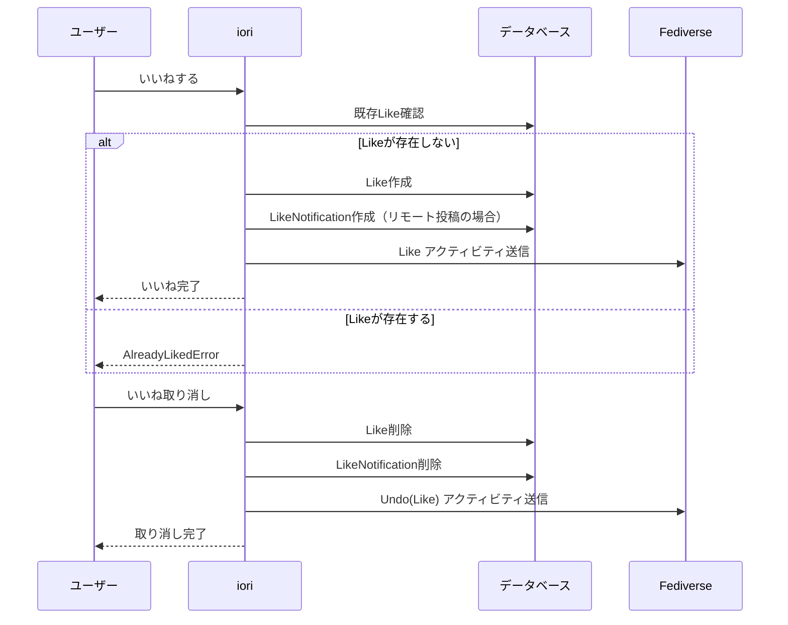
```mermaid
sequenceDiagram
    participant User as ユーザー
    participant iori as iori
    participant DB as データベース
    participant Fediverse as Fediverse

    User->>iori: いいねする
    iori->>DB: 既存Like確認

    alt Likeが存在しない
        iori->>DB: Like作成
        iori->>DB: LikeNotification作成（リモート投稿の場合）
        iori->>Fediverse: Like アクティビティ送信
        iori-->>User: いいね完了
    else Likeが存在する
        iori-->>User: AlreadyLikedError
    end

    User->>iori: いいね取り消し
    iori->>DB: Like削除
    iori->>DB: LikeNotification削除
    iori->>Fediverse: Undo(Like) アクティビティ送信
    iori-->>User: 取り消し完了
```

### 7.3 Repost（リポスト）のフロー

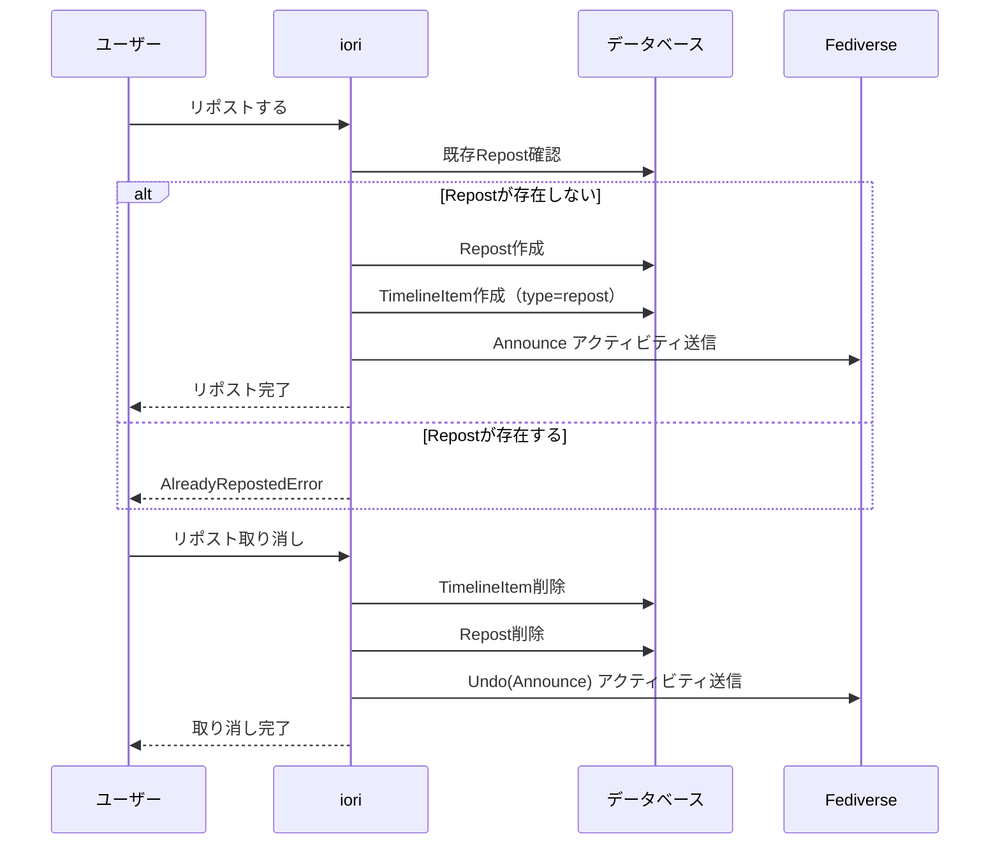
```mermaid
sequenceDiagram
    participant User as ユーザー
    participant iori as iori
    participant DB as データベース
    participant Fediverse as Fediverse

    User->>iori: リポストする
    iori->>DB: 既存Repost確認

    alt Repostが存在しない
        iori->>DB: Repost作成
        iori->>DB: TimelineItem作成（type=repost）
        iori->>Fediverse: Announce アクティビティ送信
        iori-->>User: リポスト完了
    else Repostが存在する
        iori-->>User: AlreadyRepostedError
    end

    User->>iori: リポスト取り消し
    iori->>DB: TimelineItem削除
    iori->>DB: Repost削除
    iori->>Fediverse: Undo(Announce) アクティビティ送信
    iori-->>User: 取り消し完了
```

---

## 8. TimelineItem（タイムラインアイテム）の状態モデル

### 8.1 状態遷移図

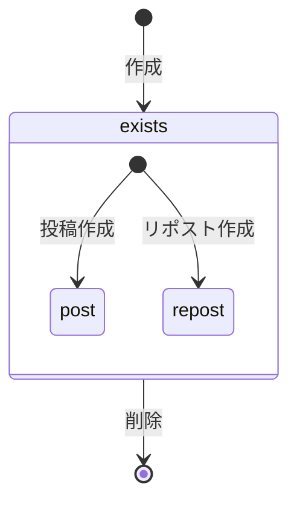
```mermaid
stateDiagram-v2
    [*] --> exists: 作成
    exists --> [*]: 削除

    state exists {
        [*] --> post: 投稿作成
        [*] --> repost: リポスト作成
    }
```

### 8.2 TimelineItemの種類

| タイプ   | 作成トリガー | 削除トリガー               |
| -------- | ------------ | -------------------------- |
| `post`   | 投稿作成     | 投稿削除                   |
| `repost` | リポスト作成 | リポスト削除 or 元投稿削除 |

### 8.3 タイムライン表示フロー

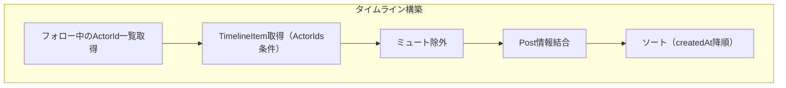
```mermaid
flowchart TD
    subgraph "タイムライン構築"
        A["フォロー中のActorId一覧取得"]
        B["TimelineItem取得（ActorIds条件）"]
        C["ミュート除外"]
        D["Post情報結合"]
        E["ソート（createdAt降順）"]
    end

    A --> B --> C --> D --> E
```

---

## 9. 複合状態遷移：投稿と反応のライフサイクル

### 9.1 投稿を中心とした状態遷移

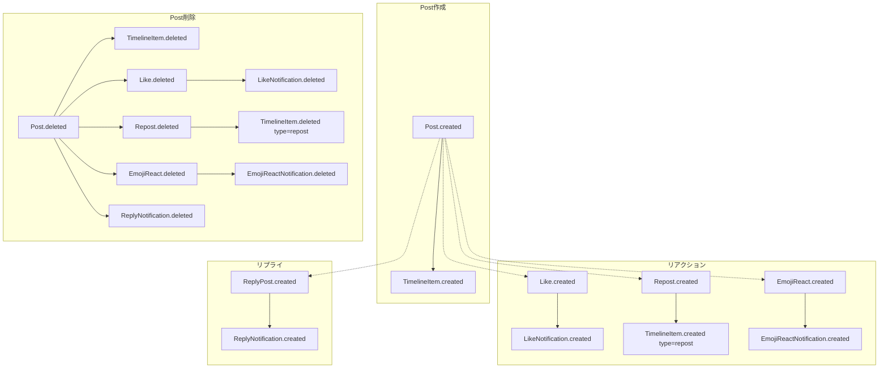
```mermaid
flowchart TB
    subgraph "Post作成"
        PC[Post.created]
        TIC[TimelineItem.created]
    end

    subgraph "リアクション"
        LC[Like.created]
        LNC[LikeNotification.created]
        RC[Repost.created]
        TIRC[TimelineItem.created type=repost]
        EC[EmojiReact.created]
        ENC[EmojiReactNotification.created]
    end

    subgraph "リプライ"
        RPC[ReplyPost.created]
        RNC[ReplyNotification.created]
    end

    subgraph "Post削除"
        PD[Post.deleted]
        TID[TimelineItem.deleted]
        LD[Like.deleted]
        LND[LikeNotification.deleted]
        RD[Repost.deleted]
        TIRD[TimelineItem.deleted type=repost]
        ED[EmojiReact.deleted]
        END[EmojiReactNotification.deleted]
        RND[ReplyNotification.deleted]
    end

    PC --> TIC

    PC -.-> LC
    LC --> LNC
    PC -.-> RC
    RC --> TIRC
    PC -.-> EC
    EC --> ENC
    PC -.-> RPC
    RPC --> RNC

    PD --> TID
    PD --> LD
    LD --> LND
    PD --> RD
    RD --> TIRD
    PD --> ED
    ED --> END
    PD --> RND
```

### 9.2 状態の依存関係

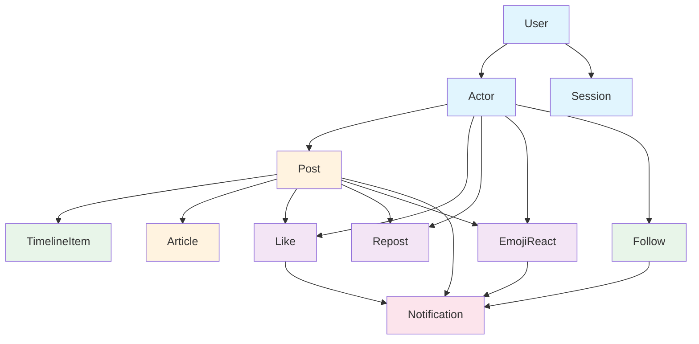
```mermaid
graph TD
    User["User"]
    Actor["Actor"]
    Post["Post"]
    Article["Article"]
    Like["Like"]
    Repost["Repost"]
    EmojiReact["EmojiReact"]
    TimelineItem["TimelineItem"]
    Notification["Notification"]
    Follow["Follow"]
    Session["Session"]

    User --> Actor
    User --> Session
    Actor --> Post
    Actor --> Like
    Actor --> Repost
    Actor --> EmojiReact
    Actor --> Follow
    Post --> TimelineItem
    Post --> Article
    Post --> Like
    Post --> Repost
    Post --> EmojiReact
    Like --> Notification
    Follow --> Notification
    EmojiReact --> Notification
    Post --> Notification

    style User fill:#e1f5fe
    style Actor fill:#e1f5fe
    style Post fill:#fff3e0
    style Article fill:#fff3e0
    style Like fill:#f3e5f5
    style Repost fill:#f3e5f5
    style EmojiReact fill:#f3e5f5
    style TimelineItem fill:#e8f5e9
    style Notification fill:#fce4ec
    style Follow fill:#e8f5e9
    style Session fill:#e1f5fe
```

---

## 10. ビジネスルールまとめ

### 10.1 Article

| ルール   | 説明                    |
| -------- | ----------------------- |
| 公開条件 | タイトルが1文字以上必要 |
| 再公開   | 非公開状態からのみ可能  |
| 削除     | 任意の状態から可能      |

### 10.2 Follow

| ルール       | 説明                                   |
| ------------ | -------------------------------------- |
| 自己フォロー | 禁止（フォロワーID ≠ フォロイーID）    |
| 重複フォロー | 禁止（同じペアは1レコードのみ）        |
| 自動承認     | ローカルユーザーへのフォローは自動承認 |

### 10.3 Like/Repost/EmojiReact

| ルール           | 説明                                           |
| ---------------- | ---------------------------------------------- |
| 重複禁止         | 同じユーザーが同じ投稿に複数回リアクション不可 |
| EmojiReact       | 同じ絵文字は1回のみ、異なる絵文字は複数可      |
| 自己リアクション | 許可（自分の投稿にいいね可能）                 |

### 10.4 Session

| ルール         | 説明                                 |
| -------------- | ------------------------------------ |
| 有効期限       | 作成から30日                         |
| 複数セッション | 許可（複数デバイスからログイン可能） |

---

## 改訂履歴

| 日付       | バージョン | 変更内容 |
| ---------- | ---------- | -------- |
| 2026-01-24 | 1.0        | 初版作成 |
