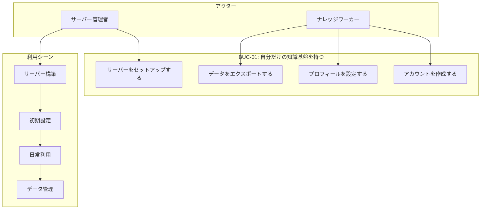
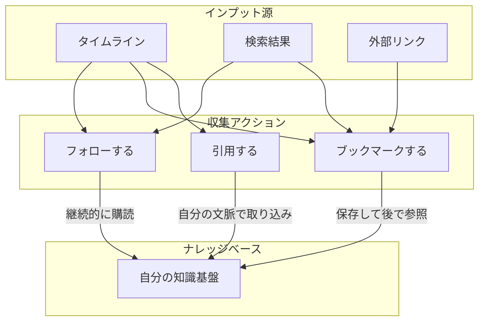
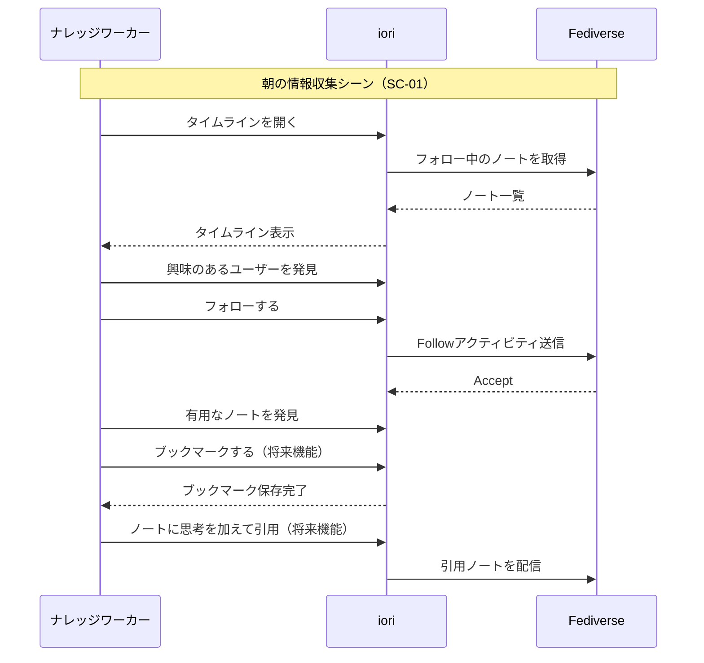
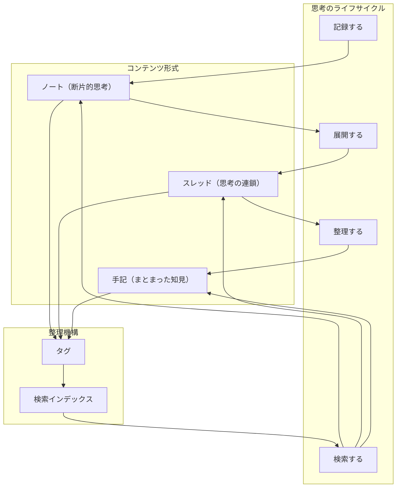
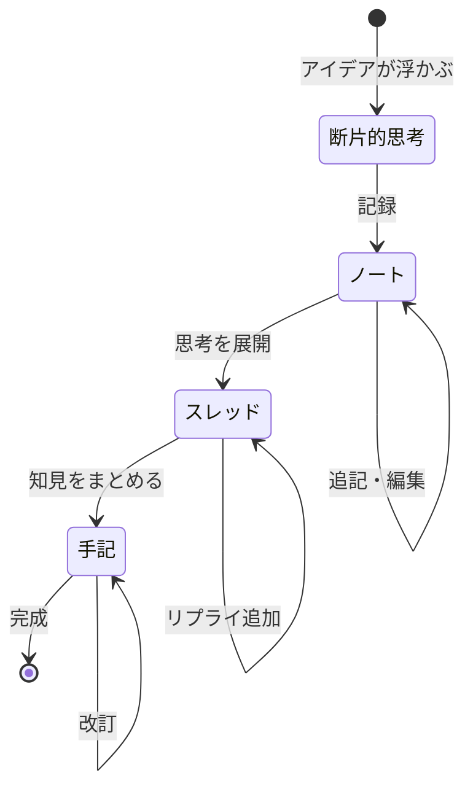
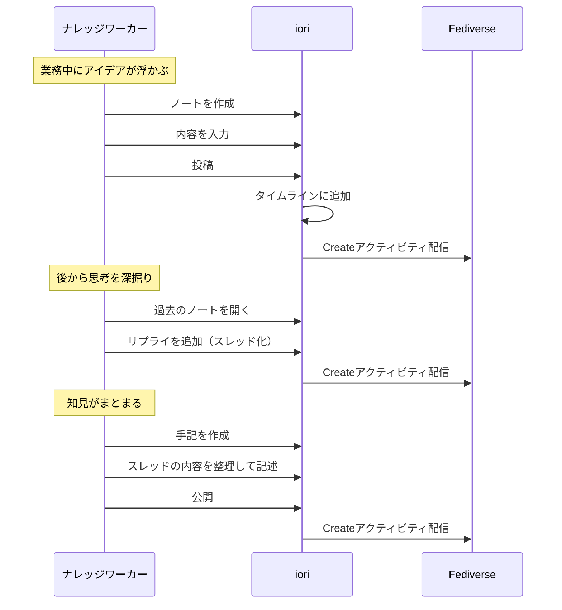
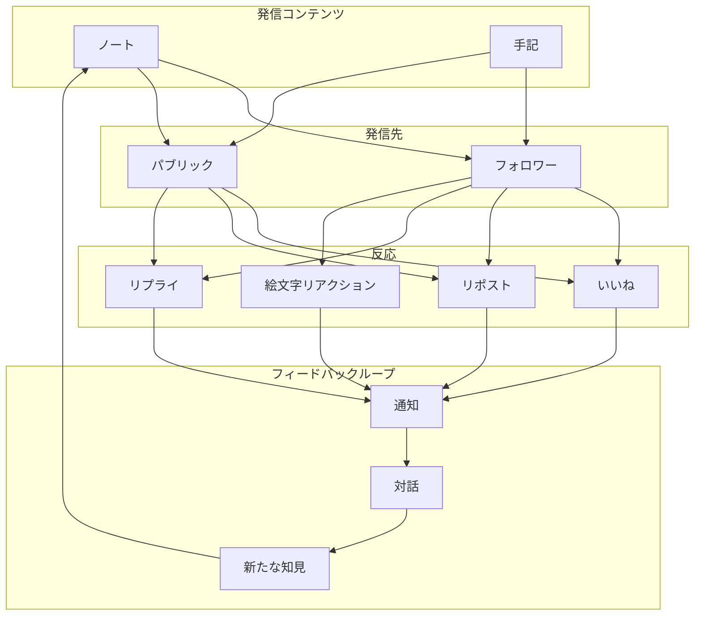
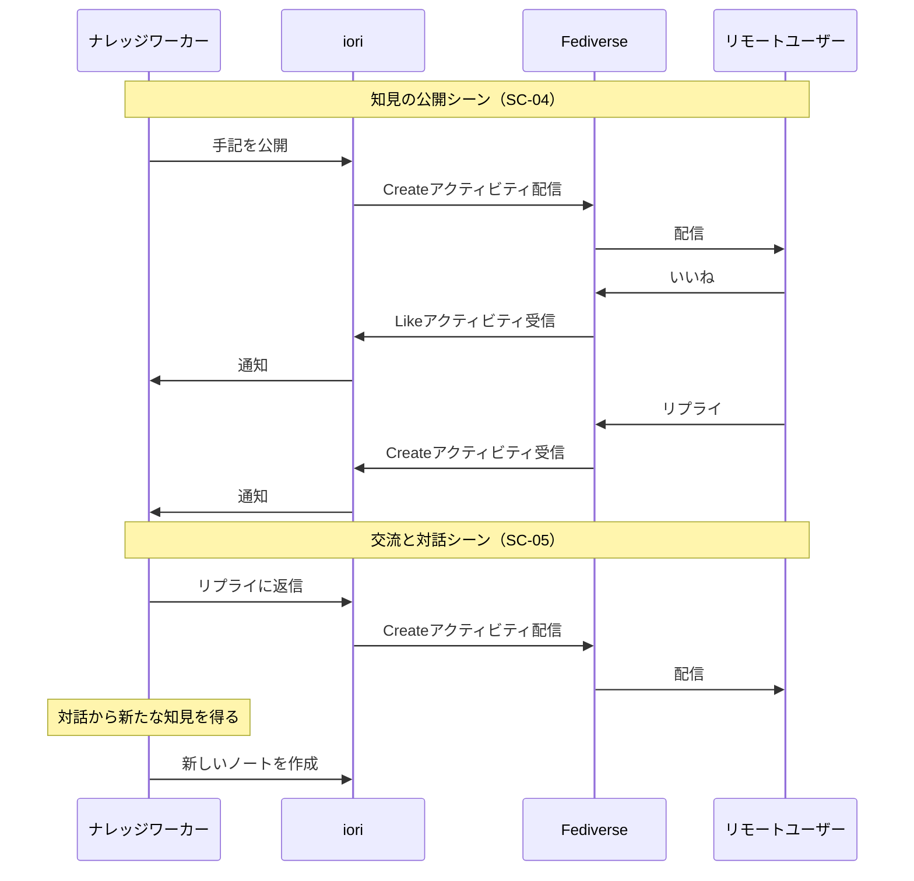
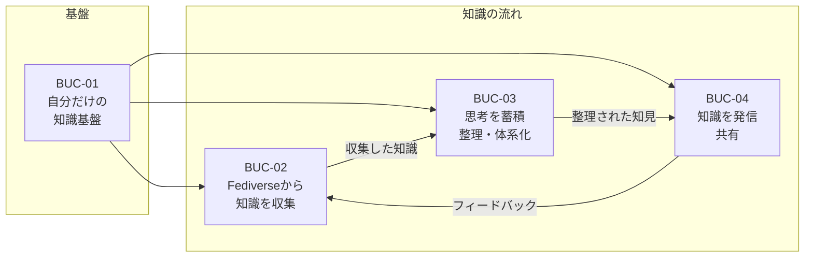

# iori（庵）システム外部環境定義書

**作成日**: 2026-01-24
**バージョン**: 1.0

---

## 1. 利用シーン（シナリオ）

ナレッジワーカーがioriを使用する典型的なシーンを整理します。

### 1.1 シーン一覧

| シーンID | シーン名 | 概要 | 関連BUC |
|---------|---------|------|---------|
| SC-01 | 朝の情報収集 | タイムラインから新しい知識を収集し、気になるものをブックマーク | BUC-02 |
| SC-02 | 思考の記録 | 業務中に思いついたアイデアをノートとして記録 | BUC-03 |
| SC-03 | 知識の深掘り | 過去のノートを振り返り、スレッドで思考を展開 | BUC-03 |
| SC-04 | 知見の公開 | まとまった知識を手記として整理し、Fediverseに公開 | BUC-03, BUC-04 |
| SC-05 | 交流と対話 | リモートユーザーからの反応を受け、対話を通じて知識を深化 | BUC-04 |
| SC-06 | 知識の検索 | 過去に蓄積した知識を検索し、現在の課題解決に活用 | BUC-03 |

---

## 2. ビジネスユースケース詳細

### 2.1 BUC-01: 自分だけの知識基盤を持つ

**目的**: 大規模プラットフォームに依存せず、自分のサーバーで知識を管理し、データのポータビリティを確保する

**シナリオ詳細**:

1. **サーバー構築フェーズ**
   - サーバー管理者がioriをVPSまたは自宅サーバーにデプロイ
   - PostgreSQL、ファイルストレージを設定
   - ドメインとSSL証明書を設定

2. **初期設定フェーズ**
   - ナレッジワーカーがアカウントを作成
   - プロフィール（表示名、アイコン、自己紹介）を設定
   - ActivityPubを通じてFediverseに接続

3. **データ主権の確保**
   - すべてのデータは自分のサーバーに保存
   - 必要に応じてデータをエクスポート可能（将来機能）
   - プラットフォームの都合でデータが消えることがない

---

### 2.2 BUC-02: Fediverseから知識を収集する

**目的**: フォロー・ブックマーク・引用を通じて、他者の知識を自分のナレッジベースに取り込む

**アクティビティフロー**:

**収集の3つの方法**:

| 方法 | 説明 | ユースケース | 実装状況 |
|-----|------|-------------|---------|
| **フォロー** | 興味のあるユーザーを購読し、継続的にノートを受信 | 特定分野の専門家を追う | ✅ 実装済 |
| **ブックマーク** | 有用なノートを保存し、後で参照・整理 | 参考資料として保存 | ❌ 未実装 |
| **引用** | 他者のノートに自分の思考を加えて取り込み | 批評や発展的考察 | ❌ 未実装 |

---

### 2.3 BUC-03: 思考を蓄積・整理・体系化する

**目的**: 収集した知識と自分の思考をノートとして記録し、スレッドで展開、手記としてまとめ、タグで分類、検索でアクセス

**思考の段階**:

**各コンテンツ形式の特徴**:

| 形式 | 粒度 | 用途 | 公開設定 | 実装状況 |
|-----|------|------|---------|---------|
| **ノート** | 短文（280文字程度） | 思いつきの記録、メモ | 公開/非公開 | ✅ 公開のみ |
| **スレッド** | ノートの連鎖 | 思考の深掘り、議論の展開 | 公開 | ✅ 実装済 |
| **手記** | 長文 | まとまった知見、解説記事 | 公開/非公開 | ✅ 実装済 |

**思考の記録シーン（SC-02）**:

---

### 2.4 BUC-04: 知識を発信・共有する

**目的**: Fediverseに接続して発信、他のユーザーと交流、フィードバックを受けて思考を深化

**発信と交流のフロー**:

**反応の種類と意味**:

| 反応 | 送信側の意図 | 受信側の活用 | 実装状況 |
|-----|------------|------------|---------|
| **いいね** | 共感・賛同 | モチベーション | ✅ 実装済 |
| **リポスト** | 拡散・共有 | リーチ拡大 | ✅ 実装済 |
| **リプライ** | 議論・質問 | 対話・深化 | ✅ 実装済 |
| **絵文字リアクション** | 感情表現 | ニュアンス理解 | ✅ 実装済 |

---

## 3. ビジネスユースケース間の関係

**知識のサイクル**:

1. **収集** (BUC-02): Fediverseから他者の知識を取り込む
2. **蓄積・整理** (BUC-03): 自分の思考と融合させ、体系化する
3. **発信** (BUC-04): まとまった知見を公開し、フィードバックを得る
4. **再収集**: フィードバックから新たな知識を得て、サイクルが回る

この循環が「**集合知に接続されたセカンドブレイン**」としてのioriの価値を生み出します。

---

## 4. アクター×ビジネスユースケース マトリクス

| アクター | BUC-01 知識基盤 | BUC-02 収集 | BUC-03 蓄積・整理 | BUC-04 発信 |
|---------|:---:|:---:|:---:|:---:|
| **ナレッジワーカー** | ○ | ◎ | ◎ | ◎ |
| **リモートユーザー** | - | - | - | ○ |
| **閲覧者** | - | - | - | △ |
| **サーバー管理者** | ◎ | - | - | - |

凡例: ◎ 主たる利用者 / ○ 利用する / △ 限定的に利用 / - 利用しない

---

## 5. 未実装機能の整理

BUCの達成に必要だが未実装の機能を整理します。

### 5.1 BUC-02（知識収集）の未実装機能

| 機能 | 必要性 | 優先度 |
|-----|-------|-------|
| ブックマーク | 他者のノートを保存し、後で参照できる | **高** |
| 引用ノート | 他者のノートに文脈を加えて取り込める | **高** |
| ブックマーク一覧 | 保存したノートを一覧・検索できる | 中 |

### 5.2 BUC-03（蓄積・整理）の未実装機能

| 機能 | 必要性 | 優先度 |
|-----|-------|-------|
| 全文検索 | 蓄積した知識を検索できる | **高** |
| タグ付け | ノート・手記をタグで分類できる | **高** |
| タグ検索 | タグで絞り込み検索できる | 中 |
| 非公開ノート | 自分だけが見られるノートを作成 | 中 |
| 双方向リンク | ノート間を相互にリンクできる | 低 |

### 5.3 BUC-04（発信）は概ね実装済み

通知、いいね、リポスト、リプライ、絵文字リアクションはすべて実装済みです。

---

## 改訂履歴

| 日付 | バージョン | 変更内容 |
|-----|----------|---------|
| 2026-01-24 | 1.0 | 初版作成 |
