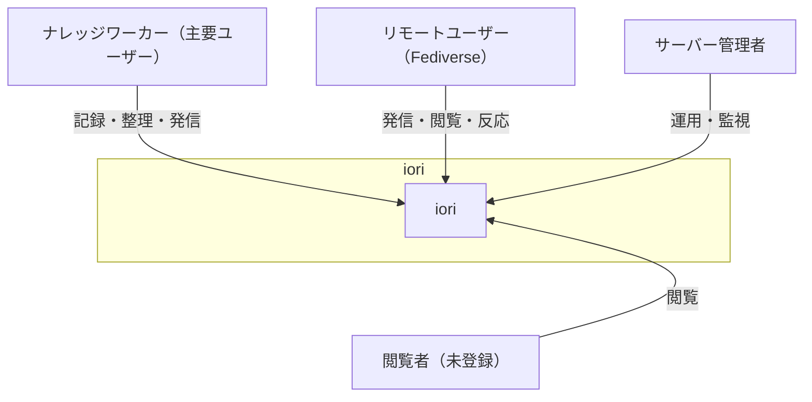
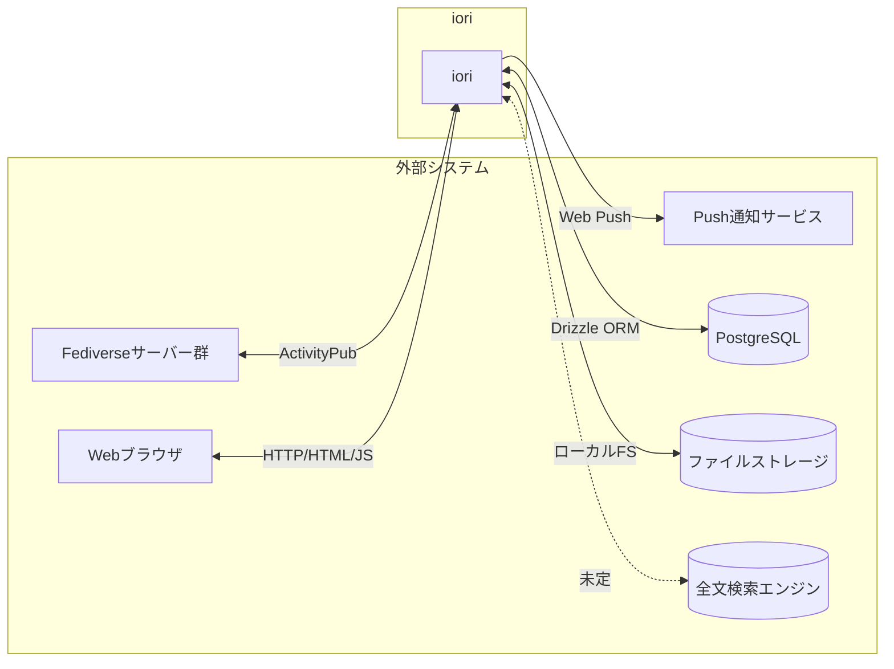
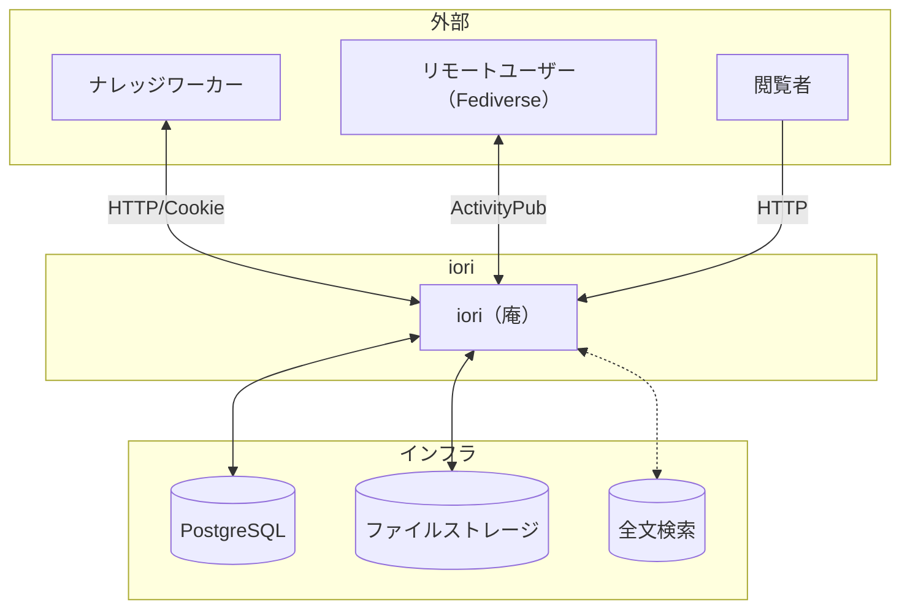
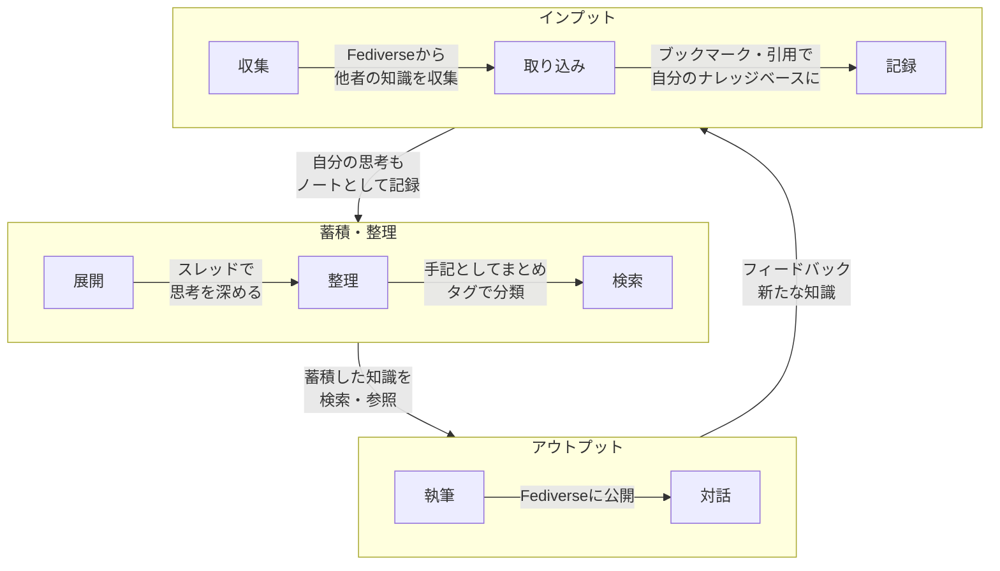
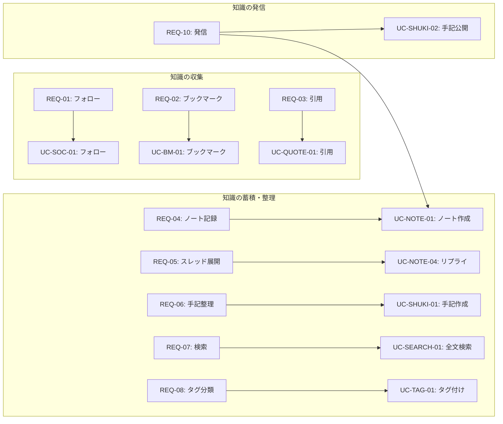

# iori（庵）システム価値定義書

**作成日**: 2026-01-24
**バージョン**: 2.0

---

## 1. プロダクトビジョン

### 1.1 iori（庵）とは

iori（庵）は、**Fediverseに接続された個人向けナレッジ管理プラットフォーム**です。

日々の思考を記録・整理するだけでなく、Fediverseを通じて**他者の知識を収集**し、自分の知識と**発信**もできる「**集合知に接続されたセカンドブレイン**」を提供します。

**庵（いおり）** = 静かに思索し、知を紡ぎ、世界と繋がる小さな隠れ家

### 1.2 なぜ作るのか

- 大規模プラットフォームに依存せず、**自分だけの知識基盤**を持ちたい
- 思考を流さず、**蓄積・整理・体系化**したい
- Fediverseから**他者の知識を収集**し、自分の知識と融合させたい
- 必要に応じて、蓄積した知識を**発信・共有**したい

### 1.3 ポジショニング

|                  | クローズド（個人）     | オープン（収集＋発信）     |
| ---------------- | ---------------------- | -------------------------- |
| **ナレッジ管理** | Obsidian, Notion, Roam | -                          |
| **ハイブリッド** | -                      | **iori（庵）**             |
| **ソーシャル**   | -                      | Mastodon, Misskey, Twitter |

**ioriの位置づけ**: Fediverseから知識を収集し、自分の思考と融合させ、発信もできる「集合知に接続されたセカンドブレイン」

### 1.4 競合との差別化

| 観点       | Obsidian/Notion | Mastodon/Misskey | iori                             |
| ---------- | --------------- | ---------------- | -------------------------------- |
| 主目的     | 知識管理        | ソーシャル発信   | **収集＋管理＋発信**             |
| 知識の収集 | 手動のみ        | フォローで購読   | **フォロー＋ブックマーク＋引用** |
| 公開性     | 基本非公開      | 基本公開         | **選択可能**                     |
| 構造       | ドキュメント    | タイムライン     | **ノート→手記**                  |
| 連携       | なし/独自       | ActivityPub      | **ActivityPub**                  |

---

## 2. アクターモデル

### 2.1 アクター一覧

### 2.2 アクター詳細

| アクター             | 説明                     | 主な関心事                   |
| -------------------- | ------------------------ | ---------------------------- |
| **ナレッジワーカー** | 思考を蓄積・整理したい人 | 知識の記録、整理、検索、発信 |
| **リモートユーザー** | Fediverseからの訪問者    | 公開コンテンツの閲覧、交流   |
| **閲覧者**           | 未登録の訪問者           | 公開コンテンツの閲覧         |
| **サーバー管理者**   | インスタンス運用者       | 安定稼働、低コスト運用       |

### 2.3 ナレッジワーカーの活動

**収集（インプット）**

- Fediverseで興味のあるユーザーをフォローする
- 他者のノートをブックマーク・引用して取り込む
- タイムラインから知識を収集する

**蓄積・整理**

- 思考をノートとして記録する
- スレッドで思考を展開する
- 手記として知識を整理・まとめる
- 蓄積した知識を検索・参照する

**発信（アウトプット）**

- 必要に応じてFediverseに発信する
- 他のユーザーと対話し、フィードバックを得る

---

## 3. 外部システムモデル

### 3.1 外部システム一覧

### 3.2 外部システム詳細

| 外部システム           | 説明                     | 連携方式     | 優先度 |
| ---------------------- | ------------------------ | ------------ | ------ |
| **Fediverseサーバー**  | 発信・交流ネットワーク   | ActivityPub  | 必須   |
| **Webブラウザ**        | ユーザーインターフェース | HTTP/HTML/JS | 必須   |
| **PostgreSQL**         | データ永続化             | Drizzle ORM  | 必須   |
| **ファイルストレージ** | 画像保存                 | ローカルFS   | 必須   |
| **Push通知**           | 通知配信                 | Web Push     | 任意   |
| **全文検索エンジン**   | 知識検索                 | 未定         | 将来   |

---

## 4. コンテキストモデル

### 4.1 システムコンテキスト図

### 4.2 知識のフロー

---

## 5. 要求モデル

### 5.1 ビジネスユースケース（BUC）

| BUC ID     | ビジネスユースケース         | 説明                                                                                                       |
| ---------- | ---------------------------- | ---------------------------------------------------------------------------------------------------------- |
| **BUC-01** | 自分だけの知識基盤を持つ     | 大規模プラットフォームに依存せず、自分のサーバーで知識を管理し、データのポータビリティを確保する           |
| **BUC-02** | Fediverseから知識を収集する  | フォロー・ブックマーク・引用を通じて、他者の知識を自分のナレッジベースに取り込む                           |
| **BUC-03** | 思考を蓄積・整理・体系化する | 収集した知識と自分の思考をノートとして記録し、スレッドで展開、手記としてまとめ、タグで分類、検索でアクセス |
| **BUC-04** | 知識を発信・共有する         | Fediverseに接続して発信、他のユーザーと交流、フィードバックを受けて思考を深化                              |

### 5.2 ステークホルダー要求

#### 知識の収集（コア機能）

| REQ ID | ステークホルダー | 要求                               | 関連BUC | 優先度   |
| ------ | ---------------- | ---------------------------------- | ------- | -------- |
| REQ-01 | ナレッジワーカー | 興味のあるユーザーをフォローしたい | BUC-02  | **必須** |
| REQ-02 | ナレッジワーカー | 他者のノートをブックマークしたい   | BUC-02  | **必須** |
| REQ-03 | ナレッジワーカー | 他者のノートを引用して取り込みたい | BUC-02  | **必須** |

#### 知識の蓄積・整理（コア機能）

| REQ ID | ステークホルダー | 要求                         | 関連BUC | 優先度   |
| ------ | ---------------- | ---------------------------- | ------- | -------- |
| REQ-04 | ナレッジワーカー | 思考をノートとして記録したい | BUC-03  | **必須** |
| REQ-05 | ナレッジワーカー | スレッドで思考を展開したい   | BUC-03  | **必須** |
| REQ-06 | ナレッジワーカー | 手記として知識を整理したい   | BUC-03  | **必須** |
| REQ-07 | ナレッジワーカー | 蓄積した知識を検索したい     | BUC-03  | **必須** |
| REQ-08 | ナレッジワーカー | タグで知識を分類したい       | BUC-03  | **必須** |
| REQ-09 | ナレッジワーカー | 自分のサーバーで管理したい   | BUC-01  | **必須** |

#### 知識の発信（コア機能）

| REQ ID | ステークホルダー | 要求                         | 関連BUC | 優先度   |
| ------ | ---------------- | ---------------------------- | ------- | -------- |
| REQ-10 | ナレッジワーカー | Fediverseに発信したい        | BUC-04  | **必須** |
| REQ-11 | ナレッジワーカー | いいね・リポストで反応したい | BUC-04  | 任意     |
| REQ-12 | ナレッジワーカー | 通知で反応を知りたい         | BUC-04  | 任意     |
| REQ-13 | リモートユーザー | 公開コンテンツを閲覧したい   | BUC-04  | 任意     |

#### 運用

| REQ ID | ステークホルダー | 要求                 | 関連BUC | 優先度 |
| ------ | ---------------- | -------------------- | ------- | ------ |
| REQ-14 | サーバー管理者   | 運用コストを抑えたい | BUC-01  | 必須   |

### 5.3 要求とユースケースの対応

---

## 6. 機能要求と非機能要求

### 6.1 機能要求

| カテゴリ         | 機能                           | 優先度   | 現状       |
| ---------------- | ------------------------------ | -------- | ---------- |
| **認証**         | サインアップ/サインイン        | 必須     | 実装済     |
| **収集**         | フォロー/アンフォロー          | **必須** | 実装済     |
| **収集**         | ブックマーク                   | **必須** | **未実装** |
| **収集**         | 引用ノート                     | **必須** | **未実装** |
| **ノート**       | 作成、削除、画像添付、リプライ | 必須     | 実装済     |
| **手記**         | 作成、公開、非公開、削除       | **必須** | 実装済     |
| **検索**         | 全文検索                       | **必須** | **未実装** |
| **タグ**         | タグ付け、タグ検索             | **必須** | **未実装** |
| **ActivityPub**  | 送受信、署名検証               | 必須     | 実装済     |
| **リアクション** | いいね、リポスト               | 任意     | 実装済     |
| **通知**         | 通知一覧、Web Push             | 任意     | 実装済     |

### 6.2 非機能要求

| カテゴリ           | 要求               | 説明                            |
| ------------------ | ------------------ | ------------------------------- |
| **パフォーマンス** | 軽量動作           | 個人サーバーでも快適に動作      |
| **セキュリティ**   | 認証・認可         | セッション管理、HTTP Signatures |
| **可用性**         | 安定稼働           | エラーハンドリング、ログ        |
| **運用性**         | 低コスト運用       | シンプルな構成                  |
| **相互運用性**     | ActivityPub準拠    | Fediverse互換                   |
| **ポータビリティ** | データエクスポート | 知識の持ち出し（将来）          |

---

## 7. 用語集

| 用語             | 定義                                                           |
| ---------------- | -------------------------------------------------------------- |
| **ノート**       | 日々の思考を記録する短いテキスト（旧: 投稿/Post）              |
| **スレッド**     | ノートへのリプライの連鎖。思考の展開                           |
| **手記**         | スレッドをまとめたもの。思考の軌跡（旧: Article）              |
| **ブックマーク** | 他者のノートを自分のナレッジベースに保存すること（将来実装）   |
| **引用**         | 他者のノートを参照しながら自分の思考を記録すること（将来実装） |
| **タグ**         | ノート・手記を分類するためのラベル（将来実装）                 |
| **公開**         | Fediverseに発信し、誰でも閲覧可能にすること                    |
| **非公開**       | 自分だけが閲覧可能な状態（将来実装）                           |

---

## 8. 成功指標（KPI）案

| 指標              | 説明                         | 目標値       |
| ----------------- | ---------------------------- | ------------ |
| 起動時間          | サーバー起動にかかる時間     | 5秒以内      |
| メモリ使用量      | 定常状態でのメモリ消費       | 256MB以下    |
| 検索応答時間      | 検索クエリの応答速度         | 500ms以内    |
| ActivityPub互換性 | Mastodon/Misskeyとの相互運用 | 基本機能100% |

---

## 9. ロードマップ（案）

### Phase 1: 現状（マイクロブログ機能）

- [x] ノート（投稿）の作成・削除
- [x] スレッド（リプライ）
- [x] 手記（Article）の作成・公開
- [x] ActivityPub連携
- [x] フォロー・いいね・リポスト

### Phase 2: 知識収集基盤

- [ ] ブックマーク機能の実装
- [ ] 引用ノート機能の実装
- [ ] ブックマーク・引用の一覧表示
- [ ] Article → 手記への改名

### Phase 3: ナレッジ管理基盤

- [ ] 検索機能の実装
- [ ] タグ機能の実装
- [ ] UIの見直し（ナレッジ管理向け）

### Phase 4: 知識の体系化

- [ ] 内部リンク（双方向リンク）
- [ ] 非公開ノート
- [ ] データエクスポート

---

## 改訂履歴

| 日付       | バージョン | 変更内容                                      |
| ---------- | ---------- | --------------------------------------------- |
| 2026-01-24 | 1.0        | 初版作成（マイクロブログとして）              |
| 2026-01-24 | 2.0        | ナレッジ管理プラットフォームとして再定義      |
| 2026-01-24 | 2.1        | ASCII図をMermaid/表/箇条書きに変更            |
| 2026-01-24 | 2.2        | Mermaidの日本語ラベルをダブルクォートで囲む   |
| 2026-01-24 | 3.0        | Fediverseからの知識収集をコア機能として再定義 |
