# iori（庵）ロバストネス図

**作成日**: 2026-01-24
**バージョン**: 1.0

---

## 1. 概要

本ドキュメントでは、iori（庵）システムの主要ユースケースをロバストネス図で表現します。
ロバストネス図は、バウンダリ（UI）、コントローラ（処理）、エンティティ（データ）の3つの要素でシステムの振る舞いを可視化します。

### 1.1 凡例

| 要素 | 記号 | 説明 |
|-----|------|------|
| アクター | 👤 | システムの利用者 |
| バウンダリ | 🖥️/👆 | 画面・UI要素 |
| コントローラ | 🔄 | 処理・ロジック |
| エンティティ | 💾 | データ・集約 |

---

## 2. 認証系

### 2.1 サインアップ・サインイン

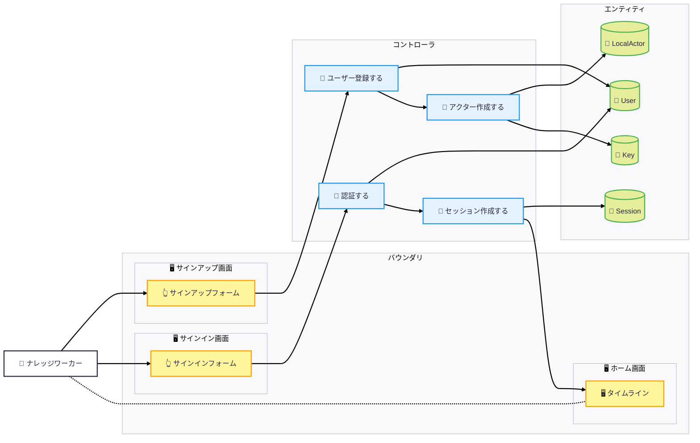

---

## 3. コンテンツ系

### 3.1 ノート作成

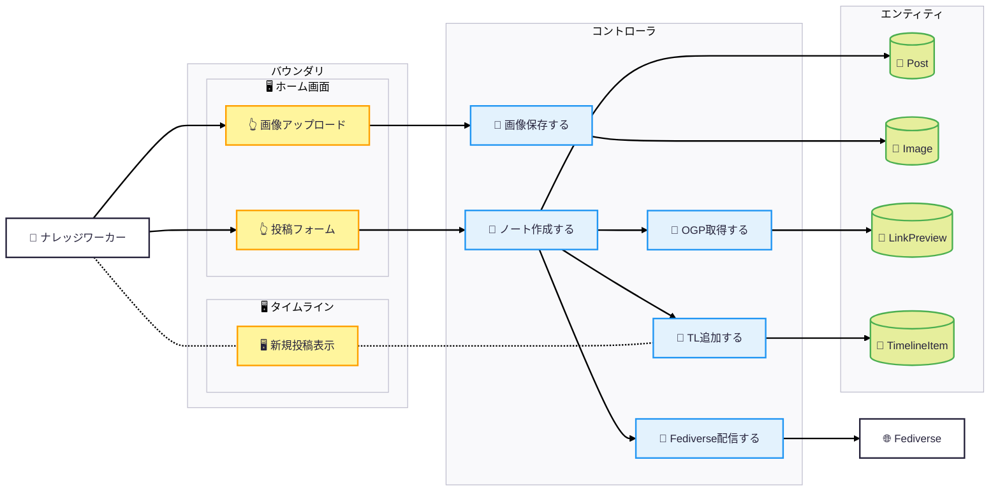

### 3.2 リプライ（スレッド展開）

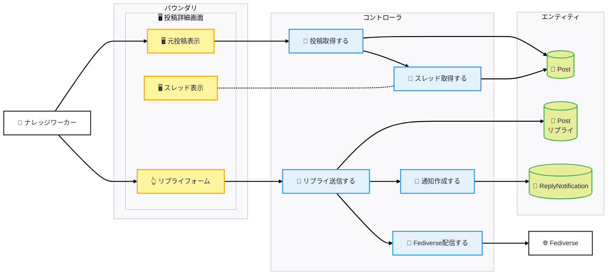

### 3.3 手記作成・公開

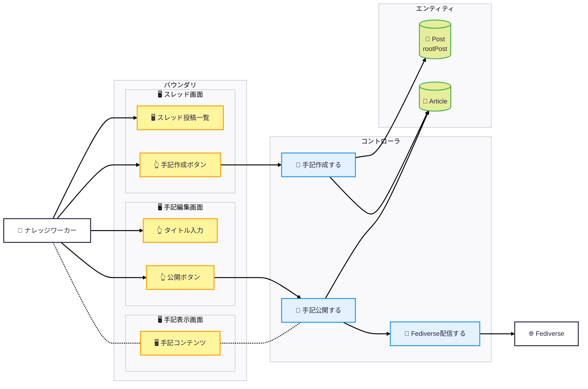

---

## 4. タイムライン系

### 4.1 ホームタイムライン表示

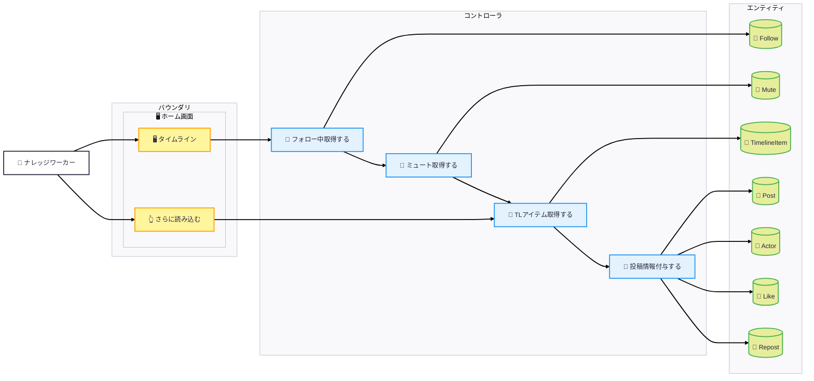

### 4.2 ユーザー投稿一覧表示

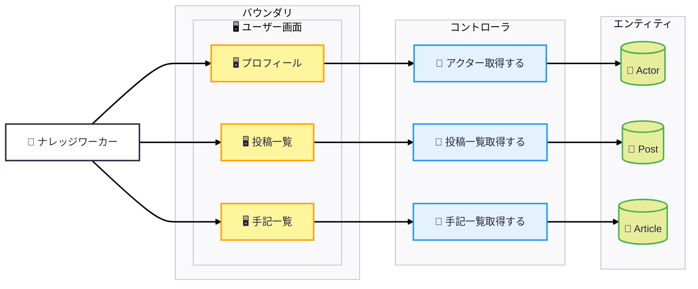

---

## 5. ソーシャル系

### 5.1 フォロー

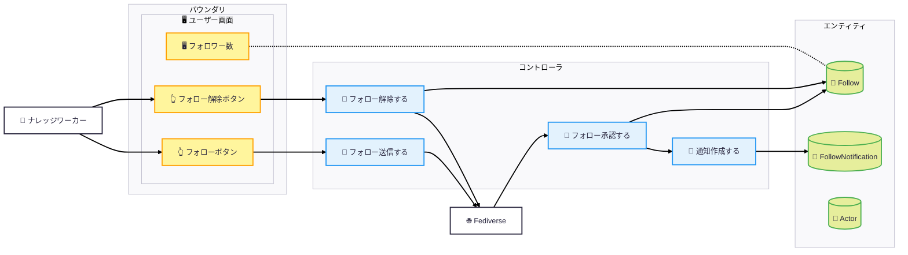

### 5.2 いいね

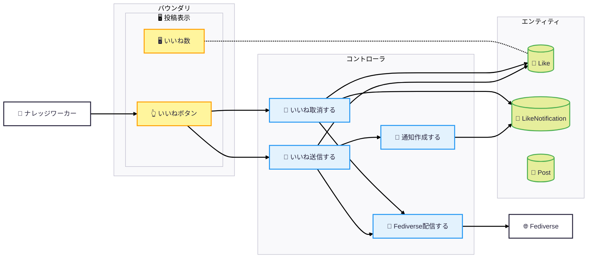

### 5.3 リポスト

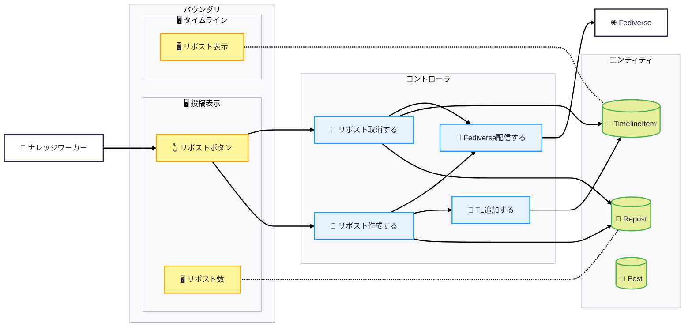

### 5.4 絵文字リアクション

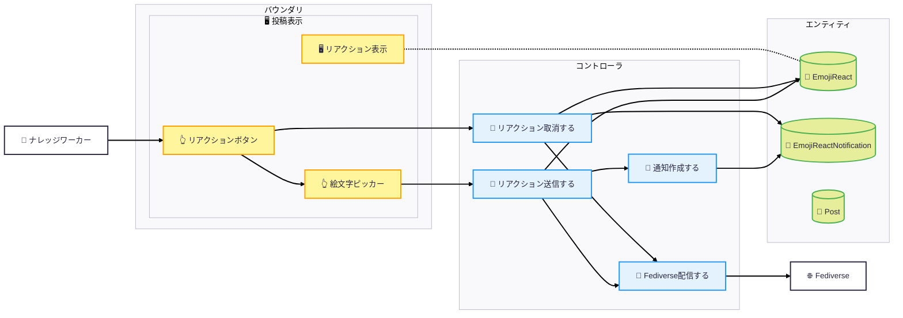

---

## 6. 通知系

### 6.1 通知一覧表示・既読化

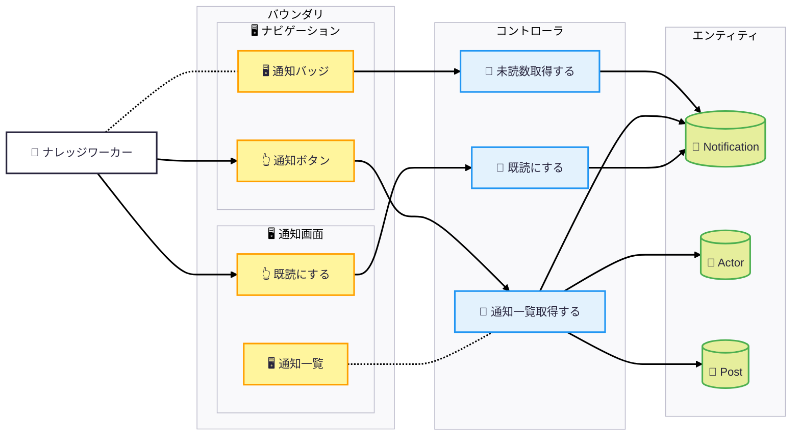

---

## 7. Fediverse受信系

### 7.1 リモート投稿受信

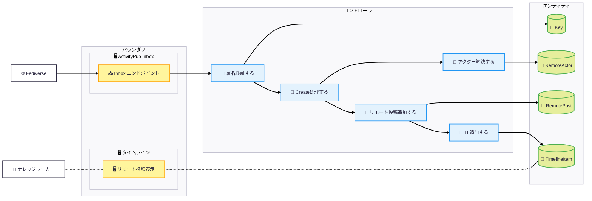

### 7.2 リモートいいね受信

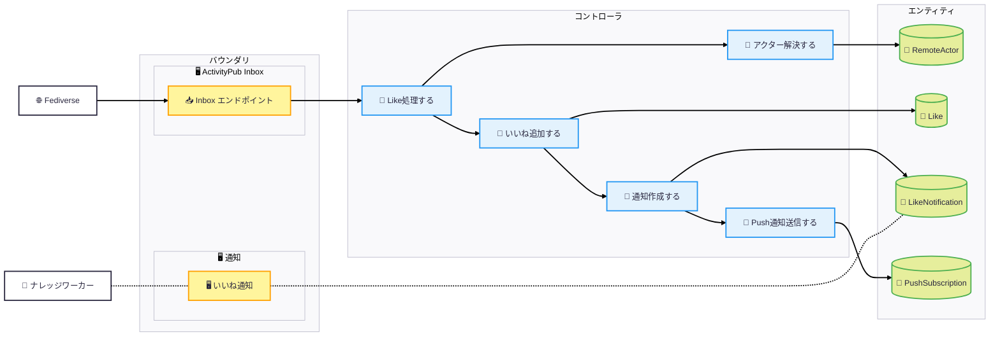

---

## 8. 削除系

### 8.1 投稿削除（カスケード）

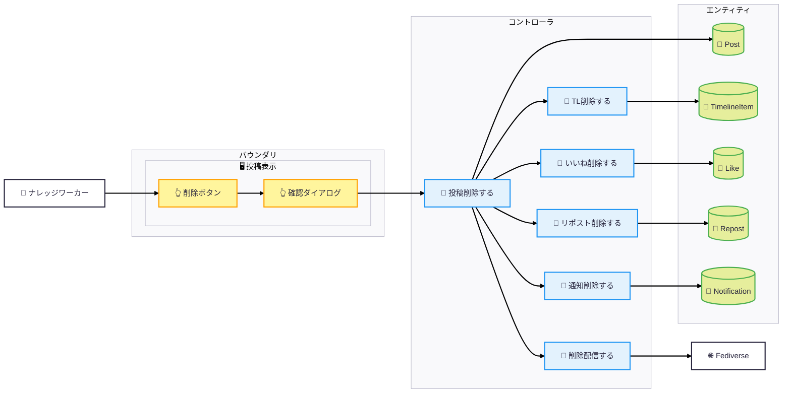

---

## 9. ユースケース×コントローラ対応表

| ユースケース | コントローラ | エンティティ |
|------------|------------|------------|
| サインアップ | ユーザー登録、アクター作成 | User, LocalActor, Key |
| サインイン | 認証、セッション作成 | User, Session |
| ノート作成 | ノート作成、画像保存、OGP取得、TL追加、配信 | Post, Image, LinkPreview, TimelineItem |
| リプライ | リプライ送信、通知作成、配信 | Post, ReplyNotification |
| 手記作成 | 手記作成、手記公開、配信 | Post, Article |
| TL表示 | フォロー取得、ミュート取得、TLアイテム取得、情報付与 | Follow, Mute, TimelineItem, Post, Actor |
| フォロー | フォロー送信、フォロー承認、通知作成 | Follow, FollowNotification |
| いいね | いいね送信、通知作成、配信 | Like, LikeNotification |
| リポスト | リポスト作成、TL追加、配信 | Repost, TimelineItem |
| 絵文字リアクション | リアクション送信、通知作成、配信 | EmojiReact, EmojiReactNotification |
| 通知表示 | 未読数取得、通知一覧取得、既読化 | Notification, Actor, Post |
| リモート投稿受信 | 署名検証、Create処理、アクター解決、TL追加 | Key, RemoteActor, RemotePost, TimelineItem |
| 投稿削除 | 投稿削除、TL削除、いいね削除、リポスト削除、通知削除、配信 | Post, TimelineItem, Like, Repost, Notification |

---

## 改訂履歴

| 日付 | バージョン | 変更内容 |
|-----|----------|---------|
| 2026-01-24 | 1.0 | 初版作成 |
