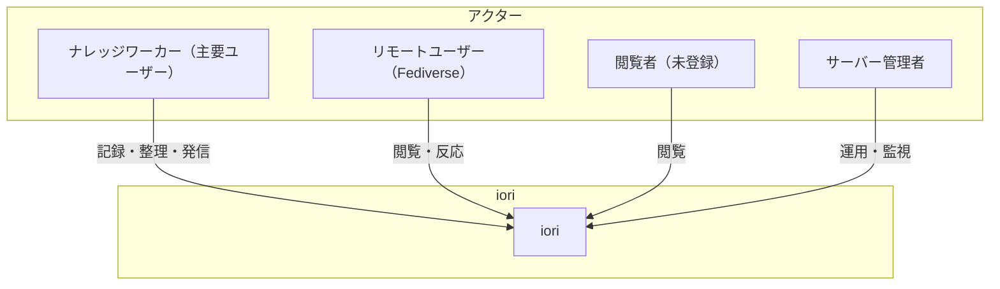
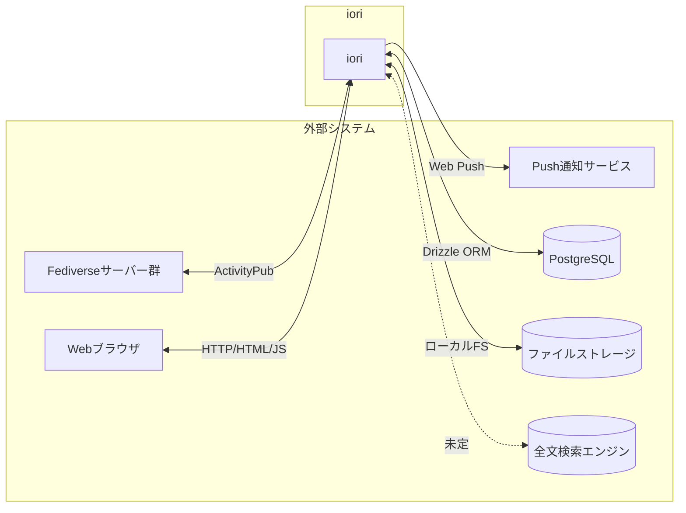
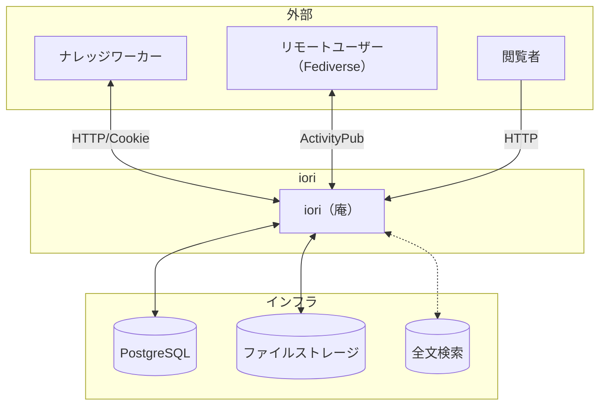
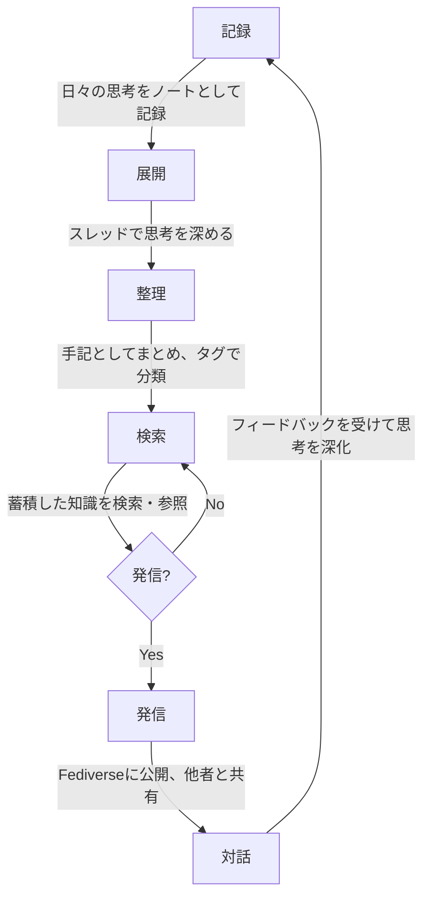
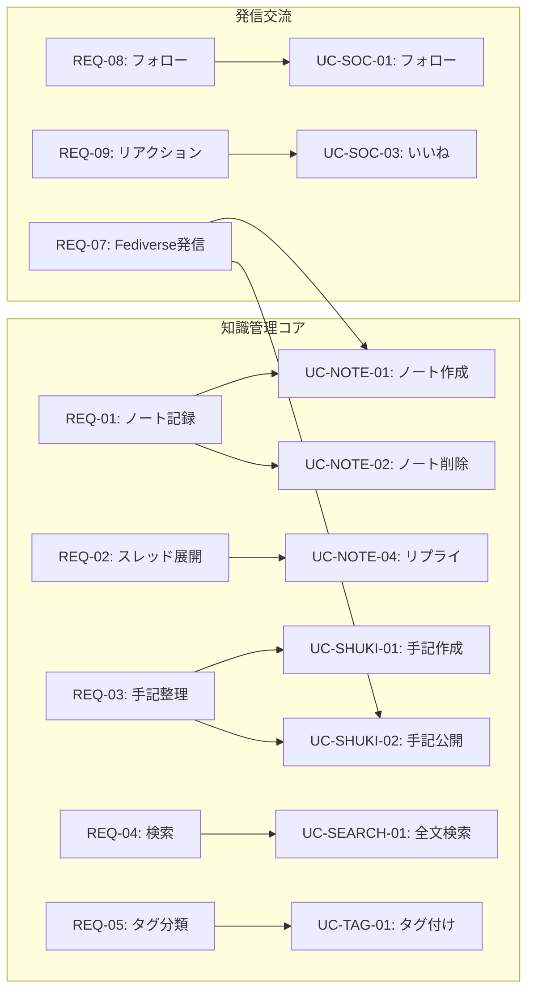

# iori（庵）システム価値定義書

**作成日**: 2026-01-24
**バージョン**: 2.0

---

## 1. プロダクトビジョン

### 1.1 iori（庵）とは

iori（庵）は、**個人向けナレッジ管理プラットフォーム**です。

日々の思考を記録し、展開し、整理し、必要に応じてFediverseを通じて発信できる「**発信可能なセカンドブレイン**」を提供します。

**庵（いおり）** = 静かに思索し、知を紡ぐための小さな隠れ家

### 1.2 なぜ作るのか

- 大規模プラットフォームに依存せず、**自分だけの知識基盤**を持ちたい
- 思考を流さず、**蓄積・整理・体系化**したい
- 必要に応じて、蓄積した知識を**発信・共有**したい

### 1.3 ポジショニング

|  | クローズド（個人） | オープン（発信） |
|--|------------------|-----------------|
| **ナレッジ管理** | Obsidian, Notion, Roam | - |
| **ハイブリッド** | - | **iori（庵）** |
| **ソーシャル** | - | Mastodon, Misskey, Twitter |

**ioriの位置づけ**: 思考を蓄積しつつ発信もできる「発信可能なセカンドブレイン」

### 1.4 競合との差別化

| 観点 | Obsidian/Notion | Mastodon/Misskey | iori |
|------|-----------------|------------------|------|
| 主目的 | 知識管理 | ソーシャル発信 | **両方** |
| 公開性 | 基本非公開 | 基本公開 | **選択可能** |
| 構造 | ドキュメント | タイムライン | **ノート→手記** |
| 連携 | なし/独自 | ActivityPub | **ActivityPub** |

---

## 2. アクターモデル

### 2.1 アクター一覧

### 2.2 アクター詳細

| アクター | 説明 | 主な関心事 |
|---------|------|-----------|
| **ナレッジワーカー** | 思考を蓄積・整理したい人 | 知識の記録、整理、検索、発信 |
| **リモートユーザー** | Fediverseからの訪問者 | 公開コンテンツの閲覧、交流 |
| **閲覧者** | 未登録の訪問者 | 公開コンテンツの閲覧 |
| **サーバー管理者** | インスタンス運用者 | 安定稼働、低コスト運用 |

### 2.3 ナレッジワーカーの活動

- 思考をノートとして記録する
- スレッドで思考を展開する
- 手記として知識を整理・まとめる
- 蓄積した知識を検索・参照する
- 必要に応じてFediverseに発信する
- 他のユーザーと交流する（任意）

---

## 3. 外部システムモデル

### 3.1 外部システム一覧

### 3.2 外部システム詳細

| 外部システム | 説明 | 連携方式 | 優先度 |
|-------------|------|---------|--------|
| **Fediverseサーバー** | 発信・交流ネットワーク | ActivityPub | 必須 |
| **Webブラウザ** | ユーザーインターフェース | HTTP/HTML/JS | 必須 |
| **PostgreSQL** | データ永続化 | Drizzle ORM | 必須 |
| **ファイルストレージ** | 画像保存 | ローカルFS | 必須 |
| **Push通知** | 通知配信 | Web Push | 任意 |
| **全文検索エンジン** | 知識検索 | 未定 | 将来 |

---

## 4. コンテキストモデル

### 4.1 システムコンテキスト図

### 4.2 知識のフロー

---

## 5. 要求モデル

### 5.1 ビジネスユースケース（BUC）

| BUC ID | ビジネスユースケース | 説明 |
|--------|---------------------|------|
| **BUC-01** | 自分だけの知識基盤を持つ | 大規模プラットフォームに依存せず、自分のサーバーで知識を管理し、データのポータビリティを確保する |
| **BUC-02** | 思考を蓄積・整理・体系化する | 日々の思考をノートとして記録し、スレッドで展開、手記としてまとめ、タグで分類、検索でアクセス |
| **BUC-03** | 知識を発信・共有する（任意） | Fediverseに接続して発信、他のユーザーと交流、フィードバックを受けて思考を深化 |

### 5.2 ステークホルダー要求

#### 知識管理（コア機能）

| REQ ID | ステークホルダー | 要求 | 関連BUC | 優先度 |
|--------|-----------------|------|---------|--------|
| REQ-01 | ナレッジワーカー | 思考をノートとして記録したい | BUC-02 | **必須** |
| REQ-02 | ナレッジワーカー | スレッドで思考を展開したい | BUC-02 | **必須** |
| REQ-03 | ナレッジワーカー | 手記として知識を整理したい | BUC-02 | **必須** |
| REQ-04 | ナレッジワーカー | 蓄積した知識を検索したい | BUC-02 | **必須** |
| REQ-05 | ナレッジワーカー | タグで知識を分類したい | BUC-02 | **必須** |
| REQ-06 | ナレッジワーカー | 自分のサーバーで管理したい | BUC-01 | **必須** |

#### 発信・交流（任意機能）

| REQ ID | ステークホルダー | 要求 | 関連BUC | 優先度 |
|--------|-----------------|------|---------|--------|
| REQ-07 | ナレッジワーカー | Fediverseに発信したい | BUC-03 | 任意 |
| REQ-08 | ナレッジワーカー | 他のユーザーをフォローしたい | BUC-03 | 任意 |
| REQ-09 | ナレッジワーカー | いいね・リポストで反応したい | BUC-03 | 任意 |
| REQ-10 | ナレッジワーカー | 通知で反応を知りたい | BUC-03 | 任意 |
| REQ-11 | リモートユーザー | 公開コンテンツを閲覧したい | BUC-03 | 任意 |

#### 運用

| REQ ID | ステークホルダー | 要求 | 関連BUC | 優先度 |
|--------|-----------------|------|---------|--------|
| REQ-12 | サーバー管理者 | 運用コストを抑えたい | BUC-01 | 必須 |

### 5.3 要求とユースケースの対応

---

## 6. 機能要求と非機能要求

### 6.1 機能要求

| カテゴリ | 機能 | 優先度 | 現状 |
|---------|------|--------|------|
| **認証** | サインアップ/サインイン | 必須 | 実装済 |
| **ノート** | 作成、削除、画像添付、リプライ | 必須 | 実装済 |
| **手記** | 作成、公開、非公開、削除 | **必須** | 実装済 |
| **検索** | 全文検索 | **必須** | **未実装** |
| **タグ** | タグ付け、タグ検索 | **必須** | **未実装** |
| **ActivityPub** | 送受信、署名検証 | 必須 | 実装済 |
| **フォロー** | フォロー/アンフォロー | 任意 | 実装済 |
| **リアクション** | いいね、リポスト | 任意 | 実装済 |
| **通知** | 通知一覧、Web Push | 任意 | 実装済 |

### 6.2 非機能要求

| カテゴリ | 要求 | 説明 |
|---------|------|------|
| **パフォーマンス** | 軽量動作 | 個人サーバーでも快適に動作 |
| **セキュリティ** | 認証・認可 | セッション管理、HTTP Signatures |
| **可用性** | 安定稼働 | エラーハンドリング、ログ |
| **運用性** | 低コスト運用 | シンプルな構成 |
| **相互運用性** | ActivityPub準拠 | Fediverse互換 |
| **ポータビリティ** | データエクスポート | 知識の持ち出し（将来） |

---

## 7. 用語集

| 用語 | 定義 |
|------|------|
| **ノート** | 日々の思考を記録する短いテキスト（旧: 投稿/Post） |
| **スレッド** | ノートへのリプライの連鎖。思考の展開 |
| **手記** | スレッドをまとめたもの。思考の軌跡（旧: Article） |
| **タグ** | ノート・手記を分類するためのラベル（将来実装） |
| **公開** | Fediverseに発信し、誰でも閲覧可能にすること |
| **非公開** | 自分だけが閲覧可能な状態（将来実装） |

---

## 8. 成功指標（KPI）案

| 指標 | 説明 | 目標値 |
|------|------|--------|
| 起動時間 | サーバー起動にかかる時間 | 5秒以内 |
| メモリ使用量 | 定常状態でのメモリ消費 | 256MB以下 |
| 検索応答時間 | 検索クエリの応答速度 | 500ms以内 |
| ActivityPub互換性 | Mastodon/Misskeyとの相互運用 | 基本機能100% |

---

## 9. ロードマップ（案）

### Phase 1: 現状（マイクロブログ機能）

- [x] ノート（投稿）の作成・削除
- [x] スレッド（リプライ）
- [x] 手記（Article）の作成・公開
- [x] ActivityPub連携
- [x] フォロー・いいね・リポスト

### Phase 2: ナレッジ管理基盤

- [ ] 検索機能の実装
- [ ] タグ機能の実装
- [ ] UIの見直し（ナレッジ管理向け）
- [ ] Article → 手記への改名

### Phase 3: 知識の体系化

- [ ] 内部リンク（双方向リンク）
- [ ] 非公開ノート
- [ ] データエクスポート

---

## 改訂履歴

| 日付 | バージョン | 変更内容 |
|------|-----------|---------|
| 2026-01-24 | 1.0 | 初版作成（マイクロブログとして） |
| 2026-01-24 | 2.0 | ナレッジ管理プラットフォームとして再定義 |
| 2026-01-24 | 2.1 | ASCII図をMermaid/表/箇条書きに変更 |
| 2026-01-24 | 2.2 | Mermaidの日本語ラベルをダブルクォートで囲む |
