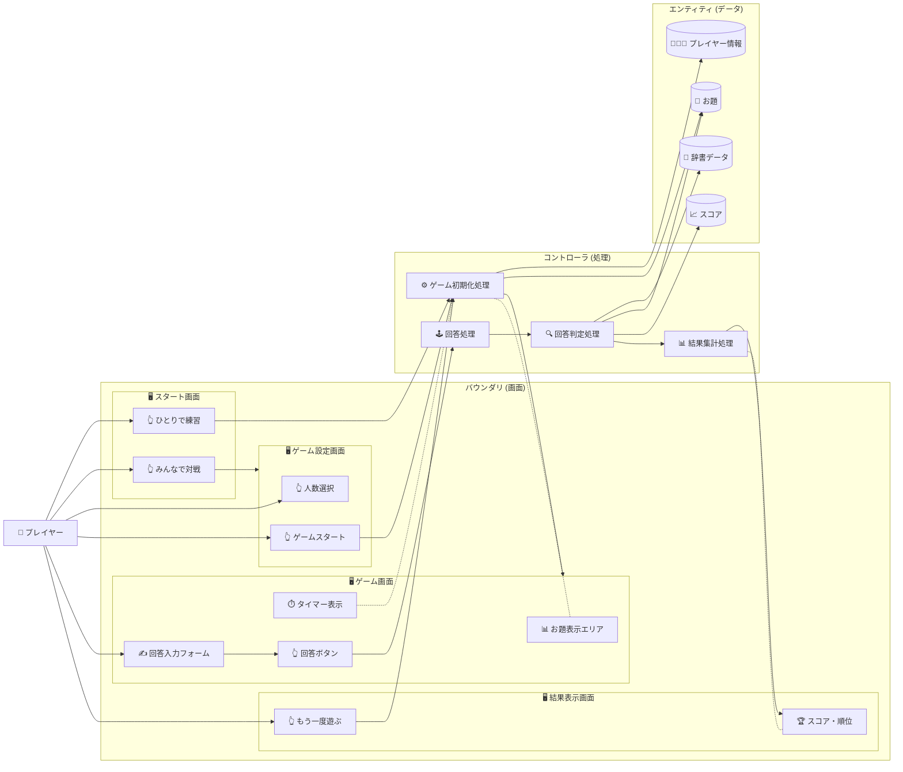

## **Webブラウザ版『モジサンド』 製品要求仕様書 (PRD)**

### **1. 概要**

#### **1.1. 製品名**

Webブラウザ版『モジサンド』

#### **1.2. 目的・背景**

本製品は、人気TV番組のコーナーのコンセプトをベースにした、Webブラウザ上で手軽に遊べるカジュアルゲームです。

友人や家族とのパーティー、飲み会、移動時間などのシーンで、スマートフォンやPC一つで即座に盛り上がれる「言葉をサンドする」ゲームを提供することを目的とします。

#### **1.3. ターゲットオーディエンス**

* 友人や家族との集まりで、手軽に盛り上がれるパーティーゲームを探している人  
* 言葉遊びやクイズゲームが好きな人  
* 短時間で楽しめるカジュアルゲームユーザー

### **2. 機能要件**

#### **2.1. ゲームモード**

本ゲームは、利用シーンに応じて2つのモードを提供する。

* **① ひとりで練習（シングルプレイ）**  
  * 概要: 制限時間内（例: 3分間）にどれだけ多くのポイントを獲得できるか挑戦するモード。  
  * 目的: ルールの習熟と、高得点を出せる単語の練習。  
* **② みんなで対戦（マルチプレイ・ホットシート形式）**  
  * 概要: 1台のデバイスを共有し、複数人（2〜4人）で順番に回答し、ポイントを競うモード。  
  * 目的: パーティーシーンでの対戦。

#### **2.2. コア・ゲームプレイ**

ゲームの基本的な流れは以下の通り。

1. **お題の提示:**  
   * 「あたまの文字（ひらがな1文字）」と「おしりの文字（ひらがな1文字）」がランダムに決定され、画面に表示される。  
   * お題の文字は、意味のある単語が成立しやすいよう、一定のルールに基づいて選定される。（例: 「あたま」から「ん」は除外、「おしり」で「を」は除外など）  
2. **BGMとタイマー:**  
   * ゲームを盛り上げるリズミカルなBGMが再生される。  
   * 回答の制限時間（10秒）のタイマーが作動し、視覚的に（バーや円グラフで）表示される。  
3. **回答の入力:**  
   * プレイヤーは、お題に当てはまる単語をテキスト入力欄に入力し、「回答」ボタンを押す。  
4. **回答の判定:**  
   * 入力された単語が以下の条件をすべて満たしているか、システムが自動判定する。  
     1. お題の「あたまの文字」で始まっている。  
     2. お題の「おしりの文字」で終わっている。  
     3. システム内の辞書データ（後述）に存在する有効な単語である。  
     4. 文字数が3文字以上であること（2文字は簡単すぎるため除外）。  
5. **スコアリング:**  
   * 判定が「OK」の場合、**単語の文字数**がそのまま得点として加算される。（例: 「きつつき」→ 4点）  
   * 判定が「NG」（時間切れ含む）の場合、0点となる。

#### **2.3. ゲームの進行（マルチプレイ時）**

1. **プレイヤー設定:** 参加人数（2〜4人）とプレイヤー名（任意入力、デフォルトは「プレイヤー1」など）を設定する。  
2. **ターン制:** プレイヤー1から順番に回答ターンが回る。  
3. **ゲーム終了:** 規定のラウンド数（例: 5ラウンド）が終了した時点でゲーム終了。  
4. **結果発表:** 最終的なスコアと順位が表示される。

#### **2.4. 辞書データ**

* ゲームの判定に使用する、ひらがな表記の単語リスト（辞書データ）を内蔵する。  
* 一般的な名詞、動詞、形容詞などを中心に収録する。  
* 初期リリースでは、判定のシンプルさを優先し、一般的な名詞を主に採用する。

### **3. 画面・UI要件**

#### **3.1. スタート画面**

* ゲームタイトルロゴ『モジサンド』  
* 「ひとりで練習」ボタン  
* 「みんなで対戦」ボタン

#### **3.2. ゲーム設定画面（マルチプレイ選択時）**

* 参加人数の選択（2人 / 3人 / 4人）  
* 各プレイヤーの名前入力欄（任意）  
* 「ゲームスタート」ボタン

#### **3.3. ゲーム画面**

* **お題表示:** 「あたまは『X』」「おしりは『Y』」を大きく表示。  
* **タイマー:** 10秒のカウントダウンタイマー（視覚的なゲージ）。  
* **現在のプレイヤー:** （マルチプレイ時）現在誰のターンかを表示。  
* **BGM:** オン/オフ切り替えボタン。  
* **回答入力:** テキスト入力フィールドと「回答」ボタン。  
* **スコア表示:** （マルチプレイ時）各プレイヤーの現在のスコア一覧。

#### **3.4. 判定・結果表示（ポップアップ）**

* 回答後に表示される。  
* **OKの場合:** 「OK!『（回答した単語）』〇文字！ 〇点獲得！」  
* **NGの場合:** 「NG...」（理由: 時間切れ / お題と違う / 辞書にない）  
* 「次の人へ」または「次のお題へ」ボタン。

#### **3.5. リザルト画面（ゲーム終了時）**

* 最終スコアランキング（順位、プレイヤー名、得点）  
* 「もう一度遊ぶ」ボタン（同じメンバーで）  
* 「はじめに戻る」ボタン

### **5. 非機能要件**

#### **5.1. ユーザビリティ**

* 直感的で分かりやすい操作性。マニュアルを読まなくてもプレイできること。  
* パーティーゲームとして盛り上がれる、明るく楽しいビジュアルデザイン。

#### **5.2. パフォーマンス**

* ページの読み込み、お題の生成、回答の判定がストレスなく高速（2秒以内）に完了すること。

#### **5.3. 互換性（レスポンシブデザイン）**

* PCおよびスマートフォンの主要なモダンブラウザ（Chrome, Safari, Firefox, Edge）に対応すること。  
* 画面サイズに応じてレイアウトが最適化されること。特にスマートフォンでの操作性を優先する。

### **6. 将来の展望（v.2.0以降）**

* **お題の難易度設定:** 「かんたん」（よく使われる文字）、「むずかしい」（「ぢ」「ぷ」など）の選択。  
* **音声入力:** テキスト入力に加え、音声認識による回答機能の追加。  
* **オンライン対戦:** URLを共有することで、離れた場所にいる友人とも対戦できる機能。  
* **辞書データの拡充:** 固有名詞や流行語の追加、ユーザーによる単語登録機能。
