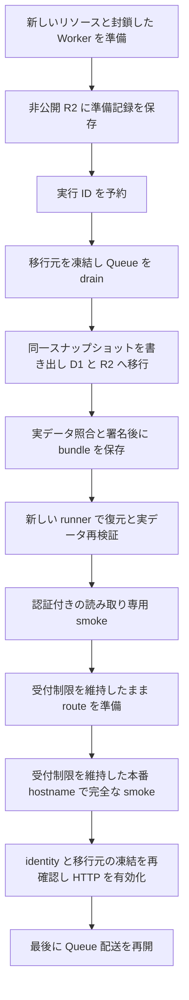

# iori Cloudflare 移行の再開計画

更新日: 2026-09-06

## 実行方針

リポジトリを public のまま維持し、移行と再検証にも GitHub-hosted runner の `ubuntu-latest` を使います。self-hosted runner の登録やリポジトリの private 化は移行の必須条件にしません。GitHub-hosted runner は public repository で利用できます。[GitHub の runner 仕様](https://docs.github.com/en/actions/reference/runners/github-hosted-runners)

各 job の作業領域は `$RUNNER_TEMP` 配下に作り、job をまたぐ移行データと証跡は専用の非公開 R2 bucket に保存します。後続 job は同じデータを新しい作業領域へ復元します。Cloudflare への移行操作は、承認者と保護ブランチ制限を設定した `production` Environment から、レビュー済み SHA を指定して手動実行します。`main` を保護し、workflow の `main` 固定検査を維持します。

CI の出力ガード、相対パスを使う v3 証跡、非公開 R2 への分割転送・復元、D1/R2 の実データ検証、移行元の永続的な凍結・drain・一貫 snapshot、新しい移行先の受付制御、実 import と executor を実装しました。hosted workflow も固定 CLI に接続し、操作別の権限、一時入力、非公開ログ、期限と cleanup を組み込みました。D1 の多数 actor 選択と閲覧者の like/repost 状態の回帰も修正し、各実装と全体の接続について独立レビューを完了しています。本番設定と実リソースは変更していません。

## 移行先を分離する追加方針

新しい D1、R2、KV、Queue、DLQ と Worker identity を移行先として作成します。environment と generation ごとに実リソース名と Terraform backend key を分け、以前の Cloudflare リソースと state は保持します。新しい binding を旧 Worker に渡しません。この方針は、以前の「既存 6 リソースを import して移行先にする」手順を置き換えます。実際の作成はレビュー済みの準備操作で行い、この開発作業では apply しません。

現行 Worker は `workers.dev` と preview URL からも呼び出せるため、production route がないことだけでは書き込み停止を示せません。また、接続中の HTTP invocation には一般的な時間上限がなく、deploy や一定時間の待機で旧処理の完了を証明できません。新しいリソースへの権限を旧処理が持たない構成にします。[Workers の制限](https://developers.cloudflare.com/workers/platform/limits/)

準備順序は、新しい storage と配送を一時停止した Queue の作成、全 HTTP を拒否する Worker の初回 deploy、停止したままの consumer の接続です。移行と別 job での実データ検証中はこの状態を維持します。その後、認証付きの読み取り専用 smoke、route の準備、指定した本番 hostname への HTTP 有効化、Queue の配送再開の順に進めます。smoke の検査項目は省略せず、D1/R2/KV への書き込みを許可しません。Queue の一時停止と再開は Terraform が管理します。[Queue の Terraform schema](https://developers.cloudflare.com/api/terraform/resources/queues/)

準備が成功したときだけ、environment、generation、main SHA、run ID、backend、作成した実 ID と sealed version の記録を専用の非公開 R2 の固定キーへ新規保存します。後の executor はこの記録を Terraform の期待値と実 API 応答に照合し、署名する移行先証跡へ内容と hash を結び付けます。途中で失敗した generation を準備済みとして再利用しません。移行用 bucket の作成後、移行元を凍結する前に executor の実行 ID を予約します。署名用秘密鍵は移行 job だけに渡します。

R2 への書き込み後に応答や再読込を確認できない場合、保存の成否を推測せず処理を停止します。object が残っている可能性を保ち、自動削除・再試行・後続処理を行いません。復旧時は実状態を確認して判断します。



## 現在地

移行は進行中です。以前の実装候補を専用 worktree と `codex/feat/iori-cloudflare-resume` に引き継いでいます。Workers、D1、R2、KV、Queues への移行と、Terraform と Wrangler の管理境界は[設計書](../specs/2026-08-16-iori-cloudflare-complete-migration-design.md)を維持します。前回のテスト成功は、本番移行や運用準備の完了を意味しません。

再開前の 2026-09-05 に GitHub API と実装を照合し、次の不足を確認しました。この時点の状況を記録しています。秘密情報の値、本番データ、Cloudflare の実リソースは参照していません。

- 実装候補は `origin/main` より 50 コミット先にあり、対応する PR は未作成でした。
- リポジトリに登録された self-hosted runner は 0 台でした。修正後の計画では、この台数を開始条件にしません。
- `production` Environment の `protection_rules` は空で、`deployment_branch_policy` は `null` でした。Environment 名だけでは承認やブランチ制限は有効になりません。
- 当時の `migrate-data` は既存の署名付き証跡と移行結果の検証だけを行い、書き込み停止、Queue drain、export/import、署名付き証跡の生成を実行する入口が未接続でした。今回の実装で固定 executor に接続しました。
- manifest の形式、Queue drain の順序、smoke 対象の指定に実装間の不整合がありました。この再開作業で回帰テストと修正を追加しました。

2026-09-06 の初回再確認では `production` は `protection_rules=[]`、`deployment_branch_policy=null` でした。その後、ユーザーが `protected_branches` 方式を選択しました。選択後の API readback では `staging` は `protected_branches=true`、`custom_branch_policies=false` で reviewer がなく、`production` は required reviewer 1件と `deployment_branch_policy=null`、`main` は `protected=true` です。残る保護設定は staging の reviewer と production の保護ブランチ制限です。秘密情報の値は取得していません。

旧 source deploy は対象 path の `main` push と手動実行を保持するため、merge で job が起動し得ます。source credential を供給して merge する前に、上記の保護設定を完了します。Environment 名の指定だけでは承認待ちになりません。

2026-09-06 の実装統合後のローカル検証結果は次のとおりです。各実装と全体の接続、D1 の回帰修正を独立レビューし、全件テストで見つかった旧 health fixture も受付制御を維持して修正しました。

- iori: 109 ファイル、668 テスト成功。他パッケージ: 216 テスト成功。1 worker・ファイル逐次実行で全体を検査
- iori 型検査、全体の `tsc --noEmit`・`lint:fix`・format: 成功
- fixture を使う Worker dry-run、bundle graph、公開成果物と出力ログの検査: 成功
- Terraform fmt、fresh な作業領域で backend に接続しない init、validate: 成功
- opt-in の合成 PostgreSQL 16 snapshot と、固定 provider `5.23.0` の実 schema 検査も有効にして成功。専用コンテナと backend を持たない provider fixture を使い、本番接続は不使用
- 全体 build: `--workspace-concurrency=1` を指定して成功。既定の並列実行では iori の prebuild による `result/dist` 再生成と mdlive の参照が競合したため、逐次実行で確認

本番デプロイ、データ移行、route 切替、AWS 撤去は実行していません。

変更と検証結果は [Draft PR #486](https://github.com/iwasa-kosui/monorepo/pull/486) で管理します。pnpm の起動表示に含まれる絶対パスを出力検査が拒否していた問題は、コマンドの終了コードと検査を維持して修正し、実際の dry-run 出力でも確認しました。remote CI は PR に反映した HEAD に対する [Checks](https://github.com/iwasa-kosui/monorepo/pull/486/checks) を確認し、以前の SHA の結果を完了判定に使いません。

## 1. 実装候補をレビュー可能にする

**状態:** 実装と独立レビューは完了しています。ローカル統合検証の結果は「現在地」に記録し、既存 Draft PR #486 を更新します。

**事前条件:** 最新の `origin/main` と前回の実装候補が取得済みで、作業は専用 worktree で行います。本番接続を使わず、Node.js 24.12.0 と固定した依存で検証します。

**作業:** 実際の CLI が生成した manifest を証跡検証へ通し、Queue drain を export より前に揃えます。smoke は必須検査を維持しながら、検査対象のユーザー・画像・記事を環境ごとに指定できるようにします。旧ブランチは残し、検証済みの現在の差分から Draft PR を作成します。

**コマンド:** リポジトリのルートから実行します。

```bash
pnpm --filter result run build
pnpm --filter kosui-me generate:talks
pnpm --filter iori run cloudflare:public-artifacts:check
pnpm --filter iori run typecheck
pnpm --filter iori run lint
pnpm --filter iori run format:check
pnpm --filter iori run test:ci --maxWorkers=1 --no-file-parallelism
pnpm --filter iori run build
terraform -chdir=apps/iori/infra/cloudflare fmt -check -recursive
terraform -chdir=apps/iori/infra/cloudflare init -backend=false -input=false
terraform -chdir=apps/iori/infra/cloudflare validate
git diff --check
```

Worker bundle の dry-run には CI と同じ fixture の bindings を渡します。リポジトリ全体の品質チェックは `CLAUDE.md` に従って別途実行します。全体 build は `--workspace-concurrency=1`、全体 test は同じ指定に `--maxWorkers=1 --no-file-parallelism` を加え、build 出力の競合と CPU を使う password test の競合を避けます。assertion と production timeout は変更しません。実行できなかった項目や既存の失敗は PR に記録します。

**事後条件:** 検証結果と残作業を記載した Draft PR が存在します。Ready 化と merge はユーザーの明示承認後に行います。

## 2. GitHub-hosted runner で実行できる条件を揃える

**状態:** workflow の実装は完了しています。本番 Environment の保護設定、用途を限定した credential、実際の接続・容量・所要時間の確認は未完了です。

**事前条件:** 運用担当者、レビュー済み SHA、staging の匿名データを用意します。PR の検証には fixture だけを使い、本番 credential、state、データを渡しません。

**作業:** [Environment の設定手順](https://docs.github.com/en/actions/how-tos/deploy/configure-and-manage-deployments/manage-environments)に従い、`production` と `staging` に承認者と Protected branches only（`protected_branches=true`、`custom_branch_policies=false`）を設定します。repository の `main` を保護し、workflow の `main` 固定検査を維持します。公開 repository のまま、次の条件を確認します。

1. `migrate-data` と `verify-import` に採用する `ubuntu-latest` 上で、Node.js、pnpm、Terraform、Wrangler と移行ツールの準備手順を確定します。workflow の変更は手順 3 で行い、本番 job の同時実行防止とレビュー済み SHA・`main` の一致検査を維持します。
2. 既存の `.github/workflows/deploy-iori.yml` が使う hosted runner から Lightsail への SSH 経路を前提に、停止・drain・export に必要な接続を事前検証します。接続先と信頼する SSH host key、用途を限定した credential は Environment から供給します。PostgreSQL を一般公開せず、SSH 経由の export を使います。hosted runner の送信元 IP は固定と仮定しません。
3. Cloudflare API と既存の state backend への接続を確認します。移行用 R2 の接続確認は、手順 3 の Terraform 変更で bucket を作成した後に行います。state 用と移行データ用の R2 credential を分け、署名用秘密鍵は移行 job、検証用公開鍵は検証 job に必要な範囲で渡す設定を準備します。鍵や接続情報をデータ bundle に含めません。
4. `$RUNNER_TEMP` 配下の作業領域が repository 外で mode `0700`、ファイルが `0600` であることを検査します。必要なツールを導入した後の空き容量を確認し、データ量から必要容量を見積もります。ピーク使用量と転送・変換・検証時間は、手順 3 の実装後のリハーサルで測ります。
5. 本番の停止時間中は旧 SSH deploy によるサービス再起動を抑止し、書き込み停止を維持する手順を用意します。撤去の承認までは旧 deploy 定義を保持します。

標準 Linux runner の SSD 容量は 14 GB ですが、利用可能な空き容量は実測します。hosted job の実行上限は 6 時間です。executor は 5 時間 45 分の期限と cleanup の余裕を設け、同じ SHA の実測 throughput、source/runner の空き容量、D1 の容量計画、16 MiB の metadata 上限を事前検査します。ストリーミングと 32 MiB の SQL 分割は実装に含めます。条件に収まらないデータでは本番の停止を開始せず、別のレビュー済み設計とリハーサルが必要です。現在の経路に checkpoint からの自動再開はありません。[runner の仕様](https://docs.github.com/en/actions/reference/runners/github-hosted-runners)、[Actions の制限](https://docs.github.com/en/actions/reference/limits)

**確認コマンド:** 保護設定の確認と、実装後の runner 内での空き容量確認に使います。前者は credential の値を表示しません。

```bash
gh api repos/iwasa-kosui/monorepo/environments/production \
  --jq '{protection_rules: [.protection_rules[] | {type}], deployment_branch_policy}'
gh api repos/iwasa-kosui/monorepo/branches/main --jq '{name, protected}'
df -Pk "$RUNNER_TEMP"
```

**事後条件:** 承認と `main` 制限が機能し、hosted runner からの接続と権限を確認できます。容量・時間の最終確認は、手順 3 の実装を使う手順 4 のリハーサルで行います。移行用の一時ファイルは失敗時を含む job 終了時の cleanup 対象とします。別 job に同じディスクが残ることには依存しません。Environment の必要な値が設定済みかどうかは、2026-09-05 の調査では未確認です。

## 3. 移行 executor と job 間のデータ受け渡しを実装する

**状態:** 固定 executor、転送・復元、workflow への接続と fixture の独立レビューは完了しています。匿名化した staging での実行確認は、手順 2 の外部条件を揃えた後に行います。

**事前条件:** 実装と fixture 検証は本番接続なしで進めます。staging 実行前に手順 2 の保護設定・既存接続と匿名データを用意し、本項の Terraform 変更で移行用 bucket を作成して接続を検証します。次のファイル変更をレビューしてから本番へ適用します。

**変更対象と実装:** 次の固定 CLI と adapter を接続します。操作条件と正確な入力は [データ移行手順](../../../apps/iori/docs/operations/cloudflare-data-migration.md)と [cutover runbook](../../../apps/iori/docs/operations/cloudflare-cutover-runbook.md)で管理します。

- `.github/workflows/deploy-iori-worker.yml` と `apps/iori/scripts/hosted-workflow.mjs`: hosted runner、手動実行と Environment の検査、操作別の入力・非公開ログ、bundle 保存・復元、期限と cleanup を接続します。
- `apps/iori/infra/cloudflare/{main.tf,variables.tf,outputs.tf}` と `apps/iori/scripts/validate-cloudflare-plan.mjs`: 新しい generation の分離、consumer の段階的な作成、Queue の停止・再開を管理します。state・アプリ画像用とは別の移行用 R2 bucket は追加済みです。新規作成したリソースの実 ID と状態を検査し、参照は sensitive output として job 内で受け取ります。旧 import CLI は新しい移行経路から呼びません。
- `apps/iori/scripts/prepare-migration-target.mjs` と `read-migration-target.mjs`: 新規 generation の準備記録を保存し、別 job では指定済み backend から独立した期待値を読み取ります。
- `apps/iori/scripts/execute-protected-migration.mjs`、`restore-protected-migration.mjs` と `migration-bundle.mjs`: 実処理の成功に基づく証跡生成、実行予約、全データの転送・復元と再検証を担当します。
- `apps/iori/scripts/cutover-migration.mjs` と `deploy-active-worker.mjs`: 同じ切替 job 内の再検証・smoke・有効化と、移行 identity を維持した通常更新を分けて実行します。旧 source の事前配備は `deploy-source.mjs` が担当します。
- `apps/iori/scripts/run-protected-migration.mjs`、`materialize-import-verification-inputs.mjs`、`validate-private-mounted-inputs.mjs`: ホストに事前配置する絶対パスへの依存を除き、job ごとの root に対して署名済みの相対パスを解決します。
- `apps/iori/scripts/verify-cloudflare-import.mjs` と `cloudflare-import-provider.mjs`: provider はレビュー済み SHA に含まれるコードを使います。Environment は接続設定を渡し、外部 module のパスを渡しません。

**移行データの保存:** 専用 R2 bucket は `r2.dev`、custom domain とも公開せず、アプリの Worker から配信する binding も作りません。R2 は既定で非公開ですが、公開設定が無効であることを事前検査します。[R2 public bucket の仕様](https://developers.cloudflare.com/r2/buckets/public-buckets/)

bundle は environment、`main_sha`、`migration_run_id` で識別します。再検証に必要な全 application table の NDJSON、各 manifest、署名付き証跡と、それらが参照する全 artifact を含めます。manifest だけでは実データの再検証はできません。アップロード元の画像は必要量ずつ転送して一時ディスクの重複を減らし、署名対象に含めたファイルは必ず bundle に保存します。Terraform state・plan、生成 config、credential、署名用秘密鍵は含めず、config は各 job で再生成します。GitHub artifact、cache、公開ログには移行データを保存しません。

全ファイルの転送と照合後に完了 marker を最後に保存し、後続 job は完了済み bundle だけを受け付けます。同じ run ID のデータを上書きせず、途中失敗した実行も自動再開しません。部分データと予約を保持し、復旧判断を明示的に行います。完了 marker の書き込み後に応答や照合が失われた場合も、成功とは扱わず後続を停止します。bundle は cutover 完了から少なくとも 14 日間保持し、進行中・失敗中の run を一律 TTL で削除しません。保持期間と照合結果を確認し、削除承認後に cleanup します。

**署名形式:** v3 contract は artifact を bundle 内の相対パスで参照し、復元先 root を署名対象から分離します。検証時は署名済み bytes を変更せず、絶対パス、`..`、symlink による root 外参照と旧 contract を拒否します。検証用公開鍵とその digest は Environment を信頼元とし、bundle から取得しません。provider のコードも bundle から読み込みません。準備時の sealed Worker version は不変の履歴として保存し、後続の smoke/active version は別に検査します。

**実行順序:** protected Environment の GitHub-hosted runner から、次の固定順序で実処理を実行し、成功した phase だけに署名付き証跡を生成します。

1. 別の準備操作で作成した新しい generation、binding、Worker の受付拒否、Queue の配送停止を実際の API 応答から検査します。証跡の最初の phase は `prepare-target-resources` とし、既存リソースを import したという記録を作りません。
2. 移行元の全 HTTP 受付を停止し、受け付け済みのリクエストとレスポンス送信、enqueue、dequeue、配送処理の完了を待ちます。遅延行を含めて Fedify Queue が 0 件となってから consumer を停止し、再検査します。停止状態を checkout 外に保存し、再起動後も維持します。Node は private Unix socket と export のために稼働を続け、systemd service の停止とは記録しません。
3. drain 後の容量を再確認し、同じ read-only repeatable-read transaction から全 31 table を export します。既存 source Env/TLS を使い、参照画像とともに固定の限定転送で runner へ復元します。
4. 全 SQL を変換し、各 INSERT の 100,000 bytes 上限と全ファイルを検査します。移行先の状態を再確認してから固定 schema を適用し、全 31 table が空であることを確認して全 SQL file を順に import します。
5. R2 import と OGP backfill を実行します。
6. 移行元の実データ・manifest と移行先の内容を照合し、署名付き証跡を生成して bundle を保存します。
7. `cutover-route` の前提となる `verify-import` は別の新しい runner で同じ bundle を復元し、署名・全ファイルと D1/R2/OGP の実データを再検証します。切替 job 自体も空の root から復元・再検証し、同じ process で sealed version を確認して `smoke` へ移します。完全な workers.dev smoke、route の準備と実状態の読み戻し、受付制限を保った canonical hostname での完全な smoke を順に行います。成功後に source の停止と対象 identity を再確認して HTTP を有効化し、Queue を最後に再開して、有効化後の完全な smoke を行います。

外部の `IORI_IMPORT_RUNNER` module を読む処理は廃止し、レビュー対象の `cloudflare-import-provider.mjs` へ置き換えました。これだけでは停止・export/import・署名生成は実行されません。既存の `cloudflare:migrate:protected` は検証コマンドとして維持し、executor の入口とは分けます。

executor は source の停止や application data の変更前に、準備済み bucket で実行 ID を一度だけ確保します。途中失敗した実行も同じ ID では再実行せず、D1 への二重投入を防ぎます。bundle 自体の保存にも別の一度限りの確保を使い、途中データを保持します。失敗時に source を自動再開せず、移行先で書き込みを開始したかを確認した明示的な復旧操作で扱います。

**呼び出し仕様:** `execute-protected-migration.mjs` は凍結から bundle 保存までを実行し、`restore-protected-migration.mjs` は新しい runner の復元と実データ再検証を実行します。既存 `cloudflare:migrate:protected` は検証コマンドとして残します。実装の存在だけを本番実行の承認とはせず、workflow の検証・保護設定・匿名化 staging rehearsal を通してから dispatch します。

**検証:** fixture で、phase 失敗時の後続停止、分割 SQL の全ファイル投入、途中転送・同一 run ID の上書き拒否、署名・SHA・run ID 不一致、root 外参照の拒否を確認します。異なる root に全 NDJSON と署名済みファイルを復元し、署名を書き換えずに再検証できることをテストします。Terraform の bucket 追加と public artifact gate も検証します。

**事後条件:** staging の匿名データで、停止、export/import、署名生成、R2 保存、別 job での復元と実データ再検証まで成功します。接続切断・容量不足・timeout で失敗したときの停止状態と、承認された復旧または rollback を確認します。証跡は実処理の観測値を記録し、runner に事前配置したディレクトリがなくても再現できます。

## 4. リハーサル、本番切替、旧環境の撤去

**状態:** いずれも未実施です。実装や Draft PR の完成を、本番切替の承認として扱いません。

**事前条件:** 手順 1〜3 が完了し、レビュー済み実装が `main` に取り込まれています。停止時間、対象 SHA、rollback 方針、本番切替の承認を確認します。

**コマンドと順序:** [cutover runbook](../../../apps/iori/docs/operations/cloudflare-cutover-runbook.md)に従い、staging smoke、移行リハーサル、本番の停止移行、workers.dev smoke、route 切替、本番 smoke を順に実施します。workflow の dispatch は手順 2・3 の不足を解消しません。

**事後条件:** HTTP、ActivityPub、Web Push、Queue retry/DLQ、D1/R2 の照合を確認します。cutover から 14 日間は Lightsail、PostgreSQL、uploads の backup、AWS state を保持します。14 日分の確認結果と destroy plan への明示承認後に、旧環境の撤去を別の変更として進めます。

## 完了の判定

- Draft PR とローカル検証: 実装候補のレビュー準備
- hosted runner 対応・保護設定・接続と容量の確認・executor・bundle 復元と staging リハーサル: 本番操作の準備
- 本番 route 切替と機能確認: Cloudflare での稼働開始
- 14 日間の確認と承認済み AWS 撤去: 完全移行の完了

各段階の実行日、対象 SHA、検証結果を記録します。未実行の段階を完了扱いにしません。
