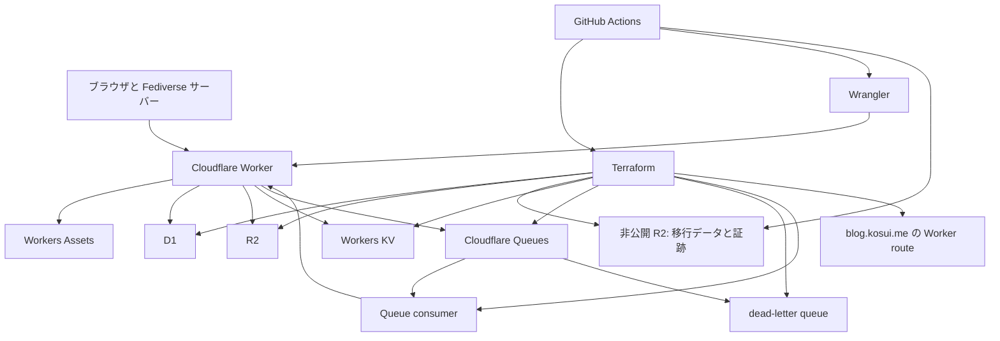

# iori の Cloudflare 完全移行 設計

作成日: 2026-08-16

更新日: 2026-09-05

実行基盤を public repository と GitHub-hosted runner に揃えます。対応する実装差分と準備状況は[再開計画](../plans/2026-09-05-iori-cloudflare-resume.md)に記載します。現行の self-hosted runner と事前配置パスへの依存は、今後の実装で解消します。

## 目的

`apps/iori` の本番稼働を Lightsail、PostgreSQL、ローカルファイルシステムから Cloudflare へ移します。移行完了時には、ユーザー向け HTTP、ActivityPub、非同期配送、アプリケーションデータ、画像、静的アセット、インフラ定義が Cloudflare とリポジトリ内の Terraform だけで運用できます。

移行対象は、現在の `main` にある Worker の土台ではなく、`feat/iori-worker-complete-migration` に実装済みの Worker 実装をレビューして取り込む作業です。この候補には D1 adapter、R2 adapter、Fedify の Cloudflare runtime、Web Push、OGP、データ移行ツール、スモークテストが含まれます。

Cloudflare のリソースは Terraform、Worker の version 更新は Wrangler に分離します。同じ Cloudflare リソースを両方で変更しません。この境界は `paytiv/paytiv` の `infra/cloudflare` と Worker deploy の分離に合わせます。

## 完了条件

次の状態を満たした時点を完全移行の完了とします。

- `https://blog.kosui.me` の全リクエストを Cloudflare Worker が処理します。
- 永続データは D1、アップロードと OGP 画像は R2、Fedify の一時状態は KV、配送は Queues に保存されます。
- D1、R2、KV、Queues、dead-letter queue、Queue consumer、Worker route は Terraform state に登録されています。
- Worker の build、version upload、deploy、rollback、D1 migration、secret 更新は Wrangler を使います。
- AWS の稼働リソース、SSH deploy、Node server 向け production secret を撤去済みです。
- 移行後の監視期間を終え、データ照合、HTTP スモークテスト、ActivityPub 配送、Web Push の確認結果が残っています。

## 採用する構成



Worker は Hono と Fedify を実行し、D1、R2、KV、Queues は `env` binding から受け取ります。`node:fs`、`node:path`、`@hono/node-server`、`pg`、`postgres`、`sharp` を Worker の module graph に含めません。Fedify は Worker の module load 時に singleton を作らず、リクエストごとに binding から構築します。

Worker とデータストアの対応は次のとおりです。

| 用途                        | 採用する Cloudflare サービス | 方針                                                                                                       |
| --------------------------- | ---------------------------- | ---------------------------------------------------------------------------------------------------------- |
| HTTP、ActivityPub、Web Push | Workers                      | `src/worker.ts` を entrypoint にします                                                                     |
| クライアント静的アセット    | Workers Assets               | Worker が API と ActivityPub を先に処理し、残りを asset binding へ渡します                                 |
| アプリケーションデータ      | D1                           | PostgreSQL schema と同じ業務上の制約を SQLite schema と D1 adapter に実装します                            |
| 投稿画像と OGP 画像         | R2                           | 既存 URL を維持し、投稿画像は `post-images/<image-id>/original`、OGP は `og/<article-id>.png` に保存します |
| Fedify の KV 状態           | Workers KV                   | 業務上の正本データは保存せず、再構築できる一時状態だけを扱います                                           |
| Fedify 配送                 | Queues                       | producer binding は Worker version、consumer と retry 設定は Terraform が管理します                        |
| 失敗配送                    | dead-letter queue            | リトライ上限に達したメッセージを退避し、運用手順で再処理または破棄します                                   |

Durable Objects は導入しません。actor 単位の順序保証や強整合の状態遷移が Queues、D1、冪等な store だけで満たせないことを計測で確認した場合だけ、対象 entity ごとに追加します。

## Terraform と Wrangler の管理境界

| 対象                        | 管理者                | 管理内容                                                                                                   |
| --------------------------- | --------------------- | ---------------------------------------------------------------------------------------------------------- |
| D1 database                 | Terraform             | 作成、import、read replication 設定、削除防止                                                              |
| R2 bucket                   | Terraform             | アプリ画像用と非公開の移行データ用の作成、import、保存地域、削除防止。state bucket は別途 bootstrap します |
| Workers KV namespace        | Terraform             | 作成と import                                                                                              |
| Queues と dead-letter queue | Terraform             | 作成、import、保持設定                                                                                     |
| Queue consumer              | Terraform             | Worker 名、batch、retry、dead-letter queue の関連付け                                                      |
| Worker route                | Terraform             | `blog.kosui.me/*` と `iori` Worker の関連付け                                                              |
| Zone                        | Terraform data source | 既存 zone は作成・変更せず、route のために参照します                                                       |
| Worker service と version   | Wrangler              | build、version upload、deploy、rollback                                                                    |
| Worker bindings と Assets   | Wrangler              | D1、R2、KV、Queue producer、Assets、互換性設定                                                             |
| Worker observability        | Wrangler              | Worker version に付随する設定として管理します                                                              |
| Worker secret               | Wrangler              | GitHub Actions の production environment から投入し、Terraform state に値を残しません                      |
| D1 schema migration         | Wrangler              | 適用済み migration を追跡し、Terraform では SQL を実行しません                                             |

この分離により、現在の `wrangler.jsonc` にある `queues.consumers` は削除します。Queue producer binding は Worker version の一部として Wrangler に残しますが、consumer、retry、dead-letter queue は Terraform の `cloudflare_queue_consumer` に移します。

Worker binding が参照する resource ID と名前は Terraform output から生成した一時 Wrangler config に渡します。生成物は Git に追加しません。deploy、D1 migration、R2 import、D1 verification は同じ生成 config を使い、binding の不一致を検出した場合は Cloudflare API を呼ぶ前に失敗します。

## 公開リポジトリの制約

このリポジトリは公開を維持します。Cloudflare account ID、D1 database ID、KV namespace ID、R2 state endpoint、Queue consumer ID、Workers URL の運用用識別子は、Git tracked file、公開する Terraform output、Issue、pull request、GitHub Actions log に含めません。これらは単独では credential ではありませんが、攻撃対象領域と運用情報を不要に広げます。

次の情報は Git、Terraform state、workflow artifact、CI log に保存しません。

- `CLOUDFLARE_API_TOKEN`、R2 state bucket の access key と secret key、VAPID private key、PostgreSQL export credential
- Worker secret の値、production database export、upload export、D1 import SQL
- 一時 Wrangler config、Terraform backend config、`terraform.tfstate`、`.terraform` の provider cache

Worker deploy 用の Wrangler config は template とし、Terraform output を標準出力へ表示せず、runner の一時ディレクトリに生成します。resource ID を含む Terraform output は `sensitive = true` にします。`wrangler.jsonc`、Terraform source、ドキュメントには production resource ID を書きません。ローカル開発は `wrangler dev --local` を使い、production resource を参照しません。

Terraform plan と plan JSON は runner の一時ディレクトリだけに置き、action 種別を検査した後に削除します。plan と output を workflow artifact に upload せず、log には resource ID を含まない検査結果だけを出します。data export script は export directory が repository root またはその配下にある場合に失敗します。各 job は `$RUNNER_TEMP` 配下に mode `0700` の作業領域を作り、ファイルを `0600` で生成して終了時に削除します。`.gitignore` は Terraform state、backend config、一時 Wrangler config、export directory を明示的に無視します。

job 間の受け渡しには、state・アプリ画像用とは別の非公開 R2 bucket を使います。`r2.dev`、custom domain とアプリからの配信を有効にしません。全 application table の NDJSON、各 manifest、署名付き証跡と参照される全 artifact を environment・main SHA・migration run ID ごとに保存し、全転送と照合後に完了 marker を保存します。完了済み bundle を上書きせず、後続 job は同じ bundle を新しい作業領域へ復元します。credential、署名用秘密鍵、Terraform state・plan、生成 config は含めません。GitHub artifact と cache に本番データを保存しません。bundle は cutover 完了から少なくとも 14 日間保持し、照合と削除承認後に cleanup します。[R2 の公開設定](https://developers.cloudflare.com/r2/buckets/public-buckets/)

pull request と production workflow は、Git tracked file と公開する workflow log に secret と production resource ID が含まれないことを検査します。検査に失敗した commit は Cloudflare API を呼ぶ前に停止します。

## Terraform 構成

`apps/iori/infra/cloudflare/` を Terraform root にします。`paytiv/paytiv/infra/cloudflare` と同様に、provider と backend を明示し、production と staging は別の state key で管理します。Terraform workspace は使いません。

```text
apps/iori/infra/cloudflare/
├── backend.tf
├── versions.tf
├── main.tf
├── variables.tf
├── outputs.tf
├── import-existing-resources.mjs
├── README.md
└── example.config.s3.tfbackend
```

- Terraform は `>= 1.10`、Cloudflare provider は `~> 5.22` に固定します。provider 更新は別 PR で行います。
- state は `iori-terraform-state` bucket の S3 互換 remote backend に置きます。state key は `apps/iori/cloudflare/production.tfstate` と `apps/iori/cloudflare/staging.tfstate` に分けます。
- state bucket は Terraform backend 自身では作成できないため、最小権限の管理者が一度だけ作成します。通常の Terraform state には state bucket を含めません。
- 移行用 R2 bucket は通常の Terraform 管理対象とし、非公開設定、削除防止、sensitive output を追加します。import 手順と plan validator の許可リソースも更新します。移行データ用 credential は state 用と分け、検証 job には読み取りに必要な権限を渡します。進行中・失敗中の bundle を一律 TTL で削除しません。
- GitHub Actions の state backend 用 credential は、state bucket だけに Object Read と Object Write を持ちます。Cloudflare API token は対象 account の D1、R2、KV、Queues、Worker route に必要な権限だけを持ちます。
- production の D1 と R2 には `prevent_destroy = true` を設定します。名前変更または置換を含む plan は apply しません。
- D1 は既存 database を import し、production では `read_replication.mode = "disabled"` を初期値にします。read replica の導入は読み取り整合性を別途設計してから行います。
- staging は production と異なる D1、R2、KV、Queues、dead-letter queue、Worker 名を作ります。production data は投入せず、fixture と匿名化データだけを使います。
- `cloudflare_worker`、`cloudflare_worker_version`、`cloudflare_workers_deployment`、Worker binding を Terraform state に入れません。
- `enable_production_worker_route` は既定で `false` にします。`cloudflare_worker_route` はこの値が `true` の切替専用 plan でだけ作成し、D1 と R2 の照合に成功するまで custom domain のトラフィックを Worker へ向けません。

Terraform が管理を始める既存リソースは、最初の apply より前に import します。import 対象は D1 `iori`、R2 `iori-uploads`、Fedify KV namespace、Queue `iori-fedify` です。Worker route は既存の Lightsail 経路を維持するため、初回 apply では作成しません。

Queue consumer は Cloudflare API で現在の設定を確認します。既存 consumer があれば Terraform state に import し、存在しなければ Terraform で作成します。その後に dead-letter queue を関連付けます。provider が consumer の置換を要求する場合は、通常 deploy を使わず、producer binding を外して対象 Queue と consumer だけを保存済み plan で置換する手順を使います。import 後の `terraform plan` は、dead-letter queue、consumer、route 以外の production resource を置換または削除してはなりません。

## CI/CD と運用

CI、Terraform、Worker deploy、データ移行と再検証は GitHub-hosted runner の `ubuntu-latest` を使います。self-hosted runner の登録や repository の private 化を前提にしません。現行 workflow の `migrate-data` と `verify-import` は、この方針への変更が必要です。[GitHub-hosted runner の仕様](https://docs.github.com/en/actions/reference/runners/github-hosted-runners)

本番操作は承認者と `main` の deployment branch 制限を設定した `production` Environment から手動で実行します。Environment 名だけでは保護が成立しないため、設定と実際の拒否動作を確認します。本番 job は対象 SHA と同時実行を制限します。ローカルの `terraform apply`、remote D1 migration、production Worker deploy は通常手順に含めません。[Environment の保護設定](https://docs.github.com/en/actions/how-tos/deploy/configure-and-manage-deployments/manage-environments)

pull request では次を実行します。

1. Worker の typecheck、unit test、Worker bundle dry-run を実行します。
2. `terraform fmt -check -recursive`、`terraform init -backend=false`、`terraform validate` を実行します。
3. fixture の plan JSON で置換と削除の検査を確認します。PR job に本番 Environment、credential、state、データを渡しません。本番の差分確認用 plan も、次の手動実行で作成します。

本番の手動実行は、protected `main` の指定 commit SHA に対して次の順に実行します。

1. remote backend を初期化し、Terraform state と resource import を確認します。
2. 保存済み Terraform plan を作成し、許可された resource 以外の差分、D1 と R2 の置換、Worker version resource の混入を検査します。
3. 検査済みの同じ plan を apply します。
4. Terraform output から一時 Wrangler config を生成し、D1 migration を適用します。
5. Worker version を Wrangler で upload、deploy します。
6. workers.dev URL と custom domain に対してスモークテストを実行します。

Queue consumer を再作成する操作は通常の deploy から分離します。producer binding を含まない Worker version を一時的に deploy し、対象 Queue と consumer だけを置換する保存済み plan を検査・apply してから、producer binding を復元します。これにより Queue 再作成中の delivery を意図せず失いません。consumer を Terraform に移した後は、Wrangler による Worker deploy のたびに Cloudflare API と Terraform state で consumer が維持されていることを確認します。

Worker secret は GitHub Actions の production environment から `wrangler secret put` で更新します。`VAPID_PRIVATE_KEY`、Cloudflare API token、R2 state credential、PostgreSQL export credential、production export data は、Git、Terraform variable、Terraform state、workflow artifact に保存しません。

## データ移行と切替

移行は計画停止を伴う一回限りの cutover です。PostgreSQL と D1 の二重書き込みは行いません。

hosted runner から既存の Lightsail SSH 経路を使い、書き込み停止、drain、export を実行します。接続と信頼する host key は停止前に確認し、移行時間中は旧 deploy によるサービス再起動を抑止します。ツール導入後の空き容量、ピーク使用量と全工程の実行時間を測り、転送・変換を分割して hosted runner の容量と job 時間内に収めます。上限内で完了できるリハーサルが終わるまで、本番の停止を始めません。[Actions の制限](https://docs.github.com/en/actions/reference/limits)

移行 executor は停止から import、署名生成、bundle 保存までを実行する入口として新設します。既存の `cloudflare:migrate:protected` は完了済み証跡の検証です。新しい contract version では artifact の参照を相対パスにし、各 job の root に解決して署名済み bytes を維持します。絶対パス、`..`、symlink による root 外参照と旧 contract を拒否します。検証用公開鍵と digest は Environment から供給し、provider はレビュー済み SHA の repository 内コードを使います。bundle 内の鍵や module を信頼元にしません。

### 事前検証

1. `feat/iori-worker-complete-migration` を main へ取り込む前に、D1 adapter、Worker routes、Fedify inbox と outbox、Web Push、R2、OGP の対象を絞った test を実行します。
2. staging resources に D1 schema migration を適用し、fixture だけで sign-in、timeline、投稿、画像 upload、OGP、ActivityPub、Queue consumer のスモークテストを通します。
3. production Worker を workers.dev URL に deploy し、custom domain route を有効化する前に `/health`、`/healthz`、`/readyz`、静的アセット、認証エラー、WebFinger、VAPID public key、OGP の境界を検証します。
4. 本番と同等規模の匿名化データで PostgreSQL export と upload export、D1 import、R2 import、件数照合、OGP backfill、bundle 保存と別 job での復元を事前リハーサルします。staging に本番データは投入しません。
5. rehearsal では生成 SQL のサイズを確認します。Cloudflare の `wrangler d1 execute --file` が受け付ける 5 GiB を超える場合は、row 境界で複数ファイルに分割して順番に実行します。

### 本番 cutover

1. メンテナンス開始時刻、対象機能、停止理由を事前に通知します。
2. Lightsail で新規書き込みを停止し、Fedify の PostgreSQL queue を drain して深さ 0 を確認してから配送処理を停止します。
3. `cloudflare:export:pg` で全 application table を決定的な順序の NDJSON と manifest に出力し、uploads も export します。
4. `cloudflare:convert:d1` で D1 用の INSERT 文だけを生成します。D1 schema はこの前に `d1:migrate:remote` で適用済みにします。同じ schema を二重に実行しません。
5. 生成した SQL を D1 へ投入し、`cloudflare:import:uploads` で既存 WebP を安定した R2 key に移します。
6. published article の OGP を backfill して R2 に保存します。
7. `cloudflare:verify:import` で全 table 件数・checksum、全 upload object、published article の OGP object を照合し、署名付き証跡と bundle を保存します。一致しない場合は cutover を中止します。
8. Cloudflare KV を空の状態で開始し、workers.dev smoke を確認します。`cutover-route` の `verify-import` は別の新しい runner に bundle を復元して署名と実データを再検証します。PostgreSQL の Fedify KV は移行せず、actor key、投稿、フォロー、重複処理を防ぐ識別子が D1 に存在することを事前リハーサルで確認します。
9. `enable_production_worker_route=true` の保存済み Terraform plan を検査・apply して Worker route を有効にし、`https://blog.kosui.me` で worker smoke test を実行します。
10. sign-in、sign-up、timeline、投稿、reply、削除、upload、画像取得、ActivityPub inbox と outbox、follow、like、repost、relay、Web Push を手動確認します。

## ロールバックと AWS 撤去

custom domain route を有効にする前は、Lightsail service を再開すればロールバックできます。route 有効化後に Cloudflare 側で書き込みが始まると、D1 と R2 の新規データを PostgreSQL とローカルディスクへ自動同期できません。その時点からは、Worker を maintenance mode にして原因を修正する前方復旧を原則とします。

route を Lightsail に戻す必要がある場合は、D1 と R2 に発生した書き込みを一覧化し、PostgreSQL と upload directory に手動反映してから Lightsail を再開します。整合性を確認できない状態で Lightsail を write mode に戻しません。

cutover 完了時刻から 14 日間は Lightsail、PostgreSQL、upload backup、AWS Terraform state を保持します。この期間に daily smoke test、D1 件数照合、R2 object 取得、Fediverse の送受信、Queue の dead-letter queue を監視します。14 日間の記録に未解決の障害がなく、復元テストを終えた後に既存 AWS Terraform の保存済み destroy plan をレビューして、Lightsail instance、database、static IP、AWS 側の deploy 経路を撤去します。

AWS 撤去後は `deploy-iori.yml`、SSH key、Lightsail database password、Node server 用の secret、`apps/iori/terraform` の AWS resource 定義を削除します。ローカル開発の PostgreSQL と Node entrypoint は、Worker と D1 の再現性を保つために必要な場合だけ残し、本番 deploy path には含めません。

## 受入基準

- Terraform import 後の production plan に、D1、R2、KV、Queue、Worker route の意図しない置換と削除がありません。
- Terraform state に Worker version、Worker deployment、Worker secret は存在しません。
- Wrangler config に Queue consumer 定義がなく、Terraform state に Queue consumer と dead-letter queue が存在します。
- Git tracked file、公開する Terraform output、workflow artifact、workflow log に secret、production resource ID、一時 Wrangler config、production export が含まれません。
- public repository の GitHub-hosted runner で停止・移行・保存と別 job での復元・実データ再検証が成功し、事前配置したホストのパスに依存しません。署名、SHA、run ID、完了 marker が不正な入力は route 変更前に拒否します。
- Worker bundle に Node server、PostgreSQL client、filesystem、`sharp` の本番依存が含まれません。
- D1 schema と export manifest の全 table 件数が一致します。
- R2 の投稿画像と OGP 画像が取得できます。
- ActivityPub actor、WebFinger、inbox、outbox、delivery queue が Worker で動作します。
- dead-letter queue の message を検知し、原因と再処理判断を記録できます。
- custom domain に対する smoke test と主要操作の手動確認が成功します。
- AWS 撤去後、`blog.kosui.me` への公開トラフィックとバックグラウンド配送が Lightsail に依存しません。

## 参照

- [Cloudflare Workers の Infrastructure as Code](https://developers.cloudflare.com/workers/platform/infrastructure-as-code/)
- [Cloudflare Terraform Provider の D1 resource](https://registry.terraform.io/providers/cloudflare/cloudflare/latest/docs/resources/d1_database)
- [Cloudflare R2 を使う Terraform remote backend](https://developers.cloudflare.com/terraform/advanced-topics/remote-backend/)
- [Cloudflare D1 の import と export](https://developers.cloudflare.com/d1/best-practices/import-export-data/)
- [Cloudflare Queues の dead-letter queue](https://developers.cloudflare.com/queues/configuration/dead-letter-queues/)
- [Fedify の Cloudflare Workers deployment](https://fedify.dev/manual/deploy)
