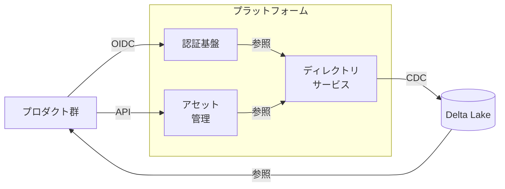
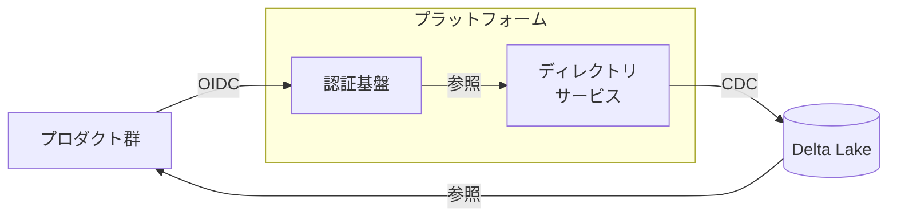
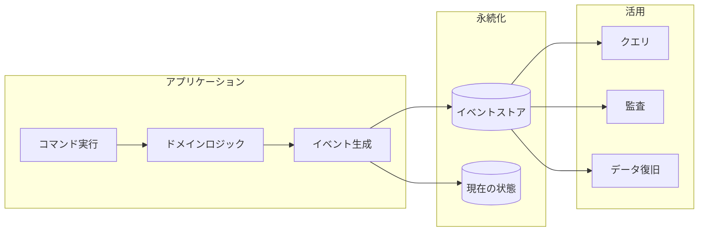
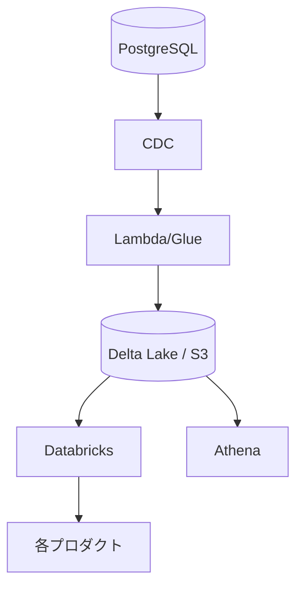
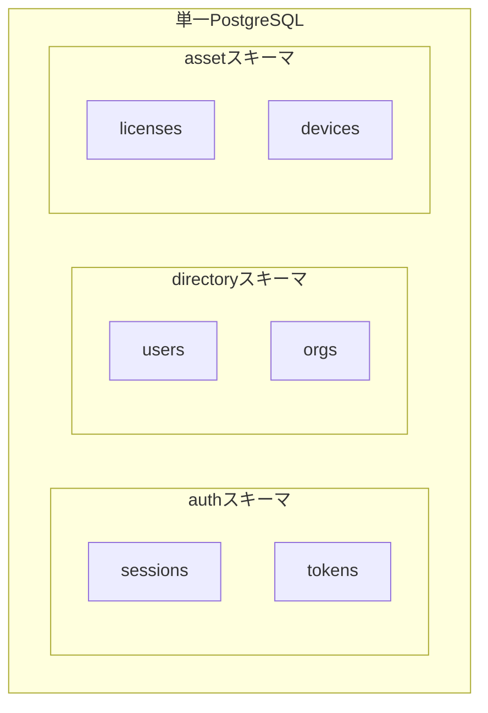
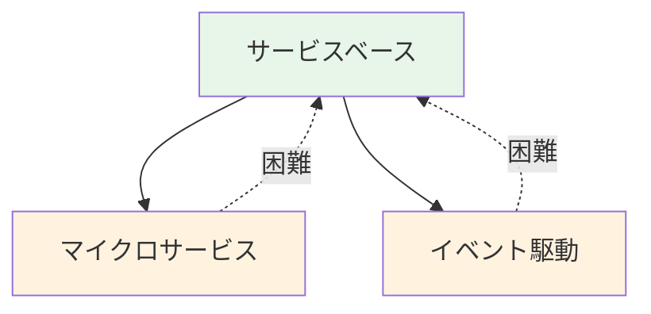
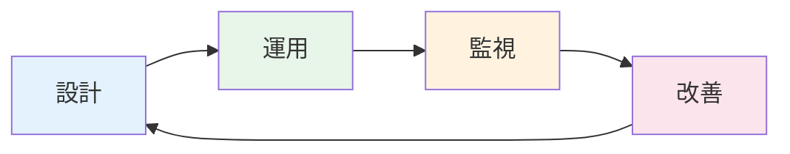

<div class="text-sm opacity-80 mb-16">SRE Kaigi 2026</div>

# 開発チームが<br/>信頼性向上のためにできること

医療SaaS企業を支える共通基盤の挑戦

<div class="mt-16">
  <div class="text-lg">2026年1月23日</div>
  <div class="text-lg">岩佐 幸翠</div>
</div>

<div class="absolute bottom-6 left-14 text-xs opacity-60">©KAKEHASHI inc.</div>


<!--
本日は「開発チームが信頼性向上のためにできること」というテーマでお話しします。
皆さんのチームには、Embedded SREはいらっしゃいますか？
私たちのチームにはいません。でも、医療SaaSという高い信頼性が求められる領域で、開発チーム自身が信頼性に責任を持ち、改善を続けてきました。
本日は、その具体的な方法論と、運用を通じて学んだ教訓をお伝えします。
-->

---

# 自己紹介

<div class="grid grid-cols-2 gap-8">
<div>

## 岩佐 幸翠（いわさ こうすい）

- 株式会社カケハシ
- 認証権限基盤チーム テックリード
- 認証ポータル・ディレクトリサービス・アセットサービスの設計・開発

</div>
<div class="flex items-center justify-center">


</div>
</div>

<!--
簡単に自己紹介させてください。
私は株式会社カケハシで認証権限基盤チームのテックリードをしています。
認証ポータル、ディレクトリサービス、アセットサービスという3つの基盤システムを担当しており、これらは社内の複数プロダクトから利用される共通基盤です。
本日お話しする内容は、この基盤開発で実際に直面した課題と、その解決策です。
-->

---

# 本セッションのゴール

<CardGrid :cols="1">
  <Card
    title="開発チームのリード"
    description="信頼性を自分事として担えるようになる"
  />

  <Card
    title="SREイネイブラー"
    description="イネイブリングのゴールを具体的に示せるようになる"
  />

</CardGrid>


<!--
本セッションでは、2つのペルソナを想定しています。
一つ目は、開発チームのリードの方。SRE専任との協働が難しい状況で、「信頼性は誰かの仕事」ではなく「自分たちの責任」として担いたい方に、具体的な方法論をお伝えします。
二つ目は、SREイネイブラーの方。開発チームへの知見移転を進める際に、「イネイブリングのゴール」として何を目指すべきか、一つの具体例を示せればと思います。
それでは、本日のキーメッセージに入ります。
-->

---
layout: center
class: text-center
---

# 本日のキーメッセージ

<div class="text-3xl font-bold mt-8 p-8 bg-brand-100 rounded-lg max-w-4xl">
開発チームが設計を"自分ごと"として<br>運用し続けることで、<br>Embedded SRE不在でも信頼性は向上できる
</div>

<div class="mt-8 text-xl text-slate-600">
設計パターンを「選ぶ」だけでなく「育てる」ことが重要
</div>

<!--
本日お伝えしたいキーメッセージはこちらです。
「Embedded SREがいないから信頼性向上は難しい」——そう思っていませんか？
私たちの経験では、開発チーム自身が設計を「自分ごと」として運用し続けることで、信頼性は確実に向上できました。
ここで強調したいのは、設計パターンを「選ぶ」だけでなく「育てる」ことの重要性です。
導入して終わりではなく、運用しながら改善し続ける。その具体的な方法を、これからお話しします。
-->

---

# アジェンダ

1. 背景  
   チーム規模の制約と選択
2. 課題  
   トレーサビリティと品質要求の相反
3. 方法論  
   4つのアプローチ
4. 結果と教訓  
   責任を果たすとは
5. まとめ  
   持ち帰りポイント

<!--
本日のアジェンダです。
まず背景として、なぜ私たちが「開発チーム自身で信頼性を担う」という選択をしたのかをお話しします。
次に、直面した課題——トレーサビリティと品質要求の相反について説明します。
そして本日のメインとなる方法論として、4つの具体的なアプローチを紹介します。
最後に結果と教訓、そして皆さんが持ち帰れるポイントをまとめます。
では、背景から始めましょう。
-->

---
layout: section
---

# 1. 背景

なぜ開発チームが信頼性を担う必要があったか

---

# 私たちのチームと課された要求

<div class="grid grid-cols-2 gap-6">

<div>

### チームの役割

認証・権限の共通基盤を開発・運用

- **認証ポータル**: MFA・SSOの提供
- **ディレクトリサービス**: 組織・ユーザー情報の管理
- **アセットサービス**: ライセンス・端末の管理

</div>

<div>

### 課された要求

全プロダクトが依存する**基盤**として

- 3省2ガイドライン準拠
- 高可用性（99.9%+）
- 完全なトレーサビリティ
- セキュアなマルチテナント分離

</div>

</div>

### ミッション

プロダクトチームが顧客への価値提供に集中できる環境を作る

<!--
まず、私たちのチームが何をしているかを説明します。
私たちは認証・権限の共通基盤を開発・運用しています。認証ポータルでMFAやSSOを提供し、ディレクトリサービスで組織やユーザー情報を管理し、アセットサービスでライセンスや端末を管理しています。
ここで重要なのは、全プロダクトがこの基盤に依存しているということです。
つまり、この基盤が止まれば、すべてのプロダクトに影響が出ます。そのため、3省2ガイドライン準拠、99.9%以上の可用性、完全なトレーサビリティ、セキュアなマルチテナント分離など、非常に高い要求が課されています。
私たちのミッションは、各プロダクトチームが3省2ガイドラインを個別に解釈する必要をなくし、本来のビジネスロジックに集中できるようにすることです。
-->

---

# チーム規模の制約と選択

<div class="mt-4">

### 私たちの現実

2025年4月時点では非常に小規模なチーム

</div>

<CardGrid :cols="2">
  <OptionCard
    title="選択肢A: Embedded SREを採用"
  >
    <ul>
      <li>チーム規模に対して十分な協働が難しい</li>
      <li>コンテキスト共有の負担増</li>
      <li>かえって分散を招く恐れ</li>
    </ul>
  </OptionCard>
  <OptionCard
    title="選択肢B: 開発チームが担う ✅"
    status="selected"
    >
    <ul>
      <li>設計・実装・運用を一貫して担う</li>
      <li>深い理解と迅速な改善が可能</li>
      <li>コンテキストが集約される</li>
    </ul>
  </OptionCard>
</CardGrid>

<p class="mt-8 text-xl text-center font-bold">
  開発チーム自身が信頼性向上に主体的に取り組む道を選択
</p>

<!--
では、なぜ私たちは開発チーム自身で信頼性を担うことにしたのか。
2025年4月時点では、非常に小規模なチームでした。
ここで2つの選択肢がありました。
選択肢Aは、Embedded SREを採用すること。しかし、小規模なチームでは十分な協働が難しく、コンテキスト共有の負担が増え、かえって責任の分散を招く恐れがありました。
選択肢Bは、開発チーム自身が設計・実装・運用を一貫して担うこと。コンテキストが集約され、深い理解と迅速な改善が可能になります。
私たちは選択肢Bを選びました。制約をネガティブに捉えるのではなく、「自分たちで責任を持つ」という強みに変えようとしたのです。
-->

---

# 医療SaaSの特殊性

4つ以上のプロダクトが患者情報を扱うカケハシに課せられる様々な品質要求

<CardGrid :cols="2">
  <Card
    title="3省2ガイドライン準拠"
    description="医療情報システムとしての厳格なセキュリティ要件"
  />

  <Card
    title="高可用性とデータ整合性"
    description="24時間365日稼働と一瞬たりとも許されない不整合"
  />

  <Card
    title="頻繁な組織変更対応"
    description="薬局グループの統廃合に伴う柔軟な組織管理"
  />

  <Card
    title="法的要件への対応"
    description="過去のデータ状態を説明できることの重要性"
  />

</CardGrid>

<!--
ここで、医療SaaSならではの特殊性についてお話しします。
カケハシでは4つ以上のプロダクトを開発・運用していますが、すべてが患者情報を扱います。
まず、3省2ガイドラインへの準拠が必須です。これは厚生労働省、経済産業省、総務省が定めた医療情報の安全管理に関するガイドラインで、非常に厳格なセキュリティ要件が求められます。
次に、高可用性とデータ整合性。薬局は24時間365日稼働しており、一瞬たりとも許されない不整合があります。
また、薬局グループの統廃合が頻繁にあり、柔軟な組織管理が必要です。
そして、法的要件として「過去のデータ状態を説明できること」が非常に重要です。「3ヶ月前のこのユーザーの権限は何だったか」を説明できなければなりません。
次に、全体のアーキテクチャを簡単に説明します。
-->

---

# 全体アーキテクチャ

<div class="mt-2">



</div>

<CardGrid cols="3">
  <Card title="認証基盤">
    プロダクト群へ認証・認可を提供
  </Card>
  <Card title="ディレクトリサービス">
    組織・ユーザー情報を一元管理<br/>
    一貫性を重視しデータ基盤で連携
  </Card>
  <Card title="アセット管理">
    ライセンス・端末情報を提供<br/>
    即時性を重視しAPIで連携
  </Card>
</CardGrid>

<!--
こちらが全体像です。
プロダクト群と認証権限基盤の間に、2種類の連携があります。
認証とライセンスは即時性が必要なので直接連携。一方、組織・ユーザー情報はデータ基盤経由です。
なぜ分けているのか。ディレクトリサービスに障害が起きても、プロダクトは最後に同期されたデータで動作を継続できます。この設計意図は後ほど詳しく説明します。
以上が背景です。次に、私たちが直面した課題について説明します。
-->

---
layout: section
---

# 2. 課題

開発効率と信頼性の両立

---

# 品質要求の相反

<CardGrid :cols="2">
  <InsightCard title="システム間の依存関係" variant="negative">
    認証時にユーザーや組織の情報を参照するため<br/>
    認証基盤 → ディレクトリサービスへの依存が発生
  </InsightCard>
  <div>




  </div>
</CardGrid>


<CardGrid :cols="2">
  <InsightCard title="認証基盤に求められること">
    <ul>
      <li>高い可用性（99.9%+）</li>
      <li>低レイテンシー</li>
      <li>障害時の復旧容易性</li>
    </ul>
  </InsightCard>
  <InsightCard title="ディレクトリサービスに求められること">
    <ul>
      <li>強い整合性</li>
      <li>ACIDトランザクション</li>
      <li>完全なトレーサビリティ</li>
    </ul>
  </InsightCard>
</CardGrid>

> [!CAUTION]
> **依存関係があるのに、品質要求が異なる**場合、どう両立する?

<!--
最初の課題は、品質要求の相反です。
認証時にはユーザーや組織の情報を参照する必要があります。つまり、認証基盤はディレクトリサービスに依存しています。
しかし、それぞれに求められる品質要求が異なるのです。
認証基盤には、高可用性——99.9%以上——と低レイテンシー、そして障害時の復旧容易性が求められます。ログインできなければ全プロダクトが使えません。
一方、ディレクトリサービスには、強い整合性、ACIDトランザクション、完全なトレーサビリティが求められます。「このユーザーの所属が間違っていた」では済まされないのです。
依存関係があるのに、品質要求が異なる。これをどう両立するかが、私たちの最初の課題でした。
-->

---

# トレーサビリティの欠如

<CardGrid :cols="1">
  <InsightCard title="既存システムの問題" variant="negative">
    <ul>
      <li>最新データしか保存されていない</li>
      <li>障害発生時の原因調査に時間がかかる</li>
      <li>「3ヶ月前のこのユーザーの所属・権限は?」を説明できない</li>
    </ul>
  </InsightCard>
  <InsightCard title="医療分野での重要性" variant="negative">
    過去のデータ状態を説明できることは、法的にもビジネス的にも極めて重要<br>
    監査対応、コンプライアンス要件への対応が困難
  </InsightCard>
</CardGrid>

<!--
もう一つの課題は、トレーサビリティの欠如です。
従来のシステムでは、最新データしか保存されていませんでした。これが何を意味するか。
障害が発生したとき、「何が起きたのか」を調査するのに2〜3時間かかることもありました。ログを追いかけ、データベースの状態を推測し、関係者にヒアリングして……。
さらに深刻なのは、「3ヶ月前のこのユーザーの所属・権限は？」という問いに答えられないことです。
医療分野では、過去のデータ状態を説明できることは法的にもビジネス的にも極めて重要です。監査対応やコンプライアンス要件への対応が困難な状態でした。
では、これらの課題に対して、私たちがどのようなアプローチを取ったのかを説明します。
-->

---
layout: section
---

# 3. 方法論

4つのアプローチで信頼性を向上

---

# 設計を育てる3つの観点

<MessageBox>

設計パターンは「選んで終わり」ではない
運用しながらチームで育て続ける

</MessageBox>

<CardGrid :cols="3">
  <CardNumbered
    :number="1"
    title="なぜ選んだか"
    description="解決したい課題と
受け入れるトレードオフを
チームで言語化"
  />
  <CardNumbered
    :number="2"
    title="どう運用するか"
    description="導入して終わりではなく
監視・障害対応・改善の
サイクルを回す"
  />
  <CardNumbered
    :number="3"
    title="どう育てるか"
    description="運用で見つかった課題を
設計にフィードバックし
継続的に改善"
  />
</CardGrid>

> [!IMPORTANT]
> **設計を「自分ごと」として運用し続ける** — これが私たちの信頼性向上の核心

<!--
具体的な方法論に入る前に、私たちの基本姿勢をお伝えします。
設計パターンは「選んで終わり」ではありません。「選ぶ」「運用する」「育てる」という3つの観点で継続的に向き合う必要があります。
まず「なぜ選んだか」。解決したい課題と、受け入れるトレードオフをチームで言語化します。これがないと、後から「なぜこうなっているのか」がわからなくなります。
次に「どう運用するか」。導入して終わりではなく、監視・障害対応・改善のサイクルを回し続けます。
そして「どう育てるか」。運用で見つかった課題を設計にフィードバックし、継続的に改善していきます。
この後紹介する4つの方法論も、すべてこの観点に基づいて選択し、運用し、改善し続けてきました。
-->

---

# 育てるための実践: 設計判断の土台

<CardGrid :cols="2">

<div>

### 品質特性の明文化と合意

<InsightCard title="まず「何を守るか」を決める" variant="positive">
  <p>可用性・整合性・セキュリティなど<br>自チームに求められる品質特性を言語化し、<br><span class="highlight">チーム全員で合意する</span></p>
</InsightCard>

</div>

<div>

### ADRによる意思決定の記録

<InsightCard title="「なぜこの設計か」を残す" variant="positive">
  <p>技術選択の背景・トレードオフ・却下案を記録<br><span class="highlight">新メンバーも同じ判断ができるように</span></p>
</InsightCard>

</div>

</CardGrid>

> [!NOTE]
> **判断の「軸」と「記録」があることで、一貫した意思決定が可能になる**

<!--
設計を育てるための具体的な実践を紹介します。まずは設計判断の土台となる2つです。
1つ目は、品質特性の明文化と合意。可用性、整合性、セキュリティなど、自チームに求められる品質特性を言語化し、チーム全員で合意します。これがないと、何を優先すべきか判断がブレます。
2つ目は、ADRによる意思決定の記録。Architecture Decision Recordとして「なぜこの設計を選んだか」を記録しておくことで、新メンバーも同じ判断ができるようになります。
判断の「軸」と「記録」。この2つがあることで、チームとして一貫した意思決定が可能になります。
-->

---

# 育てるための実践: 継続的改善

<CardGrid :cols="2">

<div>

### ポストモーテムから改善プランへ

<InsightCard title="障害を改善機会に変える" variant="positive">
  <p>顧客影響を評価し、<br>実現可能な設計・運用プロセスの改善プランを策定<br><span class="highlight">改善プランをロードマップに反映</span></p>
</InsightCard>

</div>

<div>

### ビジネスロードマップとの接続

<InsightCard title="説明責任を果たす" variant="positive">
  <p>「いつまでにこの問題が未解決だと困る」を<br>ロードマップと照らし合わせて議論<br><span class="highlight">PMへの説明責任を果たす</span></p>
</InsightCard>

</div>

</CardGrid>

> [!NOTE]
> **改善を「振り返り」で終わらせず、ロードマップに反映することで実行が担保される**

<!--
続いて、継続的改善のための2つの実践です。
1つ目は、ポストモーテムから改善プランへの接続です。ポストモーテムを作成すること自体は当たり前ですが、重要なのはその先です。顧客影響を評価し、実現可能なアーキテクチャや設計、運用プロセスの改善プランを策定する。そして、その改善プランをロードマップに反映することで、実行が担保されます。
2つ目は、ビジネスロードマップとの接続。技術負債の解消を単独で議論するのではなく、「いつまでにこの問題が解決していないとこう困る」とロードマップと照らし合わせて議論します。これにより、プロダクトマネージャーへの説明責任を果たすことができます。
改善を振り返りで終わらせず、ロードマップに反映することで、優先度が明確になり、実行が担保されます。
-->

---

# 信頼性を支える4つの設計判断

<CardGrid :cols="2">
  <Card
    title="1. データモデル設計"
    description="状態変更をどう記録し、追跡可能にするか"
  />
  <Card
    title="2. データ連携設計"
    description="システム間をどう連携し、障害を局所化するか"
  />
  <Card
    title="3. アーキテクチャパターン"
    description="整合性と独立性をどう両立するか"
  />
  <Card
    title="4. テナント分離パターン"
    description="テナント分離をどう保証するか"
  />
</CardGrid>

> [!NOTE]
> 各フェーズで**選択肢を理解し、トレードオフを受け入れて選ぶ**

<!--
具体的な方法論に入る前に、信頼性を支えるために必要な設計判断を整理します。
私たちは4つのフェーズで重要な選択を行いました。
1つ目はデータモデル設計。状態変更をどう記録し、追跡可能にするか。
2つ目はデータ連携設計。システム間をどう連携し、障害を局所化するか。
3つ目はアーキテクチャ設計。整合性と独立性をどう両立するか。
4つ目はセキュリティ設計。テナント分離をどう保証するか。
それぞれのフェーズで複数の選択肢があり、トレードオフを理解した上で選択しました。
では、各フェーズでの具体的な選択を見ていきましょう。
-->

---

# 各フェーズでの選択

| フェーズ | 直面した課題 | 我々の選択 |
|:--|:--|:--|
| データモデル設計 | 過去の状態を説明できない | ドメインイベントの永続化 |
| データ連携設計 | 基盤障害が全体に波及 | データ基盤経由をデフォルトに |
| アーキテクチャパターン | 整合性と独立性のトレードオフ | サービスベースアーキテクチャ |
| テナント分離パターン | テナント分離がアプリ実装に依存 | RLSによるDB保証 |

> [!IMPORTANT]
> 選択して終わりではない — **運用しながら育て続ける**ことが重要

<!--
各フェーズでの具体的な選択を一覧でお見せします。
データモデル設計では、「過去の状態を説明できない」という課題に直面し、ドメインイベントの永続化を選びました。
データ連携設計では、「基盤障害が全体に波及する」という課題に対して、データ基盤経由をデフォルトとしました。
アーキテクチャ設計では、「整合性と独立性のトレードオフ」に対して、サービスベースアーキテクチャを選びました。
セキュリティ設計では、「テナント分離がアプリ実装に依存する」という課題に対して、RLSを選びました。
重要なのは、これらは「選んで終わり」ではないということです。
運用しながら課題を見つけ、設計を育て続ける。それが「責任を果たす」ということです。
では、最初のドメインイベントの永続化から詳しく説明していきます。
-->

---
layout: section
---

# 3-1. データモデル設計の選択

ドメインイベントの永続化による<br/>
完全なトレーサビリティを実現

---

# ドメインイベントとは

<div class="mt-4">



</div>


<CardGrid :cols="3">
  <Card
    title="障害調査"
    description="過去の状態を再現し原因を特定"
  />

  <Card
    title="監査対応"
    description="変更履歴を完全に追跡"
  />
  
  <Card
    title="データ復旧"
    description="イベントリプレイで任意の時点に復元"
  />

</CardGrid>

<!--
ドメインイベントとは何かを説明します。
簡単に言えば、「システムで何が起きたか」をすべて記録する設計パターンです。
図を見てください。コマンドが実行されると、ドメインロジックを経てイベントが生成されます。このイベントをイベントストアに永続化し、同時に現在の状態も保存します。
これにより何ができるようになるか。
障害調査では、過去の状態を再現して原因を特定できます。監査対応では、変更履歴を完全に追跡できます。データ復旧では、イベントをリプレイして任意の時点に復元できます。
従来の「最新データのみ保存」から「すべての変更を記録」へのシフトです。
-->

---

# ドメインイベントの設計

<div class="mt-4">

```typescript
const createUser = (name: string): UserCreatedEvent => ({
  aggregate: { id: uuid(), name, status: "active" },  // 変更後の状態
  eventAt:   Date.now(),                              // いつ
  createdBy: "admin",                                 // 誰が
});
```

</div>

<div class="mt-4 p-4 bg-brand-50 rounded-lg">
  <p class="font-bold mb-2">記録する内容</p>
  <p class="text-sm">いつ・誰が・何を・どう変更したか + <span class="font-bold">変更後の状態</span></p>
</div>

> [!TIP]
> **ポイント:** 変更後の状態も一緒に保存することで、リプレイなしでも過去の状態を即座に参照可能

<!--
具体的な設計を見てみましょう。
このコード例では、ユーザーを作成するとUserCreatedEventが生成されます。
イベントには「いつ」「誰が」「何を変更したか」に加えて、「変更後の状態」も含めています。
なぜ変更後の状態も保存するのか。イベントソーシングの純粋な形では、イベントをリプレイして状態を再構築します。しかし、私たちは実用性を重視し、変更後の状態も一緒に保存しています。
これにより、リプレイなしでも過去の任意の時点の状態を即座に参照できます。「3ヶ月前のこのユーザーの所属は？」という問いに、イベントストアを1回クエリするだけで答えられるのです。
-->

---

# イベントストアの設計

## 例: UserCreated イベント

<div class="grid grid-cols-2 gap-4">

<div>

### 通常テーブル

| カラム | 値 |
|--------|-----|
| event | `UserCreated` |
| user_id | `uuid-123` |
| name | `田中` |
| status | `active` |


他チームもトレース可能

</div>

<div>

### 秘匿テーブル

| カラム | 値 |
|--------|-----|
| event_id | `evt-456` |
| password_hash | `$2b$...` |


アクセス制限あり

</div>

</div>

### 設計判断

「ユーザーが作成された」事実は共有、パスワードは分離


<!--
イベントストアの設計では、セキュリティ要件も考慮する必要があります。
UserCreatedイベントを例に説明します。左が通常テーブル、右が秘匿テーブルです。
通常テーブルには、イベント名、ユーザーID、名前、ステータスなど、他チームもトレースできる情報を保存します。
一方、パスワードハッシュなど秘匿性の高い情報は、別テーブルに分離してアクセス制限をかけています。
この設計判断の意図は、「ユーザーが作成された」という事実は共有しつつ、機密情報は適切に保護することです。
トレーサビリティとセキュリティ、両方を満たす設計が必要です。
-->

<style>
table {
  font-size: 14px !important;
}
td, th {
  padding: 8px !important;
}
</style>

---

# ドメインイベント: 運用と改善

<CardGrid :cols="2">

<div>

### 運用で得た気づき

<InsightCard title="既存システムへの導入">
  <p>既存データからイベントを生成する際、依存関係を考慮した順序制御が必要<br><span class="highlight">→ 段階的な導入計画が重要</span></p>
</InsightCard>

<InsightCard title="イベント設計の見直し">
  <p>運用中に「このイベントも必要だった」と気づく<br><span class="highlight">→ スキーマ進化の仕組みを用意</span></p>
</InsightCard>

</div>

<div>

### 継続的な改善

<InsightCard title="障害調査での活用" variant="positive">
  <p>「3ヶ月前のこのユーザーの状態は？」<br>→ イベントを辿って即座に回答可能に</p>
</InsightCard>

<InsightCard title="監査対応の効率化" variant="positive">
  <p>変更履歴の完全な追跡が可能になり、監査対応の工数が大幅に削減</p>
</InsightCard>

</div>

</CardGrid>

> [!IMPORTANT]
> **選んで終わりではない** — 運用しながら設計を育て続ける

<!--
ドメインイベントを「育てる」過程で得た気づきと改善をお話しします。
まず、既存システムへの導入について。既存システムにドメインイベントを導入する際、既存データからイベントを生成する必要がありました。依存関係を考慮した順序制御が必要で、想定以上に工数がかかりました。新規開発なら最初から組み込み、既存システムなら段階的に導入することをお勧めします。
次に、イベント設計の見直し。運用を続けていると、「このイベントも必要だった」と気づくことがあります。そのため、スキーマ進化の仕組みを用意しておくことが重要です。
一方、成果もありました。障害調査では、「3ヶ月前のこのユーザーの状態は？」という問いに即座に回答できるようになりました。監査対応では、変更履歴の完全な追跡が可能になり、工数が大幅に削減されました。
選んで終わりではなく、運用しながら設計を育て続けることが重要です。では次に、データ連携パターンについて説明します。
-->

---
layout: section
---

# 3-2. データ連携パターンの選択

基盤障害をプロダクト全体に波及させない

---

# データ連携パターン比較

<div class="mt-4">

| パターン | 即時性 | 耐障害性 | 一貫性 | ユースケース |
|----------|:------:|:--------:|:------:|-------------|
| **データ基盤経由** | △ | ◎ | ◎ | 定期的に一貫性のあるデータを取得 |
| **API連携** | ◎ | △ | ◎ | リアルタイムでデータ取得が必要 |
| **イベント連携** | ○ | ○ | ○ | 変更をトリガーに非同期処理 |

</div>

<CardGrid :cols="3">
  <OptionCard title="デフォルト: データ基盤" status="selected">
    <p>Delta Lake形式でS3に蓄積<br>99.999999999%の耐久性<br><span class="font-bold">基盤障害が波及しない</span></p>
  </OptionCard>
  <OptionCard title="即時性が必要な場合">
    <p>API連携を選択<br>例: ライセンス確認<br>ただし障害の影響を受ける</p>
  </OptionCard>
  <OptionCard title="非同期処理の場合">
    <p>イベント連携を選択<br>例: ログイン履歴の配信<br>Outboxパターンで信頼性確保</p>
  </OptionCard>
</CardGrid>

<!--
2つ目の方法論、データ連携パターンの選択について説明します。
私たちは「基盤障害がプロダクト全体に波及しない」ことを最優先としました。表を見てください。
データ基盤経由は、即時性は劣りますが、耐障害性と一貫性に優れています。Delta Lake形式でS3に蓄積するため、99.999999999%——イレブンナインの耐久性があります。
API連携は即時性に優れますが、基盤が落ちるとプロダクトも影響を受けます。
イベント連携は、変更をトリガーに非同期処理を行う場合に使います。
私たちの選択は、「デフォルトはデータ基盤経由」です。基盤に障害が発生しても、プロダクトは最後に同期されたデータで動作を継続できます。API連携は、ライセンス確認など本当にリアルタイム性が必要な場合のみ選択します。
-->

---

# Delta Lake + タイムトラベル

<div class="grid grid-cols-2 gap-6 mt-4">

<div>

### アーキテクチャ



</div>

<div>

### タイムトラベル機能

```python
# 現在のデータ
df = spark.read.format("delta")
    .load("s3://bucket/users")

# 3ヶ月前の状態
df_past = spark.read.format("delta") \
    .option("timestampAsOf", "2025-10-01") \
    .load("s3://bucket/users")

# 特定バージョン
df_v100 = spark.read.format("delta") \
    .option("versionAsOf", 100) \
    .load("s3://bucket/users")
```

<div class="mt-2 p-2 bg-brand-50 rounded text-sm">
「3ヶ月前のデータ」に即座にアクセス可能
</div>

</div>

</div>

<!--
データ基盤の具体的なアーキテクチャを説明します。
左側がアーキテクチャです。PostgreSQLからCDCでデータを抽出し、Lambda/Glueで処理してDelta Lake形式でS3に保存します。DatabricksやAthenaから各プロダクトがデータを参照できます。
右側がDelta Lakeのタイムトラベル機能です。これが非常に強力です。
通常のクエリは現在のデータを返しますが、`timestampAsOf`オプションで過去の任意の時点のデータにアクセスできます。「3ヶ月前のユーザーデータ」も、オプションを1つ追加するだけで取得できるのです。
これは先ほどのドメインイベントと組み合わせることで、完全なトレーサビリティを実現します。イベントストアで「何が起きたか」を追跡し、Delta Lakeで「その時点のデータ全体」を参照できます。
-->

---

# データ連携: 運用と改善

<CardGrid :cols="2">

<div>

### 運用で直面した課題

<InsightCard title="「即時性が必要」の誘惑">
  <p>プロダクトチームから「リアルタイムで欲しい」<br>→ 本当に必要か？を一緒に検討<br><span class="highlight">多くは「数分遅延OK」だった</span></p>
</InsightCard>

<InsightCard title="CDC遅延の監視">
  <p>データ基盤への反映遅延をアラート化<br><span class="highlight">異常を早期に検知できる体制を構築</span></p>
</InsightCard>

</div>

<div>

### パターン選択の判断基準を育てる

<InsightCard title="ドキュメント化" variant="positive">
  <p>「なぜこのパターンを選んだか」を記録<br>新メンバーも同じ判断ができるように</p>
</InsightCard>

<InsightCard title="定期的な見直し" variant="positive">
  <p>API連携で障害が波及した事例を振り返り<br><span class="highlight">データ基盤経由に変更した例も</span></p>
</InsightCard>

</div>

</CardGrid>

> [!IMPORTANT]
> **選択基準をチームで共有し、運用しながら磨き続ける**

<!--
データ連携パターンの運用で直面した課題と改善をお話しします。
最も多かったのは「即時性が必要」という誘惑です。プロダクトチームから「リアルタイムでデータが欲しい」という要望がよく来ます。しかし、一緒に要件を検討すると、多くの場合「数分の遅延は許容できる」ことがわかりました。本当にリアルタイムが必要なケースは限られています。
また、CDC遅延の監視も重要です。データ基盤への反映が遅延した場合にアラートを出す仕組みを構築し、異常を早期に検知できるようにしています。
改善として、「なぜこのパターンを選んだか」をドキュメント化しています。ADR——Architecture Decision Recordとして記録し、新メンバーも同じ判断ができるようにしています。
また、定期的な見直しも行っています。実際に、API連携で障害が波及した事例を振り返り、データ基盤経由に変更したケースもあります。
選択基準をチームで共有し、運用しながら磨き続けることが重要です。次に、サービスベースアーキテクチャについて説明します。
-->

---
layout: section
---

# 3-3. サービスベースアーキテクチャ

強い整合性と独立したデプロイの両立

---

# なぜサービスベースアーキテクチャか

<CardGrid :cols="3">
  <OptionCard title="マイクロサービス" status="rejected" statusText="✗ 不採用">
    <p>分散トランザクション</p>
    <p>結果整合性の複雑さ</p>
  </OptionCard>
  <OptionCard title="イベント駆動" status="rejected" statusText="✗ 不採用">
    <p>結果整合性が前提</p>
    <p>状態追跡の難しさ</p>
  </OptionCard>
  <OptionCard title="サービスベース" status="selected" statusText="✓ 採用">
    <p>単一DB共有</p>
    <p>独立したデプロイ</p>
  </OptionCard>
</CardGrid>

<div class="mt-4 p-4 bg-brand-50 rounded-lg">
  <h4 class="font-bold mb-2">採用理由</h4>
  <ul class="text-sm space-y-1">
    <li>組織・薬局・ユーザー・ライセンス・端末は<span class="font-bold">密接に関連</span></li>
    <li>ドメインを横断した<span class="font-bold">強い一貫性</span>が必要</li>
    <li>分散トランザクションの複雑さを<span class="font-bold">回避</span></li>
  </ul>
</div>

<!--
3つ目の方法論、サービスベースアーキテクチャについて説明します。
アーキテクチャの選択では、3つの選択肢を検討しました。
マイクロサービスは独立性が高いですが、分散トランザクションや結果整合性の複雑さが課題です。私たちのドメインでは強い整合性が必要なので、この複雑さは受け入れられませんでした。
イベント駆動アーキテクチャは、サービス間を非同期イベントで連携させるパターンです。スケーラビリティは高いですが、結果整合性が前提となり、状態の追跡やデバッグが難しくなります。
そこで選んだのがサービスベースアーキテクチャです。単一のデータベースを共有しながら、サービスは独立してデプロイできる。
なぜこれを選んだか。組織・薬局・ユーザー・ライセンス・端末は密接に関連しており、これらを横断した強い一貫性が必要だからです。例えば「ユーザーを組織に追加すると同時にライセンスを付与する」といった処理を、単一のトランザクションで実行できます。
-->

---

# サービスベースアーキテクチャの実装

<div class="grid grid-cols-2 gap-6 mt-4">

<div>

### 共有DBと論理的分離



</div>

<div>

### DBユーザーによる権限制御

```sql
-- 認証サービス用
CREATE ROLE auth_service;
GRANT ALL ON auth.* TO auth_service;
GRANT SELECT ON directory.* TO auth_service;

-- ディレクトリサービス用
CREATE ROLE directory_service;
GRANT ALL ON directory.* TO directory_service;
GRANT SELECT ON auth.*, asset.*
  TO directory_service;
```

<div class="mt-4 p-3 bg-slate-100 rounded text-sm">
  <span class="font-bold">原則:</span><br>
  自分のスキーマにのみ書き込み権限<br>
  他のスキーマは読み取りのみ
</div>

</div>

</div>

<!--
具体的な実装を見てみましょう。
左側の図を見てください。単一のPostgreSQLの中に、authスキーマ、directoryスキーマ、assetスキーマが存在します。物理的には1つのデータベースですが、論理的にはスキーマで分離されています。
右側のSQLが重要です。各サービスには専用のDBユーザーを作成し、権限を制御しています。
auth_serviceは、authスキーマにはフルアクセス権限を持ちますが、directoryスキーマは読み取り専用です。directory_serviceは、directoryスキーマにはフルアクセス、他は読み取り専用。
この原則——「自分のスキーマにのみ書き込み権限、他は読み取りのみ」——により、サービス間の境界を技術的に強制しています。間違えて他のスキーマに書き込もうとしても、データベースレベルで拒否されます。
-->

---

# サービス間通信を原則禁止

<div class="mt-4">

<div class="grid grid-cols-2 gap-6">

<div>

### 禁止パターン

```typescript
// ❌ サービス間API呼び出し
const user = await userService.getUser(userId);
const org = await orgService.getOrg(user.orgId);
```

<div class="p-3 bg-red-50 rounded mt-2">
  <p class="text-sm font-bold text-red-600">問題点</p>
  <ul class="text-xs text-slate-600 mt-1">
    <li>DNS解決の遅延（実際に発生）</li>
    <li>障害の連鎖</li>
    <li>レイテンシーの増加</li>
  </ul>
</div>

</div>

<div>

### 推奨パターン

```typescript
// ✓ 共有DBから直接読み取り
const user = await db.query(
  'SELECT * FROM directory.users WHERE id = $1',
  [userId]
);
const org = await db.query(
  'SELECT * FROM directory.orgs WHERE id = $1',
  [user.orgId]
);
```

<div class="p-3 bg-brand-50 rounded mt-2">
  <p class="text-sm font-bold text-brand-600">メリット</p>
  <ul class="text-xs text-slate-600 mt-1">
    <li>ネットワーク障害の影響なし</li>
    <li>トランザクションで整合性保証</li>
    <li>低レイテンシー</li>
  </ul>
</div>

</div>

</div>

</div>

<!--
サービスベースアーキテクチャで重要な原則があります。サービス間のAPI通信を原則禁止としています。
左側が禁止パターンです。userServiceからgetUserを呼び、その結果を使ってorgServiceからgetOrgを呼ぶ。一見よくあるパターンに見えますが、私たちはこれを禁止しています。
なぜか。実際に問題が発生したからです。ある時、DNS解決の遅延が発生し、サービス間の呼び出しがタイムアウト。結果として、ユーザー体験に深刻な影響が出ました。
右側が推奨パターンです。共有DBから直接読み取ります。directoryスキーマのusersテーブル、orgsテーブルに直接クエリを投げる。
これにより、ネットワーク障害の影響を受けず、トランザクションで整合性も保証され、レイテンシーも低い。
「サービスを分けたのにDB直接アクセス？」と思われるかもしれません。しかし、私たちの目的は「独立したデプロイ」であり、「ネットワーク分離」ではないのです。
-->

---

# サービスベース: 運用と改善

<CardGrid :cols="2">

<div>

### 失敗から学んだこと

<InsightCard title="共通ライブラリの肥大化" variant="negative">
  <p>型定義・バリデーションを共通化しすぎた結果、一つの変更が全サービスのリビルドを強制<br><span class="highlight" style="color: var(--slidev-code-error)">→「分散モノリス」の兆候</span></p>
</InsightCard>

<InsightCard title="DNS解決の遅延問題">
  <p>「一時的にAPI連携で」が常態化<br>→ 原則に立ち返り、DB経由に修正</p>
</InsightCard>

</div>

<div>

### 原則を守るための工夫

<InsightCard title="ADR（Architecture Decision Record）" variant="positive">
  <p>「なぜサービス間通信を禁止するか」を記録<br>例外を認める際の判断基準を明文化</p>
</InsightCard>

<InsightCard title="コードレビューでの確認" variant="positive">
  <p>サービス間API呼び出しを見つけたら<br>「本当に必要？DB経由でできない？」と問う</p>
</InsightCard>

</div>

</CardGrid>

> [!IMPORTANT]
> **原則を言語化し、逸脱を検知し、継続的に守り続ける**

<!--
サービスベースアーキテクチャの運用で、私たちも失敗を経験しました。
一つ目は、共通ライブラリの肥大化です。型定義やバリデーションを共通化しすぎた結果、一つの変更が全サービスのリビルドを強制する状態になりました。これは「分散モノリス」の兆候です。共通化は便利ですが、やりすぎると独立性が失われます。
二つ目は、DNS解決の遅延問題。先ほど説明した事例です。「一時的にAPI連携で」というつもりが常態化し、障害を招きました。
これらの失敗から、原則を守るための工夫を導入しました。
ADR——Architecture Decision Recordで「なぜサービス間通信を禁止するか」を記録し、例外を認める際の判断基準を明文化しています。
また、コードレビューでサービス間API呼び出しを見つけたら、「本当に必要？DB経由でできない？」と問うようにしています。
原則を言語化し、逸脱を検知し、継続的に守り続ける。これが「設計を育てる」ということです。では最後に、RLSについて説明します。
-->

---

# サービスベースアーキテクチャの発展可能性

<div class="grid grid-cols-2 gap-6 mt-4">

<div>

### 発展パス



<div class="p-3 bg-red-50 rounded mt-2">
  <p class="text-sm font-bold">分離 → 結合は困難</p>
  <p class="text-xs">一度完全に分離すると、再統合は大規模な作り直しに</p>
</div>

</div>

<div>

### サービスベースからの移行

<InsightCard title="適切な分割面が見えたら" variant="positive">
  <p>ドメイン境界が明確になった段階で<br>マイクロサービス化を検討できる</p>
</InsightCard>

<InsightCard title="非同期処理が必要になったら" variant="positive">
  <p>イベント駆動パターンを<br>部分的に導入できる</p>
</InsightCard>

<InsightCard title="今は「まだ分割しない」選択" variant="positive">
  <p>境界が不明確なうちは<br>強い整合性を維持できる</p>
</InsightCard>

</div>

</div>

<!--
サービスベースアーキテクチャの重要な利点として、将来の発展可能性があります。
左側の図を見てください。サービスベースアーキテクチャからは、マイクロサービスやイベント駆動アーキテクチャへ移行できます。適切なサービスの分割面が見えてきたタイミングで、必要な部分だけを分離できるのです。
しかし、その逆——つまり一度完全に分離してしまったサービスを再び結合することは、非常に困難です。点線で示している通り、これは事実上、大規模な作り直しを意味します。
右側に、サービスベースアーキテクチャからの移行パターンを示しました。
ドメイン境界が明確になった段階で、その部分をマイクロサービスとして切り出せます。
非同期処理が必要になったら、イベント駆動パターンを部分的に導入できます。
そして重要なのは、境界が不明確なうちは「まだ分割しない」という選択ができること。早すぎる分離は、間違った境界での分割を招きます。
サービスベースアーキテクチャは、「今は分からないことを認め、将来の選択肢を残す」設計なのです。
-->

---
layout: section
---

# 3-4. RLSによるマルチテナント分離

DBレベルでの強制的なセキュリティ

---

# RLSの選択理由

<div class="mt-4">

<div class="p-5 bg-red-50 rounded-lg mb-4">
  <h3 class="font-bold text-lg">課題: 顧客Aのデータを顧客Bが絶対に参照できないようにする</h3>
</div>

<CardGrid :cols="3">
  <OptionCard title="アプリレベル" status="rejected" statusText="✗ 実装ミスのリスク">
    <p>WHERE句でフィルタリング</p>
    <p class="mt-2">SQLインジェクション、バグで漏洩</p>
  </OptionCard>
  <OptionCard title="スキーマ分離" status="rejected" statusText="✗ 管理コストが膨大">
    <p>テナントごとにスキーマ</p>
    <p class="mt-2">統廃合時の対応が困難</p>
  </OptionCard>
  <OptionCard title="RLS（行レベルセキュリティ）" status="selected" statusText="✓ 採用">
    <p>DBレベルで強制保護</p>
    <p class="mt-2">バグがあっても漏洩しない</p>
  </OptionCard>
</CardGrid>

</div>

<!--
4つ目の方法論、RLS——Row Level Securityによるマルチテナント分離について説明します。
課題は明確です。顧客Aのデータを、顧客Bが絶対に参照できないようにする。医療データを扱う以上、「絶対に」という言葉に妥協はありません。
3つの選択肢を検討しました。
アプリレベルは、WHERE句でtenant_idをフィルタリングする方法です。しかし、実装ミス、SQLインジェクション、バグで漏洩するリスクがあります。人間はミスをします。
スキーマ分離は、テナントごとにスキーマを作る方法です。強力ですが、管理コストが膨大です。特に薬局グループの統廃合が頻繁にある私たちの環境では、現実的ではありませんでした。
そこで選んだのがRLSです。データベースレベルで強制的にテナントを分離します。アプリにバグがあっても、SQLインジェクションが成功しても、他テナントのデータにはアクセスできません。
-->

---

# RLSの実装

<div class="grid grid-cols-2 gap-6 mt-4">

<div>

### PostgreSQL側

```sql
-- RLSポリシーの定義
CREATE POLICY tenant_isolation ON users
  USING (tenant_id =
    current_setting('app.tenant_id')::uuid);

-- RLSを有効化
ALTER TABLE users
  ENABLE ROW LEVEL SECURITY;

-- 重要: tenant_idにインデックス
CREATE INDEX idx_users_tenant_id
  ON users(tenant_id);
```

</div>

<div>

### アプリケーション側

```typescript
// ミドルウェアでテナントIDを設定
const tenantMiddleware = async (req, res, next) => {
  const tenantId = extractTenantId(req);

  // DB接続時にセッション変数を設定
  await db.query(
    `SET app.tenant_id = $1`,
    [tenantId]
  );

  next();
};

// WHERE句なしで自動フィルタリング
const users = await db.query(
  'SELECT * FROM users'
);
```

</div>

</div>

> [!TIP]
> **メリット:** SQLインジェクションやアプリバグがあっても、他テナントのデータには**絶対に**アクセスできない

<!--
RLSの具体的な実装を説明します。
左側がPostgreSQL側の設定です。まずポリシーを定義します。`current_setting('app.tenant_id')`でセッション変数を参照し、tenant_idが一致する行のみアクセスを許可します。そしてテーブルでRLSを有効化します。
重要なのは、tenant_idにインデックスを作成することです。RLSはすべてのクエリに条件を追加するため、インデックスがないとパフォーマンスが悪化します。
右側がアプリケーション側です。ミドルウェアでリクエストからテナントIDを抽出し、`SET app.tenant_id`でセッション変数に設定します。以降のクエリは、WHERE句なしでも自動的にテナントでフィルタリングされます。
`SELECT * FROM users`と書くだけで、現在のテナントのユーザーのみが返ってくる。開発者がWHERE句を書き忘れても、他テナントのデータは絶対に返ってきません。
-->

---

# RLS: 運用と改善

<CardGrid :cols="2">

<div>

### 慎重なマイグレーション

<InsightCard title="段階的な適用">
  <p>1. まずPERMISSIVEモードで導入<br>2. 全クエリをログに記録して影響確認<br>3. 問題なければENFORCEモードに移行</p>
</InsightCard>

<InsightCard title="誤ったポリシーのリスク" variant="negative">
  <p>データ漏洩 or 正当なアクセスの拒否<br><span class="highlight">→ 十分なテストとモニタリングが必須</span></p>
</InsightCard>

</div>

<div>

### 継続的な監視と改善

<InsightCard title="パフォーマンス監視" variant="positive">
  <p>RLSポリシーがクエリ性能に影響<br>→ tenant_idインデックスの最適化<br>→ スロークエリの定期的な分析</p>
</InsightCard>

<InsightCard title="新規テーブルへの適用" variant="positive">
  <p>テーブル追加時のチェックリスト化<br><span class="highlight">「RLS適用を忘れない」仕組み</span></p>
</InsightCard>

</div>

</CardGrid>

> [!IMPORTANT]
> **セキュリティは一度設定して終わりではない** — 継続的な監視と改善が不可欠

<!--
RLSの運用と改善についてお話しします。
マイグレーションは慎重に行う必要があります。私たちは段階的なアプローチを取りました。
まずPERMISSIVEモードで導入し、全クエリをログに記録して影響を確認。問題なければENFORCEモードに移行。これにより、予期しない影響を事前に検知できます。
誤ったポリシーのリスクも認識しておく必要があります。データ漏洩か、正当なアクセスの拒否か。どちらも深刻な問題です。十分なテストとモニタリングが必須です。
継続的な監視と改善も重要です。RLSポリシーはクエリ性能に影響するため、tenant_idインデックスの最適化やスロークエリの定期的な分析を行っています。
また、新規テーブル追加時の「RLS適用を忘れない」仕組みも重要です。チェックリスト化し、コードレビューで確認するようにしています。
セキュリティは一度設定して終わりではありません。継続的な監視と改善が不可欠です。
-->

---

# 導入の現実

<div class="mt-4">

<div class="grid grid-cols-2 gap-6">

<div>

### 初期導入の工数感

| 手法 | 新規開発 | 既存システム |
|------|:--------:|:------------:|
| ドメインイベント | 2〜3週間 | 1〜2ヶ月 |
| データ連携基盤 | 1〜2週間 | 2〜4週間 |
| サービスベース | 設計時に決定 | 移行困難 |
| RLS | 1〜2週間 | 2〜4週間 |

<div class="mt-2 text-xs text-slate-500">
※ チーム規模・既存コードの複雑さにより変動
</div>

</div>

<div>

### 段階的導入のすすめ

<InsightCard title="Step 1: 最もクリティカルな領域から" variant="positive">
  <p>全システムへの一斉導入は避ける<br>例: まず認証基盤にRLSを導入</p>
</InsightCard>

<InsightCard title="Step 2: 効果を計測しながら拡大" variant="positive">
  <p>障害調査時間・開発速度の変化を追跡<br>数値で効果を示し、チームの納得感を得る</p>
</InsightCard>

</div>

</div>

</div>

<!--
ここで、導入の現実についてお話しします。理想論だけでは現場では使えません。
左側の表は導入工数の目安です。新規開発と既存システムへの後付けでは、工数が大きく異なります。
特にドメインイベントは後付けが難しい。1〜2ヶ月かかることもあります。サービスベースアーキテクチャに至っては、既存システムからの移行は困難です。設計時に決定すべきものです。
ですので、段階的導入をお勧めします。
Step 1として、最もクリティカルな領域から始めてください。全システムへの一斉導入は避ける。例えば、まず認証基盤にRLSを導入する、といった形です。
Step 2として、効果を計測しながら拡大します。障害調査時間がどれだけ短縮されたか、開発速度にどう影響したか。数値で効果を示すことで、チームの納得感を得られます。
では、結果と教訓についてお話しします。
-->

---
layout: section
---

# 4. 結果と教訓

「責任を果たす」とは何か

---

# 成果

<div class="mt-4">

<div class="grid grid-cols-2 gap-6">

<div>

| 項目 | Before | After |
|------|--------|-------|
| 障害時の原因特定 | 2〜3時間 | 30分以内 |
| 過去データの追跡 | 不可能 | 任意の時点で可能 |
| テナント分離 | アプリ依存 | DB保証 |
| 新規プロダクト認証 | 各チームで実装 | 共通基盤を利用 |

</div>

<div>

### プロダクトチームへの貢献

<div class="p-4 bg-slate-100 rounded-lg">
  <p class="text-sm">
    認証・認可基盤の共通化により、<br>
    <span class="font-bold">3省2ガイドラインを各チームが個別に解釈する必要がなくなった</span>
  </p>
</div>

### SREイネイブラーの観点

<div class="p-4 bg-brand-50 rounded-lg mt-4">
  <p class="text-sm">
    開発チームが「自分事として信頼性を担う」状態を実現<br>
    → <span class="font-bold">イネイブリングの目標状態</span>の一つの形
  </p>
</div>

</div>

</div>

</div>

<!--
導入による成果をまとめます。
左側の表を見てください。障害時の原因特定は、2〜3時間かかっていたものが30分以内になりました。イベントストアを参照するだけで、何が起きたかがわかります。
過去データの追跡は、不可能だったものが任意の時点で可能になりました。「3ヶ月前のこのユーザーの権限は？」に即座に回答できます。
テナント分離は、アプリ依存からDB保証になりました。バグがあっても漏洩しません。
新規プロダクトの認証は、各チームで実装していたものが共通基盤を利用する形になりました。
プロダクトチームへの貢献として、3省2ガイドラインを各チームが個別に解釈する必要がなくなりました。本来のビジネスロジックに集中できるようになったのです。
SREイネイブラーの観点からは、これが「開発チームが自分事として信頼性を担う状態」——イネイブリングの目標状態の一つの形だと考えています。
-->

---

# 運用し続けることで見えてきたこと

<CardGrid :cols="2">

<div class="space-y-3">

<InsightCard title="設計の意図がチームに浸透する" variant="positive">
  <p>「なぜこの設計か」を繰り返し説明するうちに、新メンバーも同じ判断ができるようになった</p>
</InsightCard>

<InsightCard title="失敗が設計を強くする" variant="positive">
  <p>障害や問題が起きるたびに、「次は防げる」仕組みを設計に組み込んだ</p>
</InsightCard>

</div>

<div class="space-y-3">

<InsightCard title="「自分たちの責任」という意識" variant="positive">
  <p>SRE専任がいないからこそ、「誰かがやってくれる」ではなく「自分たちで解決する」マインドが育った</p>
</InsightCard>

<InsightCard title="制約がチームの強みになった" variant="positive">
  <p>小さなチームだからこそ、設計・運用・改善を一貫して担え、深い理解と迅速な改善が可能に</p>
</InsightCard>

</div>

</CardGrid>

> [!IMPORTANT]
> 設計パターンは「選ぶ」ものではなく「育てる」もの

<!--
数値的な成果の先に、運用し続けることで見えてきたことがあります。
まず、設計の意図がチームに浸透するということ。「なぜこの設計か」を繰り返し説明するうちに、新メンバーも同じ判断ができるようになりました。設計の「なぜ」を共有することの重要性を実感しています。
次に、失敗が設計を強くするということ。障害や問題が起きるたびに、「次は防げる」仕組みを設計に組み込んできました。失敗を恐れるのではなく、学びに変える姿勢が重要です。
そして、「自分たちの責任」という意識が育ったこと。SRE専任がいないからこそ、「誰かがやってくれる」ではなく「自分たちで解決する」というマインドが自然と育ちました。
最後に、制約がチームの強みになったこと。小さなチームだからこそ、設計・運用・改善を一貫して担え、深い理解と迅速な改善が可能になりました。
設計パターンは「選ぶ」ものではなく「育てる」もの。これが私たちの最も重要な学びです。
-->

---

# 「責任を果たす」サイクル

<div class="mt-4">



</div>

<CardGrid :cols="4">
  <InsightCard title="1. 設計" variant="positive">
    <p>原則に基づいて技術を選択<br><span class="highlight">なぜ選んだかを言語化</span></p>
  </InsightCard>
  <InsightCard title="2. 運用" variant="positive">
    <p>本番環境で動かし続ける<br><span class="highlight">設計の意図を理解</span></p>
  </InsightCard>
  <InsightCard title="3. 監視" variant="positive">
    <p>メトリクス・ログ・アラート<br><span class="highlight">状態を把握</span></p>
  </InsightCard>
  <InsightCard title="4. 改善" variant="positive">
    <p>問題を発見したら修正<br><span class="highlight">設計にフィードバック</span></p>
  </InsightCard>
</CardGrid>

> [!NOTE]
> このサイクルを開発チームが自走できる状態 = 責任を果たしている状態

<!--
では、「責任を果たす」とは具体的に何を意味するのか。
私たちはこのサイクルを回し続けることだと考えています。
設計フェーズでは、原則に基づいて技術を選択し、「なぜ選んだか」を言語化します。
運用フェーズでは、本番環境で動かし続け、設計の意図を理解しながら日々の業務を行います。
監視フェーズでは、メトリクス・ログ・アラートでシステムの状態を把握します。
改善フェーズでは、問題を発見したら修正し、その学びを設計にフィードバックします。
そしてまた設計に戻る。このサイクルを開発チームが自走できる状態。これが私たちの考える「責任を果たしている状態」です。
SRE専任がいなくても、このサイクルを回し続けることはできます。それでは、まとめに入ります。
-->

---
layout: section
---

# 5. まとめ

持ち帰りポイント

---

# 開発チームができること

<CardGrid :cols="2">
  <SummaryCard :number="1" title="ドメインイベント" description="「何が起きたか」を完全に記録" subdescription="障害調査・監査対応・データ復旧" />
  <SummaryCard :number="2" title="データ連携パターン" description="基盤障害を波及させない設計" subdescription="デフォルトはデータ基盤経由" variant="secondary" />
  <SummaryCard :number="3" title="サービスベースアーキテクチャ" description="強い整合性と独立デプロイの両立" subdescription="サービス間通信を原則禁止" variant="secondary" />
  <SummaryCard :number="4" title="RLS" description="DBレベルでテナントを強制分離" subdescription="バグがあっても漏洩しない" variant="secondary" />
</CardGrid>

> [!NOTE]
> **段階的に導入可能** — クリティカルな領域から優先的に適用

<!--
まとめとして、開発チームができることを振り返ります。
1つ目、ドメインイベントの永続化。「何が起きたか」を完全に記録することで、障害調査・監査対応・データ復旧が可能になります。
2つ目、データ連携パターンの選択。デフォルトはデータ基盤経由とし、基盤障害を波及させない設計を目指します。
3つ目、サービスベースアーキテクチャ。サービス間通信を原則禁止とし、強い整合性と独立デプロイを両立します。
4つ目、RLS。DBレベルでテナントを強制分離し、バグがあっても漏洩しない状態を作ります。
これらは段階的に導入可能です。すべてを一度に導入する必要はありません。クリティカルな領域から優先的に適用してください。
-->

---

# 自チームへの適用チェックリスト

<CardGrid :cols="2">

<div class="space-y-3">

<ChecklistCard title="トレーサビリティが必要か？">
  <p>「過去の状態を説明できない」問題があるなら<br>→ <span class="highlight">ドメインイベント</span>を検討</p>
</ChecklistCard>

<ChecklistCard title="基盤障害が全体に波及するか？">
  <p>一つの障害で複数サービスが止まるなら<br>→ <span class="highlight">データ連携パターン</span>を見直す</p>
</ChecklistCard>

</div>

<div class="space-y-3">

<ChecklistCard title="整合性と独立性のどちらが重要か？">
  <p>密結合なドメインで強い整合性が必要なら<br>→ <span class="highlight">サービスベースアーキテクチャ</span>を検討</p>
</ChecklistCard>

<ChecklistCard title="マルチテナントでデータ漏洩が致命的か？">
  <p>テナント分離をアプリに依存しているなら<br>→ <span class="highlight">RLS</span>を検討</p>
</ChecklistCard>

</div>

</CardGrid>

> [!WARNING]
> **すべてを導入する必要はない** — 自チームの課題に合った手法を選択

<!--
皆さんが自チームに適用する際のチェックリストです。医療SaaSに限らず、どのチームでも使えます。
トレーサビリティが必要か？「過去の状態を説明できない」という問題があるなら、ドメインイベントを検討してください。
基盤障害が全体に波及するか？一つの障害で複数サービスが止まるなら、データ連携パターンを見直してください。
整合性と独立性のどちらが重要か？密結合なドメインで強い整合性が必要なら、サービスベースアーキテクチャを検討してください。
マルチテナントでデータ漏洩が致命的か？テナント分離をアプリに依存しているなら、RLSを検討してください。
重要なのは、すべてを導入する必要はないということです。自チームの課題に合った手法を選択してください。
-->

---

# イネイブリングの観点から

<div class="mt-1 space-y-2">

<InsightCard title="設計を選ぶだけでなく、責任を果たす" variant="positive">
  <p>技術選定で終わりではなく、<span class="highlight">運用・監視・改善を継続</span>する</p>
</InsightCard>

<InsightCard title="「誰かの仕事」ではなく「自分たちの責任」" variant="positive">
  <p>開発チームが<span class="highlight">自分事として信頼性を担う</span>状態を目指す</p>
</InsightCard>

<InsightCard title="SREイネイブラーへ" variant="positive">
  <p>本セッションの事例は、<span class="highlight">イネイブリングのゴールの一つの形</span></p>
</InsightCard>

</div>

<!--
SREイネイブラーの方に向けて、イネイブリングの観点からまとめます。
まず、「設計を選ぶだけでなく、責任を果たす」。技術選定で終わりではなく、運用・監視・改善を継続することが重要です。開発チームにこの姿勢を伝えていただければと思います。
次に、「誰かの仕事」ではなく「自分たちの責任」。SRE専任がいなくても、開発チームが自分事として信頼性を担う状態は実現できます。
本セッションの事例は、イネイブリングのゴールの一つの形だと考えています。開発チームへの知見移転を進める際の参考になれば幸いです。
開発チームのリードの方も、SRE専任がいないことを言い訳にせず、自分たちで責任を持つマインドを持っていただければと思います。
-->

---
layout: center
class: text-center
---

# 本日のキーメッセージ（再掲）

<div class="mt-8 space-y-6 max-w-3xl mx-auto">

<div class="text-2xl p-6 bg-brand-100 rounded-lg">
設計パターンは「導入して終わり」ではない
</div>

<div class="text-2xl">
チームで意図を共有し、継続的に改善する
</div>

<div class="text-2xl font-bold text-brand-500">
それが開発チームによる信頼性向上の本質
</div>

</div>

<!--
最後に、本日のキーメッセージを再掲します。
設計パターンは「導入して終わり」ではありません。
ドメインイベント、データ連携、サービスベースアーキテクチャ、RLS——どれも選んだだけでは効果を発揮しません。
チームで意図を共有し、運用しながら課題を発見し、設計にフィードバックして継続的に改善する。それが開発チームによる信頼性向上の本質です。
Embedded SREがいなくても、開発チーム自身が「自分ごと」として設計を育て続けることで、信頼性は確実に向上できます。
本日の内容が、皆さんのチームでの信頼性向上の参考になれば幸いです。ご清聴ありがとうございました。
-->
