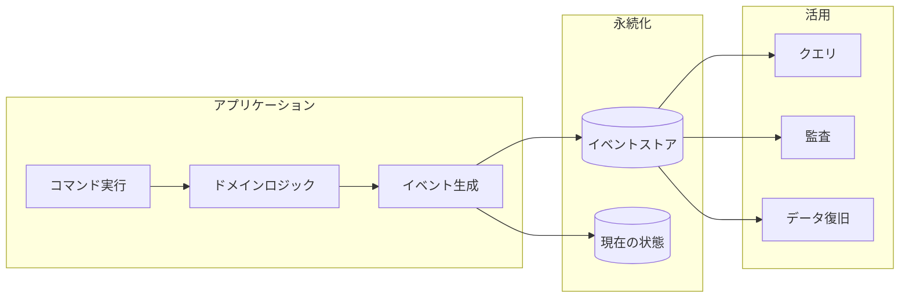
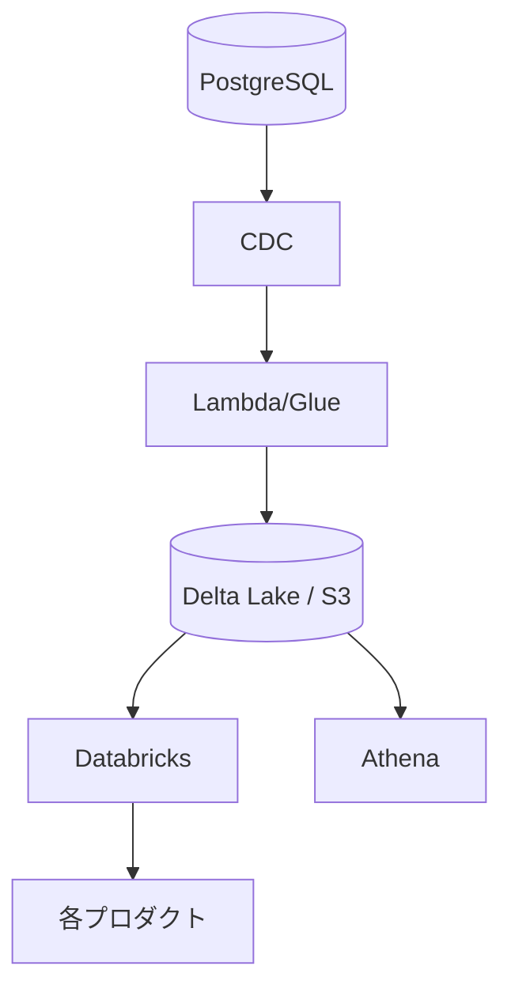
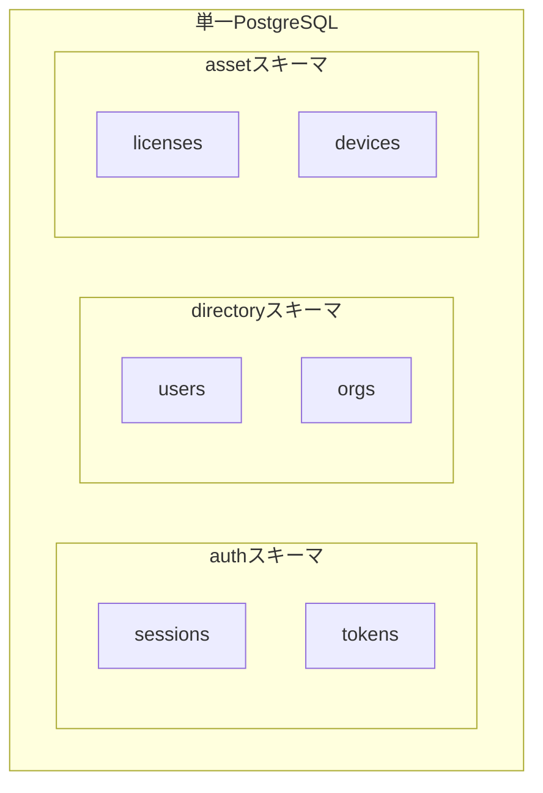
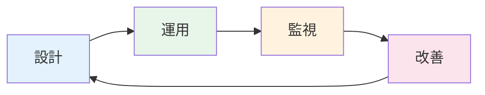

# 開発チームが信頼性向上のためにできること

<div class="text-2xl text-slate-500 mt-4">
医療SaaS企業を支える共通基盤の挑戦
</div>

<div class="absolute bottom-10">
  <p class="text-slate-500">SRE Kaigi 2026</p>
  <p class="font-bold">kosui (岩佐 幸翠) / 株式会社カケハシ</p>
</div>

<!--
本日は「開発チームが信頼性向上のためにできること」というテーマでお話しします。
私たちカケハシで、SRE専任を持たない開発チームがどのように信頼性向上に取り組んできたかを共有します。
-->

---

# 自己紹介

<div class="grid grid-cols-2 gap-8">
<div>

## 岩佐 幸翠（いわさ こうすい）

- 株式会社カケハシ
- 認証権限基盤チーム テックリード
- 認証ポータル・ディレクトリサービス・アセットサービスの設計・開発

</div>
<div class="flex items-center justify-center">


</div>
</div>

<!--
私はカケハシで認証権限基盤チームに所属しています。
認証ポータル、ディレクトリサービス、アセットサービスという3つの基盤システムの設計・開発を担当しています。
-->

---

# 本セッションの対象者

- 開発チームのリード  
  
- SREイネイブラー  
  開発チームが「自分事として信頼性を担う」状態を目指しているが、<br>
  Enablingのゴールを具体的に示したい方

<!--
本セッションは主に2つのペルソナを想定しています。
一つ目は、SRE専任との協働が難しい状況で、開発チーム自身が信頼性に責任を持とうとしているリーダーの方。
二つ目は、開発チームへの知見移転を進めているSREイネイブラーの方です。
-->

---
layout: center
class: text-center
---

# 本日のキーメッセージ

<div class="text-3xl font-bold mt-8 p-8 bg-brand-100 rounded-lg max-w-4xl">
開発チームが設計を"自分ごと"として<br>運用し続けることで、<br>SRE専任なしでも信頼性は向上できる
</div>

<div class="mt-8 text-xl text-slate-600">
設計パターンを「選ぶ」だけでなく「育てる」ことが重要
</div>

<!--
本日お伝えしたいキーメッセージはこちらです。
SRE専任チームがいない環境でも、開発チーム自身が設計を理解し、運用し続けることで信頼性は向上できます。
重要なのは、設計パターンを選んで終わりではなく、チームで育て続けることです。
-->

---

# アジェンダ

<div class="grid grid-cols-5 gap-4 mt-8">

<div class="text-center p-4 bg-slate-50 rounded-lg">
  <div class="text-3xl mb-2">1</div>
  <div class="font-bold">背景</div>
  <div class="text-xs text-slate-500 mt-1">チーム規模の制約と<br>選択</div>
</div>

<div class="text-center p-4 bg-slate-50 rounded-lg">
  <div class="text-3xl mb-2">2</div>
  <div class="font-bold">課題</div>
  <div class="text-xs text-slate-500 mt-1">トレーサビリティと<br>品質要求の相反</div>
</div>

<div class="text-center p-4 bg-slate-50 rounded-lg">
  <div class="text-3xl mb-2">3</div>
  <div class="font-bold">方法論</div>
  <div class="text-xs text-slate-500 mt-1">4つのアプローチ</div>
</div>

<div class="text-center p-4 bg-slate-50 rounded-lg">
  <div class="text-3xl mb-2">4</div>
  <div class="font-bold">結果と教訓</div>
  <div class="text-xs text-slate-500 mt-1">責任を果たすとは</div>
</div>

<div class="text-center p-4 bg-slate-50 rounded-lg">
  <div class="text-3xl mb-2">5</div>
  <div class="font-bold">まとめ</div>
  <div class="text-xs text-slate-500 mt-1">持ち帰りポイント</div>
</div>

</div>

<!--
本日のアジェンダです。
まず背景として、なぜ開発チームが信頼性を担う必要があったのかをお話しします。
次に課題、そして具体的な方法論、最後に結果と教訓をお伝えします。
-->

---
layout: section
---

# 1. 背景

なぜ開発チームが信頼性を担う必要があったか

---

# チーム規模の制約

<div class="mt-6">

<div class="p-6 bg-slate-100 rounded-lg mb-6">
  <h3 class="font-bold text-lg mb-2">私たちの現実</h3>
  <p class="text-slate-700">
    2025年4月時点では<span class="font-bold">正社員1名、業務委託2-3名</span>という小規模なチーム
  </p>
  <p class="text-slate-600 mt-2">
    SRE専任メンバーの増員はかえって<span class="font-bold">共有すべきコンテキストの分散</span>を招く恐れがあった
  </p>
</div>

<div class="grid grid-cols-2 gap-6">

<div class="p-4 bg-red-50 rounded-lg">
  <h4 class="font-bold mb-2">選択肢A: SRE専任を採用</h4>
  <ul class="text-sm text-slate-600 space-y-1">
    <li>チーム規模に対して十分な協働が難しい</li>
    <li>コンテキスト共有の負担増</li>
    <li>「SREの仕事」になりがち</li>
  </ul>
</div>

<div class="p-4 bg-brand-50 rounded-lg border-2 border-brand-400">
  <h4 class="font-bold mb-2">選択肢B: 開発チームが担う</h4>
  <ul class="text-sm text-slate-600 space-y-1">
    <li>設計・実装・運用を一貫して担う</li>
    <li>深い理解と迅速な改善が可能</li>
    <li class="font-bold">「自分たちの責任」として捉える</li>
  </ul>
</div>

</div>

</div>

<!--
私たちのチームでは、2025年4月時点では正社員1名、業務委託2-3名という小規模なチームでした。
この規模でSRE専任を採用しても、十分な協働が難しく、かえってコンテキストの分散を招く恐れがありました。
そこで、開発チーム自身が信頼性向上に主体的に取り組む道を選びました。
-->

---

# 医療SaaSの特殊性

<div class="mt-4">

<div class="p-4 bg-red-50 rounded-lg mb-4">
  <p class="font-bold">薬局向けSaaSを4つ以上開発・運用 / すべてが患者情報を扱う医療情報システム</p>
</div>

<div class="grid grid-cols-2 gap-6">

<div>

### 厳格なセキュリティ要件

<div class="p-4 bg-slate-50 rounded-lg mt-2">
  <h4 class="font-bold text-sm mb-2">3省2ガイドライン</h4>
  <ul class="text-sm text-slate-600 space-y-1">
    <li>多要素認証の必須化（2026年度〜）</li>
    <li>監査ログの長期保存</li>
    <li>厳格なパスワードポリシー</li>
  </ul>
</div>

<div class="p-4 bg-slate-50 rounded-lg mt-2">
  <h4 class="font-bold text-sm mb-2">堅牢なテナント分離</h4>
  <p class="text-sm text-slate-600">
    薬局グループの統廃合が頻繁に発生するため、<br>
    テナント分離と柔軟な組織管理の両立が必要
  </p>
</div>

</div>

<div>

### 高い可用性要件

<div class="p-4 bg-slate-50 rounded-lg mt-2">
  <h4 class="font-bold text-sm mb-2">24時間365日稼働</h4>
  <p class="text-sm text-slate-600">
    医療機関は常に稼働しており、<br>
    システム停止は患者の安全に直結
  </p>
</div>

<div class="p-4 bg-slate-50 rounded-lg mt-2">
  <h4 class="font-bold text-sm mb-2">データ整合性</h4>
  <p class="text-sm text-slate-600">
    患者情報・処方データは<br>
    一瞬たりとも不整合が許されない
  </p>
</div>

</div>

</div>

</div>

<!--
カケハシでは薬局向けSaaSを4つ以上開発・運用しています。
すべてのプロダクトが医療情報システムとして患者情報を扱うため、3省2ガイドラインへの準拠が必須です。
また、医療機関は24時間365日稼働しており、高い可用性とデータ整合性が求められます。
-->

---

# 全体アーキテクチャ

<div class="mt-2">

| 基盤 | 提供する価値 | 利用者 | 連携方式 |
|------|-------------|--------|----------|
| **認証ポータル** | セキュアな認証（MFA, SSO） | プロダクトチーム | OIDC連携 |
| **ディレクトリサービス** | 組織・薬局・ユーザー情報 | プロダクトチーム | データ基盤経由 |
| **アセットサービス** | ライセンス・端末の管理 | プロダクトチーム | API連携 |

</div>

<div class="mt-4 p-4 bg-brand-50 rounded-lg">
  <p class="text-sm">
    <span class="font-bold">共通の目的:</span> プロダクトチームが3省2ガイドラインを個別に解釈する必要をなくし、<br>
    本来のビジネスロジックに集中できるようにする
  </p>
</div>

<!--
私たちが担当する3つの基盤システムです。
認証ポータルはセキュアな認証をOIDCで提供し、ディレクトリサービスは組織・薬局・ユーザー情報をデータ基盤経由で提供します。
アセットサービスはライセンスと端末の管理をAPIで提供しています。
共通の目的は、プロダクトチームが3省2ガイドラインを個別に解釈する必要をなくし、本来のビジネスロジックに集中できるようにすることです。
-->

---
layout: section
---

# 2. 課題

開発効率と信頼性の両立

---

# 品質要求の相反

<div class="mt-4">

<div class="p-4 bg-red-50 rounded-lg mb-4">
  <p class="font-bold">要件: 認証時にユーザー・組織情報を参照する必要がある</p>
  <p class="text-sm text-slate-600 mt-1">認証基盤 → ディレクトリサービスへの依存が発生</p>
</div>

<div class="grid grid-cols-2 gap-6">

<div class="p-4 bg-brand-50 rounded-lg">
  <h4 class="font-bold mb-2">認証基盤に求められること</h4>
  <ul class="text-sm space-y-1">
    <li>高い可用性（99.9%+）</li>
    <li>低レイテンシー</li>
    <li>障害時の復旧容易性</li>
  </ul>
</div>

<div class="p-4 bg-slate-50 rounded-lg">
  <h4 class="font-bold mb-2">ディレクトリサービスに求められること</h4>
  <ul class="text-sm space-y-1">
    <li>強い整合性</li>
    <li>ACIDトランザクション</li>
    <li>完全なトレーサビリティ</li>
  </ul>
</div>

</div>

> [!CAUTION]
> **依存関係があるのに、品質要求が異なる** — これをどう両立するか？

</div>

<!--
認証時にユーザー・組織情報を参照する必要があるため、認証基盤はディレクトリサービスに依存します。
しかし、認証基盤には高可用性と低レイテンシーが求められる一方、ディレクトリサービスには強い整合性とトレーサビリティが求められます。
依存関係があるのに品質要求が異なる。これをどう両立するかが課題でした。
-->

---

# トレーサビリティの欠如

<div class="mt-6">

<div class="p-6 bg-red-50 rounded-lg mb-6">
  <h3 class="font-bold text-lg mb-3">既存システムの問題</h3>
  <ul class="space-y-2">
    <li class="flex items-start gap-2">
      <span class="text-red-500 mt-1">✗</span>
      <span>最新データしか保存されていない</span>
    </li>
    <li class="flex items-start gap-2">
      <span class="text-red-500 mt-1">✗</span>
      <span>障害発生時の原因調査に時間がかかる</span>
    </li>
    <li class="flex items-start gap-2">
      <span class="text-red-500 mt-1">✗</span>
      <span><span class="font-bold">「3ヶ月前のこのユーザーの所属・権限は?」</span>を説明できない</span>
    </li>
  </ul>
</div>

<div class="p-4 bg-slate-100 rounded-lg">
  <h4 class="font-bold mb-2">医療分野での重要性</h4>
  <p class="text-slate-600">
    過去のデータ状態を説明できることは、<span class="font-bold">法的にもビジネス的にも極めて重要</span><br>
    監査対応、コンプライアンス要件への対応が困難
  </p>
</div>

</div>

<!--
最大の課題は、トレーサビリティの欠如でした。
従来のシステムでは最新データしか保存されていなかったため、障害発生時の原因調査に時間がかかりました。
また、過去のデータ状態を説明できないことは、医療という特殊なドメインでは大きな問題でした。
-->

---
layout: section
---

# 3. 方法論

4つのアプローチで信頼性を向上

---

# 設計を育てる3つの観点

<div class="mt-6">

<div class="p-4 bg-brand-50 rounded-lg mb-4">
  <p class="text-xl font-bold text-center">
    設計パターンは「選んで終わり」ではない<br>
    運用しながらチームで育て続ける
  </p>
</div>

<div class="grid grid-cols-3 gap-4">

<div class="p-4 bg-slate-50 rounded-lg text-center">
  <div class="text-3xl mb-2">1</div>
  <h4 class="font-bold text-sm">なぜ選ぶか</h4>
  <p class="text-xs text-slate-600 mt-1">
    解決したい課題と<br>
    受け入れるトレードオフを<br>
    チームで言語化
  </p>
</div>

<div class="p-4 bg-slate-50 rounded-lg text-center">
  <div class="text-3xl mb-2">2</div>
  <h4 class="font-bold text-sm">どう運用するか</h4>
  <p class="text-xs text-slate-600 mt-1">
    導入して終わりではなく<br>
    監視・障害対応・改善の<br>
    サイクルを回す
  </p>
</div>

<div class="p-4 bg-slate-50 rounded-lg text-center">
  <div class="text-3xl mb-2">3</div>
  <h4 class="font-bold text-sm">どう育てるか</h4>
  <p class="text-xs text-slate-600 mt-1">
    運用で見つかった課題を<br>
    設計にフィードバックし<br>
    継続的に改善
  </p>
</div>

</div>

> [!IMPORTANT]
> **設計を「自分ごと」として運用し続ける** — これが私たちの信頼性向上の核心

</div>

<!--
設計を育てる3つの観点についてお話しします。
設計パターンは選んで終わりではなく、「なぜ選ぶか」「どう運用するか」「どう育てるか」の観点で継続的に向き合います。
この後紹介する4つの方法論も、この観点に基づいて選択し、運用し、改善し続けてきました。
-->

---

# 方法論の全体像

<div class="grid grid-cols-2 gap-4 mt-6">

<div class="p-5 bg-brand-50 rounded-lg">
  <div class="flex items-center gap-3 mb-2">
    <div class="w-8 h-8 bg-brand-500 text-white rounded-full flex items-center justify-center font-bold">1</div>
    <h3 class="font-bold">ドメインイベントの永続化</h3>
  </div>
  <p class="text-sm text-slate-600">「いつ・誰が・何を変更したか」を完全に記録</p>
</div>

<div class="p-5 bg-brand-50 rounded-lg">
  <div class="flex items-center gap-3 mb-2">
    <div class="w-8 h-8 bg-brand-400 text-white rounded-full flex items-center justify-center font-bold">2</div>
    <h3 class="font-bold">データ連携パターンの選択</h3>
  </div>
  <p class="text-sm text-slate-600">基盤障害がプロダクト全体に波及しない設計</p>
</div>

<div class="p-5 bg-brand-50 rounded-lg">
  <div class="flex items-center gap-3 mb-2">
    <div class="w-8 h-8 bg-brand-400 text-white rounded-full flex items-center justify-center font-bold">3</div>
    <h3 class="font-bold">サービスベースアーキテクチャ</h3>
  </div>
  <p class="text-sm text-slate-600">強い整合性を保ちながら独立したデプロイを実現</p>
</div>

<div class="p-5 bg-brand-50 rounded-lg">
  <div class="flex items-center gap-3 mb-2">
    <div class="w-8 h-8 bg-brand-400 text-white rounded-full flex items-center justify-center font-bold">4</div>
    <h3 class="font-bold">RLSによるマルチテナント分離</h3>
  </div>
  <p class="text-sm text-slate-600">DBレベルで強制的にテナントを分離</p>
</div>

</div>

> [!NOTE]
> **特別なツールや大規模な組織変更は不要**  
> 既存の技術を組み合わせて段階的に導入可能

<!--
方法論は4つあります。
ドメインイベントの永続化、データ連携パターンの選択、サービスベースアーキテクチャ、RLSによるマルチテナント分離です。
これらは特別なツールを必要とせず、既存の技術を組み合わせて段階的に導入できます。
-->

---
layout: section
---

# 3-1. ドメインイベントの永続化

完全なトレーサビリティを実現

---

# ドメインイベントとは

<div class="mt-4">



</div>

<div class="grid grid-cols-3 gap-4 mt-4">

<div class="p-3 bg-brand-50 rounded-lg text-center">
  <h4 class="font-bold text-sm">障害調査</h4>
  <p class="text-xs text-slate-600">過去の状態を再現して<br>原因を特定</p>
</div>

<div class="p-3 bg-brand-50 rounded-lg text-center">
  <h4 class="font-bold text-sm">監査対応</h4>
  <p class="text-xs text-slate-600">変更履歴を<br>完全に追跡</p>
</div>

<div class="p-3 bg-brand-50 rounded-lg text-center">
  <h4 class="font-bold text-sm">データ復旧</h4>
  <p class="text-xs text-slate-600">イベントリプレイで<br>任意の時点に復元</p>
</div>

</div>

<!--
ドメインイベントとは、「システムで何が起きたか」をすべて記録する設計パターンです。
イベントを永続化することで、障害調査、監査対応、データ復旧など様々な場面で活用できます。
-->

---

# ドメインイベントの設計

<div class="mt-4">

```typescript
const createUser = (name: string): UserCreatedEvent => ({
  aggregate: { id: uuid(), name, status: "active" },  // 変更後の状態
  eventAt:   Date.now(),                              // いつ
  createdBy: "admin",                                 // 誰が
});
```

</div>

<div class="mt-4 p-4 bg-brand-50 rounded-lg">
  <p class="font-bold mb-2">記録する内容</p>
  <p class="text-sm">いつ・誰が・何を・どう変更したか + <span class="font-bold">変更後の状態</span></p>
</div>

> [!TIP]
> **ポイント:** 変更後の状態も一緒に保存することで、リプレイなしでも過去の状態を即座に参照可能

<!--
ドメインイベントの設計です。
Userに対してCreateを実行すると、UserCreatedEventが生成されます。
変更後の状態も一緒に保存することで、過去の状態を即座に参照できます。
-->

---

# イベントストアの設計

<div class="mt-2 text-sm mb-2">例: UserCreated イベント</div>

<div class="grid grid-cols-2 gap-4">

<div>

### 通常テーブル

| カラム | 値 |
|--------|-----|
| event | `UserCreated` |
| user_id | `uuid-123` |
| name | `田中` |
| status | `active` |

<p class="text-xs text-slate-500">→ 他チームもトレース可能</p>

</div>

<div>

### 秘匿テーブル

| カラム | 値 |
|--------|-----|
| event_id | `evt-456` |
| password_hash | `$2b$...` |

<p class="text-xs text-slate-500">→ アクセス制限あり</p>

</div>

</div>

<div class="mt-4 p-3 bg-brand-50 rounded-lg text-center">
  <p class="text-sm"><span class="font-bold">設計判断:</span> 「ユーザーが作成された」事実は共有、パスワードは分離</p>
</div>

<!--
イベントストアの設計では、セキュリティ要件も考慮しています。
パスワードハッシュなど秘匿性の高い情報は別テーブルに分離し、
イベント発生の事実は通常テーブルに記録することで、トレーサビリティを確保しています。
-->

---

# ドメインイベント: 運用と改善

<div class="grid grid-cols-2 gap-6 mt-4">

<div>

### 運用で得た気づき

<div class="p-4 bg-slate-100 rounded-lg mt-2">
  <h4 class="font-bold text-sm mb-2">後付け導入の難しさ</h4>
  <p class="text-xs text-slate-600">
    既存データからイベントを生成する際、<br>
    依存関係を考慮した順序制御が必要だった<br>
    <span class="font-bold">→ 新規開発時に組み込むべき</span>
  </p>
</div>

<div class="p-4 bg-slate-100 rounded-lg mt-2">
  <h4 class="font-bold text-sm mb-2">イベント設計の見直し</h4>
  <p class="text-xs text-slate-600">
    運用中に「このイベントも必要だった」と気づく<br>
    <span class="font-bold">→ スキーマ進化の仕組みを用意</span>
  </p>
</div>

</div>

<div>

### 継続的な改善

<div class="p-4 bg-brand-50 rounded-lg mt-2">
  <h4 class="font-bold text-sm mb-2">障害調査での活用</h4>
  <p class="text-xs text-slate-600">
    「3ヶ月前のこのユーザーの状態は？」<br>
    → イベントを辿って即座に回答可能に
  </p>
</div>

<div class="p-4 bg-brand-50 rounded-lg mt-2">
  <h4 class="font-bold text-sm mb-2">監査対応の効率化</h4>
  <p class="text-xs text-slate-600">
    変更履歴の完全な追跡が可能になり、<br>
    監査対応の工数が大幅に削減
  </p>
</div>

</div>

</div>

> [!IMPORTANT]
> **選んで終わりではない** — 運用しながら設計を育て続ける

<!--
ドメインイベントの運用で得た気づきと改善です。
後付け導入は難しく、新規開発時に組み込むべきだと学びました。
また、運用中に必要なイベントが見つかることもあり、スキーマ進化の仕組みが重要です。
-->

---
layout: section
---

# 3-2. データ連携パターンの選択

基盤障害をプロダクト全体に波及させない

---

# データ連携パターン比較

<div class="mt-4">

| パターン | 即時性 | 耐障害性 | 一貫性 | ユースケース |
|----------|:------:|:--------:|:------:|-------------|
| **データ基盤経由** | △ | ◎ | ◎ | 定期的に一貫性のあるデータを取得 |
| **API連携** | ◎ | △ | ◎ | リアルタイムでデータ取得が必要 |
| **イベント連携** | ○ | ○ | ○ | 変更をトリガーに非同期処理 |

</div>

<div class="grid grid-cols-3 gap-4 mt-4">

<div class="p-4 bg-brand-50 rounded-lg border-2 border-brand-400">
  <h4 class="font-bold text-sm mb-2">デフォルト: データ基盤</h4>
  <p class="text-xs text-slate-600">
    Delta Lake形式でS3に蓄積<br>
    99.999999999%の耐久性<br>
    <span class="font-bold">基盤障害が波及しない</span>
  </p>
</div>

<div class="p-4 bg-slate-50 rounded-lg">
  <h4 class="font-bold text-sm mb-2">即時性が必要な場合</h4>
  <p class="text-xs text-slate-600">
    API連携を選択<br>
    例: ライセンス確認<br>
    ただし障害の影響を受ける
  </p>
</div>

<div class="p-4 bg-slate-50 rounded-lg">
  <h4 class="font-bold text-sm mb-2">非同期処理の場合</h4>
  <p class="text-xs text-slate-600">
    イベント連携を選択<br>
    例: ログイン履歴の配信<br>
    Outboxパターンで信頼性確保
  </p>
</div>

</div>

<!--
データ連携パターンは3つあります。
私たちは「基盤障害がプロダクト全体に波及しない」ことを最優先とし、
データ基盤経由をデフォルトの連携方法としています。
即時性が必要な場合のみAPI連携を選択します。
-->

---

# Delta Lake + タイムトラベル

<div class="grid grid-cols-2 gap-6 mt-4">

<div>

### アーキテクチャ



</div>

<div>

### タイムトラベル機能

```python
# 現在のデータ
df = spark.read.format("delta")
    .load("s3://bucket/users")

# 3ヶ月前の状態
df_past = spark.read.format("delta") \
    .option("timestampAsOf", "2025-10-01") \
    .load("s3://bucket/users")

# 特定バージョン
df_v100 = spark.read.format("delta") \
    .option("versionAsOf", 100) \
    .load("s3://bucket/users")
```

<div class="mt-2 p-2 bg-brand-50 rounded text-sm">
「3ヶ月前のデータ」に即座にアクセス可能
</div>

</div>

</div>

<!--
データ基盤にはDelta Lakeを採用しています。
S3に保存することで高い耐久性を確保し、タイムトラベル機能により過去の任意の時点のデータにアクセスできます。
これにより「3ヶ月前のデータがどうだったか」という問い合わせに即座に回答できます。
-->

---

# データ連携: 運用と改善

<div class="grid grid-cols-2 gap-6 mt-4">

<div>

### 運用で直面した課題

<div class="p-4 bg-slate-100 rounded-lg mt-2">
  <h4 class="font-bold text-sm mb-2">「即時性が必要」の誘惑</h4>
  <p class="text-xs text-slate-600">
    プロダクトチームから「リアルタイムで欲しい」<br>
    → 本当に必要か？を一緒に検討<br>
    <span class="font-bold">多くは「数分遅延OK」だった</span>
  </p>
</div>

<div class="p-4 bg-slate-100 rounded-lg mt-2">
  <h4 class="font-bold text-sm mb-2">CDC遅延の監視</h4>
  <p class="text-xs text-slate-600">
    データ基盤への反映遅延をアラート化<br>
    <span class="font-bold">異常を早期に検知できる体制を構築</span>
  </p>
</div>

</div>

<div>

### パターン選択の判断基準を育てる

<div class="p-4 bg-brand-50 rounded-lg mt-2">
  <h4 class="font-bold text-sm mb-2">ドキュメント化</h4>
  <p class="text-xs text-slate-600">
    「なぜこのパターンを選んだか」を記録<br>
    新メンバーも同じ判断ができるように
  </p>
</div>

<div class="p-4 bg-brand-50 rounded-lg mt-2">
  <h4 class="font-bold text-sm mb-2">定期的な見直し</h4>
  <p class="text-xs text-slate-600">
    API連携で障害が波及した事例を振り返り<br>
    <span class="font-bold">データ基盤経由に変更した例も</span>
  </p>
</div>

</div>

</div>

> [!IMPORTANT]
> **選択基準をチームで共有し、運用しながら磨き続ける**

<!--
データ連携パターンの運用と改善です。
「即時性が必要」という要求に対して、本当に必要かを一緒に検討することが重要でした。
また、選択基準をドキュメント化し、定期的に見直すことで、チーム全体の判断力を高めています。
-->

---
layout: section
---

# 3-3. サービスベースアーキテクチャ

強い整合性と独立したデプロイの両立

---

# なぜサービスベースアーキテクチャか

<div class="mt-4">

<div class="grid grid-cols-3 gap-4">

<div class="p-4 bg-red-50 rounded-lg">
  <h4 class="font-bold mb-2">モノリス</h4>
  <p class="text-xs text-slate-600">変更容易性が低い</p>
  <p class="text-xs text-slate-600">一度に全体を更新</p>
  <p class="text-xs text-red-600 mt-2">✗ 不採用</p>
</div>

<div class="p-4 bg-red-50 rounded-lg">
  <h4 class="font-bold mb-2">マイクロサービス</h4>
  <p class="text-xs text-slate-600">分散トランザクション</p>
  <p class="text-xs text-slate-600">結果整合性の複雑さ</p>
  <p class="text-xs text-red-600 mt-2">✗ 不採用</p>
</div>

<div class="p-4 bg-brand-50 rounded-lg border-2 border-brand-400">
  <h4 class="font-bold mb-2">サービスベース</h4>
  <p class="text-xs text-slate-600">単一DB共有</p>
  <p class="text-xs text-slate-600">独立したデプロイ</p>
  <p class="text-xs text-brand-600 mt-2 font-bold">✓ 採用</p>
</div>

</div>

</div>

<div class="mt-4 p-4 bg-brand-50 rounded-lg">
  <h4 class="font-bold mb-2">採用理由</h4>
  <ul class="text-sm space-y-1">
    <li>組織・薬局・ユーザー・ライセンス・端末は<span class="font-bold">密接に関連</span></li>
    <li>ドメインを横断した<span class="font-bold">強い一貫性</span>が必要</li>
    <li>分散トランザクションの複雑さを<span class="font-bold">回避</span></li>
  </ul>
</div>

<!--
アーキテクチャの選択では、モノリス、マイクロサービス、サービスベースの3つを検討しました。
私たちが担当するシステムは密接に関連するドメインで構成されており、強い一貫性が必要です。
そのため、分散トランザクションの複雑さを避けられるサービスベースアーキテクチャを選択しました。
-->

---

# サービスベースアーキテクチャの実装

<div class="grid grid-cols-2 gap-6 mt-4">

<div>

### 共有DBと論理的分離



</div>

<div>

### DBユーザーによる権限制御

```sql
-- 認証サービス用
CREATE ROLE auth_service;
GRANT ALL ON auth.* TO auth_service;
GRANT SELECT ON directory.* TO auth_service;

-- ディレクトリサービス用
CREATE ROLE directory_service;
GRANT ALL ON directory.* TO directory_service;
GRANT SELECT ON auth.*, asset.*
  TO directory_service;
```

<div class="mt-4 p-3 bg-slate-100 rounded text-sm">
  <span class="font-bold">原則:</span><br>
  自分のスキーマにのみ書き込み権限<br>
  他のスキーマは読み取りのみ
</div>

</div>

</div>

<!--
サービスベースアーキテクチャでは、単一のPostgreSQLを共有しながら、スキーマで論理的に分離しています。
各サービスは自分のスキーマにのみ書き込み権限を持ち、他のスキーマは読み取り専用でアクセスします。
これにより、ACIDトランザクションを活用しながら、サービスの独立性を保っています。
-->

---

# サービス間通信を原則禁止

<div class="mt-4">

<div class="grid grid-cols-2 gap-6">

<div>

### 禁止パターン

```typescript
// ❌ サービス間API呼び出し
const user = await userService.getUser(userId);
const org = await orgService.getOrg(user.orgId);
```

<div class="p-3 bg-red-50 rounded mt-2">
  <p class="text-sm font-bold text-red-600">問題点</p>
  <ul class="text-xs text-slate-600 mt-1">
    <li>DNS解決の遅延（実際に発生）</li>
    <li>障害の連鎖</li>
    <li>レイテンシーの増加</li>
  </ul>
</div>

</div>

<div>

### 推奨パターン

```typescript
// ✓ 共有DBから直接読み取り
const user = await db.query(
  'SELECT * FROM directory.users WHERE id = $1',
  [userId]
);
const org = await db.query(
  'SELECT * FROM directory.orgs WHERE id = $1',
  [user.orgId]
);
```

<div class="p-3 bg-brand-50 rounded mt-2">
  <p class="text-sm font-bold text-brand-600">メリット</p>
  <ul class="text-xs text-slate-600 mt-1">
    <li>ネットワーク障害の影響なし</li>
    <li>トランザクションで整合性保証</li>
    <li>低レイテンシー</li>
  </ul>
</div>

</div>

</div>

</div>

<!--
サービス間通信は原則禁止としています。
実際に、ライセンス管理から端末管理へのAPI呼び出しでDNS解決の遅延が発生し、ユーザー体験に悪影響を及ぼした事例がありました。
サービス間の連携は共有DBから直接読み取ることで、ネットワーク障害の影響を受けずに実現しています。
-->

---

# サービスベース: 運用と改善

<div class="grid grid-cols-2 gap-6 mt-4">

<div>

### 失敗から学んだこと

<div class="p-4 bg-red-50 rounded-lg mt-2">
  <h4 class="font-bold text-sm mb-2">共通ライブラリの肥大化</h4>
  <p class="text-xs text-slate-600">
    型定義・バリデーションを共通化しすぎた結果、<br>
    一つの変更が全サービスのリビルドを強制<br>
    <span class="font-bold text-red-600">→「分散モノリス」の兆候</span>
  </p>
</div>

<div class="p-4 bg-slate-100 rounded-lg mt-2">
  <h4 class="font-bold text-sm mb-2">DNS解決の遅延問題</h4>
  <p class="text-xs text-slate-600">
    「一時的にAPI連携で」が常態化<br>
    → 原則に立ち返り、DB経由に修正
  </p>
</div>

</div>

<div>

### 原則を守るための工夫

<div class="p-4 bg-brand-50 rounded-lg mt-2">
  <h4 class="font-bold text-sm mb-2">ADR（Architecture Decision Record）</h4>
  <p class="text-xs text-slate-600">
    「なぜサービス間通信を禁止するか」を記録<br>
    例外を認める際の判断基準を明文化
  </p>
</div>

<div class="p-4 bg-brand-50 rounded-lg mt-2">
  <h4 class="font-bold text-sm mb-2">コードレビューでの確認</h4>
  <p class="text-xs text-slate-600">
    サービス間API呼び出しを見つけたら<br>
    「本当に必要？DB経由でできない？」と問う
  </p>
</div>

</div>

</div>

> [!IMPORTANT]
> **原則を言語化し、逸脱を検知し、継続的に守り続ける**

<!--
サービスベースアーキテクチャの運用と改善です。
共通ライブラリの肥大化や、例外的なAPI連携の常態化など、失敗もありました。
ADRで原則を記録し、コードレビューで逸脱を検知することで、原則を守り続けています。
-->

---
layout: section
---

# 3-4. RLSによるマルチテナント分離

DBレベルでの強制的なセキュリティ

---

# RLSの選択理由

<div class="mt-4">

<div class="p-5 bg-red-50 rounded-lg mb-4">
  <h3 class="font-bold text-lg">課題: 顧客Aのデータを顧客Bが絶対に参照できないようにする</h3>
</div>

<div class="grid grid-cols-3 gap-4">

<div class="p-4 bg-slate-50 rounded-lg">
  <h4 class="font-bold text-sm mb-2">アプリレベル</h4>
  <p class="text-xs text-slate-600">WHERE句でフィルタリング</p>
  <div class="mt-2 p-2 bg-red-100 rounded">
    <p class="text-xs text-red-600 font-bold">✗ 実装ミスのリスク</p>
    <p class="text-xs text-slate-600">SQLインジェクション、バグで漏洩</p>
  </div>
</div>

<div class="p-4 bg-slate-50 rounded-lg">
  <h4 class="font-bold text-sm mb-2">スキーマ分離</h4>
  <p class="text-xs text-slate-600">テナントごとにスキーマ</p>
  <div class="mt-2 p-2 bg-red-100 rounded">
    <p class="text-xs text-red-600 font-bold">✗ 管理コストが膨大</p>
    <p class="text-xs text-slate-600">統廃合時の対応が困難</p>
  </div>
</div>

<div class="p-4 bg-brand-50 rounded-lg border-2 border-brand-400">
  <h4 class="font-bold text-sm mb-2">RLS（行レベルセキュリティ）</h4>
  <p class="text-xs text-slate-600">DBレベルで強制保護</p>
  <div class="mt-2 p-2 bg-brand-100 rounded">
    <p class="text-xs text-brand-600 font-bold">✓ 採用</p>
    <p class="text-xs text-slate-600">バグがあっても漏洩しない</p>
  </div>
</div>

</div>

</div>

<!--
テナント分離の方法として、アプリレベル、スキーマ分離、RLSの3つを検討しました。
アプリレベルは実装ミスのリスクがあり、スキーマ分離は管理コストが高すぎます。
RLSはDBレベルで強制的に保護できるため、最も安全です。
-->

---

# RLSの実装

<div class="grid grid-cols-2 gap-6 mt-4">

<div>

### PostgreSQL側

```sql
-- RLSポリシーの定義
CREATE POLICY tenant_isolation ON users
  USING (tenant_id =
    current_setting('app.tenant_id')::uuid);

-- RLSを有効化
ALTER TABLE users
  ENABLE ROW LEVEL SECURITY;

-- 重要: tenant_idにインデックス
CREATE INDEX idx_users_tenant_id
  ON users(tenant_id);
```

</div>

<div>

### アプリケーション側

```typescript
// ミドルウェアでテナントIDを設定
const tenantMiddleware = async (req, res, next) => {
  const tenantId = extractTenantId(req);

  // DB接続時にセッション変数を設定
  await db.query(
    `SET app.tenant_id = $1`,
    [tenantId]
  );

  next();
};

// WHERE句なしで自動フィルタリング
const users = await db.query(
  'SELECT * FROM users'
);
```

</div>

</div>

> [!TIP]
> **メリット:** SQLインジェクションやアプリバグがあっても、他テナントのデータには**絶対に**アクセスできない

<!--
RLSの実装では、PostgreSQLのセッション変数を使ってテナントIDを設定します。
ポリシーがその値を参照し、tenant_idが一致する行のみアクセスを許可します。
これにより、WHERE句を書かなくても自動的にテナントでフィルタリングされます。
-->

---

# RLS: 運用と改善

<div class="grid grid-cols-2 gap-6 mt-4">

<div>

### 慎重なマイグレーション

<div class="p-4 bg-slate-100 rounded-lg mt-2">
  <h4 class="font-bold text-sm mb-2">段階的な適用</h4>
  <p class="text-xs text-slate-600">
    1. まずPERMISSIVEモードで導入<br>
    2. 全クエリをログに記録して影響確認<br>
    3. 問題なければENFORCEモードに移行
  </p>
</div>

<div class="p-4 bg-red-50 rounded-lg mt-2">
  <h4 class="font-bold text-sm mb-2">誤ったポリシーのリスク</h4>
  <p class="text-xs text-slate-600">
    データ漏洩 or 正当なアクセスの拒否<br>
    <span class="font-bold">→ 十分なテストとモニタリングが必須</span>
  </p>
</div>

</div>

<div>

### 継続的な監視と改善

<div class="p-4 bg-brand-50 rounded-lg mt-2">
  <h4 class="font-bold text-sm mb-2">パフォーマンス監視</h4>
  <p class="text-xs text-slate-600">
    RLSポリシーがクエリ性能に影響<br>
    → tenant_idインデックスの最適化<br>
    → スロークエリの定期的な分析
  </p>
</div>

<div class="p-4 bg-brand-50 rounded-lg mt-2">
  <h4 class="font-bold text-sm mb-2">新規テーブルへの適用</h4>
  <p class="text-xs text-slate-600">
    テーブル追加時のチェックリスト化<br>
    <span class="font-bold">「RLS適用を忘れない」仕組み</span>
  </p>
</div>

</div>

</div>

> [!IMPORTANT]
> **セキュリティは一度設定して終わりではない** — 継続的な監視と改善が不可欠

<!--
RLSの運用と改善です。
マイグレーションは段階的に行い、まずPERMISSIVEモードで影響を確認することが重要です。
また、パフォーマンス監視や新規テーブルへの適用漏れ防止など、継続的な運用が必要です。
-->

---

# 導入の現実

<div class="mt-4">

<div class="grid grid-cols-2 gap-6">

<div>

### 初期導入の工数感

| 手法 | 新規開発 | 既存システム |
|------|:--------:|:------------:|
| ドメインイベント | 2〜3週間 | 1〜2ヶ月 |
| データ連携基盤 | 1〜2週間 | 2〜4週間 |
| サービスベース | 設計時に決定 | 移行困難 |
| RLS | 1〜2週間 | 2〜4週間 |

<div class="mt-2 text-xs text-slate-500">
※ チーム規模・既存コードの複雑さにより変動
</div>

</div>

<div>

### 段階的導入のすすめ

<div class="p-4 bg-brand-50 rounded-lg">
  <h4 class="font-bold text-sm mb-2">Step 1: 最もクリティカルな領域から</h4>
  <p class="text-xs text-slate-600">
    全システムへの一斉導入は避ける<br>
    例: まず認証基盤にRLSを導入
  </p>
</div>

<div class="p-4 bg-brand-50 rounded-lg mt-2">
  <h4 class="font-bold text-sm mb-2">Step 2: 効果を計測しながら拡大</h4>
  <p class="text-xs text-slate-600">
    障害調査時間・開発速度の変化を追跡<br>
    数値で効果を示し、チームの納得感を得る
  </p>
</div>

</div>

</div>

</div>

<!--
導入工数の目安です。新規開発と既存システムへの後付けでは、工数が大きく異なります。
特にドメインイベントは後付けが難しいため、新規開発時に検討することをお勧めします。
段階的に導入し、効果を計測しながら拡大していくアプローチが現実的です。
-->

---
layout: section
---

# 4. 結果と教訓

「責任を果たす」とは何か

---

# 成果

<div class="mt-4">

<div class="grid grid-cols-2 gap-6">

<div>

| 項目 | Before | After |
|------|--------|-------|
| 障害時の原因特定 | 2〜3時間 | 30分以内 |
| 過去データの追跡 | 不可能 | 任意の時点で可能 |
| テナント分離 | アプリ依存 | DB保証 |
| 新規プロダクト認証 | 各チームで実装 | 共通基盤を利用 |

</div>

<div>

### プロダクトチームへの貢献

<div class="p-4 bg-slate-100 rounded-lg">
  <p class="text-sm">
    認証・認可基盤の共通化により、<br>
    <span class="font-bold">3省2ガイドラインを各チームが個別に解釈する必要がなくなった</span>
  </p>
</div>

### SREイネイブラーの観点

<div class="p-4 bg-brand-50 rounded-lg mt-4">
  <p class="text-sm">
    開発チームが「自分事として信頼性を担う」状態を実現<br>
    → <span class="font-bold">Enablingの目標状態</span>の一つの形
  </p>
</div>

</div>

</div>

</div>

<!--
導入による成果です。
障害発生時の原因特定時間が大幅に短縮され、過去データの追跡も任意の時点で可能になりました。
また、認証・認可基盤の共通化により、プロダクトチームがガイドラインを個別に解釈する負担を軽減できました。
-->

---

# 運用し続けることで見えてきたこと

<div class="mt-4">

<div class="grid grid-cols-2 gap-6">

<div class="space-y-3">

<div class="p-4 bg-brand-50 rounded-lg">
  <h4 class="font-bold mb-2">設計の意図がチームに浸透する</h4>
  <p class="text-sm text-slate-600">
    「なぜこの設計か」を繰り返し説明するうちに、<br>
    新メンバーも同じ判断ができるようになった
  </p>
</div>

<div class="p-4 bg-brand-50 rounded-lg">
  <h4 class="font-bold mb-2">失敗が設計を強くする</h4>
  <p class="text-sm text-slate-600">
    障害や問題が起きるたびに、<br>
    「次は防げる」仕組みを設計に組み込んだ
  </p>
</div>

</div>

<div class="space-y-3">

<div class="p-4 bg-brand-50 rounded-lg">
  <h4 class="font-bold mb-2">「自分たちの責任」という意識</h4>
  <p class="text-sm text-slate-600">
    SRE専任がいないからこそ、<br>
    「誰かがやってくれる」ではなく<br>
    「自分たちで解決する」マインドが育った
  </p>
</div>

<div class="p-4 bg-brand-50 rounded-lg">
  <h4 class="font-bold mb-2">制約がチームの強みになった</h4>
  <p class="text-sm text-slate-600">
    小さなチームだからこそ、<br>
    設計・運用・改善を一貫して担え、<br>
    深い理解と迅速な改善が可能に
  </p>
</div>

</div>

</div>

> [!IMPORTANT]
> 設計パターンは「選ぶ」ものではなく「育てる」もの

</div>

<!--
運用し続けることで見えてきたことをまとめます。
設計の意図がチームに浸透し、失敗が設計を強くし、「自分たちの責任」という意識が育ちました。
制約があったからこそ、チームの強みに変えることができました。
-->

---

# 「責任を果たす」サイクル

<div class="mt-4">



</div>

<div class="grid grid-cols-4 gap-4 mt-4">

<div class="p-4 bg-brand-50 rounded-lg">
  <h4 class="font-bold text-sm mb-2">1. 設計</h4>
  <p class="text-xs text-slate-600">
    原則に基づいて技術を選択<br>
    <span class="font-bold">なぜ選んだかを言語化</span>
  </p>
</div>

<div class="p-4 bg-brand-50 rounded-lg">
  <h4 class="font-bold text-sm mb-2">2. 運用</h4>
  <p class="text-xs text-slate-600">
    本番環境で動かし続ける<br>
    <span class="font-bold">設計の意図を理解</span>
  </p>
</div>

<div class="p-4 bg-brand-50 rounded-lg">
  <h4 class="font-bold text-sm mb-2">3. 監視</h4>
  <p class="text-xs text-slate-600">
    メトリクス・ログ・アラート<br>
    <span class="font-bold">状態を把握</span>
  </p>
</div>

<div class="p-4 bg-brand-50 rounded-lg">
  <h4 class="font-bold text-sm mb-2">4. 改善</h4>
  <p class="text-xs text-slate-600">
    問題を発見したら修正<br>
    <span class="font-bold">設計にフィードバック</span>
  </p>
</div>

</div>

> [!NOTE]
> このサイクルを開発チームが自走できる状態 = 責任を果たしている状態

<!--
「責任を果たす」とは、設計・運用・監視・改善のサイクルを回し続けることです。
このサイクルを開発チームが自走できる状態が、私たちが目指す「責任を果たしている状態」です。
-->

---
layout: section
---

# 5. まとめ

持ち帰りポイント

---

# 開発チームができること

<div class="grid grid-cols-2 gap-4 mt-6">

<div class="p-5 bg-brand-50 rounded-lg">
  <div class="flex items-center gap-2 mb-2">
    <div class="w-6 h-6 bg-brand-500 text-white rounded-full flex items-center justify-center text-sm font-bold">1</div>
    <h3 class="font-bold">ドメインイベント</h3>
  </div>
  <p class="text-sm text-slate-600">「何が起きたか」を完全に記録</p>
  <p class="text-xs text-slate-500 mt-1">障害調査・監査対応・データ復旧</p>
</div>

<div class="p-5 bg-brand-50 rounded-lg">
  <div class="flex items-center gap-2 mb-2">
    <div class="w-6 h-6 bg-brand-400 text-white rounded-full flex items-center justify-center text-sm font-bold">2</div>
    <h3 class="font-bold">データ連携パターン</h3>
  </div>
  <p class="text-sm text-slate-600">基盤障害を波及させない設計</p>
  <p class="text-xs text-slate-500 mt-1">デフォルトはデータ基盤経由</p>
</div>

<div class="p-5 bg-brand-50 rounded-lg">
  <div class="flex items-center gap-2 mb-2">
    <div class="w-6 h-6 bg-brand-400 text-white rounded-full flex items-center justify-center text-sm font-bold">3</div>
    <h3 class="font-bold">サービスベースアーキテクチャ</h3>
  </div>
  <p class="text-sm text-slate-600">強い整合性と独立デプロイの両立</p>
  <p class="text-xs text-slate-500 mt-1">サービス間通信を原則禁止</p>
</div>

<div class="p-5 bg-brand-50 rounded-lg">
  <div class="flex items-center gap-2 mb-2">
    <div class="w-6 h-6 bg-brand-400 text-white rounded-full flex items-center justify-center text-sm font-bold">4</div>
    <h3 class="font-bold">RLS</h3>
  </div>
  <p class="text-sm text-slate-600">DBレベルでテナントを強制分離</p>
  <p class="text-xs text-slate-500 mt-1">バグがあっても漏洩しない</p>
</div>

</div>

> [!NOTE]
> **段階的に導入可能** — クリティカルな領域から優先的に適用

<!--
開発チームができることの振り返りです。
これらの方法論は、段階的に導入可能です。
クリティカルな領域から優先的に適用していくことをお勧めします。
-->

---

# 自チームへの適用チェックリスト

<div class="mt-4">

<div class="grid grid-cols-2 gap-6">

<div class="space-y-3">

<div class="p-3 bg-slate-50 rounded-lg">
  <h4 class="font-bold text-sm mb-1">トレーサビリティが必要か？</h4>
  <p class="text-xs text-slate-600">
    「過去の状態を説明できない」問題があるなら<br>
    → <span class="font-bold">ドメインイベント</span>を検討
  </p>
</div>

<div class="p-3 bg-slate-50 rounded-lg">
  <h4 class="font-bold text-sm mb-1">基盤障害が全体に波及するか？</h4>
  <p class="text-xs text-slate-600">
    一つの障害で複数サービスが止まるなら<br>
    → <span class="font-bold">データ連携パターン</span>を見直す
  </p>
</div>

</div>

<div class="space-y-3">

<div class="p-3 bg-slate-50 rounded-lg">
  <h4 class="font-bold text-sm mb-1">整合性と独立性のどちらが重要か？</h4>
  <p class="text-xs text-slate-600">
    密結合なドメインで強い整合性が必要なら<br>
    → <span class="font-bold">サービスベースアーキテクチャ</span>を検討
  </p>
</div>

<div class="p-3 bg-slate-50 rounded-lg">
  <h4 class="font-bold text-sm mb-1">マルチテナントでデータ漏洩が致命的か？</h4>
  <p class="text-xs text-slate-600">
    テナント分離をアプリに依存しているなら<br>
    → <span class="font-bold">RLS</span>を検討
  </p>
</div>

</div>

</div>

> [!WARNING]
> **すべてを導入する必要はない** — 自チームの課題に合った手法を選択

</div>

<!--
医療SaaSに限らず、どのチームでも適用できるチェックリストです。
自チームの課題を特定し、それに合った手法を選択してください。
すべてを一度に導入する必要はありません。
-->

---

# Enablingの観点から

<div class="mt-1 space-y-2">

<div class="p-2 bg-brand-50 rounded-lg">
  <h3 class="text-sm font-bold">設計を選ぶだけでなく、責任を果たす</h3>
  <p class="text-xs text-slate-600">技術選定で終わりではなく、<span class="font-bold">運用・監視・改善を継続</span>する</p>
</div>

<div class="p-2 bg-brand-50 rounded-lg">
  <h3 class="text-sm font-bold">「誰かの仕事」ではなく「自分たちの責任」</h3>
  <p class="text-xs text-slate-600">開発チームが<span class="font-bold">自分事として信頼性を担う</span>状態を目指す</p>
</div>

<div class="p-2 bg-brand-50 rounded-lg">
  <h3 class="text-sm font-bold">SREイネイブラーへ</h3>
  <p class="text-xs text-slate-600">本セッションの事例は、<span class="font-bold">Enablingのゴールの一つの形</span></p>
</div>

</div>

<!--
Enablingの観点からまとめます。
開発チームが自分事として信頼性を担う状態を目指します。
SREイネイブラーの方にとって、本セッションの事例はEnablingのゴールの一つの形として参考になれば幸いです。
-->

---
layout: center
class: text-center
---

# 本日のキーメッセージ（再掲）

<div class="mt-8 space-y-6 max-w-3xl mx-auto">

<div class="text-2xl p-6 bg-brand-100 rounded-lg">
設計パターンは「導入して終わり」ではない
</div>

<div class="text-2xl">
チームで意図を共有し、継続的に改善する
</div>

<div class="text-2xl font-bold text-brand-500">
それが開発チームによる信頼性向上の本質
</div>

</div>

<!--
最後に、本日のキーメッセージを再掲します。
設計パターンは導入して終わりではありません。
チームで意図を共有し、継続的に改善する。それが開発チームによる信頼性向上の本質です。
-->
