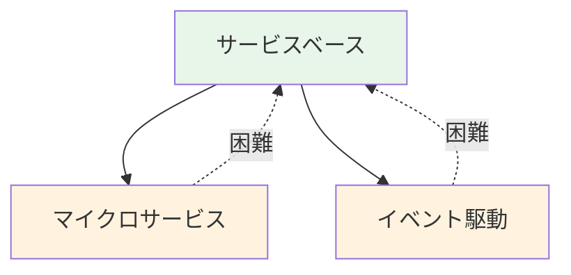
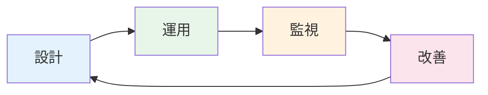

<div class="text-sm opacity-80 mb-16">SRE Kaigi 2026</div>

# 開発チームが<br/>信頼性向上のためにできること

医療SaaS企業を支える共通基盤の挑戦

<div class="mt-16">
  <div class="text-lg">2026年1月23日</div>
  <div class="text-lg">岩佐 幸翠</div>
</div>

<div class="absolute bottom-6 left-14 text-xs opacity-60">©KAKEHASHI inc.</div>


<!--
本日は「開発チームが信頼性向上のためにできること」というテーマでお話しします。
皆さんのチームには、Embedded SREはいらっしゃいますか？
私たちのチームにはいません。でも、医療SaaSという高い信頼性が求められる領域で、開発チーム自身が信頼性に責任を持ち、改善を続けてきました。
本日は、その具体的な方法論と、運用を通じて学んだ教訓をお伝えします。
-->

---

# 自己紹介

<div class="grid grid-cols-3 gap-8">
<div class="col-span-2">

## 岩佐 幸翠（いわさ こうすい）

- 株式会社カケハシ（2022〜）
- 認証権限基盤チーム テックリード

<div class="mt-2 text-sm">

登壇歴: TSKaigi 2024 / 関数型まつり 2025 など

</div>

<div class="mt-2 text-sm opacity-70">

X: @kosui_me

</div>

</div>
<div>


</div>
</div>

---
layout: center
class: text-center
---

# キーメッセージ

<MessageBox>

Embedded SRE不在でも<br/>開発チームが設計を"自分ごと"として<br/>運用し続けることで信頼性は向上できる

</MessageBox>

---

# 本日の構成

1. **背景** — チーム・プロダクト紹介
2. **課題** — 品質要求の相反・トレーサビリティ欠如
3. **方法論** — 2つのレイヤーと継続的改善プロセス
4. **結果と教訓** — 成果と学び
5. **まとめ** — 持ち帰りポイント

---
layout: section
---

# 1. 背景

チーム・プロダクト紹介

---

# 株式会社カケハシ

<div class="grid grid-cols-2 gap-8">
<div>

## ミッション・ビジョン

- **ミッション**  
  日本の医療体験を、しなやかに。
- **ビジョン**  
  明日の医療の基盤となる、エコシステムの実現。

調剤薬局向けDXプロダクト群を中心に、  
医療現場のデジタル化を推進。

</div>
<div>

## 主なプロダクト

- **Musubi**  
  次世代型電子薬歴
- **Musubi Insight**  
  経営分析ダッシュボード
- **Pocket Musubi**  
  患者向けアプリ
- **Musubi AI在庫管理**  
  在庫最適化

</div>
</div>

---

# 認証権限基盤チーム

### ミッション

プロダクトチームが顧客と向き合えるように、  
認証・ID管理・ライセンス管理などの基盤を通じて、  
医療システムとして要求される高い信頼性とセキュリティを提供する

### 担当する基盤システム

<CardGrid cols="2">
  <Card title="認証基盤" />
  <Card title="ID基盤" />
  <Card title="ライセンス基盤" />
  <Card title="端末・証明書基盤" />
</CardGrid>

---

# 2025年4月時点の基盤構成

- 社内の**複数プロダクトから利用**される共通基盤
- 法令や省庁ガイドラインに準拠できる
- すべてのプロダクトが**患者情報**を扱うため、
  高い信頼性とセキュリティが必要

<div class="flex justify-center mt-4">

</div>

---
layout: section
---

# 2. 課題

品質要求の相反とトレーサビリティの欠如

---

# チームの制約

## 2025年4月時点の状況

「新認証基盤の各プロダクトへの一斉展開」と  
「ライセンス基盤・端末基盤の新規開発」の開発を両立する必要性が生じた

## 小規模チームの選択

2025年4月時点では非常に小規模なチームであり  
現状の人員数では開発が不可能と判断

アプリケーション開発者の採用は進んだが、Embedded SREを迎える余裕はない  

開発チーム自身が **信頼性に責任を持つ** 必要があった

---

# 医療SaaS特有の品質要求

全プロダクトが依存する**基盤**として  
要求される品質は高い上に多様

- **コンプライアンス**  
  各省庁のガイドライン準拠 (監査ログ・BCP・二要素認証など)
- **高可用性**  
  夜間・休日も医療機関は稼働
- **トレーサビリティ**  
  医療システムとしてデータの真正性が重要
- **テナント分離**  
  患者情報を絶対に漏洩させない

---

# 課題①  トレーサビリティの欠如

### 既存システムの問題

一部の既存基盤では最新のデータだけを保存していた

- 例) 「3ヶ月前にこの証明書はどの端末に紐づいていたか?」  
  **アクセスログ**や**復元したDBバックアップ** から調査する必要があり、時間がかかる

### 医療システムでの重要性

過去のデータ状態を説明できることは、法的にもビジネス的にも極めて重要

### CSへのデータ提供

開発者のみならず、CSチームが顧客対応で過去データを調査するケースも多い  
CSが即座に問い合わせへ回答し顧客の信頼を維持できる必要がある

---

# 課題②  品質要求の相反

### 異なる品質要求を持つシステム間の依存

<div class="mb-4 flex gap-4">


<div>
例) 認証基盤はID基盤に依存する

- 認証基盤  
  **可用性**が重要
- ID基盤  
  整合性と**トレーサビリティ**が重要

</div>
</div>

- 生じる課題1: メンテナンス計画  
  例) **ID基盤** で整合性維持のため停止してデータ移行したいが
  **認証基盤** は停止できない

- 生じる課題2: 障害対応  
  例) **ID基盤** でデータ不整合が発生した場合、**認証基盤** を停止せざるを得ない

---
layout: section
---

# 3. 方法論

2つのレイヤーと継続的改善プロセス

---

# 信頼性を支える2つのレイヤーと継続的改善


<CardGrid :cols="2">
  <Card
    title="1. インフラレイヤ"
    description="テナント分離・データ連携"
  >
  </Card>
  <Card
    title="2. アプリケーションレイヤ"
    description="ドメインイベント・サービス分割"
  >
  </Card>
</CardGrid>

<div class="mt-4">
  <Card title="継続的改善プロセス" description="評価・計画・実行" />
</div>

<!--
具体的な方法論に入る前に、信頼性を支えるために必要なレイヤーを整理します。
私たちは2つの技術レイヤーと、それを維持するプロセスで設計判断を行いました。
1つ目はインフラレイヤ。テナント分離とデータ連携の基盤です。RLSやDelta Lakeを使ったデータ配信を扱います。
2つ目はアプリケーションレイヤ。整合性とトレーサビリティの実現です。ドメインイベントやサービスベースアーキテクチャを扱います。
そしてこれらを支えるのがプロセスです。ADRやポストモーテムを活用し、設計を育て続けます。
それぞれのレイヤーで複数の選択肢があり、トレードオフを理解した上で選択しました。
では、各レイヤーでの具体的な選択を見ていきましょう。
-->

---
layout: section
---

# 3-1. インフラレイヤの設計

データの分離・永続化・配信

---

# テナント分離

### 課題

顧客Aが持つ患者データを顧客Bが絶対に参照できないようにしたい

<CardGrid :cols="3">
  <OptionCard title="アプリレベル" status="rejected" statusText="✗ 仕組みで防げない">
    <p>WHERE句でフィルタ</p>
    <p class="mt-2">SQLインジェクションやバグで漏洩</p>
  </OptionCard>
  <OptionCard title="スキーマ分離" status="rejected" statusText="✗ 管理コストが膨大">
    <p>テナントごとにスキーマ</p>
    <p class="mt-2">統廃合時の対応が困難</p>
  </OptionCard>
  <OptionCard title="行レベルセキュリティ" status="selected" statusText="✓ 採用">
    <span>(RLS)</span>
    <p>DBレベルで強制保護</p>
    <p class="mt-2">漏洩を仕組みで防止</p>
  </OptionCard>
</CardGrid>

---

# RLSの実装

<div class="grid grid-cols-[350px_1fr] gap-6 mt-4">

<div>

### PostgreSQL側

```sql
-- RLSポリシーの定義
CREATE POLICY tenant_isolation ON users
  USING (tenant_id =
    current_setting('app.tenant_id')::uuid);

-- RLSを有効化
ALTER TABLE users
  ENABLE ROW LEVEL SECURITY;

ALTER TABLE users
  FORCE ROW LEVEL SECURITY;

-- 重要: tenant_idにインデックス
CREATE INDEX idx_users_tenant_id
  ON users(tenant_id);
```

</div>

<div>

### アプリケーション側

```typescript
// ミドルウェアでトランザクションを開始し
// テナントIDをセッション変数に設定
const tenantMiddleware = createMiddleware(
  async (c, next) => {
    const tenantId = extractTenantId(c);
    await db.transaction(async (tx) => {
      await tx.execute(
        sql`select set_config('app.tenant_id', ${tenantId}, false)`;
      );
      c.set("tx", tx);
      await next();
    });
  }
);

// うっかりWHERE句を忘れてもRLSが働く
const users = await c.get("tx").select()
  .from(usersTable);
```

</div>

</div>

---

# RLS: 運用と改善

### 複数ポリシーの運用

ポリシーを複数定義することは可能だが、一つのトランザクションに複数のポリシーが誤って適用されるリスクに注意

### パフォーマンス

- 想定通りにインデックスが機能しているか確認
- 検索キーとRLS条件の組み合わせを考慮したインデックス設計

### 新規テーブルへの適用

自動テストでRLS適用漏れを検知する

- 例) `pg_policy` テーブルを参照し、RLS未適用テーブルを検出

---

# データ連携パターン比較

基盤とプロダクト間のデータ連携には3つのパターンがある

限られた人員数と高い信頼性要求を満たすためにデータ基盤連携を第一選択肢とした

<div class="mt-4">

| パターン | 即時性 | 耐障害性 | 一貫性 | ユースケース |
|----------|:------:|:--------:|:------:|-------------|
| **データ基盤連携** | △ | ◎ | ◎ | 定期的に一貫性の<br/>あるデータを取得 |
| **API連携** | ◎ | △ | ◎ | リアルタイムで<br/>データ取得が必要 |
| **イベント連携** | ○ | ○ | ○ | 変更をトリガーに非同期処理 |

</div>

---

# データ基盤連携: Delta Lake + タイムトラベル

<div class="grid grid-cols-2 gap-6 mt-4">

<div>

### アーキテクチャ


</div>

<div>

### タイムトラベル機能

Delta LakeやApache Icebergなど
モダンなデータレイクでは
過去のデータ状態に即座にアクセス可能

```python
# 現在のデータ
df = spark.read.format("delta")
    .load("s3://bucket/users")

# 3ヶ月前の状態
df_past = spark.read.format("delta") \
    .option("timestampAsOf", "2025-10-01") \
    .load("s3://bucket/users")
```

<OptionCard status="selected">

DBバックアップを復元せずに
過去データを即座に調査可能に

</OptionCard>

</div>

</div>

---

# データ連携: 運用と改善

<CardGrid :cols="1">

<div>

### 運用で直面した課題

<InsightCard title="「即時性が必要」の誘惑">
  <p>プロダクトチームから「リアルタイムで欲しい」→ 本当に必要か？を一緒に検討<br><span class="highlight">多くは「数分遅延OK」</span>であり、むしろ一貫性の方が重要なケースがほとんど</p>
</InsightCard>

<InsightCard title="障害発生時のリスク管理">

- 基盤側に障害が生じた場合のリスクをプロダクトチームと事前に整理し
  対応手順を合意しておくことが重要
- 障害発生時のリスクが大きいデータは
  データパイプライン上で重点的にデータバリデーションする

</InsightCard>

</div>

<div>

</div>

</CardGrid>

---
layout: section
---

# 3-2. アプリケーションレイヤの設計

ドメインイベントとサービス分割

---

# ドメインイベント

### ドメインイベントとは

過去に発生した出来事を表したもの

> ドメインイベントはドメインモデルの正式な構成要素であり、  
> ドメイン内で起こった何かを表現するものである
>
> — Eric Evans

### 認証権限基盤での具体例

- `UserCreated`（ユーザー作成）
- `RoleAssigned`（ロール付与）
- `PermissionRevoked`（権限剥奪）

---

# ドメインイベントを記録する意義

### CQRS? イベントソーシング?

イベント駆動アーキテクチャやCQRSの文脈でよく語られる

### それだけではない

出来事が**すべて記録される**こと自体に価値がある


- 障害調査: 過去の状態を再現し、原因特定が容易に
- 監査: 監査ログを完全に追跡可能
- 動向分析: ユーザー行動の時系列分析


---

# ドメインイベントの保存と検索

#### ドメインイベントの保存

```typescript
// 例: ユーザー作成を実行するときUserCreatedイベントを生成
const createUser = (name: string): UserCreatedEvent => ({
  kind:       "User",
  aggregateId: uuid(),
  state:      { name, status: "active" },     // 変更後の状態
  eventAt:    Date.now(),                     // 変更日時
  eventName:  "UserCreated",                  // イベント名
  payload:    { performedBy: "system", name } // イベント詳細
});
```

#### ドメインイベントの検索

```sql
-- あるユーザーの状態の履歴を全件取得
SELECT * FROM domain_event
  WHERE `kind` = 'User' AND `aggregate`.id = '123e...'
  ORDER BY eventAt ASC;
```


> [!TIP]
> **ポイント:** 変更後の状態も一緒に保存することで、リプレイなしでも過去の状態を即座に参照可能

---

# 既存システムへの導入戦略

稼働中のID基盤にドメインイベントを導入し  
過去のユーザーの状態を追跡可能にしたい

<CardGrid :cols="2">
  <OptionCard title="フルリプレイス" status="rejected" statusText="✗ リスクが高い">
    <p>全機能を一斉に移行</p>
    <p class="mt-2">ダウンタイム・バグリスクが大</p>
  </OptionCard>
  <OptionCard title="段階的導入" status="selected" statusText="✓ 採用">
    <p>既存データからイベントを生成</p>
    <p class="mt-2">リスクを最小化しながら移行</p>
  </OptionCard>
</CardGrid>

<div class="mt-4 p-4 bg-brand-50 rounded-lg">
  <h4 class="font-bold mb-2">戦略: スナップショット→イベント変換</h4>
  <ul class="text-sm space-y-1">
    <li>既存DBの<span class="font-bold">スナップショット</span>から初期イベントを生成</li>
    <li>新規書き込みは<span class="font-bold">即座にイベント化</span></li>
  </ul>
</div>

<!--
既存システムにドメインイベントを導入する際の戦略についてお話しします。
課題は明確です。すでに稼働中のシステムにドメインイベントを導入したい。しかし、フルリプレイスはリスクが高すぎます。
私たちは段階的導入を選択しました。既存データからイベントを生成し、リスクを最小化しながら移行する戦略です。
具体的には、既存DBのスナップショットから初期イベントを生成します。先ほど説明したDelta Lakeのタイムトラベル機能を使って、特定時点のスナップショットを再現できます。データ基盤経由で一貫性を保証しながら変換し、新規書き込みは即座にイベント化します。
-->

---

# スナップショットからイベントを生成

<div class="grid grid-cols-[300px_1fr] gap-6 mt-4">

<div>

### アーキテクチャ


</div>

<div>

### 導入ステップ

1. 初期フェーズ  
    データ基盤へのCDC蓄積を開始
1. 差分検出  
    データ基盤にて差分を検出しイベント生成
1. 新規書き込み対応  
    アプリケーションで新規書き込みを即座にイベント化

状態テーブルとイベントテーブルを  
同じDB内に保持し、一貫性を保証

</div>
</div>


---

# ドメインイベント: 運用と結果

<CardGrid :cols="2">

<div>

### 運用で得た気づき

<InsightCard title="イベント設計の見直し">
  <p>運用中に「この情報も必要だ」と気づく<br><span class="highlight">→ イベントのバージョン管理が重要</span></p>
</InsightCard>

<InsightCard title="運用負荷の最適化">

集約やイベントごとにテーブルを分割していた<br/>
→ 必要になるまで単一のテーブルに寄せて良い

</InsightCard>

<InsightCard title="過去データのイベント情報欠損問題">
  <p>既存データには操作者情報がない<br><span class="highlight">→ 「システム移行」として記録</span></p>
</InsightCard>

</div>

<div>

### 得られた成果

<InsightCard title="障害調査での活用" variant="positive">
  <p>「このユーザーはいつ名前を変えた？」<br>→ イベントを辿って即座に回答可能に</p>
</InsightCard>

<InsightCard title="監査対応の効率化" variant="positive">
  <p>変更履歴の完全な追跡が可能になり、監査対応の工数が大幅に削減</p>
</InsightCard>

</div>

</CardGrid>

> [!IMPORTANT]
> **選んで終わりではない** — 運用しながら設計を育て続ける

<!--
ドメインイベントの運用と改善についてお話しします。
運用で得た気づきとして、イベント設計の見直しがあります。運用を続けていると、「このイベントも必要だった」と気づくことがあります。そのため、スキーマ進化の仕組みを用意しておくことが重要です。
また、既存システムへの段階的導入では、過去データには「誰が操作したか」という情報がありません。これは「システム移行」として記録することで対応しました。
一方、成果もありました。障害調査では、「3ヶ月前のこのユーザーの状態は？」という問いに即座に回答できるようになりました。監査対応では、変更履歴の完全な追跡が可能になり、工数が大幅に削減されました。
選んで終わりではなく、運用しながら設計を育て続けることが重要です。では次に、サービスベースアーキテクチャについて説明します。
-->

---

# 品質要求が相反するシステムをどう構成するか

品質要求が異なるシステム（認証基盤・ID基盤）の<span class="font-bold">独立性を高めたい</span>

<div class="mt-6 p-4 bg-brand-50 rounded-lg">
  <h4 class="font-bold mb-2">求められる要件</h4>
  <ul class="text-sm space-y-1">
    <li>基盤システムは<span class="font-bold">発展途上</span>であり、誤った分割は障害点を増やすリスクがある</li>
    <li>データの<span class="font-bold">強い整合性・一貫性</span>を保ちたい</li>
    <li>サービスごとの<span class="font-bold">独立したデプロイ</span>を実現したい</li>
  </ul>
</div>


<CardGrid :cols="3">
  <OptionCard title="マイクロサービス" status="rejected" statusText="✗ 不採用">
    <p>誤った分割のリスクが大きい</p>
    <p>分散トランザクションの複雑さ</p>
  </OptionCard>
  <OptionCard title="イベント駆動" status="rejected" statusText="✗ 不採用">
    <p>誤った分割のリスクが大きい</p>
    <p>結果整合性・状態追跡の難しさ</p>
  </OptionCard>
  <OptionCard title="モジュラモノリス" status="rejected" statusText="✗ 不採用">
    <p>認証基盤だけのデプロイなど</p>
    <p>影響を最小化したデプロイが困難</p>
  </OptionCard>
</CardGrid>

<!--
課題②で触れた通り、認証基盤とID基盤では求められる品質特性が異なります。この相反する要求を満たすために、アーキテクチャパターンの選定が重要になりました。
アーキテクチャの選択では、いくつかの選択肢を検討しました。
マイクロサービスやイベント駆動アーキテクチャは、誤った分割をしたときのリスクが大きいです。基盤システムはまだ発展途上であり、適切なドメイン分割が不明瞭な段階で分散トランザクションや結果整合性の複雑さを抱えるのは避けたいと考えました。
モジュラモノリスも検討しましたが、認証基盤だけをデプロイするなど、影響を最小化したデプロイが難しいという課題がありました。
私たちが求めていたのは、強い整合性を保ちつつ、サービスごとに独立してデプロイできるアーキテクチャです。
-->

---

# サービスベースアーキテクチャとは

<div class="flex gap-4 mb-2">


<div class="mt-3 text-sm">

単一の**共有DB**を持ちながら、  
サービスは**独立してデプロイ**できる  
アーキテクチャ

- システム間でのAPI通信は禁止
- システム間でDBの読み取りを許可
- ただし各テーブルは  
  特定のサービスが所有し  
  他のサービスによる書込は禁止

</div>

</div>

> 参考
> Mark Richards『ソフトウェアアーキテクチャの基礎』）

<!--
そこで検討したのが、サービスベースアーキテクチャです。
これはMark Richardsらが『Fundamentals of Software Architecture』で体系化したパターンで、単一の共有データベースを持ちながら、サービスは独立してデプロイできるアーキテクチャです。
図をご覧ください。上段にある各サービスは独立してデプロイ可能ですが、サービス間のAPI通信は禁止しています。バツ印がついている部分です。
代わりに、すべてのサービスが下段の単一PostgreSQLに接続します。各スキーマにはサービスごとの所有権があり、自分のスキーマには読み書きできますが、他のスキーマは読み取りのみです。点線の矢印がSELECTのみの参照を表しています。
マイクロサービスとモノリスの中間に位置するパターンで、分散トランザクションの複雑さを避けつつ、デプロイの独立性を得ることができます。
-->

---

# サービスベースアーキテクチャの採用

<div class="grid grid-cols-2 gap-8 mt-4">

<div>

### 共有DBアンチパターンとの違い

<div class="p-3 bg-red-50 rounded mb-3">
  <p class="text-sm font-bold text-red-600">共有DBアンチパターン</p>
  <ul class="text-xs text-slate-600 mt-1">
    <li>どのサービスもどのテーブルも自由に読み書き</li>
    <li>変更の影響範囲が不明</li>
    <li>サービス間の結合度が極めて高い</li>
  </ul>
</div>

<div class="p-3 bg-brand-50 rounded">
  <p class="text-sm font-bold text-brand-600">サービスベースアーキテクチャ</p>
  <ul class="text-xs text-slate-600 mt-1">
    <li>テーブル/スキーマはサービスごとに<span class="font-bold">所有権</span>を持つ</li>
    <li>他サービスは<span class="font-bold">読み取りのみ</span>、変更は許されない</li>
    <li>サービス間はAPIで通信せず、<span class="font-bold">DBから直接参照</span></li>
  </ul>
</div>

</div>

<div>

### なぜAPI通信しないのか

```typescript
// ❌ サービス間API呼び出し
const user = await userService.getUser(userId);
```

```typescript
// ✓ 共有DBから直接読み取り
const user = await db.query(
  'SELECT * FROM directory.users WHERE id = $1',
  [userId]
);
```

<div class="mt-3 p-3 bg-slate-100 rounded text-sm">
  <span class="font-bold">DB直接参照のメリット:</span>
  <ul class="text-xs mt-1">
    <li>ネットワーク障害・DNS遅延の影響なし</li>
    <li>トランザクションで整合性保証</li>
    <li>低レイテンシー</li>
  </ul>
</div>

</div>

</div>

<!--
そこで検討したのがサービスベースアーキテクチャです。DBを共有するため、いわゆる「共有DBアンチパターン」と非常に似ています。正直、危険に見えます。
しかし、サービスベースアーキテクチャでは結合度を下げるための工夫を行います。
まず、テーブルやスキーマはサービスごとに所有権を持ちます。他のサービスがそのテーブルを変更することは許されません。読み取りのみです。
次に、サービス間はAPIで通信しません。他サービスのデータが必要な場合は、共有DBから直接参照します。API呼び出しでは、DNS解決の遅延やネットワーク障害による連鎖障害のリスクがあります。実際にそうした問題も発生しました。DB直接参照であれば、ネットワーク障害の影響を受けず、トランザクションで整合性も保証されます。
私たちの目的は「独立したデプロイ」であり、「ネットワーク分離」ではないのです。
-->

---

# サービスベースアーキテクチャの発展可能性

<div class="grid grid-cols-2 gap-6 mt-4">

<div>

### 発展パス



<div class="p-3 bg-red-50 rounded mt-2">
  <p class="text-sm font-bold">分離 → 結合は困難</p>
  <p class="text-xs">一度完全に分離すると、再統合は大規模な作り直しに</p>
</div>

</div>

<div>

### サービスベースからの移行

<InsightCard title="適切な分割面が見えたら" variant="positive">
  <p>ドメイン境界が明確になった段階で<br>マイクロサービス化を検討できる</p>
</InsightCard>

<InsightCard title="非同期処理が必要になったら" variant="positive">
  <p>イベント駆動パターンを<br>部分的に導入できる</p>
</InsightCard>

<InsightCard title="今は「まだ分割しない」選択" variant="positive">
  <p>境界が不明確なうちは<br>強い整合性を維持できる</p>
</InsightCard>

</div>

</div>

<!--
サービスベースアーキテクチャの重要な利点として、将来の発展可能性があります。
左側の図を見てください。サービスベースアーキテクチャからは、マイクロサービスやイベント駆動アーキテクチャへ移行できます。適切なサービスの分割面が見えてきたタイミングで、必要な部分だけを分離できるのです。
しかし、その逆——つまり一度完全に分離してしまったサービスを再び結合することは、非常に困難です。点線で示している通り、これは事実上、大規模な作り直しを意味します。
右側に、サービスベースアーキテクチャからの移行パターンを示しました。
ドメイン境界が明確になった段階で、その部分をマイクロサービスとして切り出せます。
非同期処理が必要になったら、イベント駆動パターンを部分的に導入できます。
そして重要なのは、境界が不明確なうちは「まだ分割しない」という選択ができること。早すぎる分離は、間違った境界での分割を招きます。
サービスベースアーキテクチャは、「今は分からないことを認め、将来の選択肢を残す」設計なのです。
-->

---

# サービスベースアーキテクチャの実装

<div class="grid grid-cols-2 gap-6 mt-4">

<div>

### 共有DBと論理的分離


</div>

<div>

### DBユーザーによる権限制御

```sql
-- 認証サービス用
CREATE ROLE auth_service;
GRANT ALL ON auth.* TO auth_service;
GRANT SELECT ON directory.* TO auth_service;

-- ディレクトリサービス用
CREATE ROLE directory_service;
GRANT ALL ON directory.* TO directory_service;
GRANT SELECT ON auth.*, asset.*
  TO directory_service;
```

<div class="mt-4 p-3 bg-slate-100 rounded text-sm">
  <span class="font-bold">原則:</span><br>
  自分のスキーマにのみ書き込み権限<br>
  他のスキーマは読み取りのみ
</div>

</div>

</div>

<!--
具体的な実装を見てみましょう。
単一のPostgreSQLの中に、authスキーマ、directoryスキーマ、assetスキーマが存在します。物理的には1つのデータベースですが、論理的にはスキーマで分離されています。
各サービスには専用のDBユーザーを作成し、権限を制御しています。auth_serviceはauthスキーマにはフルアクセス、directoryスキーマは読み取り専用。この「自分のスキーマにのみ書き込み権限、他は読み取りのみ」という原則を、データベースレベルで強制しています。
-->

---

# サービスベースアーキテクチャの課題

<div class="grid grid-cols-2 gap-8 mt-4">

<div>

### 参照可否の区別

サービスが拡大するにつれ、テーブルの区別が困難に

<div class="p-3 bg-red-50 rounded mt-2 mb-3">
  <ul class="text-sm space-y-1">
    <li>他サービスから参照して<span class="font-bold">良い</span>テーブル</li>
    <li>他サービスから参照<span class="font-bold">しないでほしい</span>テーブル</li>
  </ul>
</div>

<div class="p-3 bg-brand-50 rounded">
  <p class="text-sm font-bold mb-1">対策</p>
  <ul class="text-sm space-y-1">
    <li>命名規則やスキーマで<span class="font-bold">公開/非公開</span>を区別</li>
    <li>チーム間でルールを明文化</li>
  </ul>
</div>

</div>

<div>

### スキーマ変更の制約

他サービスが参照するテーブルは容易に変更できない

<div class="p-3 bg-red-50 rounded mt-2 mb-3">
  <ul class="text-sm space-y-1">
    <li>カラム追加・変更時に<span class="font-bold">影響範囲</span>の調査が必要</li>
    <li>参照元サービスとの<span class="font-bold">デプロイ順序</span>の調整</li>
  </ul>
</div>

<div class="p-3 bg-brand-50 rounded">
  <p class="text-sm font-bold mb-1">対策</p>
  <ul class="text-sm space-y-1">
    <li>公開テーブルは<span class="font-bold">慎重に設計</span></li>
    <li>デプロイの柔軟性については<span class="font-bold">課題が残る</span></li>
  </ul>
</div>

</div>

</div>

<!--
一方で、サービスベースアーキテクチャには課題もあります。
まず、サービスが拡大するにつれて「他サービスから参照して良いテーブル」と「参照しないでほしいテーブル」の区別が難しくなりました。これに対しては、命名規則やスキーマで公開・非公開を区別するルールを設けて対応しています。
もう一つの課題は、他サービスが参照する可能性のあるテーブルのスキーマを容易に変更できないことです。カラムの追加や変更時には影響範囲の調査が必要ですし、参照元サービスとのデプロイ順序の調整も求められます。公開テーブルは慎重に設計するようにしていますが、デプロイの柔軟性については課題が残っています。
-->

---
layout: section
---

# 3-3. 継続的改善プロセス

設計を「選んで終わり」にしない仕組み

---

# 設計を育て続ける仕組み

<CardGrid :cols="2">

<div>

### 判断の土台を作る

<InsightCard title="品質特性の明文化" variant="positive">
  <p>可用性・整合性・セキュリティなど<br>自チームに求められる品質特性を言語化し<br><span class="highlight">チーム全員で合意する</span></p>
</InsightCard>

<InsightCard title="ADRで意思決定を記録" variant="positive">
  <p>技術選択の背景・トレードオフ・却下案を記録<br><span class="highlight">新メンバーも同じ判断ができるように</span></p>
</InsightCard>

</div>

<div>

### 改善をロードマップに接続する

<InsightCard title="ポストモーテム → 改善プラン" variant="positive">
  <p>障害の顧客影響を評価し<br>実現可能な改善プランを策定<br><span class="highlight">改善プランをロードマップに反映</span></p>
</InsightCard>

<InsightCard title="PMへの説明責任" variant="positive">
  <p>「いつまでに未解決だと困る」を<br>ロードマップと照らし合わせて議論</p>
</InsightCard>

</div>

</CardGrid>

> [!IMPORTANT]
> **判断の「軸」と「記録」があり、改善がロードマップに反映されることで、設計を育て続けられる**

<!--
設計パターンは「選んで終わり」ではありません。育て続ける仕組みが必要です。
左側は判断の土台です。品質特性を明文化してチームで合意し、ADRで意思決定を記録します。これにより新メンバーも同じ判断ができるようになります。
右側は改善の実行を担保する仕組みです。ポストモーテムから改善プランを策定し、ロードマップに反映します。「いつまでに解決が必要か」をPMと議論することで、技術負債の解消にも優先度がつきます。
-->

---
layout: section
---

# 4. 結果と教訓

「責任を果たす」とは何か

---

# 成果

<div class="mt-4">

<div class="grid grid-cols-2 gap-6">

<div>

| 項目 | Before | After |
|------|--------|-------|
| 障害時の原因特定 | 2〜3時間 | 30分以内 |
| 過去データの追跡 | 不可能 | 任意の時点で可能 |
| テナント分離 | アプリ依存 | DB保証 |
| 新規プロダクト認証 | 各チームで実装 | 共通基盤を利用 |

</div>

<div>

### プロダクトチームへの貢献

<div class="p-4 bg-slate-100 rounded-lg">
  <p class="text-sm">
    認証・認可基盤の共通化により、<br>
    <span class="font-bold">3省2ガイドラインを各チームが個別に解釈する必要がなくなった</span>
  </p>
</div>

### SREイネイブラーの観点

<div class="p-4 bg-brand-50 rounded-lg mt-4">
  <p class="text-sm">
    開発チームが「自分事として信頼性を担う」状態を実現<br>
    → <span class="font-bold">イネイブリングの目標状態</span>の一つの形
  </p>
</div>

</div>

</div>

</div>

<!--
導入による成果をまとめます。
左側の表を見てください。障害時の原因特定は、2〜3時間かかっていたものが30分以内になりました。イベントストアを参照するだけで、何が起きたかがわかります。
過去データの追跡は、不可能だったものが任意の時点で可能になりました。「3ヶ月前のこのユーザーの権限は？」に即座に回答できます。
テナント分離は、アプリ依存からDB保証になりました。バグがあっても漏洩しません。
新規プロダクトの認証は、各チームで実装していたものが共通基盤を利用する形になりました。
プロダクトチームへの貢献として、3省2ガイドラインを各チームが個別に解釈する必要がなくなりました。本来のビジネスロジックに集中できるようになったのです。
SREイネイブラーの観点からは、これが「開発チームが自分事として信頼性を担う状態」——イネイブリングの目標状態の一つの形だと考えています。
-->

---

# 教訓: 運用から見えてきたこと

<div class="grid grid-cols-[1fr_1fr] gap-6 mt-4">

<div>

### チームへの効果

<InsightCard title="設計意図の浸透" variant="positive">
  <p>「なぜこの設計か」を繰り返し説明するうちに<br>新メンバーも同じ判断ができるようになった</p>
</InsightCard>

<InsightCard title="失敗が設計を強くする" variant="positive">
  <p>障害のたびに「次は防げる」仕組みを設計に組み込み<br>制約が強みに変わった</p>
</InsightCard>

</div>

<div>

### 「責任を果たす」サイクル



このサイクルを開発チームが
自走できる状態 = 責任を果たしている状態

</div>

</div>

> [!IMPORTANT]
> 設計パターンは「選ぶ」ものではなく「育てる」もの

<!--
数値的な成果の先に、運用し続けることで見えてきたことがあります。
設計の意図がチームに浸透し、新メンバーも同じ判断ができるようになりました。障害のたびに「次は防げる」仕組みを設計に組み込み、SRE専任がいないからこそ「自分たちで解決する」マインドが育ちました。
右側の設計→運用→監視→改善のサイクルを、開発チームが自走できる状態。これが私たちの考える「責任を果たしている状態」です。
-->

---
layout: section
---

# 5. まとめ

持ち帰りポイント

---

# 開発チームができること

<CardGrid :cols="2">
  <SummaryCard :number="1" title="ドメインイベント" description="「何が起きたか」を完全に記録" subdescription="障害調査・監査対応・データ復旧" />
  <SummaryCard :number="2" title="データ連携パターン" description="基盤障害を波及させない設計" subdescription="デフォルトはデータ基盤経由" variant="secondary" />
  <SummaryCard :number="3" title="サービスベースアーキテクチャ" description="強い整合性と独立デプロイの両立" subdescription="サービス間通信を原則禁止" variant="secondary" />
  <SummaryCard :number="4" title="RLS" description="DBレベルでテナントを強制分離" subdescription="バグがあっても漏洩しない" variant="secondary" />
</CardGrid>

> [!NOTE]
> **段階的に導入可能** — クリティカルな領域から優先的に適用

<!--
まとめとして、開発チームができることを振り返ります。
1つ目、ドメインイベントの永続化。「何が起きたか」を完全に記録することで、障害調査・監査対応・データ復旧が可能になります。
2つ目、データ連携パターンの選択。デフォルトはデータ基盤経由とし、基盤障害を波及させない設計を目指します。
3つ目、サービスベースアーキテクチャ。サービス間通信を原則禁止とし、強い整合性と独立デプロイを両立します。
4つ目、RLS。DBレベルでテナントを強制分離し、バグがあっても漏洩しない状態を作ります。
これらは段階的に導入可能です。すべてを一度に導入する必要はありません。クリティカルな領域から優先的に適用してください。
-->

---
layout: center
class: text-center
---

# 本日のキーメッセージ

<div class="text-3xl font-bold mt-8 p-8 bg-brand-100 rounded-lg max-w-4xl">
開発チームが設計を"自分ごと"として<br>運用し続けることで、<br>Embedded SRE不在でも信頼性は向上できる
</div>

<div class="mt-8 text-xl text-slate-600">
設計パターンを「選ぶ」だけでなく「育てる」ことが重要
</div>

<!--
最後に、本日のキーメッセージです。
「Embedded SREがいないから信頼性向上は難しい」——そう思っていませんか？
私たちの経験では、開発チーム自身が設計を「自分ごと」として運用し続けることで、信頼性は確実に向上できました。
ドメインイベント、データ連携、サービスベースアーキテクチャ、RLS——どれも選んだだけでは効果を発揮しません。
チームで意図を共有し、運用しながら課題を発見し、設計にフィードバックして継続的に改善する。それが開発チームによる信頼性向上の本質です。
本日の内容が、皆さんのチームでの信頼性向上の参考になれば幸いです。ご清聴ありがとうございました。
-->
