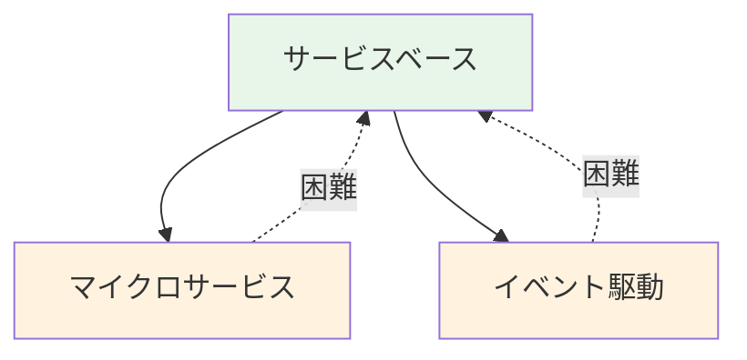
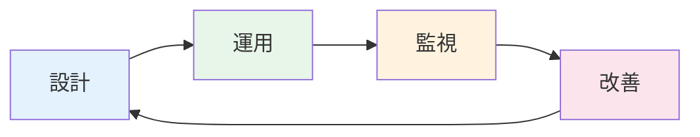

<div class="text-sm opacity-80 mb-16">SRE Kaigi 2026</div>

# 開発チームが<br/>信頼性向上のためにできること

医療SaaS企業を支える共通基盤の挑戦

<div class="mt-16">
  <div class="text-lg">2026年1月31日</div>
  <div class="text-lg">岩佐 幸翠</div>
</div>

<div class="absolute bottom-6 left-14 text-xs opacity-60">©KAKEHASHI inc.</div>

<!--
皆さん、こんにちは。本日は「開発チームが信頼性向上のためにできること」というテーマでお話しさせていただきます。
-->

---
layout: center
class: text-center
---

# キーメッセージ

<MessageBox>

Embedded SRE不在でも<br/>開発チームが設計を"自分ごと"として<br/>運用し続けることで信頼性は向上できる

</MessageBox>

これからSREを実践する開発チームに向けて  
私たちが直面した困難と  
それを乗り越えた方法論を共有します

<!--
まず最初に、本日一番お伝えしたいメッセージをお見せします。
Embedded SREがいなくても、開発チームが設計を「自分ごと」として運用し続ければ、信頼性は向上できます。

突然ですが、皆さんのチームにはEmbedded SREはいらっしゃいますか？いらっしゃる方、挙手をお願いします。
ありがとうございます。私たちのチームにはEmbedded SREがいません。しかし、医療SaaSという高い信頼性が求められる領域で、開発チーム自身が信頼性に責任を持ち、設計を選び、運用し、改善を続けてきました。
本日は30分で、その具体的な方法論と、運用を通じて得た教訓をお伝えします。

-->

---

# 自己紹介

<div class="grid grid-cols-3 gap-8">
<div class="col-span-2">

## 岩佐 幸翠（いわさ こうすい）

- 株式会社カケハシ（2022〜）
- 認証権限基盤チーム テックリード

<div class="mt-2 text-sm">

登壇歴: TSKaigi 2024 / 関数型まつり 2025 など

</div>

<div class="mt-2 text-sm opacity-70">

X: @kosui_me

</div>

</div>
<div>


</div>
</div>

<!-- 自己紹介は画面を見ていただければと思います。カケハシで認証権限基盤チームのテックリードをしている岩佐です。本日はよろしくお願いいたします。 -->


---

# 本日の構成

1. **背景** — チーム・プロダクト紹介
2. **課題** — 品質要求の相反・トレーサビリティ欠如
3. **方法論** — 2つのレイヤーと継続的改善プロセス
4. **結果と教訓** — 成果と学び
5. **まとめ** — 持ち帰りポイント

<!--
本日の流れはこのようになっています。まず背景としてチームとプロダクトを紹介し、次に私たちが直面した課題を共有します。そして方法論として、インフラレイヤとアプリケーションレイヤの2つの技術的アプローチと、それを支える継続的改善プロセスについてお話しします。最後に成果と教訓をまとめます。
-->

---
layout: section
---

# 1. 背景

チーム・プロダクト紹介

---

<!--
まずは私たちのチームとプロダクトについて簡単にご紹介します。なぜ信頼性がそこまで重要なのか、背景を理解していただくためです。
-->

# 株式会社カケハシ

<div class="grid grid-cols-2 gap-8">
<div>

## ミッション・ビジョン

- **ミッション**  
  日本の医療体験を、しなやかに。
- **ビジョン**  
  明日の医療の基盤となる、エコシステムの実現。

調剤薬局向けDXプロダクト群を中心に、  
医療現場のデジタル化を推進。

</div>
<div>

## 主なプロダクト

- **Musubi**  
  次世代型電子薬歴
- **Musubi Insight**  
  経営分析ダッシュボード
- **Pocket Musubi**  
  患者向けアプリ
- **Musubi AI在庫管理**  
  在庫最適化

</div>
</div>

<!--
カケハシは「日本の医療体験を、しなやかに」をミッションに掲げている会社です。調剤薬局向けのDXプロダクト群を中心に、電子薬歴のMusubi、経営分析のMusubi Insight、患者向けアプリのPocket Musubiなど、複数のプロダクトを展開しています。
ここで重要なのは、これらすべてのプロダクトが医療データ、つまり患者情報を扱っているという点です。
-->

---

# 認証権限基盤チーム

### ミッション

プロダクトチームが顧客と向き合えるように、  
認証・ID管理・ライセンス管理などの基盤を通じて、  
医療システムとして要求される高い信頼性とセキュリティを提供する

### 提供するもの

X-as-a-Service モードのプラットフォームチームとしてシステムを提供  
インフラ管理・障害管理も自チームで担う

<CardGrid cols="2">
  <Card title="認証基盤" />
  <Card title="ID基盤" />
  <Card title="ライセンス基盤" />
  <Card title="端末・証明書基盤" />
</CardGrid>

<!--
私が所属する認証権限基盤チームのミッションは、プロダクトチームが顧客と向き合えるように、認証・ID管理・ライセンス管理などの基盤を提供することです。
具体的には、認証基盤、ID基盤、ライセンス基盤、端末・証明書基盤の4つの基盤システムを担当しています。
これらは社内の複数プロダクトから利用される共通基盤であり、止まると全プロダクトに影響が出ます。
-->

---

# 2025年4月時点の基盤構成

- 社内の**複数プロダクトから利用**される共通基盤
- 法令や省庁ガイドラインに準拠できる
- すべてのプロダクトが**患者情報**を扱うため、
  高い信頼性とセキュリティが必要

<div class="flex justify-center mt-4">

</div>

<!--
こちらが2025年4月時点の基盤構成の全体像です。図の通り、複数のプロダクトがこの共通基盤に依存しています。
すべてのプロダクトが患者情報を扱うため、法令や省庁ガイドラインに準拠した高い信頼性とセキュリティが求められます。この基盤が壊れることは、すなわち医療現場に直接影響が出ることを意味します。
-->

---
layout: section
---

# 2. 課題

品質要求の相反とトレーサビリティの欠如

---

<!--
背景をご理解いただいたところで、私たちが直面した課題についてお話しします。大きく2つあります。トレーサビリティの欠如と、品質要求の相反です。
-->

# チームの制約

## 2025年4月時点の状況

「新認証基盤の各プロダクトへの一斉展開」と  
「ライセンス基盤・端末基盤の新規開発」の開発を両立する必要性が生じた

## 小規模チームの選択

2025年4月時点では非常に小規模なチームであり  
現状の人員数では開発が不可能と判断

アプリケーション開発者の採用は進んだが、Embedded SREを迎える余裕はない  

開発チーム自身が **信頼性に責任を持つ** 必要があった

<!--
課題の前に、まずチームの制約をお伝えします。2025年4月時点で、新認証基盤の全プロダクトへの一斉展開と、ライセンス基盤・端末基盤の新規開発を同時に進める必要がありました。
しかしチームは非常に小規模で、アプリケーション開発者の採用は進んだものの、Embedded SREを迎える余裕はありませんでした。つまり、開発チーム自身が信頼性に責任を持つしかなかったのです。この制約が、本日の発表の出発点になっています。
-->

---

# 医療SaaS特有の品質要求

全プロダクトが依存する**基盤**として  
要求される品質は高い上に多様

- **コンプライアンス**  
  各省庁のガイドライン準拠 (監査ログ・BCP・二要素認証など)
- **高可用性**  
  夜間・休日も医療機関は稼働
- **トレーサビリティ**  
  医療システムとしてデータの真正性が重要
- **テナント分離**  
  患者情報を絶対に漏洩させない

<!--
医療SaaSの共通基盤に求められる品質要求は、高い上に多様です。まずコンプライアンス。各省庁のガイドラインへの準拠が必要で、監査ログやBCP、二要素認証などが求められます。
次に高可用性。病院や薬局は夜間・休日も稼働しているため、メンテナンスウィンドウの確保すら難しい。トレーサビリティは、医療システムとしてデータの真正性、つまり「この情報は本物か」を証明できることが重要です。
そしてテナント分離。患者情報を絶対に他のテナントに漏洩させてはなりません。これらの要求を同時に満たす必要があります。
-->

---

# 課題①  トレーサビリティの欠如

### 既存システムの問題

一部の既存基盤では最新のデータだけを保存していた

- 例) 「3ヶ月前にこの証明書はどの端末に紐づいていたか?」  
  **アクセスログ**や**復元したDBバックアップ** から調査する必要があり、時間がかかる

### 医療システムでの重要性

過去のデータ状態を説明できることは、法的にもビジネス的にも極めて重要

### CSへのデータ提供

開発者のみならず、CSチームが顧客対応で過去データを調査するケースも多い  
CSが即座に問い合わせへ回答し顧客の信頼を維持できる必要がある

<!--
1つ目の課題はトレーサビリティの欠如です。既存の基盤では最新のデータだけを保存していました。
例えば「3ヶ月前にこの証明書はどの端末に紐づいていたか？」という問いに答えるには、アクセスログを追ったり、DBバックアップを復元して調査する必要がありました。これには数時間かかります。
医療システムでは、過去のデータ状態を説明できることが法的にもビジネス的にも極めて重要です。さらに、開発者だけでなくCSチームが顧客対応で過去データを調査するケースも多く、即座に回答できない状態は顧客の信頼に直結する問題でした。
-->

---

# 課題②  品質要求の相反

### 異なる品質要求を持つシステム間の依存

<div class="mb-4 flex gap-4">


<div>
例) 認証基盤はID基盤に依存する

- 認証基盤  
  **可用性**が重要
- ID基盤  
  整合性と**トレーサビリティ**が重要

</div>
</div>

- 生じる課題1: メンテナンス計画  
  例) **ID基盤** で整合性維持のため停止してデータ移行したいが
  **認証基盤** は停止できない

- 生じる課題2: 障害対応  
  例) **ID基盤** でデータ不整合が発生した場合、**認証基盤** を停止せざるを得ない

<!--
2つ目の課題は、品質要求の相反です。図を見てください。認証基盤はID基盤に依存しています。しかし、認証基盤は可用性が最優先、ID基盤は整合性とトレーサビリティが最優先です。
これが具体的にどう困るかというと、例えばID基盤でデータ移行のために停止したいが、認証基盤は停止できない。あるいはID基盤でデータ不整合が起きた場合、認証基盤も巻き込まれて停止せざるを得ない。品質要求が異なるシステムが密結合していることで、一方の改善が他方に悪影響を及ぼす状況でした。
-->

---
layout: section
---

# 3. 方法論

2つのレイヤーと継続的改善プロセス

---

# 信頼性を支える2つのレイヤーと継続的改善


<CardGrid :cols="2">
  <Card
    title="1. インフラレイヤ"
    description="テナント分離・データ連携"
  >
  </Card>
  <Card
    title="2. アプリケーションレイヤ"
    description="ドメインイベント・サービス分割"
  >
  </Card>
</CardGrid>

<div class="mt-4">
  <Card title="継続的改善プロセス" description="評価・計画・実行" />
</div>

<!--
ここからが本題です。私たちは信頼性を2つの技術レイヤーと1つのプロセスで支えています。
1つ目のインフラレイヤでは、テナント分離とデータ連携を扱います。RLSやDelta Lakeといった技術を使います。
2つ目のアプリケーションレイヤでは、ドメインイベントとサービス分割によってトレーサビリティと整合性を実現します。
そしてこれらの設計を「選んで終わり」にせず育て続けるための継続的改善プロセスがあります。
それぞれ順番に、何を選び、なぜそう判断し、運用してどうだったかをお話しします。
-->

---
layout: section
---

# 3-1. インフラレイヤの設計

データの分離・永続化・配信

---

<!--
まずインフラレイヤの設計から始めます。データの分離、永続化、配信という3つの観点でお話しします。
-->

# テナント分離

### 課題

顧客Aが持つ患者データを顧客Bが絶対に参照できないようにしたい

<CardGrid :cols="3">
  <OptionCard title="アプリレベル" status="rejected" statusText="✗ 仕組みで防げない">
    <p>WHERE句でフィルタ</p>
    <p class="mt-2">SQLインジェクションやバグで漏洩</p>
  </OptionCard>
  <OptionCard title="スキーマ分離" status="rejected" statusText="✗ 管理コストが膨大">
    <p>テナントごとにスキーマ</p>
    <p class="mt-2">統廃合時の対応が困難</p>
  </OptionCard>
  <OptionCard title="行レベルセキュリティ" status="selected" statusText="✓ 採用">
    <span>(RLS)</span>
    <p>DBレベルで強制保護</p>
    <p class="mt-2">漏洩を仕組みで防止</p>
  </OptionCard>
</CardGrid>

<!--
テナント分離の方法を3つ検討しました。アプリレベルのWHERE句フィルタは、SQLインジェクションやバグで漏洩するリスクがあり、仕組みで防げません。スキーマ分離はテナントごとにスキーマを作る方法ですが、テナント数が多いと管理コストが膨大になります。
私たちが採用したのはPostgreSQLの行レベルセキュリティ、RLSです。DBレベルで強制的にテナント分離を行うので、アプリケーションにバグがあっても他テナントのデータにアクセスできません。「仕組みで防ぐ」という設計思想です。
-->

---

# RLSの実装

<div class="grid grid-cols-[350px_1fr] gap-6 mt-4">

<div>

### PostgreSQL側

```sql
-- RLSポリシーの定義
CREATE POLICY tenant_isolation ON users
  USING (tenant_id =
    current_setting('app.tenant_id')::uuid);

-- RLSを有効化
ALTER TABLE users
  ENABLE ROW LEVEL SECURITY;

ALTER TABLE users
  FORCE ROW LEVEL SECURITY;

-- 重要: tenant_idにインデックス
CREATE INDEX idx_users_tenant_id
  ON users(tenant_id);
```

</div>

<div>

### アプリケーション側

```typescript
// ミドルウェアでトランザクションを開始し
// テナントIDをセッション変数に設定
const tenantMiddleware = createMiddleware(
  async (c, next) => {
    const tenantId = extractTenantId(c);
    await db.transaction(async (tx) => {
      await tx.execute(
        sql`select set_config('app.tenant_id', ${tenantId}, false)`;
      );
      c.set("tx", tx);
      await next();
    });
  }
);

// うっかりWHERE句を忘れてもRLSが働く
const users = await c.get("tx").select()
  .from(usersTable);
```

</div>

</div>

<!--
RLSの具体的な実装を見てみましょう。左がPostgreSQL側です。RLSポリシーを定義し、tenant_idカラムがセッション変数と一致する行だけにアクセスを制限します。FORCE ROW LEVEL SECURITYを忘れずに設定することが重要です。またtenant_idカラムにはインデックスを必ず作成してください。
右がアプリケーション側です。ミドルウェアでリクエストからテナントIDを抽出し、トランザクション開始時にset_configでセッション変数にセットします。これにより、以降のクエリはすべてRLSポリシーが自動的に適用されます。WHERE句を書き忘れても安全です。
-->

---

# RLS: 運用と改善

### 複数ポリシーの運用

ポリシーを複数定義することは可能だが、一つのトランザクションに複数のポリシーが誤って適用されるリスクに注意

### パフォーマンス

- 想定通りにインデックスが機能しているか確認
- 検索キーとRLS条件の組み合わせを考慮したインデックス設計

### 新規テーブルへの適用

自動テストでRLS適用漏れを検知する

- 例) `pg_policy` テーブルを参照し、RLS未適用テーブルを検出

<!--
RLSの運用で学んだポイントを3つ共有します。まず複数ポリシーの運用です。ポリシーを複数定義できますが、一つのトランザクションに意図しないポリシーが適用されるリスクには注意が必要です。
次にパフォーマンスです。RLSは内部的にWHERE句を追加するので、検索条件とRLS条件を組み合わせた複合インデックスの設計が重要になります。
最後に、新規テーブルへの適用漏れを防ぐ仕組みです。pg_policyテーブルを参照してRLS未適用テーブルを自動検出するテストを書いています。新しいテーブルを追加したのにRLSを設定し忘れた、というミスを防げます。
-->

---

# データ連携パターン比較

基盤とプロダクト間のデータ連携には3つのパターンがある

限られた人員数と高い信頼性要求を満たすためにデータ基盤連携を第一選択肢とした

<div class="mt-4">

| パターン | 即時性 | 耐障害性 | 一貫性 | ユースケース |
|----------|:------:|:--------:|:------:|-------------|
| **データ基盤連携** | △ | ◎ | ◎ | 定期的に一貫性の<br/>あるデータを取得 |
| **API連携** | ◎ | △ | ◎ | リアルタイムで<br/>データ取得が必要 |
| **イベント連携** | ○ | ○ | ○ | 変更をトリガーに非同期処理 |

</div>

<!--
次にデータ連携パターンについてです。基盤とプロダクト間のデータ連携には大きく3つのパターンがあります。
データ基盤連携は即時性は劣りますが、耐障害性と一貫性に優れています。API連携はリアルタイムですが、基盤側の障害がプロダクトに波及するリスクがあります。イベント連携はその中間です。
私たちは限られた人員と高い信頼性要求を考慮し、データ基盤連携を第一選択肢としました。基盤に障害が起きてもプロダクト側への影響を最小化できるからです。
-->

---

# データ基盤連携: Delta Lake + タイムトラベル

<div class="grid grid-cols-2 gap-6 mt-4">

<div>

### アーキテクチャ


</div>

<div>

### タイムトラベル機能

Delta LakeやApache Icebergなど
モダンなデータレイクでは
過去のデータ状態に即座にアクセス可能

```python
# 現在のデータ
df = spark.read.format("delta")
    .load("s3://bucket/users")

# 3ヶ月前の状態
df_past = spark.read.format("delta") \
    .option("timestampAsOf", "2025-10-01") \
    .load("s3://bucket/users")
```

<OptionCard status="selected">

DBバックアップを復元せずに
過去データを即座に調査可能に

</OptionCard>

</div>

</div>

<!--
データ基盤連携の具体的な実装です。左側のアーキテクチャ図を見てください。基盤のDBからデータをエクスポートし、Delta Lake形式でS3に保存します。プロダクト側はこのDelta Lakeからデータを読み取ります。
右側のタイムトラベル機能が特に重要です。Delta Lakeではデータの変更履歴が保持されるため、過去の任意の時点のデータに即座にアクセスできます。コード例のように、timestampAsOfオプションで3ヶ月前のデータを取得できます。
課題①で挙げたトレーサビリティの問題、つまりDBバックアップを復元しなくても過去データを即座に調査できるようになりました。
-->

---

# データ連携: 運用と改善

<CardGrid :cols="1">

<div>

### 運用で直面した課題

<InsightCard title="「即時性が必要」の誘惑">
  <p>プロダクトチームから「リアルタイムで欲しい」→ 本当に必要か？を一緒に検討<br><span class="highlight">多くは「数分遅延OK」</span>であり、むしろ可用性と一貫性の方が重要なケースがほとんど</p>
</InsightCard>

<InsightCard title="障害発生時のリスク管理">

- 基盤側に障害が生じた場合のリスクをプロダクトチームと整理し  
  **事前に役割や対応手順を合意しておく**ことが重要
- 障害発生時のリスクが大きいデータは  
  **データパイプライン上で** 重点的に **データバリデーション** する

</InsightCard>

</div>

<div>

</div>

</CardGrid>

<!--
データ連携の運用で直面した課題を共有します。まず「即時性が必要」の誘惑です。プロダクトチームから「リアルタイムでデータが欲しい」と言われることがありますが、一緒に要件を深掘りすると、実は数分の遅延は許容でき、むしろデータの一貫性の方が重要なケースがほとんどでした。
もう一つは障害時のリスク管理です。基盤側に障害が起きた場合のプロダクト側への影響をあらかじめ整理し、対応手順を合意しておくことが重要です。特にリスクが大きいデータについては、データパイプライン上で重点的にバリデーションを入れています。
-->

---
layout: section
---

# 3-2. アプリケーションレイヤの設計

ドメインイベントとサービス分割

---

<!--
次はアプリケーションレイヤの設計です。ドメインイベントとサービス分割について、それぞれ何を選び、なぜそう判断したかをお話しします。
-->

# ドメインイベント

### ドメインイベントとは

過去に発生した出来事を表したもの

> ドメインイベントはドメインモデルの正式な構成要素であり、  
> ドメイン内で起こった何かを表現するものである
>
> — Eric Evans

### 認証権限基盤での具体例

- `UserCreated`（ユーザー作成）
- `RoleAssigned`（ロール付与）
- `PermissionRevoked`（権限剥奪）

<!--
ドメインイベントとは、システム内で過去に発生した出来事を表現したものです。Eric Evansの言葉を借りれば、ドメインモデルの正式な構成要素であり、ドメイン内で起こった何かを表現するものです。
認証権限基盤での具体例としては、UserCreated、RoleAssigned、PermissionRevokedなどがあります。これらはすべて過去形で表現されることに注目してください。「起きた事実」を記録するものだからです。
-->

---

# ドメインイベントを記録する意義

### CQRS? イベントソーシング?

イベント駆動アーキテクチャやCQRSの文脈でよく語られる

### それだけではない

出来事が**すべて記録される**こと自体に価値がある


- 障害調査: 過去の状態を再現し、原因特定が容易に
- 監査: 監査ログを完全に追跡可能
- 動向分析: ユーザー行動の時系列分析


<!--
ドメインイベントというと、CQRSやイベントソーシングの文脈でよく語られます。しかし私たちが重視しているのは、出来事がすべて記録されること自体の価値です。
障害調査では、過去の状態を再現して原因を特定できます。監査対応では、変更履歴を完全に追跡できます。動向分析では、ユーザー行動の時系列データとして活用できます。
CQRSやイベントソーシングを導入しなくても、イベントを記録するだけで大きな価値があるということを強調したいと思います。
-->

---

# ドメインイベントの保存と検索

<div class="grid grid-cols-[500px_1fr] gap-4">

<div>

### ドメインイベントの保存

変更後の状態も一緒に保存する  
「状態テーブル」を更新しつつ「イベントテーブル」にINSERT

```typescript
// 例: ユーザー作成を実行するときUserCreatedイベントを生成
const updateUsername =
  (user: User, username: string): UserCreatedEvent => ({
    kind:        "User",
    aggregateId: user.id,
    state:       { ...user, username },              // 変更後の状態
    eventAt:     Date.now(),                         // 変更日時
    eventName:   "UsernameUpdated",                  // イベント名
    payload:     { performedBy: "system", username } // イベント詳細
  });
```

</div>

<div>

### ドメインイベントの検索

「イベントテーブル」を検索するだけで  
ユーザーへの過去の操作をすぐ確認できる

```sql
-- あるユーザーの状態の履歴を全件取得
SELECT * FROM domain_event
  WHERE
    `kind` = 'User'
    AND `aggregate`.id = '123e...'
  ORDER BY
    eventAt ASC;
```

</div>

</div>


> [!TIP]
> **ポイント:** **イベントのリプレイなし**でも過去の状態を即座に参照可能

<!--
具体的な実装を見てみましょう。上のコード例がイベントの保存です。ユーザー作成時にUserCreatedイベントを生成し、集約のID、変更後の状態、イベント名、イベント詳細を一緒に記録します。
ポイントは変更後の状態、つまりstateフィールドも一緒に保存していることです。これにより、イベントをリプレイしなくても、任意の時点の状態を即座に参照できます。
下のSQLのように、あるユーザーの全履歴をイベントテーブルから取得するだけで、「いつ何が起きたか」と「その時の状態はどうだったか」が両方わかります。
-->

---

# 既存システムへの導入戦略

**稼働中のID基盤** にドメインイベントを導入し過去のユーザーの状態を追跡可能にしたい

<CardGrid :cols="2">
  <OptionCard title="フルリプレイス" status="rejected" statusText="✗ リスクが高い">
    <p>全機能を一斉に移行</p>
    <p class="mt-2">ダウンタイム・バグリスクが大</p>
  </OptionCard>
  <OptionCard title="段階的導入" status="selected" statusText="✓ 採用">
    <p>既存データからイベントを生成</p>
    <p class="mt-2">リスクを最小化しながら移行</p>
  </OptionCard>
</CardGrid>

<div class="mt-4 p-4 bg-brand-50 rounded-lg">
  <h4 class="font-bold mb-2">戦略: スナップショット→イベント変換</h4>
  <ul class="text-sm space-y-1">
    <li>既存DBの<span class="font-bold">スナップショット</span>から初期イベントを生成</li>
    <li>新規書き込みは<span class="font-bold">即座にイベント化</span></li>
  </ul>
</div>

<!--
では、すでに稼働しているシステムにドメインイベントをどう導入するかという問題です。フルリプレイスは全機能を一斉に移行するため、ダウンタイムやバグのリスクが大きすぎます。
私たちは段階的導入を選びました。戦略はシンプルで、既存DBのスナップショットから初期イベントを生成し、新規書き込みは即座にイベント化します。先ほど紹介したDelta Lakeのタイムトラベル機能が、この戦略を支えています。過去の特定時点のデータ状態を一貫性を保ちながら取得し、イベントに変換できるからです。
-->

---

<!--
スナップショットからイベントを生成するステップを詳しく見ます。まず初期フェーズでデータ基盤へのCDC蓄積を開始します。次に差分検出フェーズで、データ基盤上でスナップショット間の差分を検出し、イベントを生成します。最後に新規書き込み対応として、アプリケーション側で新規の書き込みを即座にイベント化します。
重要なのは、状態テーブルとイベントテーブルを同じDB内に保持することで、トランザクションによる一貫性を保証している点です。
-->

# スナップショットからイベントを生成

<div class="grid grid-cols-[400px_1fr] gap-6 mt-4">

<div>

### アーキテクチャ


</div>

<div>

### 導入ステップ

1. 初期フェーズ  
    データ基盤へのCDC蓄積を開始
1. 差分検出  
    データ基盤にて差分を検出しイベント生成
1. 新規書き込み対応  
    アプリケーションで新規書き込みを即座にイベント化

状態テーブルとイベントテーブルを  
同じDB内に保持し、一貫性を保証

</div>
</div>


---

# ドメインイベント: 運用と結果

<CardGrid :cols="2">

<div>

### 運用で得た気づき

<InsightCard title="イベント設計の見直し">
  <p>運用中に「この情報も必要だ」と気づく<br><span class="highlight">→ イベントのバージョン管理が重要</span></p>
</InsightCard>

<InsightCard title="運用負荷の最適化">

集約やイベントごとにテーブルを分割していた<br/>
→ 必要になるまで単一のテーブルに寄せて良い

</InsightCard>

<InsightCard title="過去データのイベント情報欠損問題">
  <p>既存データには操作者情報がない<br><span class="highlight">→ 「システム移行」として記録</span></p>
</InsightCard>

</div>

<div>

### 得られた成果

<InsightCard title="障害調査での活用" variant="positive">
  <p>「このユーザーはいつ名前を変えた？」<br>→ イベントを辿って即座に回答可能に</p>
</InsightCard>

<InsightCard title="監査対応の効率化" variant="positive">
  <p>変更履歴の完全な追跡が可能になり、監査対応の工数が大幅に削減</p>
</InsightCard>

</div>

</CardGrid>

> [!IMPORTANT]
> **選んで終わりではない** — 運用しながら設計を育て続ける

<!--
ドメインイベントの運用で得た気づきと成果を共有します。
左側の気づきとして、まずイベント設計は一度決めたら終わりではありません。運用していると「この情報も記録すべきだった」と気づくことがあり、イベントのバージョン管理が重要になります。
また、最初は集約やイベントごとにテーブルを分割していましたが、運用負荷が高かったため、必要になるまでは単一テーブルに寄せるようにしました。過剰な設計を避けるという判断です。
過去データには操作者情報がないという問題は、「システム移行」イベントとして記録することで対応しました。
右側の成果として、障害調査で「このユーザーはいつ名前を変えたか」にイベントを辿って即答できるようになり、監査対応の工数も大幅に削減されました。
-->

---

# 品質要求が相反するシステムをどう構成するか

品質要求が異なるシステム（認証基盤・ID基盤）の<span class="font-bold">独立性を高めたい</span>

<div class="mt-6 p-4 bg-brand-50 rounded-lg">
  <h4 class="font-bold mb-2">求められる要件</h4>
  <ul class="text-sm space-y-1">
    <li>基盤システムは<span class="font-bold">発展途上</span>であり、誤った分割は障害点を増やすリスクがある</li>
    <li>データの<span class="font-bold">強い整合性・一貫性</span>を保ちたい</li>
    <li>サービスごとの<span class="font-bold">独立したデプロイ</span>を実現したい</li>
  </ul>
</div>

<!--
ここで課題②に立ち戻ります。品質要求が異なるシステムの独立性を高めるために、アーキテクチャパターンの選定が必要でした。
まず求められる要件を整理します。基盤はまだ発展途上なので、誤った分割は障害点を増やすリスクがあります。データの強い整合性は必須です。そしてサービスごとの独立デプロイも実現したい。
これらの要件を踏まえて、代表的なアーキテクチャパターンを比較検討しました。
-->

---

# アーキテクチャパターンの比較 ― マイクロサービス

<div class="flex gap-8 items-center">


<div>

### 強み

- サービス単位の独立デプロイ
- 柔軟なスケーリング

### 懸念

- 誤った分割のリスクが大きい
- 分散トランザクションの複雑さ

→ **不採用**

</div>
</div>

<!--
まずマイクロサービスです。サービスごとに独立したDBとデプロイを持ち、API通信で連携します。
独立デプロイやスケーリングができる点は強みですが、基盤がまだ発展途上のため、誤った境界で分割してしまうリスクが大きく、分散トランザクションの複雑さも懸念でした。不採用としました。
-->

---

# アーキテクチャパターンの比較 ― イベント駆動

<div class="flex gap-8 items-center">


<div>

### 強み

疎結合・非同期処理による高いスケーラビリティ

### 懸念

- 結果整合性が前提  
  現在の人員体制で品質保証が困難
- Broker障害が全体の障害点になる  
  イベント消失時のリカバリなど  
  運用負荷が懸念

→ 現時点では見送り

</div>
</div>

<!--
次にイベント駆動アーキテクチャです。ProducerがEvent Brokerにイベントを発行し、Consumerが非同期に処理します。
疎結合でスケーラビリティが高い点が強みですが、結果整合性が前提となるため、私たちが求める強いデータ整合性を保証できません。またEvent Brokerが新たな障害点となり、小規模チームでの運用負荷が懸念でした。不採用としました。
-->

---

# アーキテクチャパターンの比較 ― モジュラモノリス

<div class="flex gap-8 items-center">


<div>

### **強み**

- 単一DBで強い整合性を保ちつつモジュール分離

### 懸念

- 影響を最小化したデプロイが困難  
  例) 脆弱性対策のため  
  認証基盤だけデプロイしたい

→ **不採用**

</div>
</div>

<!--
最後にモジュラモノリスです。単一デプロイユニットの中でモジュールをインターフェースで分離し、単一データベースで強い整合性を保ちます。
整合性とモジュール分離を両立できる点が魅力ですが、認証基盤だけをデプロイするといった細かいデプロイの制御が難しく不採用としました。
では何を選んだのか。次のスライドでお話しします。
-->

---

# サービスベースアーキテクチャとは

<div class="flex gap-4 mb-2">


<div class="mt-3 text-sm">

単一の**共有DB**を持ちながら、  
サービスは**独立してデプロイ**できる  
アーキテクチャ

- システム間でのAPI通信は禁止
- システム間でDBの読み取りを許可
- ただし各テーブルは  
  特定のサービスが所有し  
  他のサービスによる書込は禁止

</div>

</div>

> 参考
> Mark Richards『ソフトウェアアーキテクチャの基礎』）

<!--
私たちが採用したのがサービスベースアーキテクチャです。Mark Richardsの『ソフトウェアアーキテクチャの基礎』で体系化されたパターンです。
図を見てください。各サービスは独立してデプロイできますが、サービス間のAPI通信は禁止です。バツ印の部分です。代わりに、すべてのサービスが単一のPostgreSQLに接続します。
各スキーマにはサービスごとの所有権があり、自分のスキーマには読み書き、他のスキーマは読み取りのみです。点線の矢印がSELECT参照を表しています。
マイクロサービスとモノリスのいいとこ取りで、分散トランザクションの複雑さを避けつつ、デプロイの独立性を確保できます。
-->

---

# サービスベースアーキテクチャの採用

<div class="grid grid-cols-2 gap-8 mt-4">

<div>

### 共有DBアンチパターンとの違い

<div class="p-3 bg-red-50 rounded mb-3">
  <p class="text-sm font-bold text-red-600">共有DBアンチパターン</p>
  <ul class="text-xs text-slate-600 mt-1">
    <li>どのサービスもどのテーブルも自由に読み書き</li>
    <li>変更の影響範囲が不明</li>
    <li>サービス間の結合度が極めて高い</li>
  </ul>
</div>

<div class="p-3 bg-brand-50 rounded">
  <p class="text-sm font-bold text-brand-600">サービスベースアーキテクチャ</p>
  <ul class="text-xs text-slate-600 mt-1">
    <li>テーブル/スキーマはサービスごとに<span class="font-bold">所有権</span>を持つ</li>
    <li>他サービスは<span class="font-bold">読み取りのみ</span>、変更は許されない</li>
    <li>サービス間はAPIで通信せず、<span class="font-bold">DBから直接参照</span></li>
  </ul>
</div>

</div>

<div>

### なぜAPI通信しないのか

```typescript
// ❌ サービス間API呼び出し
const user = await userService.getUser(userId);
```

```typescript
// ✓ 共有DBから直接読み取り
const user = await db.query(
  'SELECT * FROM directory.users WHERE id = $1',
  [userId]
);
```

<div class="mt-3 p-3 bg-slate-100 rounded text-sm">
  <span class="font-bold">DB直接参照のメリット:</span>
  <ul class="text-xs mt-1">
    <li>ネットワーク障害・DNS遅延の影響なし</li>
    <li>トランザクションで整合性保証</li>
    <li>低レイテンシー</li>
  </ul>
</div>

</div>

</div>

<!--
「DBを共有するのはアンチパターンでは？」と思われた方もいるかもしれません。共有DBアンチパターンとの違いを説明します。
アンチパターンでは、どのサービスもどのテーブルも自由に読み書きでき、変更の影響範囲が不明です。サービスベースアーキテクチャでは、テーブルの所有権を明確にし、他サービスは読み取りのみに制限します。
ではなぜAPI通信ではなくDB直接参照なのか。API呼び出しにはDNS遅延やネットワーク障害による連鎖障害のリスクがあり、実際にそうした問題も経験しました。DB直接参照ならネットワーク障害の影響を受けず、トランザクションで整合性も保証されます。
私たちの目的は「独立デプロイ」であって「ネットワーク分離」ではない。この点が重要です。
-->

---

# サービスベースアーキテクチャの発展可能性

<div class="grid grid-cols-2 gap-6 mt-4">

<div>

### 発展パス



<div class="p-3 bg-red-50 rounded mt-2">
  <p class="text-sm font-bold">分離 → 結合は困難</p>
  <p class="text-xs">一度完全に分離すると、再統合は大規模な作り直しに</p>
</div>

</div>

<div>

### サービスベースからの移行

<InsightCard title="適切な分割面が見えたら" variant="positive">
  <p>ドメイン境界が明確になった段階で<br>マイクロサービス化を検討できる</p>
</InsightCard>

<InsightCard title="非同期処理が必要になったら" variant="positive">
  <p>イベント駆動パターンを部分的に導入できる</p>
</InsightCard>

<InsightCard title="今は「まだ分割しない」選択" variant="positive">
  <p>境界が不明確なうちは強い整合性を維持</p>
</InsightCard>

</div>

</div>

<!--
サービスベースアーキテクチャの大きな利点は発展可能性です。左の図を見てください。サービスベースからマイクロサービスやイベント駆動への移行は可能です。しかし逆方向、つまり一度分離したものを再統合するのは非常に困難で、事実上作り直しになります。
つまり、サービスベースアーキテクチャは「分割の選択肢を残しつつ、今は強い整合性を維持する」ポジションです。ドメイン境界が明確になったら分離できるし、非同期処理が必要になればイベント駆動を部分導入できる。境界が不明確なうちは「まだ分割しない」という選択ができる。
早すぎる分離は間違った境界での分割を招きます。「今わからないことを認め、将来の選択肢を残す」設計です。
-->

---

# サービスベースアーキテクチャの実装

<div class="grid grid-cols-2 gap-6 mt-4">

<div>

### 共有DBと論理的分離


</div>

<div>

### DBユーザーによる権限制御

```sql
-- 認証サービス用
CREATE ROLE auth_service;
GRANT ALL ON auth.* TO auth_service;
GRANT SELECT ON directory.* TO auth_service;

-- ディレクトリサービス用
CREATE ROLE directory_service;
GRANT ALL ON directory.* TO directory_service;
GRANT SELECT ON auth.*, asset.*
  TO directory_service;
```

<div class="mt-4 p-3 bg-slate-100 rounded text-sm">
  <span class="font-bold">原則:</span><br>
  自分のスキーマにのみ書き込み権限<br>
  他のスキーマは読み取りのみ
</div>

</div>

</div>

<!--
実装を見てみましょう。単一のPostgreSQL内にauth、directory、assetの3つのスキーマがあります。物理的には1つのDBですが、論理的にスキーマで分離しています。
右のSQLが権限制御です。auth_serviceユーザーはauthスキーマにフルアクセスできますが、directoryスキーマはSELECTのみ。directory_serviceも同様に、自分のスキーマだけ書き込み可能です。
「自分のスキーマのみ書き込み、他は読み取りのみ」という原則を、運用ルールではなくDBの権限として強制しています。RLSと同じく「仕組みで防ぐ」思想です。
-->

---

# サービスベースアーキテクチャの課題

<div class="grid grid-cols-2 gap-8 mt-4">

<div>

### 参照可否の区別

サービスが拡大するにつれ、テーブルの区別が困難に

<div class="p-3 bg-red-50 rounded mt-2 mb-3">
  <ul class="text-sm space-y-1">
    <li>他サービスから参照して<span class="font-bold">良い</span>テーブル</li>
    <li>他サービスから参照<span class="font-bold">しないでほしい</span>テーブル</li>
  </ul>
</div>

<div class="p-3 bg-brand-50 rounded">
  <p class="text-sm font-bold mb-1">対策</p>
  <ul class="text-sm space-y-1">
    <li>命名規則やスキーマで<span class="font-bold">公開/非公開</span>を区別</li>
    <li>チーム間でルールを明文化</li>
  </ul>
</div>

</div>

<div>

### スキーマ変更の制約

他サービスが参照するテーブルは容易に変更できない

<div class="p-3 bg-red-50 rounded mt-2 mb-3">
  <ul class="text-sm space-y-1">
    <li>カラム追加・変更時に<span class="font-bold">影響範囲</span>の調査が必要</li>
    <li>参照元サービスとの<span class="font-bold">デプロイ順序</span>の調整</li>
  </ul>
</div>

<div class="p-3 bg-brand-50 rounded">
  <p class="text-sm font-bold mb-1">対策</p>
  <ul class="text-sm space-y-1">
    <li>公開テーブルは<span class="font-bold">慎重に設計</span></li>
    <li>デプロイの柔軟性については<span class="font-bold">課題が残る</span></li>
  </ul>
</div>

</div>

</div>

<!--
もちろん課題もあります。1つ目は参照可否の区別です。サービスが拡大すると、他サービスから参照してよいテーブルと、内部実装として参照してほしくないテーブルの区別が曖昧になります。命名規則やスキーマ分割で公開・非公開を明示するルールを設けて対応しています。
2つ目はスキーマ変更の制約です。他サービスが参照しているテーブルのカラムを変更するには、影響範囲の調査とデプロイ順序の調整が必要です。公開テーブルは慎重に設計するようにしていますが、デプロイの柔軟性については正直まだ課題が残っています。銀の弾丸はなく、トレードオフの上で選んだ設計です。
-->

---
layout: section
---

# 3-3. 継続的改善プロセス

設計を「選んで終わり」にしない仕組み

---

# 設計を育て続ける仕組み

<CardGrid :cols="2">

<div>

### 判断の土台を作る

<InsightCard title="品質特性の明文化" variant="positive">
  <p>可用性・整合性・セキュリティなど<br>自チームに求められる品質特性を言語化し<br><span class="highlight">チーム全員で合意する</span></p>
</InsightCard>

<InsightCard title="ADRで意思決定を記録" variant="positive">
  <p>技術選択の背景・トレードオフ・却下案を記録<br><span class="highlight">新メンバーも同じ判断ができるように</span></p>
</InsightCard>

</div>

<div>

### 改善をロードマップに接続する

<InsightCard title="ポストモーテム → 改善プラン" variant="positive">
  <p>障害の顧客影響を評価し<br>実現可能な改善プランを策定<br><span class="highlight">改善プランをロードマップに反映</span></p>
</InsightCard>

<InsightCard title="PMへの説明責任" variant="positive">
  <p>「いつまでに未解決だと困る」を<br>ロードマップと照らし合わせて議論</p>
</InsightCard>

</div>

</CardGrid>

> [!IMPORTANT]
> **判断の「軸」と「記録」があり、改善がロードマップに反映されることで、設計を育て続けられる**

<!--
技術的なパターンだけでは信頼性は維持できません。設計を育て続けるプロセスが必要です。
左側は判断の土台です。自チームに求められる品質特性を言語化してチーム全員で合意します。そしてADRで技術選択の背景、トレードオフ、却下した案を記録します。新メンバーが入っても「なぜこの設計なのか」を追えるようにしています。
右側は改善をロードマップに接続する仕組みです。ポストモーテムで障害の顧客影響を評価し、改善プランを策定して、それをロードマップに反映します。PMに対して「いつまでに未解決だと困るのか」をロードマップと照らし合わせて説明することで、信頼性改善にもきちんと優先度がつきます。
-->

---
layout: section
---

# 4. 結果と教訓

「責任を果たす」とは何か

---

# 成果

<div class="mt-4">

<div class="grid grid-cols-2 gap-6">

<div>

| 項目 | Before | After |
|------|--------|-------|
| 障害時の原因特定 | 2〜3時間 | 30分以内 |
| 過去データの追跡 | 不可能 | 任意の時点で可能 |
| テナント分離 | アプリ依存 | DB保証 |
| 新規プロダクト認証 | 各チームで実装 | 共通基盤を利用 |

</div>

<div>

### プロダクトチームへの貢献

<div class="p-4 bg-slate-100 rounded-lg">
  <p class="text-sm">
    認証・認可基盤の共通化により、<br>
    <span class="font-bold">3省2ガイドラインを各チームが個別に解釈する必要がなくなった</span>
  </p>
</div>

### SREイネイブラーの観点

<div class="p-4 bg-brand-50 rounded-lg mt-4">
  <p class="text-sm">
    開発チームが「自分事として信頼性を担う」状態を実現<br>
    → <span class="font-bold">イネイブリングの目標状態</span>の一つの形
  </p>
</div>

</div>

</div>

</div>

<!--
ここまでの取り組みの成果をまとめます。左の表を見てください。障害時の原因特定は2〜3時間から30分以内に短縮されました。ドメインイベントを辿るだけで何が起きたかわかります。過去データの追跡は不可能だったものが任意の時点で可能になりました。テナント分離はアプリ依存からDB保証に変わり、バグがあっても漏洩しません。
右側のプロダクトチームへの貢献も重要です。3省2ガイドラインの解釈を各チームが個別にやる必要がなくなり、本来のビジネスロジックに集中できるようになりました。
SREイネイブラーの観点で言えば、開発チームが自分事として信頼性を担っている状態、これはイネイブリングの一つの目標状態だと考えています。
-->

---

# 教訓: 運用から見えてきたこと

<div class="grid grid-cols-[480px_1fr] gap-6 mt-4">

<div>

### チームへの効果

<InsightCard title="設計意図の浸透" variant="positive">
  <p>「なぜこの設計か」を繰り返し説明するうちに<br>新メンバーも同じ判断ができるようになった</p>
</InsightCard>

<InsightCard title="失敗が設計を強くする" variant="positive">
  <p>障害のたびに「次は防げる」仕組みを設計に組み込み<br>制約が強みに変わった</p>
</InsightCard>

</div>

<div>

### 「責任を果たす」サイクル



このサイクルを開発チームが  
自走できる状態 = 責任を果たしている状態

</div>

</div>

> [!IMPORTANT]
> 設計パターンは「選ぶ」ものではなく「育てる」もの

<!--
数値の先に、運用し続けることで見えてきた教訓があります。
「なぜこの設計か」を繰り返し説明するうちに、設計意図がチームに浸透しました。新メンバーもADRを読み、同じ判断基準で設計できるようになっています。そして障害のたびに「次は防げる」仕組みを設計に組み込むことで、制約だったものが強みに変わりました。
右側のサイクルを見てください。設計して、運用して、監視して、改善して、また設計に戻る。このサイクルを開発チームが自走できている状態が、「責任を果たしている状態」だと考えています。設計パターンは選ぶものではなく育てるものです。
-->

---
layout: section
---

# 5. まとめ

---

# 開発チームができること

<CardGrid :cols="2">
  <SummaryCard :number="1" title="ドメインイベント" description="「何が起きたか」を完全に記録" subdescription="障害調査・監査対応・データ復旧" />
  <SummaryCard :number="2" title="データ連携パターン" description="基盤障害を波及させない設計" subdescription="デフォルトはデータ基盤経由" />
  <SummaryCard :number="3" title="サービスベースアーキテクチャ" description="強い整合性と独立デプロイの両立" subdescription="サービス間通信を原則禁止" />
  <SummaryCard :number="4" title="RLS" description="DBレベルでテナントを強制分離" subdescription="バグがあっても漏洩しない" />
</CardGrid>

> [!NOTE]
> **段階的に導入可能** — クリティカルな領域から優先的に適用

<!--
持ち帰りポイントとして、開発チームが信頼性向上のためにできることを4つにまとめました。
1つ目、ドメインイベントで「何が起きたか」を完全に記録する。障害調査も監査対応も格段に楽になります。
2つ目、データ連携はデフォルトでデータ基盤経由にする。基盤障害をプロダクトに波及させない設計です。
3つ目、サービスベースアーキテクチャで強い整合性と独立デプロイを両立する。サービス間API通信を原則禁止するのがポイントです。
4つ目、RLSでDBレベルのテナント分離を強制する。バグがあっても漏洩しない。
大事なのは、これらは段階的に導入できるということです。すべてを一度に入れる必要はありません。皆さんのチームでクリティカルな領域から始めてみてください。
-->

---
layout: center
class: text-center
---

# 本日のキーメッセージ

<div class="text-3xl font-bold mt-8 p-8 bg-brand-100 rounded-lg max-w-4xl">
開発チームが設計を"自分ごと"として<br>運用し続けることで、<br>Embedded SRE不在でも信頼性は向上できる
</div>

<div class="mt-8 text-xl text-slate-600">
設計パターンを「選ぶ」だけでなく「育てる」ことが重要
</div>

<!--
最初にお見せしたキーメッセージに戻ってきました。Embedded SREがいなくても、開発チームが設計を「自分ごと」として運用し続けることで、信頼性は向上できます。
ドメインイベント、データ連携、サービスベースアーキテクチャ、RLS。どれも選んだだけでは効果を発揮しません。チームで意図を共有し、運用しながら課題を見つけ、設計にフィードバックし続けることが本質です。
本日の内容が皆さんのチームでの信頼性向上のヒントになれば幸いです。ご清聴ありがとうございました。
-->
