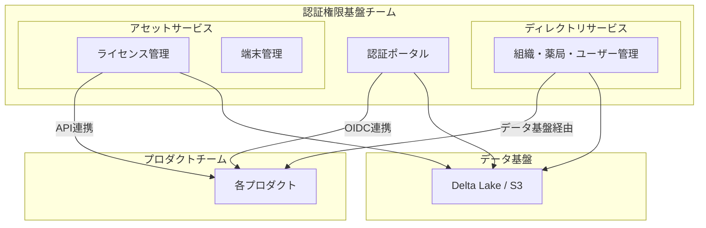

# 開発チームが信頼性向上のためにできること

<div class="text-2xl text-gray-500 mt-4">
医療SaaS企業を支える共通基盤の挑戦
</div>

<div class="absolute bottom-10">
  <p class="text-gray-500">SRE Kaigi 2026</p>
  <p class="font-bold">kosui (岩佐 幸翠) / 株式会社カケハシ</p>
</div>

<!--
本日は「開発チームが信頼性向上のためにできること」というテーマでお話しします。
私たちカケハシで、SRE専任を持たない開発チームがどのように信頼性向上に取り組んできたかを共有します。
-->

---

# 自己紹介

<div class="grid grid-cols-2 gap-8">
<div>

## 岩佐 幸翠（いわさ こうすい）

- 株式会社カケハシ
- 認証権限基盤チーム テックリード
- 認証ポータル・ディレクトリサービス・アセットサービスの設計・開発

</div>
<div class="flex items-center justify-center">


</div>
</div>

<!--
私はカケハシで認証権限基盤チームに所属しています。
認証ポータル、ディレクトリサービス、アセットサービスという3つの基盤システムの設計・開発を担当しています。
-->

---
layout: center
class: text-center
---

# 本セッションの対象者

<div class="grid grid-cols-2 gap-8 mt-8 text-left max-w-4xl mx-auto">

<div class="p-6 bg-blue-50 rounded-lg">
  <h3 class="font-bold text-lg mb-2">フルスタック開発チームのリード</h3>
  <p class="text-gray-600 text-sm">
    チーム規模的にSRE専任を置いても十分な協働が難しい状況で、<br>
    「信頼性は誰かの仕事」ではなく「自分たちの責任」と考え始めている方
  </p>
</div>

<div class="p-6 bg-green-50 rounded-lg">
  <h3 class="font-bold text-lg mb-2">SREイネイブラー</h3>
  <p class="text-gray-600 text-sm">
    開発チームが「自分事として信頼性を担う」状態を目指しているが、<br>
    Enablingのゴールを具体的に示したい方
  </p>
</div>

</div>

<!--
本セッションは主に2つのペルソナを想定しています。
一つ目は、SRE専任との協働が難しい状況で、開発チーム自身が信頼性に責任を持とうとしているリーダーの方。
二つ目は、開発チームへの知見移転を進めているSREイネイブラーの方です。
-->

---
layout: center
class: text-center
---

# 本日のキーメッセージ

<div class="text-3xl font-bold mt-8 p-8 bg-blue-100 rounded-lg max-w-4xl">
開発チームが設計を"自分ごと"として<br>運用し続けることで、<br>SRE専任なしでも信頼性は向上できる
</div>

<div class="mt-8 text-xl text-gray-600">
設計パターンを「選ぶ」だけでなく「育てる」ことが重要
</div>

<!--
本日お伝えしたいキーメッセージはこちらです。
SRE専任チームがいない環境でも、開発チーム自身が設計を理解し、運用し続けることで信頼性は向上できます。
重要なのは、設計パターンを選んで終わりではなく、チームで育て続けることです。
-->

---

# アジェンダ

<div class="grid grid-cols-5 gap-4 mt-8">

<div class="text-center p-4 bg-gray-50 rounded-lg">
  <div class="text-3xl mb-2">1</div>
  <div class="font-bold">背景</div>
  <div class="text-xs text-gray-500 mt-1">チーム規模の制約と<br>選択</div>
</div>

<div class="text-center p-4 bg-gray-50 rounded-lg">
  <div class="text-3xl mb-2">2</div>
  <div class="font-bold">課題</div>
  <div class="text-xs text-gray-500 mt-1">トレーサビリティと<br>品質要求の相反</div>
</div>

<div class="text-center p-4 bg-gray-50 rounded-lg">
  <div class="text-3xl mb-2">3</div>
  <div class="font-bold">方法論</div>
  <div class="text-xs text-gray-500 mt-1">4つのアプローチ</div>
</div>

<div class="text-center p-4 bg-gray-50 rounded-lg">
  <div class="text-3xl mb-2">4</div>
  <div class="font-bold">結果と教訓</div>
  <div class="text-xs text-gray-500 mt-1">責任を果たすとは</div>
</div>

<div class="text-center p-4 bg-gray-50 rounded-lg">
  <div class="text-3xl mb-2">5</div>
  <div class="font-bold">まとめ</div>
  <div class="text-xs text-gray-500 mt-1">持ち帰りポイント</div>
</div>

</div>

<!--
本日のアジェンダです。
まず背景として、なぜ開発チームが信頼性を担う必要があったのかをお話しします。
次に課題、そして具体的な方法論、最後に結果と教訓をお伝えします。
-->

---
layout: section
---

# 1. 背景

なぜ開発チームが信頼性を担う必要があったか

---

# チーム規模の制約

<div class="mt-6">

<div class="p-6 bg-yellow-50 rounded-lg mb-6">
  <h3 class="font-bold text-lg mb-2">私たちの現実</h3>
  <p class="text-gray-700">
    2025年4月時点では<span class="font-bold">正社員1名、業務委託2-3名</span>という小規模なチーム
  </p>
  <p class="text-gray-600 mt-2">
    SRE専任メンバーの増員はかえって<span class="font-bold">共有すべきコンテキストの分散</span>を招く恐れがあった
  </p>
</div>

<div class="grid grid-cols-2 gap-6">

<div class="p-4 bg-red-50 rounded-lg">
  <h4 class="font-bold mb-2">選択肢A: SRE専任を採用</h4>
  <ul class="text-sm text-gray-600 space-y-1">
    <li>チーム規模に対して十分な協働が難しい</li>
    <li>コンテキスト共有の負担増</li>
    <li>「SREの仕事」になりがち</li>
  </ul>
</div>

<div class="p-4 bg-green-50 rounded-lg border-2 border-green-400">
  <h4 class="font-bold mb-2">選択肢B: 開発チームが担う</h4>
  <ul class="text-sm text-gray-600 space-y-1">
    <li>設計・実装・運用を一貫して担う</li>
    <li>深い理解と迅速な改善が可能</li>
    <li class="font-bold">「自分たちの責任」として捉える</li>
  </ul>
</div>

</div>

</div>

<!--
私たちのチームでは、2025年4月時点では正社員1名、業務委託2-3名という小規模なチームでした。
この規模でSRE専任を採用しても、十分な協働が難しく、かえってコンテキストの分散を招く恐れがありました。
そこで、開発チーム自身が信頼性向上に主体的に取り組む道を選びました。
-->

---

# 医療SaaSの特殊性

<div class="mt-4">

<div class="p-4 bg-red-50 rounded-lg mb-4">
  <p class="font-bold">薬局向けSaaSを4つ以上開発・運用 / すべてが患者情報を扱う医療情報システム</p>
</div>

<div class="grid grid-cols-2 gap-6">

<div>

### 厳格なセキュリティ要件

<div class="p-4 bg-gray-50 rounded-lg mt-2">
  <h4 class="font-bold text-sm mb-2">3省2ガイドライン</h4>
  <ul class="text-sm text-gray-600 space-y-1">
    <li>多要素認証の必須化（2026年度〜）</li>
    <li>監査ログの長期保存</li>
    <li>厳格なパスワードポリシー</li>
  </ul>
</div>

<div class="p-4 bg-gray-50 rounded-lg mt-2">
  <h4 class="font-bold text-sm mb-2">堅牢なテナント分離</h4>
  <p class="text-sm text-gray-600">
    薬局グループの統廃合が頻繁に発生するため、<br>
    テナント分離と柔軟な組織管理の両立が必要
  </p>
</div>

</div>

<div>

### 高い可用性要件

<div class="p-4 bg-gray-50 rounded-lg mt-2">
  <h4 class="font-bold text-sm mb-2">24時間365日稼働</h4>
  <p class="text-sm text-gray-600">
    医療機関は常に稼働しており、<br>
    システム停止は患者の安全に直結
  </p>
</div>

<div class="p-4 bg-gray-50 rounded-lg mt-2">
  <h4 class="font-bold text-sm mb-2">データ整合性</h4>
  <p class="text-sm text-gray-600">
    患者情報・処方データは<br>
    一瞬たりとも不整合が許されない
  </p>
</div>

</div>

</div>

</div>

<!--
カケハシでは薬局向けSaaSを4つ以上開発・運用しています。
すべてのプロダクトが医療情報システムとして患者情報を扱うため、3省2ガイドラインへの準拠が必須です。
また、医療機関は24時間365日稼働しており、高い可用性とデータ整合性が求められます。
-->

---

# 全体アーキテクチャ



<div class="mt-2 text-sm text-gray-500 text-center">
認証ポータル・ディレクトリサービス・アセットサービスの3つの基盤システムを開発・運用
</div>

<!--
私たちが担当するシステムの全体像です。
認証ポータル、ディレクトリサービス、アセットサービスの3つの基盤システムがあり、
各プロダクトに対してOIDC連携やデータ連携を提供しています。
-->

---
layout: section
---

# 2. 課題

開発効率と信頼性の両立

---

# 品質要求の相反

<div class="mt-6">

<div class="p-6 bg-yellow-50 rounded-lg mb-6">
  <p class="text-lg">
    <span class="font-bold">認証基盤</span>では高い稼働率とセキュリティ要件を満たす必要がある一方で、<br>
    <span class="font-bold">ディレクトリサービス</span>では稼働率に加えデータの整合性・一貫性が求められる
  </p>
</div>

<div class="grid grid-cols-2 gap-6">

<div class="p-4 bg-blue-50 rounded-lg">
  <h4 class="font-bold mb-2">認証基盤に求められること</h4>
  <ul class="text-sm space-y-1">
    <li>高い可用性（99.9%+）</li>
    <li>低レイテンシー</li>
    <li>障害時の復旧容易性</li>
  </ul>
  <p class="text-xs text-gray-500 mt-2">→ DynamoDB等の高可用性ストレージが有効</p>
</div>

<div class="p-4 bg-green-50 rounded-lg">
  <h4 class="font-bold mb-2">ディレクトリサービスに求められること</h4>
  <ul class="text-sm space-y-1">
    <li>強い整合性</li>
    <li>ACIDトランザクション</li>
    <li>完全なトレーサビリティ</li>
  </ul>
  <p class="text-xs text-gray-500 mt-2">→ PostgreSQL等のRDBMSが有効</p>
</div>

</div>

<div class="mt-4 p-3 bg-red-50 rounded text-center">
<span class="font-bold">これらを両立するために、インフラとアプリの両面で工夫が必要</span>
</div>

</div>

<!--
認証基盤の刷新プロジェクトでは高い稼働率とセキュリティ要件を満たす必要がある一方で、
ディレクトリサービスでは稼働率に加えデータの整合性・一貫性が求められます。
これらを両立するために、インフラとアプリの両面で工夫が必要でした。
-->

---

# トレーサビリティの欠如

<div class="mt-6">

<div class="p-6 bg-red-50 rounded-lg mb-6">
  <h3 class="font-bold text-lg mb-3">既存システムの問題</h3>
  <ul class="space-y-2">
    <li class="flex items-start gap-2">
      <span class="text-red-500 mt-1">✗</span>
      <span>最新データしか保存されていない</span>
    </li>
    <li class="flex items-start gap-2">
      <span class="text-red-500 mt-1">✗</span>
      <span>障害発生時の原因調査に時間がかかる</span>
    </li>
    <li class="flex items-start gap-2">
      <span class="text-red-500 mt-1">✗</span>
      <span><span class="font-bold">「3ヶ月前のこの患者のデータがどうだったか」</span>を説明できない</span>
    </li>
  </ul>
</div>

<div class="p-4 bg-yellow-50 rounded-lg">
  <h4 class="font-bold mb-2">医療分野での重要性</h4>
  <p class="text-gray-600">
    過去のデータ状態を説明できることは、<span class="font-bold">法的にもビジネス的にも極めて重要</span><br>
    監査対応、コンプライアンス要件への対応が困難
  </p>
</div>

</div>

<!--
最大の課題は、トレーサビリティの欠如でした。
従来のシステムでは最新データしか保存されていなかったため、障害発生時の原因調査に時間がかかりました。
また、過去のデータ状態を説明できないことは、医療という特殊なドメインでは大きな問題でした。
-->

---
layout: section
---

# 3. 方法論

4つのアプローチで信頼性を向上

---

# 方法論の全体像

<div class="grid grid-cols-2 gap-4 mt-6">

<div class="p-5 bg-blue-50 rounded-lg">
  <div class="flex items-center gap-3 mb-2">
    <div class="w-8 h-8 bg-blue-500 text-white rounded-full flex items-center justify-center font-bold">1</div>
    <h3 class="font-bold">ドメインイベントの永続化</h3>
  </div>
  <p class="text-sm text-gray-600">「いつ・誰が・何を変更したか」を完全に記録</p>
</div>

<div class="p-5 bg-green-50 rounded-lg">
  <div class="flex items-center gap-3 mb-2">
    <div class="w-8 h-8 bg-green-500 text-white rounded-full flex items-center justify-center font-bold">2</div>
    <h3 class="font-bold">データ連携パターンの選択</h3>
  </div>
  <p class="text-sm text-gray-600">基盤障害がプロダクト全体に波及しない設計</p>
</div>

<div class="p-5 bg-yellow-50 rounded-lg">
  <div class="flex items-center gap-3 mb-2">
    <div class="w-8 h-8 bg-yellow-500 text-white rounded-full flex items-center justify-center font-bold">3</div>
    <h3 class="font-bold">サービスベースアーキテクチャ</h3>
  </div>
  <p class="text-sm text-gray-600">強い整合性を保ちながら独立したデプロイを実現</p>
</div>

<div class="p-5 bg-purple-50 rounded-lg">
  <div class="flex items-center gap-3 mb-2">
    <div class="w-8 h-8 bg-purple-500 text-white rounded-full flex items-center justify-center font-bold">4</div>
    <h3 class="font-bold">RLSによるマルチテナント分離</h3>
  </div>
  <p class="text-sm text-gray-600">DBレベルで強制的にテナントを分離</p>
</div>

</div>

<div class="mt-4 p-4 bg-gray-100 rounded-lg text-center">
  <p class="font-bold">特別なツールや大規模な組織変更は不要</p>
  <p class="text-sm text-gray-600">既存の技術を組み合わせて段階的に導入可能</p>
</div>

<!--
方法論は4つあります。
ドメインイベントの永続化、データ連携パターンの選択、サービスベースアーキテクチャ、RLSによるマルチテナント分離です。
これらは特別なツールを必要とせず、既存の技術を組み合わせて段階的に導入できます。
-->

---
layout: section
---

# 3-1. ドメインイベントの永続化

完全なトレーサビリティを実現

---

# ドメインイベントとは

<div class="mt-4">


</div>

<div class="grid grid-cols-3 gap-4 mt-4">

<div class="p-3 bg-blue-50 rounded-lg text-center">
  <h4 class="font-bold text-sm">障害調査</h4>
  <p class="text-xs text-gray-600">過去の状態を再現して<br>原因を特定</p>
</div>

<div class="p-3 bg-blue-50 rounded-lg text-center">
  <h4 class="font-bold text-sm">監査対応</h4>
  <p class="text-xs text-gray-600">変更履歴を<br>完全に追跡</p>
</div>

<div class="p-3 bg-blue-50 rounded-lg text-center">
  <h4 class="font-bold text-sm">データ復旧</h4>
  <p class="text-xs text-gray-600">イベントリプレイで<br>任意の時点に復元</p>
</div>

</div>

<!--
ドメインイベントとは、「システムで何が起きたか」をすべて記録する設計パターンです。
イベントを永続化することで、障害調査、監査対応、データ復旧など様々な場面で活用できます。
-->

---

# ドメインイベントの設計

```typescript {all|1-7|9-15|17-19}
// イベントの型定義
type DomainEvent<TAggregateKind, TAggregateId, TAggregate, TEventName, TPayload> = {
  aggregateKind: TAggregateKind;  // 集約の種類（User, Org等）
  aggregateId: TAggregateId;       // 集約のID
  aggregate: TAggregate;           // 変更後の状態（スナップショット）
  eventName: TEventName;           // 何が起きたか（UserCreated等）
  eventPayload: TPayload;          // イベント固有のデータ
  eventAt: UnixTime;
};

// イベント発行（純粋関数）
const createUser = (props: CreateUserProps): UserCreated => ({
  aggregateKind: 'User',
  aggregateId: UserId.generate(),
  aggregate: { ...props, status: 'active' },
  eventName: 'UserCreated',
  eventPayload: { createdBy: props.createdBy },
  eventAt: UnixTime.now(),
});
```

<div class="mt-2 p-3 bg-yellow-50 rounded text-sm">
<span class="font-bold">ポイント:</span> <code>aggregate</code>フィールドに変更後の状態を持つことで、リプレイなしでも過去の状態を即座に参照可能
</div>

<!--
こちらが実際の型定義です。
集約の種類、ID、変更後の状態、イベント名、ペイロード、発生日時を持ちます。
aggregateフィールドに変更後の状態を持つことで、過去の状態を即座に参照できます。
-->

---

# イベントストアの設計

<div class="grid grid-cols-2 gap-6 mt-4">

<div>

```sql
CREATE TABLE domain_events (
  event_id UUID PRIMARY KEY,
  aggregate_kind TEXT NOT NULL,
  aggregate_id UUID NOT NULL,
  event_name TEXT NOT NULL,
  event_at TIMESTAMPTZ NOT NULL,
  security_class TEXT NOT NULL  -- 追加
) PARTITION BY RANGE (event_at);

-- 属性テーブル（分離）
CREATE TABLE domain_event_attributes (
  event_id UUID PRIMARY KEY,
  event_payload JSONB NOT NULL,
  aggregate_snapshot JSONB NOT NULL
);

-- セキュア属性テーブル
CREATE TABLE secure_event_attributes (
  event_id UUID PRIMARY KEY,
  event_payload JSONB NOT NULL,
  aggregate_snapshot JSONB NOT NULL
);
```

</div>

<div>

### セキュリティ区分による分離

<div class="p-4 bg-gray-50 rounded-lg mt-2">
  <p class="text-sm">
    パスワードハッシュなど秘匿性の高い情報は<br>
    <span class="font-bold">セキュア属性テーブル</span>に分離
  </p>
</div>

<div class="p-4 bg-gray-50 rounded-lg mt-2">
  <p class="text-sm">
    イベント発生の<span class="font-bold">事実</span>は通常テーブルに記録<br>
    → 他チームもトレース可能
  </p>
</div>

<div class="p-4 bg-yellow-50 rounded-lg mt-2">
  <p class="text-sm font-bold">設計判断</p>
  <p class="text-xs text-gray-600">
    セキュリティ要件とトレーサビリティ要件を<br>
    両立するための現実的な選択
  </p>
</div>

</div>

</div>

<!--
イベントストアの設計では、セキュリティ要件も考慮しています。
パスワードハッシュなど秘匿性の高い情報は別テーブルに分離し、
イベント発生の事実は通常テーブルに記録することで、トレーサビリティを確保しています。
-->

---
layout: section
---

# 3-2. データ連携パターンの選択

基盤障害をプロダクト全体に波及させない

---

# データ連携パターン比較

<div class="mt-4">

| パターン | 即時性 | 耐障害性 | 一貫性 | ユースケース |
|----------|:------:|:--------:|:------:|-------------|
| **データ基盤経由** | △ | ◎ | ◎ | 定期的に一貫性のあるデータを取得 |
| **API連携** | ◎ | △ | ◎ | リアルタイムでデータ取得が必要 |
| **イベント連携** | ○ | ○ | ○ | 変更をトリガーに非同期処理 |

</div>

<div class="grid grid-cols-3 gap-4 mt-4">

<div class="p-4 bg-blue-50 rounded-lg border-2 border-blue-400">
  <h4 class="font-bold text-sm mb-2">デフォルト: データ基盤</h4>
  <p class="text-xs text-gray-600">
    Delta Lake形式でS3に蓄積<br>
    99.999999999%の耐久性<br>
    <span class="font-bold">基盤障害が波及しない</span>
  </p>
</div>

<div class="p-4 bg-gray-50 rounded-lg">
  <h4 class="font-bold text-sm mb-2">即時性が必要な場合</h4>
  <p class="text-xs text-gray-600">
    API連携を選択<br>
    例: ライセンス確認<br>
    ただし障害の影響を受ける
  </p>
</div>

<div class="p-4 bg-gray-50 rounded-lg">
  <h4 class="font-bold text-sm mb-2">非同期処理の場合</h4>
  <p class="text-xs text-gray-600">
    イベント連携を選択<br>
    例: ログイン履歴の配信<br>
    Outboxパターンで信頼性確保
  </p>
</div>

</div>

<!--
データ連携パターンは3つあります。
私たちは「基盤障害がプロダクト全体に波及しない」ことを最優先とし、
データ基盤経由をデフォルトの連携方法としています。
即時性が必要な場合のみAPI連携を選択します。
-->

---

# Delta Lake + タイムトラベル

<div class="grid grid-cols-2 gap-6 mt-4">

<div>

### アーキテクチャ


</div>

<div>

### タイムトラベル機能

```python
# 現在のデータ
df = spark.read.format("delta")
    .load("s3://bucket/users")

# 3ヶ月前の状態
df_past = spark.read.format("delta") \
    .option("timestampAsOf", "2025-10-01") \
    .load("s3://bucket/users")

# 特定バージョン
df_v100 = spark.read.format("delta") \
    .option("versionAsOf", 100) \
    .load("s3://bucket/users")
```

<div class="mt-2 p-2 bg-green-50 rounded text-sm">
「3ヶ月前のデータ」に即座にアクセス可能
</div>

</div>

</div>

<!--
データ基盤にはDelta Lakeを採用しています。
S3に保存することで高い耐久性を確保し、タイムトラベル機能により過去の任意の時点のデータにアクセスできます。
これにより「3ヶ月前のデータがどうだったか」という問い合わせに即座に回答できます。
-->

---
layout: section
---

# 3-3. サービスベースアーキテクチャ

強い整合性と独立したデプロイの両立

---

# なぜサービスベースアーキテクチャか

<div class="mt-4">

<div class="grid grid-cols-3 gap-4">

<div class="p-4 bg-red-50 rounded-lg">
  <h4 class="font-bold mb-2">モノリス</h4>
  <p class="text-xs text-gray-600">変更容易性が低い</p>
  <p class="text-xs text-gray-600">一度に全体を更新</p>
  <p class="text-xs text-red-600 mt-2">✗ 不採用</p>
</div>

<div class="p-4 bg-red-50 rounded-lg">
  <h4 class="font-bold mb-2">マイクロサービス</h4>
  <p class="text-xs text-gray-600">分散トランザクション</p>
  <p class="text-xs text-gray-600">結果整合性の複雑さ</p>
  <p class="text-xs text-red-600 mt-2">✗ 不採用</p>
</div>

<div class="p-4 bg-green-50 rounded-lg border-2 border-green-400">
  <h4 class="font-bold mb-2">サービスベース</h4>
  <p class="text-xs text-gray-600">単一DB共有</p>
  <p class="text-xs text-gray-600">独立したデプロイ</p>
  <p class="text-xs text-green-600 mt-2 font-bold">✓ 採用</p>
</div>

</div>

</div>

<div class="mt-4 p-4 bg-blue-50 rounded-lg">
  <h4 class="font-bold mb-2">採用理由</h4>
  <ul class="text-sm space-y-1">
    <li>組織・薬局・ユーザー・ライセンス・端末は<span class="font-bold">密接に関連</span></li>
    <li>ドメインを横断した<span class="font-bold">強い一貫性</span>が必要</li>
    <li>分散トランザクションの複雑さを<span class="font-bold">回避</span></li>
  </ul>
</div>

<!--
アーキテクチャの選択では、モノリス、マイクロサービス、サービスベースの3つを検討しました。
私たちが担当するシステムは密接に関連するドメインで構成されており、強い一貫性が必要です。
そのため、分散トランザクションの複雑さを避けられるサービスベースアーキテクチャを選択しました。
-->

---

# サービスベースアーキテクチャの実装

<div class="grid grid-cols-2 gap-6 mt-4">

<div>

### 共有DBと論理的分離


</div>

<div>

### DBユーザーによる権限制御

```sql
-- 認証サービス用
CREATE ROLE auth_service;
GRANT ALL ON auth.* TO auth_service;
GRANT SELECT ON directory.* TO auth_service;

-- ディレクトリサービス用
CREATE ROLE directory_service;
GRANT ALL ON directory.* TO directory_service;
GRANT SELECT ON auth.*, asset.*
  TO directory_service;
```

<div class="mt-4 p-3 bg-yellow-50 rounded text-sm">
  <span class="font-bold">原則:</span><br>
  自分のスキーマにのみ書き込み権限<br>
  他のスキーマは読み取りのみ
</div>

</div>

</div>

<!--
サービスベースアーキテクチャでは、単一のPostgreSQLを共有しながら、スキーマで論理的に分離しています。
各サービスは自分のスキーマにのみ書き込み権限を持ち、他のスキーマは読み取り専用でアクセスします。
これにより、ACIDトランザクションを活用しながら、サービスの独立性を保っています。
-->

---

# サービス間通信を原則禁止

<div class="mt-4">

<div class="grid grid-cols-2 gap-6">

<div>

### 禁止パターン

```typescript
// ❌ サービス間API呼び出し
const user = await userService.getUser(userId);
const org = await orgService.getOrg(user.orgId);
```

<div class="p-3 bg-red-50 rounded mt-2">
  <p class="text-sm font-bold text-red-600">問題点</p>
  <ul class="text-xs text-gray-600 mt-1">
    <li>DNS解決の遅延（実際に発生）</li>
    <li>障害の連鎖</li>
    <li>レイテンシーの増加</li>
  </ul>
</div>

</div>

<div>

### 推奨パターン

```typescript
// ✓ 共有DBから直接読み取り
const user = await db.query(
  'SELECT * FROM directory.users WHERE id = $1',
  [userId]
);
const org = await db.query(
  'SELECT * FROM directory.orgs WHERE id = $1',
  [user.orgId]
);
```

<div class="p-3 bg-green-50 rounded mt-2">
  <p class="text-sm font-bold text-green-600">メリット</p>
  <ul class="text-xs text-gray-600 mt-1">
    <li>ネットワーク障害の影響なし</li>
    <li>トランザクションで整合性保証</li>
    <li>低レイテンシー</li>
  </ul>
</div>

</div>

</div>

</div>

<!--
サービス間通信は原則禁止としています。
実際に、ライセンス管理から端末管理へのAPI呼び出しでDNS解決の遅延が発生し、ユーザー体験に悪影響を及ぼした事例がありました。
サービス間の連携は共有DBから直接読み取ることで、ネットワーク障害の影響を受けずに実現しています。
-->

---
layout: section
---

# 3-4. RLSによるマルチテナント分離

DBレベルでの強制的なセキュリティ

---

# RLSの選択理由

<div class="mt-4">

<div class="p-5 bg-red-50 rounded-lg mb-4">
  <h3 class="font-bold text-lg">課題: 顧客Aのデータを顧客Bが絶対に参照できないようにする</h3>
</div>

<div class="grid grid-cols-3 gap-4">

<div class="p-4 bg-gray-50 rounded-lg">
  <h4 class="font-bold text-sm mb-2">アプリレベル</h4>
  <p class="text-xs text-gray-600">WHERE句でフィルタリング</p>
  <div class="mt-2 p-2 bg-red-100 rounded">
    <p class="text-xs text-red-600 font-bold">✗ 実装ミスのリスク</p>
    <p class="text-xs text-gray-600">SQLインジェクション、バグで漏洩</p>
  </div>
</div>

<div class="p-4 bg-gray-50 rounded-lg">
  <h4 class="font-bold text-sm mb-2">スキーマ分離</h4>
  <p class="text-xs text-gray-600">テナントごとにスキーマ</p>
  <div class="mt-2 p-2 bg-red-100 rounded">
    <p class="text-xs text-red-600 font-bold">✗ 管理コストが膨大</p>
    <p class="text-xs text-gray-600">統廃合時の対応が困難</p>
  </div>
</div>

<div class="p-4 bg-green-50 rounded-lg border-2 border-green-400">
  <h4 class="font-bold text-sm mb-2">RLS（行レベルセキュリティ）</h4>
  <p class="text-xs text-gray-600">DBレベルで強制保護</p>
  <div class="mt-2 p-2 bg-green-100 rounded">
    <p class="text-xs text-green-600 font-bold">✓ 採用</p>
    <p class="text-xs text-gray-600">バグがあっても漏洩しない</p>
  </div>
</div>

</div>

</div>

<!--
テナント分離の方法として、アプリレベル、スキーマ分離、RLSの3つを検討しました。
アプリレベルは実装ミスのリスクがあり、スキーマ分離は管理コストが高すぎます。
RLSはDBレベルで強制的に保護できるため、最も安全です。
-->

---

# RLSの実装

<div class="grid grid-cols-2 gap-6 mt-4">

<div>

### PostgreSQL側

```sql
-- RLSポリシーの定義
CREATE POLICY tenant_isolation ON users
  USING (tenant_id =
    current_setting('app.tenant_id')::uuid);

-- RLSを有効化
ALTER TABLE users
  ENABLE ROW LEVEL SECURITY;

-- 重要: tenant_idにインデックス
CREATE INDEX idx_users_tenant_id
  ON users(tenant_id);
```

</div>

<div>

### アプリケーション側

```typescript
// ミドルウェアでテナントIDを設定
const tenantMiddleware = async (req, res, next) => {
  const tenantId = extractTenantId(req);

  // DB接続時にセッション変数を設定
  await db.query(
    `SET app.tenant_id = $1`,
    [tenantId]
  );

  next();
};

// WHERE句なしで自動フィルタリング
const users = await db.query(
  'SELECT * FROM users'
);
```

</div>

</div>

<div class="mt-4 p-3 bg-green-50 rounded">
<span class="font-bold">メリット:</span> SQLインジェクションやアプリバグがあっても、他テナントのデータには<span class="font-bold">絶対に</span>アクセスできない
</div>

<!--
RLSの実装では、PostgreSQLのセッション変数を使ってテナントIDを設定します。
ポリシーがその値を参照し、tenant_idが一致する行のみアクセスを許可します。
これにより、WHERE句を書かなくても自動的にテナントでフィルタリングされます。
-->

---
layout: section
---

# 4. 結果と教訓

「責任を果たす」とは何か

---

# 成果

<div class="mt-4">

<div class="grid grid-cols-2 gap-6">

<div>

| 項目 | Before | After |
|------|--------|-------|
| 障害時の原因特定 | 数時間〜 | 大幅に短縮 |
| 過去データの追跡 | 不可能 | 任意の時点で可能 |
| テナント分離 | アプリ依存 | DB保証 |
| 新規プロダクト認証 | 各チームで実装 | 共通基盤を利用 |

</div>

<div>

### プロダクトチームの声

<div class="p-4 bg-green-50 rounded-lg">
  <p class="text-sm italic">
    「認証・認可基盤が共通化されたことで、3省2ガイドラインを個別に解釈する必要がなくなり、本来のビジネスロジックに集中できるようになった」
  </p>
</div>

### SREイネイブラーの観点

<div class="p-4 bg-blue-50 rounded-lg mt-4">
  <p class="text-sm">
    開発チームが「自分事として信頼性を担う」状態を実現<br>
    → <span class="font-bold">Enablingの目標状態</span>の一つの形
  </p>
</div>

</div>

</div>

</div>

<!--
導入による成果です。
障害発生時の原因特定時間が大幅に短縮され、過去データの追跡も任意の時点で可能になりました。
プロダクトチームからは「本来のビジネスロジックに集中できるようになった」という声をいただいています。
-->

---

# 失敗から学んだこと

<div class="mt-4 space-y-4">

<div class="p-4 bg-yellow-50 rounded-lg">
  <h4 class="font-bold mb-2">RLSのマイグレーションは慎重に</h4>
  <p class="text-sm text-gray-600">
    まずPERMISSIVEモードで始め、全クエリをログに記録して影響を確認<br>
    問題がないことを確認してからENFORCEモードに移行
  </p>
  <p class="text-xs text-red-600 mt-1">誤ったポリシーを適用するとデータ漏洩や欠損のリスク</p>
</div>

<div class="p-4 bg-yellow-50 rounded-lg">
  <h4 class="font-bold mb-2">共通ライブラリにビジネスロジックを入れすぎない</h4>
  <p class="text-sm text-gray-600">
    型定義やバリデーションスキーマは共通化OK<br>
    ビジネスロジックを含む巨大な共通ライブラリは「分散モノリス」を招く
  </p>
  <p class="text-xs text-red-600 mt-1">一つのスキーマ変更が全サービスのリビルドを強制</p>
</div>

<div class="p-4 bg-yellow-50 rounded-lg">
  <h4 class="font-bold mb-2">イベント記録は最初から組み込むべき</h4>
  <p class="text-sm text-gray-600">
    後からの導入は工数がかかる（スナップショットからのイベント生成は複雑）<br>
    依存関係を考慮したイベント生成順序の制御が必要
  </p>
  <p class="text-xs text-red-600 mt-1">理想的には設計初期から組み込む</p>
</div>

</div>

<!--
失敗から学んだことも共有します。
RLSのマイグレーションは、まずPERMISSIVEモードで始め、影響を確認しながら進めるべきでした。
共通ライブラリにビジネスロジックを入れすぎると、変更が困難になります。
また、イベント記録は最初から組み込むべきでした。
-->

---

# 「責任を果たす」サイクル

<div class="mt-4">


</div>

<div class="grid grid-cols-4 gap-4 mt-4">

<div class="p-4 bg-blue-50 rounded-lg">
  <h4 class="font-bold text-sm mb-2">1. 設計</h4>
  <p class="text-xs text-gray-600">
    原則に基づいて技術を選択<br>
    <span class="font-bold">なぜ選んだかを言語化</span>
  </p>
</div>

<div class="p-4 bg-green-50 rounded-lg">
  <h4 class="font-bold text-sm mb-2">2. 運用</h4>
  <p class="text-xs text-gray-600">
    本番環境で動かし続ける<br>
    <span class="font-bold">設計の意図を理解</span>
  </p>
</div>

<div class="p-4 bg-yellow-50 rounded-lg">
  <h4 class="font-bold text-sm mb-2">3. 監視</h4>
  <p class="text-xs text-gray-600">
    メトリクス・ログ・アラート<br>
    <span class="font-bold">状態を把握</span>
  </p>
</div>

<div class="p-4 bg-pink-50 rounded-lg">
  <h4 class="font-bold text-sm mb-2">4. 改善</h4>
  <p class="text-xs text-gray-600">
    問題を発見したら修正<br>
    <span class="font-bold">設計にフィードバック</span>
  </p>
</div>

</div>

<div class="mt-4 p-4 bg-gray-100 rounded-lg text-center">
  <p class="font-bold text-lg">このサイクルを開発チームが自走できる状態 = 責任を果たしている状態</p>
</div>

<!--
「責任を果たす」とは、設計・運用・監視・改善のサイクルを回し続けることです。
このサイクルを開発チームが自走できる状態が、私たちが目指す「責任を果たしている状態」です。
-->

---
layout: section
---

# 5. まとめ

持ち帰りポイント

---

# 開発チームができること

<div class="grid grid-cols-2 gap-4 mt-6">

<div class="p-5 bg-blue-50 rounded-lg">
  <div class="flex items-center gap-2 mb-2">
    <div class="w-6 h-6 bg-blue-500 text-white rounded-full flex items-center justify-center text-sm font-bold">1</div>
    <h3 class="font-bold">ドメインイベント</h3>
  </div>
  <p class="text-sm text-gray-600">「何が起きたか」を完全に記録</p>
  <p class="text-xs text-gray-500 mt-1">障害調査・監査対応・データ復旧</p>
</div>

<div class="p-5 bg-green-50 rounded-lg">
  <div class="flex items-center gap-2 mb-2">
    <div class="w-6 h-6 bg-green-500 text-white rounded-full flex items-center justify-center text-sm font-bold">2</div>
    <h3 class="font-bold">データ連携パターン</h3>
  </div>
  <p class="text-sm text-gray-600">基盤障害を波及させない設計</p>
  <p class="text-xs text-gray-500 mt-1">デフォルトはデータ基盤経由</p>
</div>

<div class="p-5 bg-yellow-50 rounded-lg">
  <div class="flex items-center gap-2 mb-2">
    <div class="w-6 h-6 bg-yellow-500 text-white rounded-full flex items-center justify-center text-sm font-bold">3</div>
    <h3 class="font-bold">サービスベースアーキテクチャ</h3>
  </div>
  <p class="text-sm text-gray-600">強い整合性と独立デプロイの両立</p>
  <p class="text-xs text-gray-500 mt-1">サービス間通信を原則禁止</p>
</div>

<div class="p-5 bg-purple-50 rounded-lg">
  <div class="flex items-center gap-2 mb-2">
    <div class="w-6 h-6 bg-purple-500 text-white rounded-full flex items-center justify-center text-sm font-bold">4</div>
    <h3 class="font-bold">RLS</h3>
  </div>
  <p class="text-sm text-gray-600">DBレベルでテナントを強制分離</p>
  <p class="text-xs text-gray-500 mt-1">バグがあっても漏洩しない</p>
</div>

</div>

<div class="mt-4 p-4 bg-gray-100 rounded-lg text-center">
  <p class="font-bold">段階的に導入可能 — クリティカルな領域から優先的に適用</p>
</div>

<!--
開発チームができることの振り返りです。
これらの方法論は、段階的に導入可能です。
クリティカルな領域から優先的に適用していくことをお勧めします。
-->

---

# Enablingの観点から

<div class="mt-6 space-y-4">

<div class="p-5 bg-blue-50 rounded-lg">
  <h3 class="font-bold text-lg mb-2">設計を選ぶだけでなく、責任を果たす</h3>
  <p class="text-gray-600">技術選定で終わりではなく、<span class="font-bold">運用・監視・改善を継続</span>する</p>
  <p class="text-sm text-gray-500 mt-1">なぜその設計を選んだのかを言語化し、トレードオフをチームで共有する</p>
</div>

<div class="p-5 bg-green-50 rounded-lg">
  <h3 class="font-bold text-lg mb-2">「誰かの仕事」ではなく「自分たちの責任」</h3>
  <p class="text-gray-600">開発チームが<span class="font-bold">自分事として信頼性を担う</span>状態を目指す</p>
  <p class="text-sm text-gray-500 mt-1">制約があったからこそ、チームの強みに変えることができた</p>
</div>

<div class="p-5 bg-yellow-50 rounded-lg">
  <h3 class="font-bold text-lg mb-2">SREイネイブラーへ</h3>
  <p class="text-gray-600">本セッションの事例は、<span class="font-bold">Enablingのゴールの一つの形</span></p>
  <p class="text-sm text-gray-500 mt-1">開発チームが自走できる状態 = Enabling完了の目標状態</p>
</div>

</div>

<!--
Enablingの観点からまとめます。
開発チームが自分事として信頼性を担う状態を目指します。
SREイネイブラーの方にとって、本セッションの事例はEnablingのゴールの一つの形として参考になれば幸いです。
-->

---
layout: center
class: text-center
---

# 本日のキーメッセージ（再掲）

<div class="mt-8 space-y-6 max-w-3xl mx-auto">

<div class="text-2xl p-6 bg-blue-100 rounded-lg">
設計パターンは「導入して終わり」ではない
</div>

<div class="text-2xl">
チームで意図を共有し、継続的に改善する
</div>

<div class="text-2xl font-bold text-blue-600">
それが開発チームによる信頼性向上の本質
</div>

</div>

<!--
最後に、本日のキーメッセージを再掲します。
設計パターンは導入して終わりではありません。
チームで意図を共有し、継続的に改善する。それが開発チームによる信頼性向上の本質です。
-->

---
layout: center
class: text-center
---

# ご清聴ありがとうございました

<div class="mt-8 text-xl">
質問があればぜひ！
</div>

<div class="mt-8 text-gray-500">
岩佐 幸翠 / [@kosui_me](https://x.com/kosui_me)
</div>

<div class="mt-8 text-sm text-gray-400">

関連資料:
- [カケハシ開発者ブログ: アーキテクチャの進化はドメインイベントが起点になる](https://kakehashi-dev.hatenablog.com/entry/2023/12/24/091000)
- [Findy Tools インタビュー](https://findy-tools.io/companies/kakehashi/91/97)

</div>

<!--
以上で発表を終わります。
ご質問があればお気軽にどうぞ。
-->
