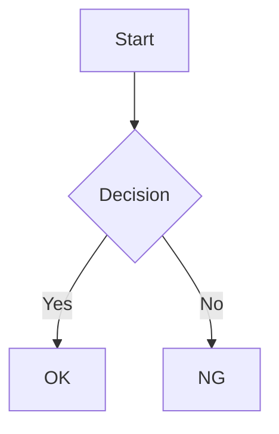

# mdlive

Markdown ファイルをブラウザでライブプレビューする CLI ツール。

## 機能

- **ライブリロード**: ファイル変更を検知して自動でブラウザをリロード
- **ディレクトリモード**: ディレクトリを指定すると左サイドバーにファイルツリーを表示
- **gitignore 対応**: `.gitignore` を尊重してファイルを無視
- **シンタックスハイライト**: Shiki による高品質なコードハイライト
- **Mermaid 対応**: フローチャート、シーケンス図などのダイアグラムをレンダリング
- **ダークモード対応**: システム設定に連動した自動切り替え

## インストール

```bash
# リポジトリをクローン
git clone https://github.com/iwasa-kosui/monorepo3.git
cd monorepo3

# 依存関係をインストール
pnpm install

# ビルド
pnpm --filter result build
pnpm --filter mdlive build

# グローバルインストール
cd tools/mdlive
npm install -g .
```

## 使い方

### 単一ファイルモード

```bash
# 基本
mdlive README.md

# ブラウザを自動で開く
mdlive README.md --open

# ポート指定
mdlive README.md --port 8080 --open
```

### ディレクトリモード

ディレクトリを指定すると、左サイドバーにファイルツリーが表示されます。

```bash
# ディレクトリ内の全 Markdown ファイルをプレビュー
mdlive ./docs --open

# カレントディレクトリ
mdlive . --open
```

- `.gitignore` に記載されたファイル・ディレクトリは自動的に無視されます
- `node_modules`、`.git`、`.DS_Store` は常に無視されます
- サイドバーからファイルを選択してプレビューできます

## オプション

| オプション | 短縮形 | 説明 | デフォルト |
|-----------|--------|------|-----------|
| `--port` | `-p` | ポート番号 | 3000 |
| `--open` | `-o` | ブラウザを自動で開く | false |
| `--help` | `-h` | ヘルプを表示 | - |

## 対応フォーマット

### コードブロック

JavaScript, TypeScript, TSX, JSX, JSON, HTML, CSS, SCSS, Markdown, YAML, TOML, Bash, Shell, Python, Rust, Go, Java, C, C++, SQL, GraphQL, Diff

### Mermaid ダイアグラム

````markdown

````

対応ダイアグラム: Flowchart, Sequence, Class, State, ER, Gantt, Pie, etc.

## ライセンス

MIT
